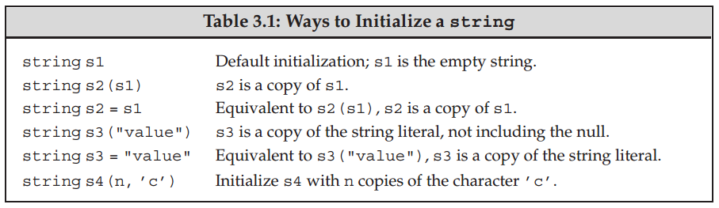
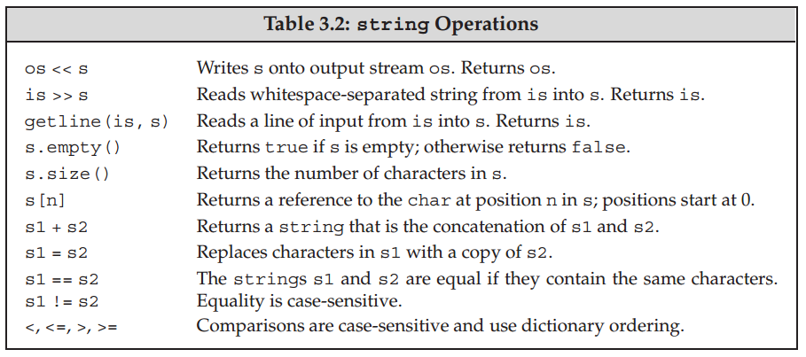
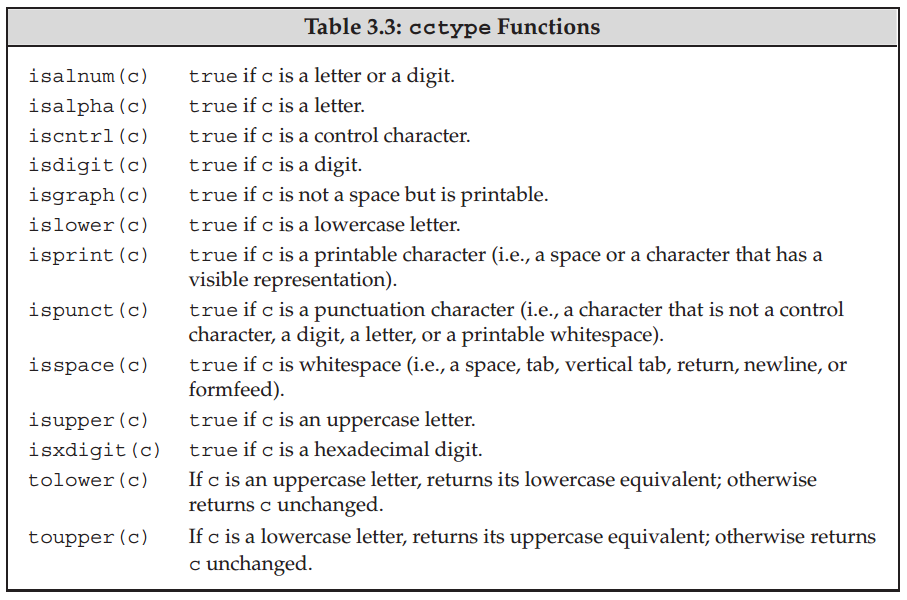
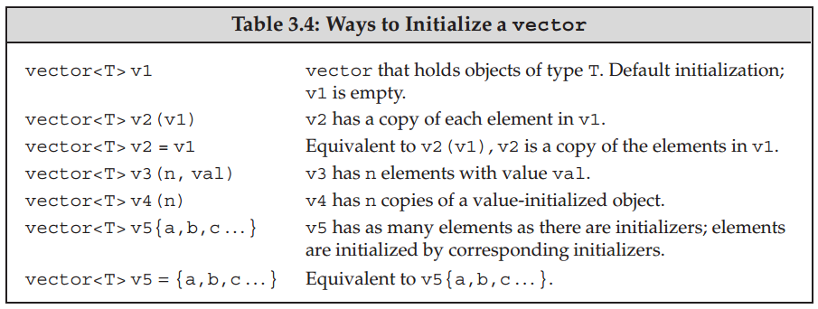
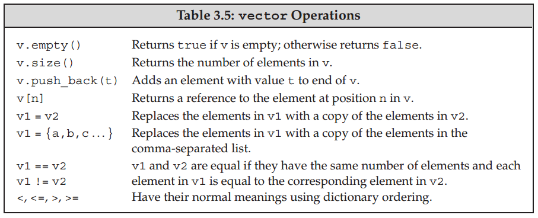
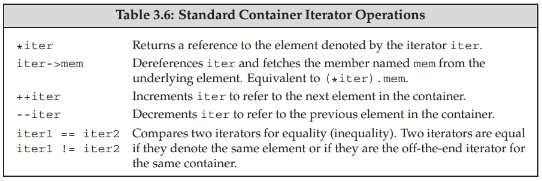
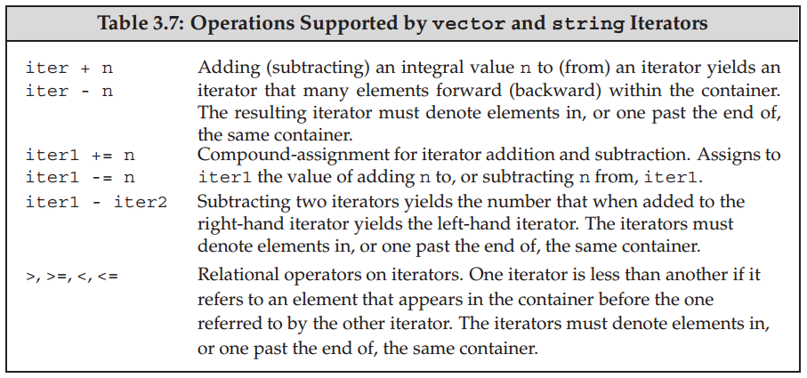
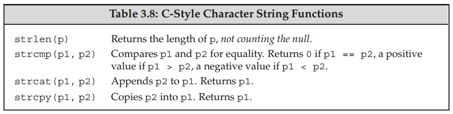

## 3. Strings, Vectors, and Arrays

- To read from the standard input, we write `std::cin`. These names use the scope operator(`::`), which says that the compiler should look in the scope of the left-hand operand for the name of the right-hand operand. Thus, `std::cin` says that we want to use the name `cin` from the namespace `std`.  
Referring to library names with this notation can be cumbersome. Fortunately, there are easier ways to use namespace members. The safest way is a **`using` declaration**:

		using namespace::name;
Code inside headers ordinarily should not use `using` declarations.

- A **`string`** is a variable-length sequence of characters. To use the `string` type, we must include the `string` header. Because it is part of the library, `string` is defined in the `std` namespace.

- When we initialize a variable using `=`, we are asking the compiler to **copy initialize** the object by copying the initializer on the right-hand side into the object being created. Otherwise, when we omit the `=`, we use **direct initialization**.

- Ways to Initialize a `string`  

- `string` Operations  

- Sometimes we do not want to ignore the whitespace in our input. In such cases, we can use the **`getline`** function instead of the `>>` operator.  
The newline that causes `getline` to return is discarded; the newline is *not* stored in the `string`.

- Although we don't know the precise type of `string::size_type`, we do know that it is an unsigned type big enough to hold the size of any \texttt{string}. Any variable used to stroe the result from the `string size` operation should be of type `string::size_type`.

- When we mix **`string`**s and string or character literals, at least one operand to each `+` operator must be of `string` type:

		string s4 = s1 + ", "; // ok: adding a string and a literal
		string s5 = "hello" + ", "; // error: no string operand

- In addition to facilities defined specifically for C++, the C++ library incorporates the C library. Headers in C have names of the form `*name*.h`. The C++ versions of these headers are named c*name*&mdash;they remove the `.h` suffix and precede the *name* with the letter `c`. The `c` indicates that the header is part of the C library.

- If we want to do something to every character in a `string`, by far the best approach is to use a statement introduced by the new standard: the **range `for`** statement. This statement iterates through the elements in a given sequence and performs some operation on each value in that sequence.

		for (declaration : expression)
			statement

- `cctype` Functions  

- The subscript operator (the **`[]` operator**) takes a `string::size_type` value that denotes the position of the character we want to access. The operator returns a reference to the character at the given position.  
The result of using an index outside this range is undefined. By implication, subscripting an empty `string` is undefined.

- A **`vector`** is a collection of objects, all of which have the same type. Every object in the collection has an associated index, which gives access to that object. A `vector` is often referred to as a **container** because it "contains" other objects.

- A `vector` is a **class template**. C++ has both class and function templates.  
The process that the compiler uses to create classes or functions from templates is called **instantiation**.  
For a class template, we specify which class to instantiate by supplying additional information, the nature of which depends on the template. How we specify the information is always the same: We supply it inside a pair of angle brackets following the template's name:

		vector<int> ivec; // ivec holds objects of type int

- Another way to provide element values, is that under the new standard, we can list initialize a `vector` from a list of zero or more initial element values enclosed in curly braces.

- Ways to Initialize a `vector`  

- If we use braces and there is no way to use the initializers to list initialize the object, then those values will be used to construct the object. 

		vector<string> v5{"hi"}; // list initialization: v5 has one element
		vector<string> v6("hi"); // error: can't construct a vector from a string literal
		vector<string> v7{10};		 // v7 has ten default-initialized elements
		vector<string> v8{10, "hi"}; // v8 has ten elements with value "hi"

- The `push_back` operation takes a value and "pushes" that value as a new last element onto the "back" of the `vector`.

- To use `size_type`, we must name the type in which it is defined. A `vector` type *always* includes its element type:

		vector<int>::size_type // ok
		vector::size_type // error

- `vector` Operations  

- The subscript operator on `vector` (and `string`) fetches an existing element; it does *not* add an element.

- Types that have iterators have members that return iterators. In particular, these types have members named **`begin`** and **`end`**.

- If the container is empty, the iterators returned by `begin` and `end` are equal&mdash;they are both off-the-end iterators.

- Standard Container Iterator Operations  

- To let us ask specifically for the `const_iterator` type, the new standard introduced two new functions named `cbegin` and `cend`.

- When we deference an iterator, we get the object that the iterator denotes. If that object has a class type, we may want to access a member of that object. For example, we might have a `vector` of `string`s and we might need to know whether a given element is empty. Assuming `it` is an iterator into this `vector`, we can check whether the `string` that `it` denotes is empty as follows:

		(*it).empty()
To simplify expressions such as this one, the language defines the arrow operator (the **`->` operator**). The arrow operator combines deference and member access into a single operation. That is, `it->mem` is a synonym for `(*it).mem`.

- Operations Supported by `vector` and `string` Iterators  

- An array is a data structure that is similar to the library `vector` type but offers a different trade-off between performance and flexibility.

- Character arrays have an additional form of initialization: We can initialize such arrays from a string literal. When we use this form of initialization, it is important to remember that string literals end with a null character:

		char a3[] = "C++"; // null terminator added automatically
		const char a4[6] = "Daniel"; // error: no space for the null!

- We cannot initialize an array as a copy of another array, nor is it legal to assign one array to another.  
Some compilers allow array assignment as a **compiler extension**. It is usually a good idea to avoid using nonstandard features. Programs that use such features, will not work with a different compiler.

- For the codes below:

		int *ptrs[10]; // ptrs is an array of ten pointers to int
		int &refs[10] = /* ? */; // error: no arrays of references
		int (*Parray)[10] = &arr; // Parray points to an array of ten ints
		int (&arrRef)[10] = arr; // arrRef refers to an array of ten ints
Because the array dimension follows the name being declared, it can be easier to read array declarations from the inside out rather than from right to left. Reading from the inside out makes it much easier to understand the type of `Parray`. We start by observing that the parentheses around `*Parray` mean that `Parray` is a pointer. Looking right, we see that `Parray` points to an array of size 10. Looking left, we see that the elements in that array are `int`s. Thus, `Parray` is a pointer to an array of ten `int`s.

- When we use a variable to subscript an array, we normally should define that variable to have type **`size_t`**.  
In most expressions, when we use an object of array type, we are really using a pointer to the first element in that array.

- To make it easier and safer to use points, the new library includes two functions, named `begin` and `end`. These functions act like the similarly named container members:

		auto n = end(arr) - begin(arr); // n is the number of elements in arr
The result of subtracting two pointers is a library type named **`ptrdiff_t`**.

- We can use the subscript operator on any pointer, as long as that pointer points to an element (or one past the last element) in an array:

		int *p = &ia[2]; // p points to the element indexed by 2
		int j = p[1]; // p[1] is equivalent to *(p+1), the same element as ia[3]
		int k = p[-2]; // p[-2] is the same element as ia[0]
Unlike subscripts for `vector` and `string`, the index of the built-in subscript operator is not an `unsigned` type.

- Although C++ supports C-style strings, they should not be used by C++ programs. C-style strings are a surprisingly rich source of bugs and are the root cause of many security problems. They're also harder to use!  
Character string literals are an instance of a more general construct that C++ inherits from C: **C-style character strings**.

- C-Style Character String Functions  

- The functions in table above do not verify their string parameters.  
The pointer(s) passed to these routines must point to null-terminated array(s):

		char ca[] = {'C', '+', '+'}; // not null terminated
		cout << strlen(ca) << endl; // disaster: ca isn't null terminated

- For the codes below:

		string s("Hello World";) // s holds Hello World
		char *str = s; // error: can't initialize a char* from a string
		const char *str = s.c_str() // ok
If a program needs continuing access to the contents of the array returned by `str()`, the program must copy the array returned by `c_str`.

- We can use an array to initialize a `vector`. To do so, we specify the address of the first element and one past the last element that we wish to copy:

		int int_arr[] = {0, 1, 2, 3, 4, 5};
		// ivec has six elements; each is a copy of the corresponding element in int_arr
		vector<int> ivec(begin(int_arr), end(int_arr));

- Strictly speaking, there are no multidimensional arrays in C++. What are commonly referred to as multidimensional arrays are actually arrays of arrays.

		int ia[3][4];
We can more easily understand these definitions by reading them from the inside out.

- For the codes below:

		for (const auto &row : ia)
			for (auto col : row)
				cout << col << endl;
To use a multidimensional array in a range `for`, the loop control variable for all but the innermost array must be references.

- When you define a pointer to a multidimensional array, remember that a multidimensional array is really an array of arrays.