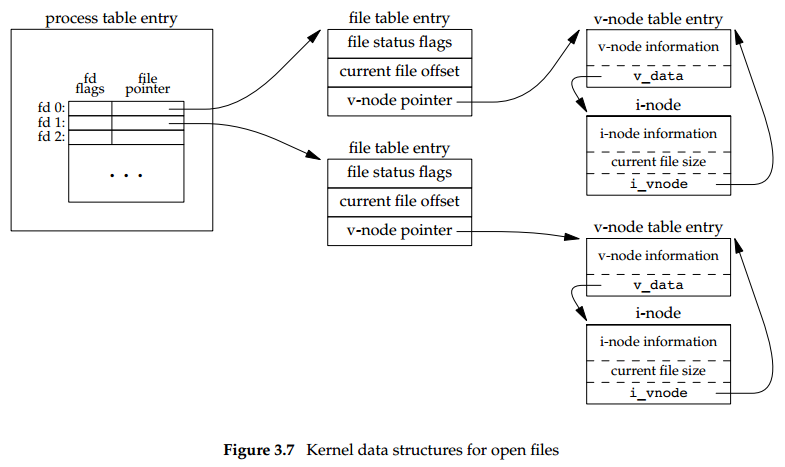
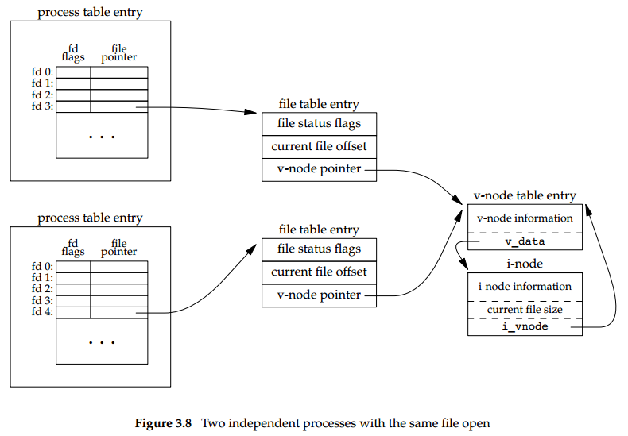
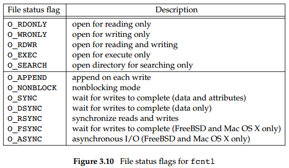

## Chapter 03: File I/O

### 3.1 Introduction

### 3.2 File Descriptors

- To the kernel, all open files are referred to by file descriptors. A file descriptor is a non-negative integer. When we open an existing file or create a new file, the kernel returns a file descriptor to the process. When we want to read or write a file, we identify the file with the file descriptor that was returned by open or creat as an argument to either read or write.

- By convention, UNIX System shells associate file descriptor 0 with the standard input of a process, file descriptor 1 with the standard output, and file descriptor 2 with the standard error.

### 3.3 open and openat Functions

- A file is opened or created by calling either the open function or the openat function.
  ```c++
  #include <fcntl.h>
  int open(const char *path, int oflag, ... /* mode_t mode */ );
  int openat(int fd, const char *path, int oflag, ... /* mode_t mode */ );
  ```
	We show the last argument as ..., which is the ISO C way to specify that the number and types of the remaining arguments may vary.

- This function has a multitude of options, which are specified by the oflag argument. This argument is formed by ORing together one or more of the following constants from the <fcntl.h> header.

- The file descriptor returned by open and openat is guaranteed to be the lowestnumbered unused descriptor. This fact is used by some applications to open a new file on standard input, standard output, or standard error.

- The fd parameter distinguishes the openat function from the open function. There are three possibilities:
	- (1) The path parameter specifies an absolute pathname. In this case, the fd parameter is ignored and the openat function behaves like the open function.
	- (2) The path parameter specifies a relative pathname and the fd parameter is a file descriptor that specifies the starting location in the file system where the relative pathname is to be evaluated.
	- (3) The path parameter specifies a relative pathname and the fd parameter has the special value AT_FDCWD. In this case, the pathname is evaluated starting in the current working directory and the openat function behaves like the open function.

- The basic idea behind TOCTTOU errors is that a program is vulnerable if it makes two file-based function calls where the second call depends on the results of the first call. Because the two calls are not atomic, the file can change between the two calls, thereby invalidating the results of the first call, leading to a program error. TOCTTOU errors in the file system namespace generally deal with attempts to subvert file system permissions by tricking a privileged program into either reducing permissions on a privileged file or modifying a privileged file to open up a security hole.

- With POSIX.1, the constant _POSIX_NO_TRUNC determines whether long filenames and long components of pathnames are truncated or an error is returned.

### 3.4 creat Function

- A new file can also be created by calling the creat function.
  ```c++
  #include <fcntl.h>
  int creat(const char *path, mode_t mode);
  ```
	Note that this function is equivalent to
  ```c++
  open(path, O_WRONLY | O_CREAT | O_TRUNC, mode);
  ```

- One deficiency with creat is that the file is opened only for writing. A better way is to use the open function, as in
  ```c++
  open(path, O_RDWR | O_CREAT | O_TRUNC, mode);
  ```

### 3.5 close Function

- An open file is closed by calling the close function.
  ```c++
  #include <unistd.h>
  int close(int fd);
  ```
	Closing a file also releases any record locks that the process may have on the file. When a process terminates, all of its open files are closed automatically by the kernel. Many programs take advantage of this fact and don’t explicitly close open files.

### 3.6 lseek Function

- Every open file has an associated ‘‘current file offset,’’ normally a non-negative integer that measures the number of bytes from the beginning of the file.

- An open file’s offset can be set explicitly by calling lseek.
  ```c++
  #include <unistd.h>
  off_t lseek(int fd, off_t offset, int whence);
  ```
	The interpretation of the offset depends on the value of the whence argument.
	- If whence is SEEK_SET, the file’s offset is set to offset bytes from the beginning of the file.
	- If whence is SEEK_CUR, the file’s offset is set to its current value plus the offset. The offset can be positive or negative.
	- If whence is SEEK_END, the file’s offset is set to the size of the file plus the offset. The offset can be positive or negative.

- The file’s offset can be greater than the file’s current size, in which case the next write to the file will extend the file. This is referred to as creating a hole in a file and is allowed. Any bytes in a file that have not been written are read back as 0. A hole in a file isn’t required to have storage backing it on disk. Depending on the file system implementation, when you write after seeking past the end of a file, new disk blocks might be allocated to store the data, but there is no need to allocate disk blocks for the data between the old end of file and the location where you start writing.

### 3.7 read Function

- Data is read from an open file with the read function.
  ```c++
  #include <unistd.h>
  ssize_t read(int fd, void *buf, size_t nbytes);
  ```
	If the read is successful, the number of bytes read is returned. If the end of file is encountered, 0 is returned.

### 3.8 write Function

- Data is written to an open file with the write function.
  ```c++
  #include <unistd.h>
  ssize_t write(int fd, const void *buf, size_t nbytes);
  ```

### 3.9 I/O Efficiency

- Most file systems support some kind of read-ahead to improve performance. When sequential reads are detected, the system tries to read in more data than an application requests, assuming that the application will read it shortly.

### 3.10 File Sharing

- Kernel data structures for open files  
  

- Two independent processes with the same file open  
  

- The lseek function modifies only the current file offset in the file table entry. No I/O takes place.

### 3.11 Atomic Operations

- The UNIX System provides an atomic way to do this operation if we set the O_APPEND flag when a file is opened. As we described in the previous section, this causes the kernel to position the file to its current end of file before each write. We no longer have to call lseek before each write.

- The Single UNIX Specification includes two functions that allow applications to seek and perform I/O atomically: pread and pwrite.
  ```c++
  #include <unistd.h>
  ssize_t pread(int fd, void *buf, size_t nbytes, off_t offset);
  ssize_t pwrite(int fd, const void *buf, size_t nbytes, off_t offset);
  ```

- We saw another example of an atomic operation when we described the O_CREAT and O_EXCL options for the open function. When both of these options are specified, the open will fail if the file already exists.

### 3.12 dup and dup2 Functions

- An existing file descriptor is duplicated by either of the following functions:
  ```c++
  #include <unistd.h>
  int dup(int fd);
  int dup2(int fd, int fd2);
  ```

- Another way to duplicate a descriptor is with the fcntl function, which we describe in Section 3.14. Indeed, the call
  ```c++
  dup(fd);
  ```
	is equivalent to
  ```c++
  fcntl(fd, F_DUPFD, 0);
  ```

### 3.13 sync, fsync, and fdatasync Functions

- Traditional implementations of the UNIX System have a buffer cache or page cache in the kernel through which most disk I/O passes. When we write data to a file, the data is normally copied by the kernel into one of its buffers and queued for writing to disk at some later time. This is called delayed write.

- To ensure consistency of the file system on disk with the contents of the buffer cache, the sync, fsync, and fdatasync functions are provided.
  ```c++
  #include <unistd.h>
  int fsync(int fd);
  int fdatasync(int fd);
  void sync(void);
  ```

- The sync function simply queues all the modified block buffers for writing and returns; it does not wait for the disk writes to take place. The function fsync refers only to a single file, specified by the file descriptor fd, and waits for the disk writes to complete before returning. The fdatasync function is similar to fsync, but it affects only the data portions of a file. With fsync, the file’s attributes are also updated synchronously.

### 3.14 fcntl Function

- The fcntl function can change the properties of a file that is already open.
  ```c++
  #include <fcntl.h>
  int fcntl(int fd, int cmd, ... /* int arg */ );
  ```

- The fcntl function is used for five different purposes.
	- Duplicate an existing descriptor (cmd = F_DUPFD or F_DUPFD_CLOEXEC)
	- Get/set file descriptor flags (cmd = F_GETFD or F_SETFD)
	- Get/set file status flags (cmd = F_GETFL or F_SETFL)
	- Get/set asynchronous I/O ownership (cmd = F_GETOWN or F_SETOWN)
	- Get/set record locks (cmd = F_GETLK, F_SETLK, or F_SETLKW)

- File status flags for fcntl  
  

- When we modify either the file descriptor flags or the file status flags, we must be careful to fetch the existing flag value, modify it as desired, and then set the new flag value. We can’t simply issue an F_SETFD or an F_SETFL command, as this could turn off flag bits that were previously set.
  ```c++
  val |= flags; /* turn on flags */
  val &= ˜flags; /* turn flags off */
  ```

### 3.15 ioctl Function

- The ioctl function has always been the catchall for I/O operations. Anything that couldn’t be expressed using one of the other functions in this chapter usually ended up being specified with an ioctl.
  ```c++
  #include <unistd.h> /* System V */
  #include <sys/ioctl.h> /* BSD and Linux */
  int ioctl(int fd, int request, ...);
  ```

### 3.16 /dev/fd

- Newer systems provide a directory named /dev/fd whose entries are files named 0, 1, 2, and so on. Opening the file /dev/fd/n is equivalent to duplicating descriptor n, assuming that descriptor n is open.

- In the function call
  ```c++
  fd = open("/dev/fd/0", mode);
  ```
	most systems ignore the specified mode, whereas others require that it be a subset of the mode used when the referenced file (standard input, in this case) was originally opened. Because the previous open is equivalent to
  ```c++
  fd = dup(0);
  ```
	the descriptors 0 and fd share the same file table entry (Figure 3.9). For example, if descriptor 0 was opened read-only, we can only read on fd. Even if the system ignores the open mode and the call
  ```c++
  fd = open("/dev/fd/0", O_RDWR);
  ```
	succeeds, we still can’t write to fd.

- The main use of the /dev/fd files is from the shell. It allows programs that use pathname arguments to handle standard input and standard output in the same manner as other pathnames.

### 3.17 Summary