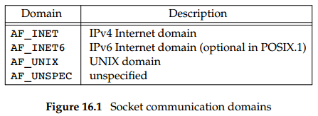
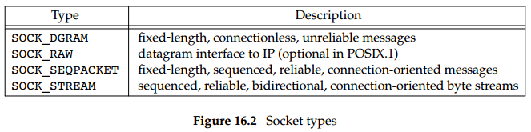
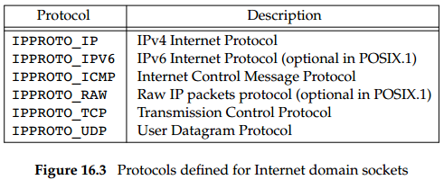
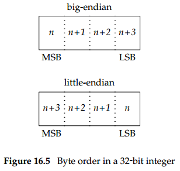
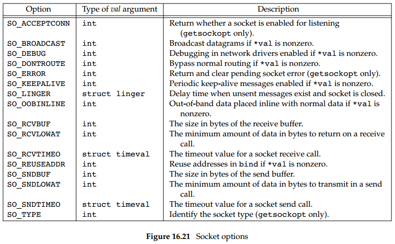

## Chapter 16: Network IPC: Sockets

### 16.1 Introduction

### 16.2 Socket Descriptors

- A socket is an abstraction of a communication endpoint. Just as they would use file descriptors to access files, applications use socket descriptors to access sockets. Socket descriptors are implemented as file descriptors in the UNIX System. Indeed, many of the functions that deal with file descriptors, such as read and write, will work with a socket descriptor. To create a socket, we call the socket function.
```c++
#include <sys/socket.h>
int socket(int domain, int type, int protocol);
```

- The domain argument determines the nature of the communication, including the address format. The type argument determines the type of the socket, which further determines the communication characteristics. The protocol argument is usually zero, to select the default protocol for the given domain and socket type. When multiple protocols are supported for the same domain and socket type, we can use the protocol argument to select a particular protocol.

- Socket communication domains  
  

- Socket types  
  

- Protocols defined for Internet domain sockets  
  

- Communication on a socket is bidirectional. We can disable I/O on a socket with the shutdown function.
```c++
#include <sys/socket.h>
int shutdown(int sockfd, int how);
```
If how is SHUT_RD, then reading from the socket is disabled. If how is SHUT_WR, then we can’t use the socket for transmitting data. We can use SHUT_RDWR to disable both data transmission and reception.

- Given that we can close a socket, why is shutdown needed? There are several reasons. First, close will deallocate the network endpoint only when the last active reference is closed. If we duplicate the socket (with dup, for example), the socket won’t be deallocated until we close the last file descriptor referring to it. The shutdown function allows us to deactivate a socket independently of the number of active file descriptors referencing it. Second, it is sometimes convenient to shut a socket down in one direction only.

### 16.3 Addressing

- Identifying the process has two components. The machine’s network address helps us identify the computer on the network we wish to contact, and the service, represented by a port number, helps us identify the particular process on the computer.

- Byte order in a 32-bit integer  
  

- If the processor architecture supports big-endian byte order, then the highest byte address occurs in the least significant byte (LSB). Little-endian byte order is the opposite: the least significant byte contains the lowest byte address.

- Four functions are provided to convert between the processor byte order and the network byte order for TCP/IP applications.
```c++
#include <arpa/inet.h>
uint32_t htonl(uint32_t hostint32);
uint16_t htons(uint16_t hostint16);
uint32_t ntohl(uint32_t netint32);
uint16_t ntohs(uint16_t netint16);
```
The h is for ‘‘host’’ byte order, and the n is for ‘‘network’’ byte order. The l is for ‘‘long’’ (i.e., 4-byte) integer, and the s is for ‘‘short’’ (i.e., 2-byte) integer.

- The address format is specific to the particular domain. So that addresses with different formats can be passed to the socket functions, the addresses are cast to a generic sockaddr address structure:
```c++
struct sockaddr {
  sa_family_t sa_family;	/* address family */
  char sa_data[];			/* variable-length address */
  ...
};
```

- Internet addresses are defined in <netinet/in.h>. In the IPv4 Internet domain (AF_INET), a socket address is represented by a sockaddr_in structure:
```c++
struct in_addr {
  in_addr_t s_addr;			/* IPv4 address */
};
struct sockaddr_in {
  sa_family_t sin_family;	/* address family */
  in_port_t sin_port;		/* port number */
  struct in_addr sin_addr;	/* IPv4 address */
};
```

- In contrast to the AF_INET domain, the IPv6 Internet domain (AF_INET6) socket address is represented by a sockaddr_in6 structure:
```c++
struct in6_addr {
  uint8_t s6_addr[16];		/* IPv6 address */
};
struct sockaddr_in6 {
  sa_family_t sin6_family;		/* address family */
  in_port_t sin6_port;			/* port number */
  uint32_t sin6_flowinfo;		/* traffic class and flow info */
  struct in6_addr sin6_addr;	/* IPv6 address */
  uint32_t sin6_scope_id;		/* set of interfaces for scope */
};
```

- Two new functions—inet_ntop and inet_pton—support similar functionality and work with both IPv4 and IPv6 addresses.
```c++
#include <arpa/inet.h>
const char *inet_ntop(int domain, const void *restrict addr, char *restrict str, socklen_t size);
int inet_pton(int domain, const char *restrict str, void *restrict addr);
```

- The hosts known by a given computer system are found by calling gethostent.
```c++
#include <netdb.h>
struct hostent *gethostent(void);
void sethostent(int stayopen);
void endhostent(void);
```

- When gethostent returns, we get a pointer to a hostent structure, which might point to a static data buffer that is overwritten each time we call gethostent. The hostent structure is defined to have at least the following members:
```c++
struct hostent {
  char *h_name;			/* name of host */
  char **h_aliases;		/* pointer to alternate host name array */
  int h_addrtype;		/* address type */
  int h_length;			/* length in bytes of address */
  char **h_addr_list;	/* pointer to array of network addresses */
  ...
};
```

- We can get network names and numbers with a similar set of interfaces.
```c++
#include <netdb.h>
struct netent *getnetbyaddr(uint32_t net, int type);
struct netent *getnetbyname(const char *name);
struct netent *getnetent(void);
void setnetent(int stayopen);
void endnetent(void);
```
The netent structure contains at least the following fields:
```c++
struct netent {
  char *n_name;		/* network name */
  char **n_aliases;	/* alternate network name array pointer */
  int n_addrtype;	/* address type */
  uint32_t n_net;	/* network number */
  ...
};
```

- We can map between protocol names and numbers with the following functions.
```c++
#include <netdb.h>
struct protoent *getprotobyname(const char *name);
struct protoent *getprotobynumber(int proto);
struct protoent *getprotoent(void);
void setprotoent(int stayopen);
void endprotoent(void);
```
The protoent structure as defined by POSIX.1 has at least the following members:
```c++
struct protoent {
  char *p_name;		/* protocol name */
  char **p_aliases;	/* pointer to alternate protocol name array */
  int p_proto;		/* protocol number */
  ...
};
```

- We can map a service name to a port number with getservbyname, map a port number to a service name with getservbyport, or scan the services database sequentially with getservent.
```c++
#include <netdb.h>
struct servent *getservbyname(const char *name, const char *proto);
struct servent *getservbyport(int port, const char *proto);
struct servent *getservent(void);
void setservent(int stayopen);
void endservent(void);
```
The servent structure is defined to have at least the following members:
```c++
struct servent {
  char *s_name;		/* service name */
  char **s_aliases;	/* pointer to alternate service name array */
  int s_port;		/* port number */
  char *s_proto;	/* name of protocol */
  ...
};
```

- The getaddrinfo function allows us to map a host name and a service name to an address.
```c++
#include <sys/socket.h>
#include <netdb.h>
int getaddrinfo(const char *restrict host, const char *restrict service,
    const struct addrinfo *restrict hint, struct addrinfo **restrict res);
void freeaddrinfo(struct addrinfo *ai);
```
We need to provide the host name, the service name, or both. If we provide only one name, the other should be a null pointer. The host name can be either a node name or the host address in dotted-decimal notation. The getaddrinfo function returns a linked list of addrinfo structures. The addrinfo structure is defined to include at least the following members:
```c++
struct addrinfo {
  int ai_flags;				/* customize behavior */
  int ai_family;			/* address family */
  int ai_socktype;			/* socket type */
  int ai_protocol;			/* protocol */
  socklen_t ai_addrlen;		/* length in bytes of address */
  struct sockaddr *ai_addr;	/* address */
  char *ai_canonname;		/* canonical name of host */
  struct addrinfo *ai_next;	/* next in list */
  ...
};
```
We can supply an optional hint to select addresses that meet certain criteria.

- If getaddrinfo fails, we can’t use perror or strerror to generate an error message. Instead, we need to call gai_strerror to convert the error code returned into an error message.
```c++
#include <netdb.h>
const char *gai_strerror(int error);
```

- The getnameinfo function converts an address into host and service names.
```c++
#include <sys/socket.h>
#include <netdb.h>
int getnameinfo(const struct sockaddr *restrict addr, socklen_t alen,
    char *restrict host, socklen_t hostlen, char *restrict service, socklen_t servlen, int flags);
```

- We use the bind function to associate an address with a socket.
```c++
#include <sys/socket.h>
int bind(int sockfd, const struct sockaddr *addr, socklen_t len);
```

- We can use the getsockname function to discover the address bound to a socket.
```c++
#include <sys/socket.h>
int getsockname(int sockfd, struct sockaddr *restrict addr, socklen_t *restrict alenp);
```

- If the socket is connected to a peer, we can find out the peer’s address by calling the getpeername function.
```c++
#include <sys/socket.h>
int getpeername(int sockfd, struct sockaddr *restrict addr, socklen_t *restrict alenp);
```

### 16.4 Connection Establishment

- We use the connect function to create a connection.
```c++
#include <sys/socket.h>
int connect(int sockfd, const struct sockaddr *addr, socklen_t len);
```

- A server announces that it is willing to accept connect requests by calling the listen function.
```c++
#include <sys/socket.h>
int listen(int sockfd, int backlog);
```
The backlog argument provides a hint to the system regarding the number of outstanding connect requests that it should enqueue on behalf of the process. 

- Once a server has called listen, the socket used can receive connect requests. We use the accept function to retrieve a connect request and convert it into a connection.
```c++
#include <sys/socket.h>
int accept(int sockfd, struct sockaddr *restrict addr, socklen_t *restrict len);
```
The file descriptor returned by accept is a socket descriptor that is connected to the client that called connect. This new socket descriptor has the same socket type and address family as the original socket (sockfd). The original socket passed to accept is not associated with the connection, but instead remains available to receive additional connect requests.

### 16.5 Data Transfer

- Three functions are available for sending data, and three are available for receiving data. First, we’ll look at the ones used to send data. The simplest one is send. It is similar to write, but allows us to specify flags to change how the data we want to transmit is treated.
```c++
#include <sys/socket.h>
ssize_t send(int sockfd, const void *buf, size_t nbytes, int flags);
```
The sendto function is similar to send. The difference is that sendto allows us to specify a destination address to be used with connectionless sockets.
```c++
#include <sys/socket.h>
ssize_t sendto(int sockfd, const void *buf, size_t nbytes, int flags,
    const struct sockaddr *destaddr, socklen_t destlen);
```
We have one more choice when transmitting data over a socket. We can call sendmsg with a msghdr structure to specify multiple buffers from which to transmit data, similar to the writev function.
```c++
#include <sys/socket.h>
ssize_t sendmsg(int sockfd, const struct msghdr *msg, int flags);
```
POSIX.1 defines the msghdr structure to have at least the following members:
```c++
struct msghdr {
  void *msg_name;			/* optional address */
  socklen_t msg_namelen;	/* address size in bytes */
  struct iovec *msg_iov;	/* array of I/O buffers */
  int msg_iovlen;			/* number of elements in array */
  void *msg_control;		/* ancillary data */
  socklen_t msg_controllen;	/* number of ancillary bytes */
  int msg_flags;			/* flags for received message */
  ...
};
```

- The recv function is similar to read, but allows us to specify some options to control how we receive the data.
```c++
#include <sys/socket.h>
ssize_t recv(int sockfd, void *buf, size_t nbytes, int flags);
```
If we are interested in the identity of the sender, we can use recvfrom to obtain the source address from which the data was sent.
```c++
#include <sys/socket.h>
ssize_t recvfrom(int sockfd, void *restrict buf, size_t len, int flags,
    struct sockaddr *restrict addr, socklen_t *restrict addrlen);
```
To receive data into multiple buffers, similar to readv (Section 14.6), or if we want to receive ancillary data, we can use recvmsg.
```c++
#include <sys/socket.h>
ssize_t recvmsg(int sockfd, struct msghdr *msg, int flags);
```

### 16.6 Socket Options

- The socket mechanism provides two socket-option interfaces for us to control the behavior of sockets. One interface is used to set an option, and another interface allows us to query the state of an option. We can get and set three kinds of options:
	- (1) Generic options that work with all socket types
	- (2) Options that are managed at the socket level, but depend on the underlying protocols for support
	- (3) Protocol-specific options unique to each individual protocol

- We can set a socket option with the setsockopt function.
```c++
#include <sys/socket.h>
int setsockopt(int sockfd, int level, int option, const void *val, socklen_t len);
```
We can find out the current value of an option with the getsockopt function.
```c++
#include <sys/socket.h>
int getsockopt(int sockfd, int level, int option, void *restrict val, socklen_t *restrict lenp);
```

- Socket options  
  

### 16.7 Out-of-Band Data

- TCP refers to out-of-band data as ‘‘urgent’’ data. TCP supports only a single byte of urgent data, but allows urgent data to be delivered out of band from the normal data delivery mechanisms. To generate urgent data, we specify the MSG_OOB flag to any of the three send functions. When urgent data is received, we are sent the SIGURG signal if we have arranged for signal generation by the socket.

- TCP supports the notion of an urgent mark : the point in the normal data stream where the urgent data would go. We can choose to receive the urgent data inline with the normal data if we use the SO_OOBINLINE socket option. To help us identify when we have reached the urgent mark, we can use the sockatmark function.
```c++
#include <sys/socket.h>
int sockatmark(int sockfd);
```
When the next byte to be read is at the urgent mark, sockatmark will return 1. When out-of-band data is present in a socket’s read queue, the select function will return the file descriptor as having an exception condition pending. We can choose to receive the urgent data inline with the normal data, or we can use the MSG_OOB flag with one of the recv functions to receive the urgent data ahead of any other queue data. TCP queues only one byte of urgent data. If another urgent byte arrives before we receive the current one, the existing one is discarded.

### 16.8 Nonblocking and Asynchronous I/O

- Normally, the recv functions will block when no data is immediately available. Similarly, the send functions will block when there is not enough room in the socket’s output queue to send the message. This behavior changes when the socket is in nonblocking mode. In this case, these functions will fail instead of blocking, setting errno to either EWOULDBLOCK or EAGAIN. When this happens, we can use either poll or select to determine when we can receive or transmit data.

- With socket-based asynchronous I/O, we can arrange to be sent the SIGIO signal when we can read data from a socket or when space becomes available in a socket’s write queue. Enabling asynchronous I/O is a two-step process. 
	- (1) Establish socket ownership so signals can be delivered to the proper processes.
	- (2) Inform the socket that we want it to signal us when I/O operations won’t block.
We can accomplish the first step in three ways.
	- (1) Use the F_SETOWN command with fcntl.
	- (2) Use the FIOSETOWN command with ioctl.
	- (3) Use the SIOCSPGRP command with ioctl.
To accomplish the second step, we have two choices.
	- (1) Use the F_SETFL command with fcntl and enable the O_ASYNC file flag.
	- (2) Use the FIOASYNC command with ioctl.