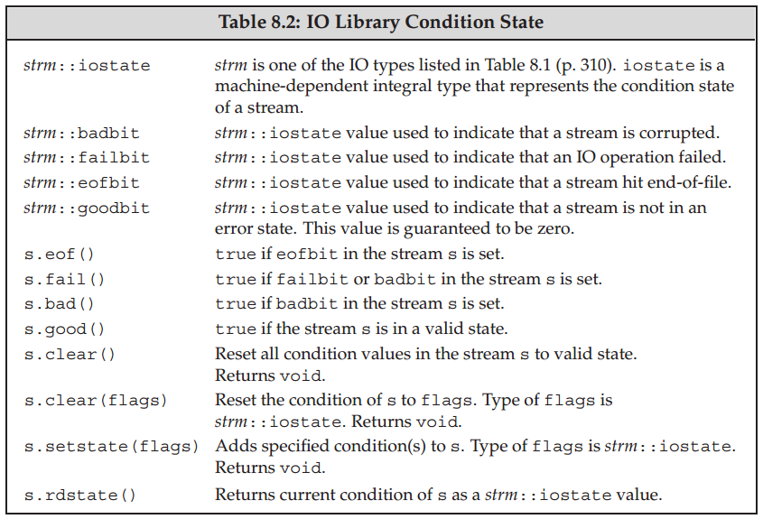

## Chapter 08: The IO Library

### 8.1 The IO Classes

- IO Library Types and Headers  
  

- To support languages that use wide characters, the library defines a set of types and objects that manipulate wchar_t data. The names of the widecharacter versions begin with a w.

- The library lets us ignore the differences among these different kinds of streams by using inheritance. As with templates, we can use classes related by inheritance without understanding the details of how inheritance works.

- We cannot copy or assign objects of the IO types:
  ```c++
  ofstream out1, out2;
  out1 = out2; // error: cannot assign stream objects
  ofstream print(ofstream); // error: can’t initialize the ofstream parameter
  out2 = print(out2); // error: cannot copy stream objects
  ```
	Because we can’t copy the IO types, we cannot have a parameter or return type that is one of the stream types. Functions that do IO typically pass and return the stream through references. Reading or writing an IO object changes its state, so the reference must not be const.

- The IO library defines a machine-dependent integral type named iostate that it uses to convey information about the state of a stream.

- IO Library Condition State  
  

- Using a buffer allows the operating system to combine several output operations from our program into a single system-level write. Because writing to a device can be time-consuming, letting the operating system combine several output operations into a single write can provide an important performance boost.

- There are several conditions that cause the buffer to be flushed—that is, to be written—to the actual output device or file:
	- The program completes normally. All output buffers are flushed as part of the return from main.
	- At some indeterminate time, the buffer can become full, in which case it will be flushed before writing the next value.
	- We can flush the buffer explicitly using a manipulator such as endl.
	- We can use the unitbuf manipulator to set the stream’s internal state to empty the buffer after each output operation. By default, unitbuf is set for cerr, so that writes to cerr are flushed immediately.
	- An output stream might be tied to another stream. In this case, the output stream is flushed whenever the stream to which it is tied is read or written.

- Our programs have already used the endl manipulator, which ends the current line and flushes the buffer. There are two other similar manipulators: flush and ends. flush flushes the stream but adds no characters to the output; ends inserts a null character into the buffer and then flushes it:
  ```c++
  cout << "hi!" << endl; // writes hi and a newline, then flushes the buffer
  cout << "hi!" << flush; // writes hi, then flushes the buffer; adds no data
  cout << "hi!" << ends; // writes hi and a null, then flushes the buffer
  ```

- If we want to flush after every output, we can use the unitbuf manipulator. This manipulator tells the stream to do a flush after every subsequent write. The nounitbuf manipulator restores the stream to use normal, system-managed buffer flushing:
  ```c++
  cout << unitbuf; // all writes will be flushed immediately
  // any output is flushed immediately, no buffering
  cout << nounitbuf; // returns to normal buffering
  ```

- Output buffers are not flushed if the program terminates abnormally. When a program crashes, it is likely that data the program wrote may be sitting in an output buffer waiting to be printed.

- When an input stream is tied to an output stream, any attempt to read the input stream will first flush the buffer associated with the output stream. The library ties cout to cin, so the statement 
  ```c++
  cin >> ival;
  ```
	causes the buffer associated with cout to be flushed.

- Interactive systems usually should tie their input stream to their output stream. Doing so means that all output, which might include prompts to the user, will be written before attempting to read the input.

- There are two overloaded versions of tie: One version takes no argument and returns a pointer to the output stream, if any, to which this object is currently tied. The function returns the null pointer if the stream is not tied. The second version of tie takes a pointer to an ostream and ties itself to that ostream. That is, x.tie(&o) ties the stream x to the output stream o.

### 8.2 File Input and Output

- If a call to open fails, failbit is set. Because a call to open might fail, it is usually a good idea to verify that the open succeeded:
  ```c++
  if (out) // check that the open succeeded
    // the open succeeded, so we can use the file
  ```

- Indeed, calling open on a file stream that is already open will fail and set failbit. Subsequent attempts to use that file stream will fail. To associate a file stream with a different file, we must first close the existing file. Once the file is closed, we can open a new one:
  ```c++
  in.close(); // close the file
  in.open(ifile + "2"); // open another file
  ```

- When an fstream object goes out of scope, the file it is bound to is automatically closed. When an fstream object is destroyed, close is called automatically.

- File Modes  
  

- By default, a file opened in out mode is truncated even if we do not specify trunc. To preserve the contents of a file opened with out, either we must also specify app, in which case we can write only at the end of the file, or we must also specify in, in which case the file is open for both input and output.

- The only way to preserve the existing data in a file opened by an ofstream is to specify app or in mode explicitly.

- The istringstream type reads a string, ostringstream writes a string, and stringstream reads and writes the string.

### 8.3 string Streams

- stringstream-Specific Operations  
  

- Our program will read the data file and build up a vector of PersonInfo. Each element in the vector will correspond to one record in the file. We’ll process the input in a loop that reads a record and then extracts the name and phone numbers for each person:
  ```c++
  string line, word; // will hold a line and word from input, respectively
  vector<PersonInfo> people; // will hold all the records from the input
  // read the input a line at a time until cin hits end-of-file (or another error)
  while (getline(cin, line)) {
    PersonInfo info; // create an object to hold this record’s data
    istringstream record(line); // bind record to the line we just read
    record >> info.name; // read the name
    while (record >> word) // read the phone numbers
      info.phones.push_back(word); // and store them
    people.push_back(info); // append this record to people
  }
  ```

- Because we don’t want to include any data for a person with an invalid number, we can’t produce the output until we’ve seen and validated all their numbers. We can, however, “write” the output to an in-memory ostringstream:
  ```c++
  for (const auto &entry : people) { // for each entry in people
    ostringstream formatted, badNums; // objects created on each loop
    for (const auto &nums : entry.phones) { // for each number
      if (!valid(nums)) {
        badNums << " " << nums; // string in badNums
      } else
        // ‘‘writes’’ to formatted’s string
        formatted << " " << format(nums);
      }
    if (badNums.str().empty()) // there were no bad numbers
      os << entry.name << " " // print the name
         << formatted.str() << endl; // and reformatted numbers
    else // otherwise, print the name and bad numbers
      cerr << "input error: " << entry.name
           << " invalid number(s) " << badNums.str() << endl;
  }
```