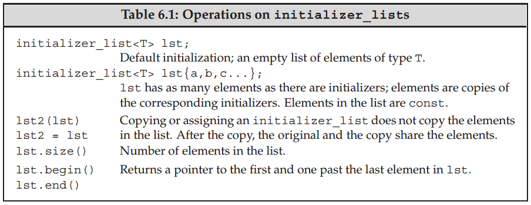

## Functions

- We execute a function through the **call operator**, which is a pair of parentheses.  
A function call does two things: It initializes the function's parameters from the corresponding arguments, and it transfers control to that function.  
Like a function call, the `return` statement does two things: It returns the value (if any) in the `return`, and it transfers control out of the *called* function back to the *calling* function.

- Objects that exist only while a block is executing are known as **automatic objects**.

- It can be useful to have a local variable whose lifetime continues across calls to the function. We obtain such objects by defining a local variable as `static`. Each **local `static` object** is initialized before the *first* time execution passes through the object's definition.

- To allow programs to be written in logical parts, C++ supports what is commonly known as ***separate compilation***.

- When a parameter is a reference, we say that its corresponding argument is **"passed by reference"** or that the function is **"called by reference."** As with any other reference, a reference parameter is an alias for the object to which it is bound; that is, the parameter is an alias for its corresponding argument.  
When the argument value is copied, the parameter and argument are independent objects. We say such arguments are **"passed by value"** or **"called by value."**.

- Programmers accustomed to programming in C often use pointer parameters to access objects outside a function. In C++, programmers generally use reference parameters instead.

- It can be inefficient to copy objects of large class types or large containers. Moreover, some class types (including the IO types) cannot be copied. Functions must use reference parameters to operate on objects of a type that cannot be copied.  
Reference parameters that are not changed inside a function should be references to `const`.  
Reference parameters let us effectively return multiple results.

- Arrays have two special properties that affect how we define and use functions that operate on arrays: We cannot copy an array, and when we use an array it is (usually) converted to a pointer. Because we cannot copy an array, we cannot pass an array by value. Because arrays are converted to pointers, when we pass an array to a function, we are actually passing a pointer to the array's first element.

- For the codes below:

		f(int &arr[10]) // error: declares arr as an array of references
		f(int (&arr)[10]) // ok: arr is a reference to an array of ten ints
The parentheses around `&arr` are necessary.

		int *matrix[10]; // array of ten pointers
		int (*matrix)[10]; // pointer to an array of ten ints
Again, the parentheses around `*matrix` are necessary.

- When you use the arguments in `argv`, remember that the optional arguments begin in `argv[1]`; `argv[0]` contains the program's name, not user input.

- The new standard provides two primary ways to write a function that takes a varying number of arguments: If all the arguments have the same type, we can pass a library type named `initializer_list`. If the argument types vary, we can write a special kind of function, known as a variadic template.  
We can write a function that takes an unknown number of arguments of a single type by using an **`initializer_list`** parameter.

- Operations on **`initializer_list`**  

- **Never Return a Reference or Pointer to a Local Object**

- Under the new standard, functions can return a braced list of values.

- Under the new standard, another way to simplify the declaration of \texttt{func} is by using a **trailing return type**.

		// fcn takes an int argument and returns a pointer to an array of ten ints
		auto func(int i)->int(*)[10];

- A parameter that has a top-level `const` is indistinguishable from one without a top-level `const`.

		Record lookip(Phone);
		Record lookup(const Phone); // redeclares Record lookup(Phone)
On the other hand, we can overload based on whether the parameter is a reference (or pointer) to the `const` or non`const` version of a given type; such `const`s are low-level.

		Record lookup(Account&); // function that takes a reference to Account
		Record lookup(const Account&); // new function that takes a const reference

- **Function matching** (also known as **overload resolution**) is the process by which a particular function call is associated with a specific function from a set of overloaded functions.  
In C++, name lookup happens before type checking.

- Some functions have parameters that are given a particular value in most, but not all, calls. In such cases, we can declare that common value as a **default argument** for the function.  
Although it is normal practice to declare a function once inside a header, it is legal to redeclare a function multiple times. However, each parameter can have its default specified only once in a given scope. Thus, any subsequent declaration can add a default only for a parameter that has not previously had a default specified.  
Names used as default arguments are resolved in the scope of the function declaration. The value that those names represent is evaluated at the time of the call.

		// the declarations of wd, def, and ht must appear outside a function
		sz wd = 80;
		char def = ' ';
		sz ht();
		string screen(sz = ht(), sz = wd, char = def);
		string window = screen(); // calls screen(ht(), 80, ' ')
		void f2()
		{
			def = '*';		// changes the value of a default argument
			sz wd = 100;	// hides the outer definition of wd but does not change the default
			window = screen(); // calls screen(ht(), 80, '*')
		}

- A function specified as ***inline*** (usually) is expanded "in line" at each call.

- A **`constexpr` function** is a function that can be used in a constant expression.  
A `constexpr` function is not required to return a constant expression.

- C++ programmers sometimes use a technique similar to header guards to conditionally execute debugging code. The idea is that the program will contain debugging code that is executed only while the program is being developed. When the application is completed and ready to ship, the debugging code is turned off. This approach uses two preprocessor facilities: `assert` and `NDEBUG`.  
**`assert`** is a **preprocessor macro**. A preprocessor macro is a preprocessor variable that acts somewhat like an inline function.  
The behavior of `assert` depends on the status of a preprocessor variable named `NDEBUG`. If `NDEBUG` is defined, `assert` does nothing. By default, `NDEBUG` is *not* defined, so, by default, `assert` performs a run-time check.

- In order to analyze a call, it is important to remember that the small integral types always promote to `int` or to a larger integral type.

		void ff(int);
		void ff(short);
		ff('a'); // char promotes to int; calls f(int)
All the arithmetic conversions are treated as equivalent to each other.

		void manip(long);
		void manip(float);
		manip(3.14); // error: ambiguous call

- A function pointer is just that&mdash;a pointer that denotes a function rather than an object. Like any other pointer, a function pointer points to a particular type. A function's type is determined by its return type and the types of its parameters.