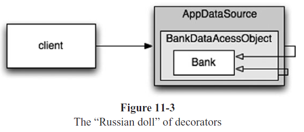

## Chapter 11: Systems

- Software systems should separate the startup process, when the application objects are constructed and the dependencies are “wired” together, from the runtime logic that takes over after startup.

- The code for the startup process is ad hoc and it is mixed in with the runtime logic. Here is a typical example:

  ```java
  public Service getService() {
    if (service == null)
      service = new MyServiceImpl(...); // Good enough default for most cases?
    return service;
  }
  ```

	This is the LAZY INITIALIZATION/EVALUATION idiom, and it has several merits. We don’t incur the overhead of construction unless we actually use the object, and our startup times can be faster as a result. We also ensure that null is never returned.

	However, we now have a hard-coded dependency on MyServiceImpl and everything its constructor requires (which I have elided). We can’t compile without resolving these dependencies, even if we never actually use an object of this type at runtime!

- If we are diligent about building well-formed and robust systems, we should never let little, convenient idioms lead to modularity breakdown. The startup process of object construction and wiring is no exception. We should modularize this process separately from the normal runtime logic and we should make sure that we have a global, consistent strategy for resolving our major dependencies.

- A powerful mechanism for separating construction from use is Dependency Injection (DI), the application of Inversion of Control (IoC) to dependency management.3 Inversion of Control moves secondary responsibilities from an object to other objects that are dedicated to the purpose, thereby supporting the Single Responsibility Principle. In the context of dependency management, an object should not take responsibility for instantiating dependencies itself. Instead, it should pass this responsibility to another “authoritative” mechanism, thereby inverting the control.

- JNDI lookups are a “partial” implementation of DI, where an object asks a directory server to provide a “service” matching a particular name.

  ```java
  MyService myService = (MyService)(jndiContext.lookup(“NameOfMyService”));
  ```

	The invoking object doesn’t control what kind of object is actually returned (as long it implements the appropriate interface, of course), but the invoking object still actively resolves the dependency.

	True Dependency Injection goes one step further. The class takes no direct steps to resolve its dependencies; it is completely passive. Instead, it provides setter methods or constructor arguments (or both) that are used to inject the dependencies. During the construction process, the DI container instantiates the required objects (usually on demand) and uses the constructor arguments or setter methods provided to wire together the dependencies. Which dependent objects are actually used is specified through a configuration file or programmatically in a special-purpose construction module.

- It is a myth that we can get systems “right the first time.” Instead, we should implement only today’s stories, then refactor and expand the system to implement new stories tomorrow. This is the essence of iterative and incremental agility. Test-driven development, refactoring, and the clean code they produce make this work at the code level.

- Software systems are unique compared to physical systems. Their architectures can grow incrementally, if we maintain the proper separation of concerns.

- In fact, the way the EJB architecture handled persistence, security, and transactions, “anticipated” aspect-oriented programming (AOP), which is a general-purpose approach to restoring modularity for cross-cutting concerns.

	In AOP, modular constructs called aspects specify which points in the system should have their behavior modified in some consistent way to support a particular concern. This specification is done using a succinct declarative or programmatic mechanism.

- Java proxies are suitable for simple situations, such as wrapping method calls in individual objects or classes. However, the dynamic proxies provided in the JDK only work with interfaces. To proxy classes, you have to use a byte-code manipulation library, such as CGLIB, ASM, or Javassist.

- Fortunately, most of the proxy boilerplate can be handled automatically by tools. Proxies are used internally in several Java frameworks, for example, Spring AOP and JBoss AOP, to implement aspects in pure Java.12 In Spring, you write your business logic as Plain-Old Java Objects. POJOs are purely focused on their domain. They have no dependencies on enterprise frameworks (or any other domains). Hence, they are conceptually simpler and easier to test drive. The relative simplicity makes it easier to ensure that you are implementing the corresponding user stories correctly and to maintain and evolve the code for future stories.

	You incorporate the required application infrastructure, including cross-cutting concerns like persistence, transactions, security, caching, failover, and so on, using declarative configuration files or APIs. In many cases, you are actually specifying Spring or JBoss library aspects, where the framework handles the mechanics of using Java proxies or byte-code libraries transparently to the user. These declarations drive the dependency injection (DI) container, which instantiates the major objects and wires them together on demand.

- The “Russian doll” of decorators  
  

- Finally, the most full-featured tool for separating concerns through aspects is the AspectJ language, an extension of Java that provides “first-class” support for aspects as modularity constructs. The pure Java approaches provided by Spring AOP and JBoss AOP are sufficient for 80–90 percent of the cases where aspects are most useful. However, AspectJ provides a very rich and powerful tool set for separating concerns. The drawback of AspectJ is the need to adopt several new tools and to learn new language constructs and usage idioms.

- The power of separating concerns through aspect-like approaches can’t be overstated. If you can write your application’s domain logic using POJOs, decoupled from any architecture concerns at the code level, then it is possible to truly test drive your architecture. You can evolve it from simple to sophisticated, as needed, by adopting new technologies on demand. It is not necessary to do a Big Design Up Front (BDUF). In fact, BDUF is even harmful because it inhibits adapting to change, due to the psychological resistance to discarding prior effort and because of the way architecture choices influence subsequent thinking about the design.

- An optimal system architecture consists of modularized domains of concern, each of which is implemented with Plain Old Java (or other) Objects. The different domains are integrated together with minimally invasive Aspects or Aspect-like tools. This architecture can be test-driven, just like the code.

- We all know it is best to give responsibilities to the most qualified persons. We often forget that it is also best to postpone decisions until the last possible moment. This isn’t lazy or irresponsible; it lets us make informed choices with the best possible information. A premature decision is a decision made with suboptimal knowledge. We will have that much less customer feedback, mental reflection on the project, and experience with our implementation choices if we decide too soon.

- The agility provided by a POJO system with modularized concerns allows us to make optimal, just-in-time decisions, based on the most recent knowledge. The complexity of these decisions is also reduced.

- Standards make it easier to reuse ideas and components, recruit people with relevant experience, encapsulate good ideas, and wire components together. However, the process of creating standards can sometimes take too long for industry to wait, and some standards lose touch with the real needs of the adopters they are intended to serve.

- Domain-Specific Languages allow all levels of abstraction and all domains in the application to be expressed as POJOs, from high-level policy to low-level details.