## Chapter 02: Application Layer

### 2.1 Principles of Network Applications

- The application architecture, on the other hand, is designed by the application developer and dictates how the application is structured over the various end systems. In choosing the application architecture, an application developer will likely draw on one of the two predominant architectural paradigms used in modern network applications: the client-server architecture or the peer-to-peer (P2P) architecture.

- In the context of a communication session between a pair of processes, the process that initiates the communication (that is, initially contacts the other process at the beginning of the session) is labeled as the client. The process that waits to be contacted to begin the session is the server.

- A socket is the interface between the application layer and the transport layer within a host. It is also referred to as the Application Programming Interface (API) between the application and the network, since the socket is the programming interface with which network applications are built. In addition to knowing the address of the host to which a message is destined, the sending process must also identify the receiving process (more specifically, the receiving socket) running in the host. This information is needed because in general a host could be running many network applications. A destination port number serves this purpose.

- We can broadly classify the possible services along four dimensions:
	- reliable data transfer
	- throughput
	- timing
	- security.

- requirements of selected network applications
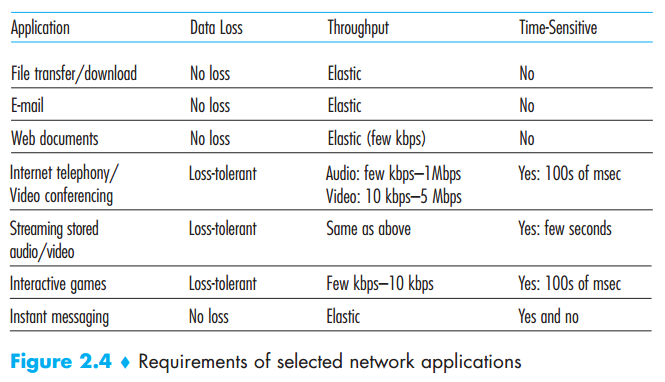

- An application-layer protocol defines how an application’s processes, running on different end systems, pass messages to each other. In particular, an application-layer protocol defines:
	- The types of messages exchanged, for example, request messages and response messages
	- The syntax of the various message types, such as the fields in the message and how the fields are delineated
	- The semantics of the fields, that is, the meaning of the information in the fields
	- Rules for determining when and how a process sends messages and responds to messages

### 2.2 The Web and HTTP

- The HyperText Transfer Protocol (HTTP), the Web’s application-layer protocol, is at the heart of the Web. HTTP is implemented in two programs: a client program and a server program. The client program and server program, executing on different end systems, talk to each other by exchanging HTTP messages. HTTP defines the structure of these messages and how the client and server exchange the messages.

- When this client-server interaction is taking place over TCP, the application developer needs to make an important decision––should each request/response pair be sent over a separate TCP connection, or should all of the requests and their corresponding responses be sent over the same TCP connection? In the former approach, the application is said to use non-persistent connections; and in the latter approach, persistent connections. 

- Below we provide a typical HTTP request message.
	> GET /somedir/page.html HTTP/1.1  
	> Host: www.someschool.edu  
	> Connection: close  
	> User-agent: Mozilla/5.0  
	> Accept-language: fr  

- HTTP request message  
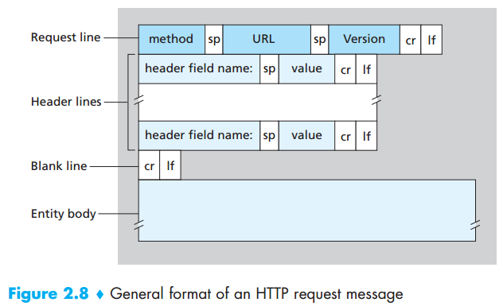  

- Below we provide a typical HTTP response message.
	> HTTP/1.1 200 OK  
	> Connection: close  
	> Date: Tue, 09 Aug 2011 15:44:04 GMT  
	> Server: Apache/2.2.3 (CentOS)  
	> Last-Modified: Tue, 09 Aug 2011 15:11:03 GMT  
	> Content-Length: 6821  
	> Content-Type: text/html  
	> 
	> (data data data data data ...)  

- HTTP response message  
  

- cookies  
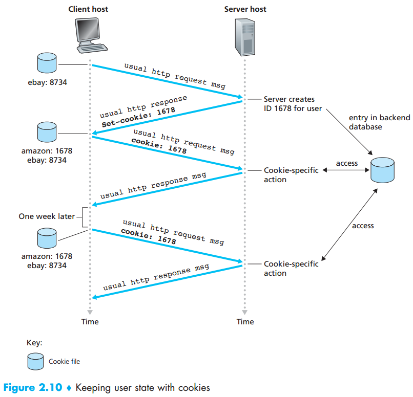  

- A Web cache—also called a proxy server—is a network entity that satisfies HTTP requests on the behalf of an origin Web server. The Web cache has its own disk storage and keeps copies of recently requested objects in this storage. Through the use of Content Distribution Networks (CDNs), Web caches are increasingly playing an important role in the Internet. A CDN company installs many geographically distributed caches throughout the Internet, thereby localizing much of the traffic.

- The object housed in the Web server may have been modified since the copy was cached at the client. Fortunately, HTTP has a mechanism that allows a cache to verify that its objects are up to date. This mechanism is called the conditional GET. An HTTP request message is a so-called conditional GET message if (1) the request message uses the GET method and (2) the request message includes an If-Modified-Since: header line.

- conditional GET request
	> GET /fruit/kiwi.gif HTTP/1.1  
	> Host: www.exotiquecuisine.com  
	> If-modified-since: Wed, 7 Sep 2011 09:23:24  

- conditional GET response
	> HTTP/1.1 304 Not Modified  
	> Date: Sat, 15 Oct 2011 15:39:29  
	> Server: Apache/1.3.0 (Unix)  
	> 
	> (empty entity body)

### 2.3 File Transfer: FTP

- In a typical FTP session, the user is sitting in front of one host (the local host) and wants to transfer files to or from a remote host. In order for the user to access the remote account, the user must provide a user identification and a password. After providing this authorization information, the user can transfer files from the local file system to the remote file system and vice versa.

- FTP uses two parallel TCP connections to transfer a file, a control connection and a data connection. The control connection is used for sending control information between the two hosts—information such as user identification, password, commands to change remote directory, and commands to “put” and “get” files. The data connection is used to actually send a file. Because FTP uses a separate control connection, FTP is said to send its control information out-of-band.

- FTP  
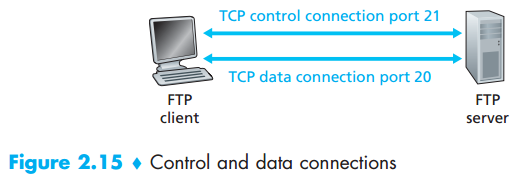  

### Electronic Mail in the Internet

- e-mail  
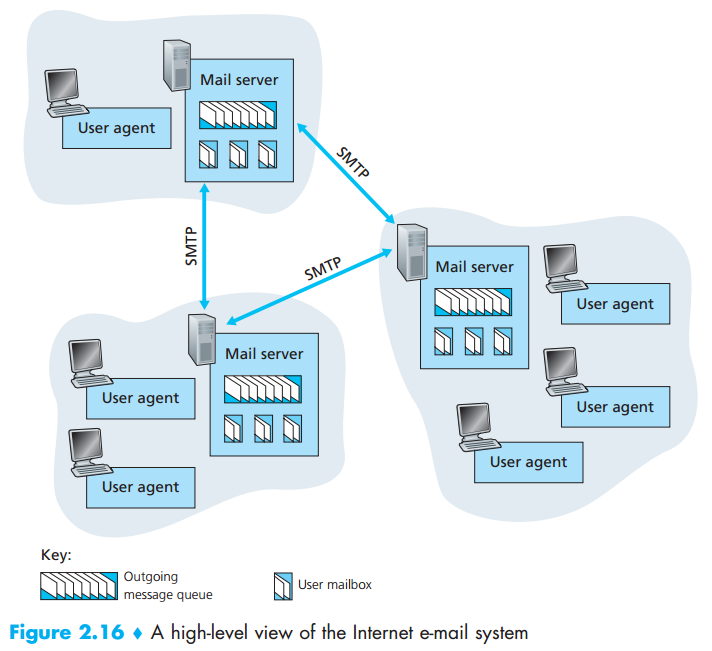  

- SMTP is at the heart of Internet electronic mail. SMTP transfers messages from senders’ mail servers to the recipients’ mail servers.

- SMTP  
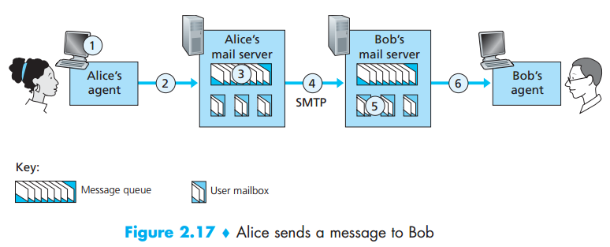  

- SMTP example
	> S: 220 hamburger.edu  
	> C: HELO crepes.fr  
	> S: 250 Hello crepes.fr, pleased to meet you  
	> C: MAIL FROM: <alice@crepes.fr>  
	> S: 250 alice@crepes.fr ... Sender ok  
	> C: RCPT TO: <bob@hamburger.edu>  
	> S: 250 bob@hamburger.edu ... Recipient ok  
	> C: DATA  
	> S: 354 Enter mail, end with “.” on a line by itself  
	> C: Do you like ketchup?  
	> C: How about pickles?  
	> C: .  
	> S: 250 Message accepted for delivery  
	> C: QUIT  
	> S: 221 hamburger.edu closing connection

- There are currently a number of popular mail access protocols, including Post Office Protocol—Version 3 (POP3), Internet Mail Access Protocol (IMAP), and HTTP.

- POP3 begins when the user agent (the client) opens a TCP connection to the mail server (the server) on port 110. With the TCP connection established, POP3 progresses through three phases: authorization, transaction, and update. During the first phase, authorization, the user agent sends a username and a password (in the clear) to authenticate the user. During the second phase, transaction, the user agent retrieves messages; also during this phase, the user agent can mark messages for deletion, remove deletion marks, and obtain mail statistics. The third phase, update, occurs after the client has issued the quit command, ending the POP3 session; at this time, the mail server deletes the messages that were marked for deletion.

- POP3 authorization
	> telnet mailServer 110  
	> +OK POP3 server ready  
	> user bob  
	> +OK  
	> pass hungry  
	> +OK user successfully logged on

- POP3 transaction
	> C: list  
	> S: 1 498  
	> S: 2 912  
	> S: .  
	> C: retr 1  
	> S: (blah blah ...  
	> S: .................  
	> S: ..........blah)  
	> S: .  
	> C: dele 1  
	> C: retr 2  
	> S: (blah blah ...  
	> S: .................  
	> S: ..........blah)  
	> S: .  
	> C: dele 2  
	> C: quit  
	> S: +OK POP3 server signing off

- An IMAP server will associate each message with a folder; when a message first arrives at the server, it is associated with the recipient’s INBOX folder. The recipient can then move the message into a new, user-created folder, read the message, delete the message, and so on. The IMAP protocol provides commands to allow users to create folders and move messages from one folder to another. IMAP also provides commands that allow users to search remote folders for messages matching specific criteria.

### 2.5 DNS—The Internet’s Directory Service

- People prefer the more mnemonic hostname identifier, while routers prefer fixed-length, hierarchically structured IP addresses. In order to reconcile these preferences, we need a directory service that translates hostnames to IP addresses. This is the main task of the Internet’s domain name system (DNS). The DNS is (1) a distributed database implemented in a hierarchy of DNS servers, and (2) an application-layer protocol that allows hosts to query the distributed database. The DNS servers are often UNIX machines running the Berkeley Internet Name Domain (BIND) software [BIND 2012]. The DNS protocol runs over UDP and uses port 53.

- DNS provides a few other important services in addition to translating hostnames to IP addresses:
	- Host aliasing.
	- Mail server aliasing.
	- Load distribution. 

- Hierarchy of DNS servers  
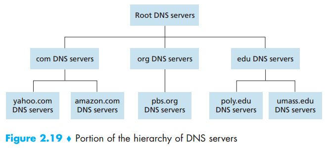  

- DNS query  
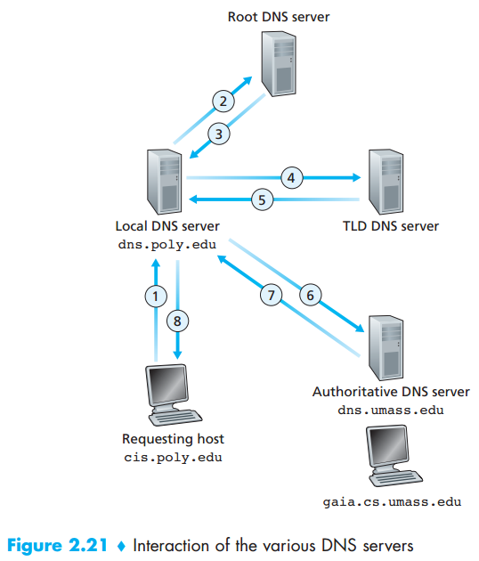  

- DNS message format  
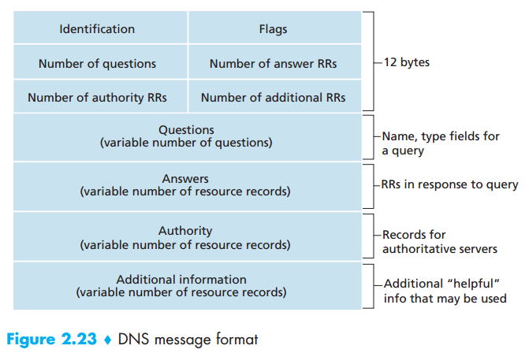  

### 2.6 Peer-to-peer Applications

- BitTorrent is a popular P2P protocol for file distribution. In BitTorrent lingo, the collection of all peers participating in the distribution of a particular file is called a torrent. Peers in a torrent download equal-size chunks of the file from one another, with a typical chunk size of 256 KBytes. When a peer first joins a torrent, it has no chunks. Over time it accumulates more and more chunks. While it downloads chunks it also uploads chunks to other peers. Each torrent has an infrastructure node called a tracker. When a peer joins a torrent, it registers itself with the tracker and periodically informs the tracker that it is still in the torrent. In this manner, the tracker keeps track of the peers that are participating in the torrent.

- In deciding which chunks to request, Alice uses a technique called rarest first. The idea is to determine, from among the chunks she does not have, the chunks that are the rarest among her neighbors (that is, the chunks that have the fewest repeated copies among her neighbors) and then request those rarest chunks first. In this manner, the rarest chunks get more quickly redistributed, aiming to (roughly) equalize the numbers of copies of each chunk in the torrent.

- To determine which requests she responds to, BitTorrent uses a clever trading algorithm. The basic idea is that Alice gives priority to the neighbors that are currently supplying her data at the highest rate. The incentive mechanism for trading just described is often referred to as tit-for-tat.

- In the P2P system, each peer will only hold a small subset of the totality of the (key, value) pairs. We’ll allow any peer to query the distributed database with a particular key. The distributed database will then locate the peers that have the corresponding (key, value) pairs and return the key-value pairs to the querying peer. Any peer will also be allowed to insert new key-value pairs into the database. Such a distributed database is referred to as a distributed hash table (DHT).

- DHT  
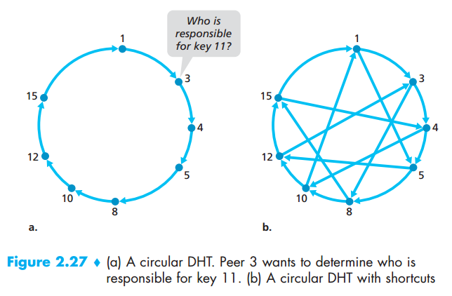  

### 2.7 Socket Programming: Creating Network Applications

- client-server application using UDP  
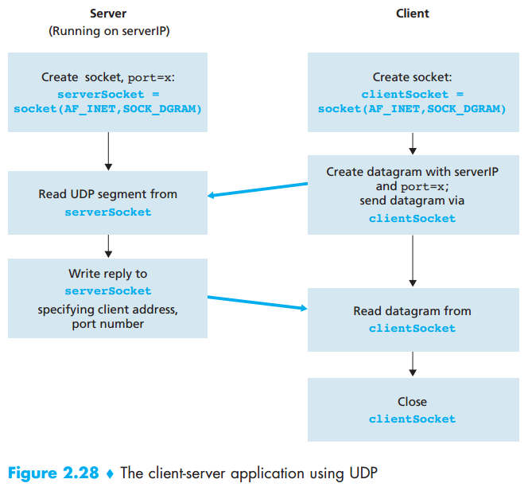  

- TCP server has two sockets  
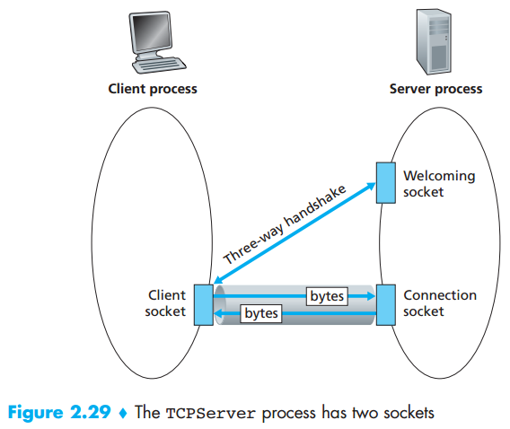  

- client-server application using TCP  
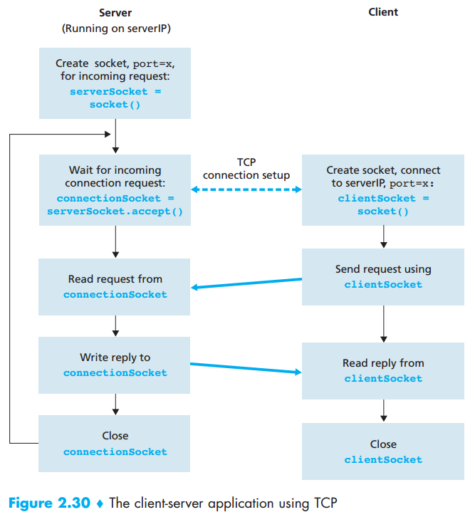  