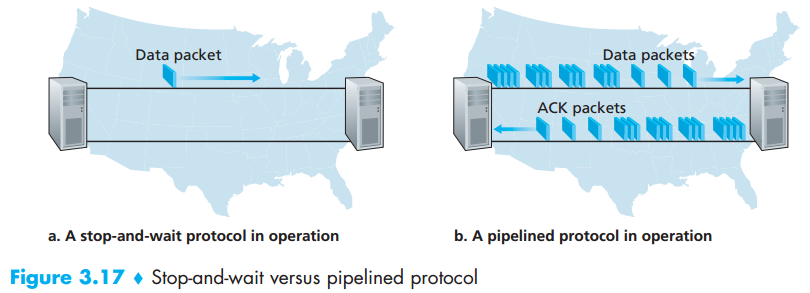
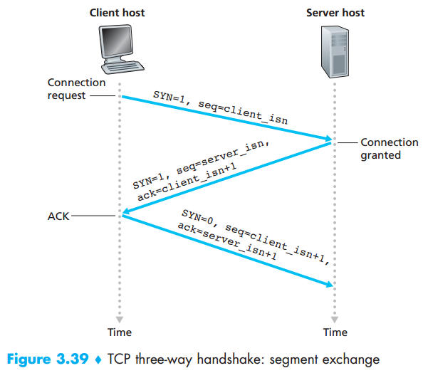

## Chapter 03: Transport Layer

### 3.1 Introduction and Transport-Layer Services

- Whereas a transport-layer protocol provides logical communication between processes running on different hosts, a network-layer protocol provides logical communication between hosts.

- Internet, and more generally a TCP/IP network, makes two distinct transport-layer protocols available to the application layer. One of these protocols is UDP (User Datagram Protocol), which provides an unreliable, connectionless service to the invoking application. The second of these protocols is TCP (Transmission Control Protocol), which provides a reliable, connection-oriented service to the invoking application.

- The IP service model is a best-effort delivery service. This means that IP makes its “best effort” to deliver segments between communicating hosts, but it makes no guarantees.

- TCP also provides congestion control. Congestion control is not so much a service provided to the invoking application as it is a service for the Internet as a whole, a service for the general good.

### 3.2 Multiplexing and Demultiplexing

- Although we have introduced multiplexing and demultiplexing in the context of the Internet transport protocols, it’s important to realize that they are concerns whenever a single protocol at one layer (at the transport layer or elsewhere) is used by multiple protocols at the next higher layer.

- It is important to note that a UDP socket is fully identified by a two-tuple consisting of a destination IP address and a destination port number. One subtle difference between a TCP socket and a UDP socket is that a TCP socket is identified by a four-tuple: (source IP address, source port number, destination IP address, destination port number).

### 3.3 Connectionless Transport: UDP

- UDP does just about as little as a transport protocol can do. Aside from the multiplexing/demultiplexing function and some light error checking, it adds nothing to IP.

- UDP segment structure  
  

- The port numbers allow the destination host to pass the application data to the correct process running on the destination end system (that is, to perform the demultiplexing function). The length field specifies the number of bytes in the UDP segment (header plus data). The checksum is used by the receiving host to check whether errors have been introduced into the segment. In truth, the checksum is also calculated over a few of the fields in the IP header in addition to the UDP segment. 

- The UDP checksum provides for error detection. That is, the checksum is used to determine whether bits within the UDP segment have been altered (for example, by noise in the links or while stored in a router) as it moved from source to destination. UDP at the sender side performs the 1s complement of the sum of all the 16-bit words in the segment, with any overflow encountered during the sum being wrapped around. This result is put in the checksum field of the UDP segment.

- Given that neither link-by-link reliability nor in-memory error detection is guaranteed, UDP must provide error detection at the transport layer, on an end-end basis, if the end-end data transfer service is to provide error detection. This is an example of the celebrated end-end principle in system design, which states that since certain functionality (error detection, in this case) must be implemented on an end-end basis: “functions placed at the lower levels may be redundant or of little value when compared to the cost of providing them at the higher level.”

### 3.4 Principles of Reliable Data Transfer

- Reliable data transfer  
  

- rdt1.0 – A protocol for a completely reliable channel  
  

- These control messages allow the receiver to let the sender know what has been received correctly, and what has been received in error and thus requires repeating. In a computer network setting, reliable data transfer protocols based on such retransmission are known as ARQ (Automatic Repeat reQuest) protocols.

- rdt2.0–A protocol for a channel with bit errors  
  

- The sender will not send a new piece of data until it is sure that the receiver has correctly received the current packet. Because of this behavior, protocols such as rdt2.0 are known as stop-and-wait protocols.

- A simple solution to the duplicate packets problem (and one adopted in almost all existing data transfer protocols, including TCP) is to add a new field to the data packet and have the sender number its data packets by putting a sequence number into this field.

- rdt2.1 sender  
  

- rdt2.1 receiver  
  

- We can accomplish the same effect as a NAK if, instead of sending a NAK, we send an ACK for the last correctly received packet. A sender that receives two ACKs for the same packet (that is, receives duplicate ACKs) knows that the receiver did not correctly receive the packet following the packet that is being ACKed twice.

- rdt2.2 sender  
  

- rdt2.2 receiver  
  

- From the sender’s viewpoint, retransmission is a panacea. The sender does not know whether a data packet was lost, an ACK was lost, or if the packet or ACK was simply overly delayed. In all cases, the action is the same: retransmit. Implementing a time-based retransmission mechanism requires a countdown timer that can interrupt the sender after a given amount of time has expired. The sender will thus need to be able to (1) start the timer each time a packet (either a first-time packet or a retransmission) is sent, (2) respond to a timer interrupt (taking appropriate actions), and (3) stop the timer.

- rdt3.0 sender  
  

- Stop-and-wait versus pipelined protocol  
  

- Rather than operate in a stop-and-wait manner, the sender is allowed to send multiple packets without waiting for acknowledgments. Since the many in-transit sender-to-receiver packets can be visualized as filling a pipeline, this technique is known as pipelining.

- Two basic approaches toward pipelined error recovery can be identified: Go-Back-N and selective repeat.

- In a Go-Back-N (GBN) protocol, the sender is allowed to transmit multiple packets (when available) without waiting for an acknowledgment, but is constrained to have no more than some maximum allowable number, N, of unacknowledged packets in the pipeline. As the protocol operates, this window slides forward over the sequence number space. For this reason, N is often referred to as the window size and the GBN protocol itself as a sliding-window protocol.  In our GBN protocol, an acknowledgment for a packet with sequence number n will be taken to be a cumulative acknowledgment, indicating that all packets with a sequence number up to and including n have been correctly received at the receiver.

- Sender’s view of sequence numbers in Go-Back-N  
  

- Extended FSM description of GBN  
  

- As the name suggests, selective-repeat protocols avoid unnecessary retransmissions by having the sender retransmit only those packets that it suspects were received in error (that is, were lost or corrupted) at the receiver. This individual, asneeded, retransmission will require that the receiver individually acknowledge correctly received packets. A window size of N will again be used to limit the number of outstanding, unacknowledged packets in the pipeline. However, unlike GBN, the sender will have already received ACKs for some of the packets in the window.

- Selective-repeat (SR)  
  

- It is important to note that the receiver reacknowledges (rather than ignores) already received packets with certain sequence numbers below the current window base.

- Summary of reliable data transfer mechanisms  
  

### 3.5 Connection-Oriented Transport: TCP

- The maximum amount of data that can be grabbed and placed in a segment is limited by the maximum segment size (MSS). The MSS is typically set by first determining the length of the largest link-layer frame that can be sent by the local sending host (the so-called maximum transmission unit, MTU), and then setting the MSS to ensure that a TCP segment (when encapsulated in an IP datagram) plus the TCP/IP header length (typically 40 bytes) will fit into a single link-layer frame. Note that the MSS is the maximum amount of application-layer data in the segment, not the maximum size of the TCP segment including headers.

- TCP segment structure  
  

- The ACK bit is used to indicate that the value carried in the acknowledgment field is valid; that is, the segment contains an acknowledgment for a segment that has been successfully received. The RST, SYN, and FIN bits are used for connection setup and teardown, as we will discuss at the end of this section. Setting the PSH bit indicates that the receiver should pass the data to the upper layer immediately. Finally, the URG bit is used to indicate that there is data in this segment that the sending-side upper-layer entity has marked as “urgent.” The location of the last byte of this urgent data is indicated by the 16-bit urgent data pointer field.

- TCP views data as an unstructured, but ordered, stream of bytes. TCP’s use of sequence numbers reflects this view in that sequence numbers are over the stream of transmitted bytes and not over the series of transmitted segments. The sequence number for a segment is therefore the byte-stream number of the first byte in the segment.

- TCP ACK Generation Recommendation  
  

- If the TCP sender receives three duplicate ACKs for the same data, it takes this as an indication that the segment following the segment that has been ACKed three times has been lost. In the case that three duplicate ACKs are received, the TCP sender performs a fast retransmit [RFC 5681], retransmitting the missing segment before that segment’s timer expires.

- A proposed modification to TCP, the so-called selective acknowledgment, allows a TCP receiver to acknowledge out-of-order segments selectively rather than just cumulatively acknowledging the last correctly received, inorder segment.

- TCP provides a flow-control service to its applications to eliminate the possibility of the sender overflowing the receiver’s buffer. 

- As noted earlier, a TCP sender can also be throttled due to congestion within the IP network; this form of sender control is referred to as congestion control.

- Suppose Host B’s receive buffer becomes full so that rwnd = 0. After advertising rwnd = 0 to Host A, also suppose that B has nothing to send to A. Now consider what happens. As the application process at B empties the buffer, TCP does not send new segments with new rwnd values to Host A; indeed, TCP sends a segment to Host A only if it has data to send or if it has an acknowledgment to send. Therefore, Host A is never informed that some space has opened up in Host B’s receive buffer—Host A is blocked and can transmit no more data! To solve this problem, the TCP specification requires Host A to continue to send segments with one data byte when B’s receive window is zero.

- TCP three-way handshake: segment exchange  
  

- Closing a TCP connection  
  

- A typical sequence of TCP states  
  

### 3.6 Principles of Congestion Control

- The Causes and the Costs of Congestion
	- Large queuing delays are experienced as the packetarrival rate nears the link capacity.
	- The sender must perform retransmissions in order to compensate for dropped (lost) packets due to buffer overflow.
	- Unneeded retransmissions by the sender in the face of large delays may cause a router to use its link bandwidth to forward unneeded copies of a packet.
	- When a packet is dropped along a path, the transmission capacity that was used at each of the upstream links to forward that packet to the point at which it is dropped ends up having been wasted.

- At the broadest level, we can distinguish among congestion-control approaches by whether the network layer provides any explicit assistance to the transport layer for congestion-control purposes:
	- End-to-end congestion control.
	- Network-assisted congestion control.

- Two feedback pathways for network-indicated congestion information  
  

### 3.7 TCP Congestion Control

- The TCP congestion-control mechanism operating at the sender keeps track of an additional variable, the congestion window. The congestion window, denoted cwnd, imposes a constraint on the rate at which a TCP sender can send traffic into the network. Specifically, the amount of unacknowledged data at a sender may not exceed the minimum of cwnd and rwnd.

- When there is excessive congestion, then one (or more) router buffers along the path overflows, causing a datagram (containing a TCP segment) to be dropped. The dropped datagram, in turn, results in a loss event at the sender—either a timeout or the receipt of three duplicate ACKs—which is taken by the sender to be an indication of congestion on the sender-to-receiver path. On the other hand, if acknowledgments arrive at a high rate, then the congestion window will be increased more quickly. Because TCP uses acknowledgments to trigger (or clock) its increase in congestion window size,
TCP is said to be self-clocking.

- Given this overview of TCP congestion control, we’re now in a position to consider the details of the celebrated TCP congestion-control algorithm, which was first described in and is standardized in. The algorithm has three major components: (1) slow start, (2) congestion avoidance, and (3) fast recovery. Slow start and congestion avoidance are mandatory components of TCP, differing in how they increase the size of cwnd in response to received ACKs. We’ll see shortly that slow start increases the size of cwnd more rapidly (despite its name!) than congestion avoidance. Fast recovery is recommended, but not required, for TCP senders.

- FSM description of TCP congestion control  
  

- Evolution of TCP’s congestion window (Tahoe and Reno)  
  

- Ignoring the initial slow-start period when a connection begins and assuming that losses are indicated by triple duplicate ACKs rather than timeouts, TCP’s congestion control consists of linear (additive) increase in cwnd of 1 MSS per RTT and then a halving (multiplicative decrease) of cwnd on a triple duplicate-ACK event. For this reason, TCP congestion control is often referred to as an additive-increase, multiplicativedecrease (AIMD) form of congestion control.

- Consider K TCP connections, each with a different end-to-end path, but all passing through a bottleneck link with transmission rate R bps. (By bottleneck link, we mean that for each connection, all the other links along the connection’s path are not congested and have abundant transmission capacity as compared with the transmission capacity of the bottleneck link.) Suppose each connection is transferring a large file and there is no UDP traffic passing through the bottleneck link. A congestion-control mechanism is said to be fair if the average transmission rate of each connection is approximately R/K; that is, each connection gets an equal share of the link bandwidth.

- From the perspective of TCP, the multimedia applications running over UDP are not being fair—they do not cooperate with the other connections nor adjust their transmission rates appropriately. Because TCP congestion control will decrease its transmission rate in the face of increasing congestion (loss), while UDP sources need not, it is possible for UDP sources to crowd out TCP traffic. But even if we could force UDP traffic to behave fairly, the fairness problem would still not be completely solved. This is because there is nothing to stop a TCP-based application from using multiple parallel connections.