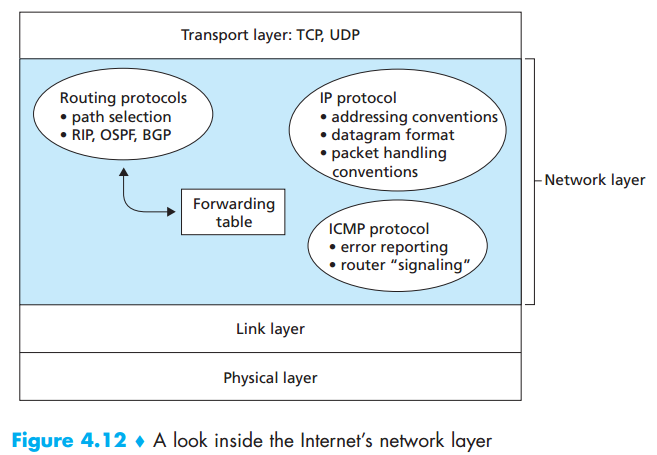

## Chapter 04: The Network Layer

- In this chapter, we’ll make an important distinction between the forwarding and routing functions of the network layer. Forwarding involves the transfer of a packet from an incoming link to an outgoing link within a single router. Routing involves all of a network’s routers, whose collective interactions via routing protocols determine the paths that packets take on their trips from source to destination node.

### 4.1 Introduction

- We’ll reserve the term packet switch to mean a general packet-switching device that transfers a packet from input link interface to output link interface, according to the value in a field in the header of the packet. Some packet switches, called link-layer switches, base their forwarding decision on values in the fields of the linklayer frame; switches are thus referred to as link-layer (layer 2) devices. Other packet switches, called routers, base their forwarding decision on the value in the networklayer field. Routers are thus network-layer (layer 3) devices, but must also implement layer 2 protocols as well, since layer 3 devices require the services of layer 2 to implement their (layer 3) functionality.

- Some network-layer architectures—for example, ATM, frame relay, and MPLS—require the routers along the chosen path from source to destination to handshake with each other in order to set up state before network-layer data packets within a given source-to-destination connection can begin to flow. In the network layer, this process is referred to as connection setup.

- The Internet’s network layer provides a single service, known as best-effort service.

### 4.2 Virtual Circuit and Datagram Networks

- Computer networks that provide only a connection service at the network layer are called virtual-circuit (VC) networks; computer networks that provide only a connectionless service at the network layer are called datagram networks.

- A VC consists of (1) a path (that is, a series of links and routers) between the source and destination hosts, (2) VC numbers, one number for each link along the path, and (3) entries in the forwarding table in each router along the path. A packet belonging to a virtual circuit will carry a VC number in its header. Because a virtual circuit may have a different VC number on each link, each intervening router must replace the VC number of each traversing packet with a new VC number. The new VC number is obtained from the forwarding table.

- There are three identifiable phases in a virtual circuit:
	- VC setup.
	- Data transfer.
	- VC teardown.

- Connection setup at the transport layer involves only the two end systems. During transport-layer connection setup, the two end systems alone determine the parameters (for example, initial sequence number and flow-control window size) of their transport-layer connection. Although the two end systems are aware of the transport-layer connection, the routers within the network are completely oblivious to it. On the other hand, with a VC network layer, routers along the path between the two end systems are involved in VC setup, and each router is fully aware of all the VCs passing through it.

- In a datagram network, each time an end system wants to send a packet, it stamps the packet with the address of the destination end system and then pops the packet into the network.

- As a packet is transmitted from source to destination, it passes through a series of routers. Each of these routers uses the packet’s destination address to forward the packet. Specifically, each router has a forwarding table that maps destination addresses to link interfaces; when a packet arrives at the router, the router uses the packet’s destination address to look up the appropriate output link interface in the forwarding table. The router then intentionally forwards the packet to that output link interface.

- With this style of forwarding table, the router matches a prefix of the packet’s destination address with the entries in the table; if there’s a match, the router forwards the packet to a link associated with the match.  When there are multiple matches, the router uses the longest prefix matching rule; that is, it finds the longest matching entry in the table and forwards the packet to the link interface associated with the longest prefix match.

- Since the resulting Internet network-layer service model makes minimal (no!) service guarantees, it imposes minimal requirements on the network layer. This makes it easier to interconnect networks that use very different link-layer technologies (for example, satellite, Ethernet, fiber, or radio) that have very different transmission rates and loss characteristics.

### 4.3 What’s Inside a Router?

- Four router components can be identified:
	- Input ports.
	- Switching fabric.
	- Output ports.
	- Routing processor.

- Router architecture  
  

- A router’s input ports, output ports, and switching fabric together implement the forwarding function and are almost always implemented in hardware. These forwarding functions are sometimes collectively referred to as the router forwarding plane. While the forwarding plane operates at the nanosecond time scale, a router’s control functions—executing the routing protocols, responding to attached links that go up or down, and performing management functions—operate at the millisecond or second timescale. These router control plane functions are usually implemented in software and execute on the routing processor (typically a traditional CPU).

- The input port’s line termination function and link-layer processing implement the physical and link layers for that individual input link. The lookup performed in the input port is central to the router’s operation—it is here that the router uses the forwarding table to look up the output port to which an arriving packet will be forwarded via the switching fabric. The forwarding table is computed and updated by the routing processor, with a shadow copy typically stored at each input port. The forwarding table is copied from the routing processor to the line cards over a separate bus. With a shadow copy, forwarding decisions can be made locally, at each input port, without invoking the centralized routing processor on a per-packet basis and thus avoiding a centralized processing bottleneck.

- Input port processing  
  

- Ternary Content Address Memories (TCAMs) are also often used for lookup. With a TCAM, a 32-bit IP address is presented to the memory, which returns the content of the forwarding table entry for that address in essentially constant time.

- Although “lookup” is arguably the most important action in input port processing, many other actions must be taken: (1) physical- and link-layer processing must occur; (2) the packet’s version number, checksum and time-to-live field must be checked and the latter two fields rewritten; and (3) counters used for network management (such as the number of IP datagrams received) must be updated.

- The “match plus action” abstraction is both powerful and prevalent in network devices.

- Switching can be accomplished in a number of ways:
	- Switching via memory.
	- Switching via a bus.
	- Switching via an interconnection network.

- Three switching techniques  
  

- Output port processing  
  

- Output port queuing  
  

- A consequence of output port queuing is that a packet scheduler at the output port must choose one packet among those queued for transmission. This selection might be done on a simple basis, such as first-come-first-served (FCFS) scheduling, or a more sophisticated scheduling discipline such as weighted fair queuing (WFQ), which shares the outgoing link fairly among the different end-to-end connections that have packets queued for transmission. Packet scheduling plays a crucial role in providing quality-of-service guarantees. 

- Similarly, if there is not enough memory to buffer an incoming packet, a decision must be made to either drop the arriving packet (a policy known as drop-tail) or remove one or more already-queued packets to make room for the newly arrived packet. In some cases, it may be advantageous to drop (or mark the header of) a packet before the buffer is full in order to provide a congestion signal to the sender. A number of packet-dropping and -marking policies (which collectively have become known as active queue management (AQM) algorithms) have been proposed and analyzed. One of the most widely studied and implemented AQM algorithms is the Random Early Detection (RED) algorithm.

- HOL blocking at an input queued switch  
  

- The network-wide routing control plane is thus decentralized—with different pieces (e.g., of a routing algorithm) executing at different routers and interacting by sending control messages to each other. Indeed, today’s Internet routers and the routing algorithms we’ll study in Section 4.6 operate in exactly this manner. Additionally, router and switch vendors bundle their hardware data plane and software control plane together into closed (but inter-operable) platforms in a vertically integrated product.

- Recently, a number of researchers have begun exploring new router control plane architectures in which part of the control plane is implemented in the routers (e.g., local measurement/reporting of link state, forwarding table installation and maintenance) along with the data plane, and part of the control plane can be implemented externally to the router (e.g., in a centralized server, which could perform route calculation). A well-defined API dictates how these two parts interact and communicate with each other.

### 4.4 The Internet Protocol (IP): Forwarding and Addressing in the Internet

- A look inside the Internet’s network layer  
  

- The Internet’s network layer has three major components. The first component is the IP protocol, the topic of this section. The second major component is the routing component, which determines the path a datagram follows from source to destination. The final component of the network layer is a facility to report errors in datagrams and respond to requests for certain network-layer information.

- IPv4 datagram format  
  

- The header checksum is computed by treating each 2 bytes in the header as a number and summing these numbers using 1s complement arithmetic. Note that the checksum must be recomputed and stored again at each router, as the TTL field, and possibly the options field as well, may change.

- A question often asked at this point is, why does TCP/IP perform error checking at both the transport and network layers? There are several reasons for this repetition. First, note that only the IP header is checksummed at the IP layer, while the TCP/UDP checksum is computed over the entire TCP/UDP segment. Second, TCP/UDP and IP do not necessarily both have to belong to the same protocol stack. TCP can, in principle, run over a different protocol (for example, ATM) and IP can carry data that will not be passed to TCP/UDP.

- The maximum amount of data that a link-layer frame can carry is called the maximum transmission unit (MTU). Because each IP datagram is encapsulated within the link-layer frame for transport from one router to the next router, the MTU of the link-layer protocol places a hard limit on the length of an IP datagram. Having a hard limit on the size of an IP datagram is not much of a problem. What is a problem is that each of the links along the route between sender and destination can use different link-layer protocols, and each of these protocols can have different MTUs. The solution is to fragment the data in the IP datagram into two or more smaller IP datagrams, encapsulate each of these smaller IP datagrams in a separate link-layer frame; and send these frames over the outgoing link. Each of these smaller datagrams is referred to as a fragment. To allow the destination host to perform these reassembly tasks, the designers of IP (version 4) put identification, flag, and fragmentation offset fields in the IP datagram header.

- An IP address is technically associated with an interface, rather than with the host or router containing that interface.

- In IP terms, this network interconnecting three host interfaces and one router interface forms a subnet [RFC 950]. (A subnet is also called an IP network or simply a network in the Internet literature.) IP addressing assigns an address to this subnet: 223.1.1.0/24, where the /24 notation, sometimes known as a subnet mask, indicates that the leftmost 24 bits of the 32-bit quantity define the subnet address.

- To determine the subnets, detach each interface from its host or router, creating islands of isolated networks, with interfaces terminating the end points of the isolated networks. Each of these isolated networks is called a subnet.

- Interface addresses and subnets  
  

- The Internet’s address assignment strategy is known as Classless Interdomain Routing (CIDR—pronounced cider). CIDR generalizes the notion of subnet addressing. As with subnet addressing, the 32-bit IP address is divided into two parts and again has the dotted-decimal form a.b.c.d/x, where x indicates the number of bits in the first part of the address. The x most significant bits of an address of the form a.b.c.d/x constitute the network portion of the IP address, and are often referred to as the prefix (or network prefix) of the address. The remaining 32-x bits of an address can be thought of as distinguishing among the devices within the organization, all of which have the same network prefix.

- Before CIDR was adopted, the network portions of an IP address were constrained to be 8, 16, or 24 bits in length, an addressing scheme known as classful addressing, since subnets with 8-, 16-, and 24-bit subnet addresses were known as class A, B, and C networks, respectively.

- IP addresses are managed under the authority of the Internet Corporation for Assigned Names and Numbers (ICANN). The role of the nonprofit ICANN organization is not only to allocate IP addresses, but also to manage the DNS root servers. It also has the very contentious job of assigning domain names and resolving domain name disputes.

- For a newly arriving host, the DHCP protocol is a four-step process:
	- DHCP server discovery. The first task of a newly arriving host is to find a DHCP server with which to interact. This is done using a DHCP discover message, which a client sends within a UDP packet to port 67.
	- DHCP server offer(s). A DHCP server receiving a DHCP discover message responds to the client with a DHCP offer message that is broadcast to all nodes on the subnet. Each server offer message contains the transaction ID of the received discover message, the proposed IP address for the client, the network mask, and an IP address lease time—the amount of time for which the IP address will be valid.
	- DHCP request. The newly arriving client will choose from among one or more server offers and respond to its selected offer with a DHCP request message, echoing back the configuration parameters. 
	- DHCP ACK. The server responds to the DHCP request message with a DHCP ACK message, confirming the requested parameters.

- DHCP client-server interaction  
  

- A realm with private addresses refers to a network whose addresses only have meaning to devices within that network. 

- Network address translation  
  

- If all datagrams arriving at the NAT router from the WAN have the same destination IP address (specifically, that of the WAN-side interface of the NAT router), then how does the router know the internal host to which it should forward a given datagram? The trick is to use a NAT translation table at the NAT router, and to include port numbers as well as IP addresses in the table entries.

- Recall that in a P2P application, any participating Peer A should be able to initiate a TCP connection to any other participating Peer B. The essence of the problem is that if Peer B is behind a NAT, it cannot act as a server and accept TCP connections. This NAT problem can be circumvented if Peer A is not behind a NAT. In this case, Peer A can first contact Peer B through an intermediate Peer C, which is not behind a NAT and to which B has established an ongoing TCP connection. Peer A can then ask Peer B, via Peer C, to initiate a TCP connection directly back to Peer A. Once the direct P2P TCP connection is established between Peers A and B, the two peers can exchange messages or files. This hack, called connection reversal, is actually used by many P2P applications for NAT traversal.

- NAT traversal is increasingly provided by Universal Plug and Play (UPnP), which is a protocol that allows a host to discover and configure a nearby NAT. UPnP requires that both the host and the NAT be UPnP compatible. With UPnP, an application running in a host can request a NAT mapping between its (private IP address, private port number) and the (public IP address, public port number) for some requested public port number. If the NAT accepts the request and creates the mapping, then nodes from the outside can initiate TCP connections to (public IP address, public port number). Furthermore, UPnP lets the application know the value of (public IP address, public port number), so that the application
can advertise it to the outside world.

- ICMP is used by hosts and routers to communicate network-layer information to each other. The most typical use of ICMP is for error reporting. ICMP messages have a type and a code field, and contain the header and the first 8 bytes of the IP datagram that caused the ICMP message to be generated in the first place (so that the sender can determine the datagram that caused the error).

- The well-known ping program sends an ICMP type 8 code 0 message to the specified host. The destination host, seeing the echo request, sends back a type 0 code 0 ICMP echo reply. Another interesting ICMP message is the source quench message. This message is seldom used in practice. Its original purpose was to perform congestion control—to allow a congested router to send an ICMP source quench message to a host to force that host to reduce its transmission rate.

- Interestingly, Traceroute is implemented with ICMP messages. To determine the names and addresses of the routers between source and destination, Traceroute in the source sends a series of ordinary IP datagrams to the destination. Each of these datagrams carries a UDP segment with an unlikely UDP port number. The first of these datagrams has a TTL of 1, the second of 2, the third of 3, and so on. The source also starts timers for each of the datagrams. When the nth datagram arrives at the nth router, the nth router observes that the TTL of the datagram has just expired. According to the rules of the IP protocol, the router discards the datagram and sends an ICMP warning message to the source (type 11 code 0). How does a Traceroute source know when to stop sending UDP segments? Recall that the source increments the TTL field for each datagram it sends. Thus, one of the datagrams will eventually make it all the way to the destination host. Because this datagram contains a UDP segment with an unlikely port number, the destination host sends a port unreachable ICMP message (type 3 code 3) back to the source. 

- ICMP message types  
  

- IPv6 datagram format  
  

- In addition to unicast and multicast addresses, IPv6 has introduced a new type of address, called an anycast address, which allows a datagram to be delivered to any one of a group of hosts. (This feature could be used, for example, to send an HTTP GET to the nearest of a number of mirror sites that contain a given document.)

- IPv6 has an elusive definition of a flow. RFC 1752 and RFC 2460 state that this allows “labeling of packets belonging to particular flows for which the sender requests special handling, such as a nondefault quality of service or real-time service.”

- IPv6 does not allow for fragmentation and reassembly at intermediate routers; these operations can be performed only by the source and destination. If an IPv6 datagram received by a router is too large to be forwarded over the outgoing link, the router simply drops the datagram and sends a “Packet Too Big” ICMP error message (see below) back to the sender. The sender can then resend the data, using a smaller IP datagram size. Fragmentation and reassembly is a time-consuming operation; removing this functionality from the routers and placing it squarely in the end systems considerably speeds up IP forwarding within the network.

- The options field is one of the possible next headers pointed to from within the IPv6 header. That is, just as TCP or UDP protocol headers can be the next header within an IP packet, so too can an options field. The removal of the options field results in a fixed-length, 40-byte IP header.

- A new version of ICMP has been defined for IPv6 in RFC 4443. In addition to reorganizing the existing ICMP type and code definitions, ICMPv6 also added new types and codes required by the new IPv6 functionality. These include the “Packet Too Big” type, and an “unrecognized IPv6 options” error code. In addition, ICMPv6 subsumes the functionality of the Internet Group Management Protocol (IGMP). IGMP, which is used to manage a host’s joining and leaving of multicast groups, was previously a separate protocol from ICMP in IPv4.

- Probably the most straightforward way to introduce IPv6-capable nodes is a dual-stack approach, where IPv6 nodes also have a complete IPv4 implementation. An alternative to the dual-stack approach is known as tunneling.

- IPsec has been designed to be backward compatible with IPv4 and IPv6. In particular, in order to reap the benefits of IPsec, we don’t need to replace the protocol stacks in all the routers and hosts in the Internet. For concreteness, we’ll focus on IPsec’s transport mode here. In this mode, two hosts first establish an IPsec session between themselves. (Thus IPsec is connectionoriented!) With the session in place, all TCP and UDP segments sent between the two hosts enjoy the security services provided by IPsec. On the sending side, the transport layer passes a segment to IPsec. IPsec then encrypts the segment, appends additional security fields to the segment, and encapsulates the resulting payload in an ordinary IP datagram. (It’s actually a little more complicated than this, as we’ll see in Chapter 8.) The sending host then sends the datagram into the Internet, which transports it to the destination host. There, IPsec decrypts the segment and passes the unencrypted segment to the transport layer. When two hosts have an IPsec session established between them, all TCP and UDP segments sent between them will be encrypted and authenticated. IPsec therefore provides blanket coverage, securing all communication between the two hosts for all network applications.

### 4.5 Routing Algorithms

- Typically a host is attached directly to one router, the default router for the host (also called the first-hop router for the host). Whenever a host sends a packet, the packet is transferred to its default router. We refer to the default router of the source host as the source router and the default router of the destination host as the destination router. The problem of routing a packet from source host to destination host clearly boils down to the problem of routing the packet from source router to destination router.

- Given any two nodes x and y, there are typically many paths between the two nodes, with each path having a cost. One or more of these paths is a least-cost path. The least-cost problem is therefore clear: Find a path between the source and destination that has least cost.

- Broadly, one way in which we can classify routing algorithms is according to whether they are global or decentralized. A global routing algorithm computes the least-cost path between a source and destination using complete, global knowledge about the network. In a decentralized routing algorithm, the calculation of the least-cost path is carried out in an iterative, distributed manner.

- A second broad way to classify routing algorithms is according to whether they are static or dynamic. In static routing algorithms, routes change very slowly over time, often as a result of human intervention (for example, a human manually editing a router’s forwarding table). Dynamic routing algorithms change the routing paths as the network traffic loads or topology change.

- A third way to classify routing algorithms is according to whether they are loadsensitive or load-insensitive. In a load-sensitive algorithm, link costs vary dynamically to reflect the current level of congestion in the underlying link. Today’s Internet routing algorithms (such as RIP, OSPF, and BGP) are load-insensitive, as a link’s cost does not explicitly reflect its current (or recent past) level of congestion.

- The link-state routing algorithm we present below is known as Dijkstra’s algorithm, named after its inventor. A closely related algorithm is Prim’s algorithm; see for a general discussion of graph algorithms. Dijkstra’s algorithm computes the least-cost path from one node (the source, which we will refer to as u) to all other nodes in the network. Dijkstra’s algorithm is iterative and has the property that after the kth iteration of the algorithm, the least-cost paths are known to k destination nodes, and among the least-cost paths to all destination nodes, these k paths will have the k smallest costs.

- Link-State (LS) Algorithm for Source Node u  
  

- Whereas the LS algorithm is an algorithm using global information, the distancevector (DV) algorithm is iterative, asynchronous, and distributed.

Distance-Vector (DV) Algorithm  
  

- The result of the bad news about the increase in link cost has indeed traveled slowly! The specific looping scenario just described can be avoided using a technique known as poisoned reverse. The idea is simple—if z routes through y to get to destination x, then z will advertise to y that its distance to x is infinity.

- A broad class of routing algorithms is based on viewing packet traffic as flows between sources and destinations in a network. In this approach, the routing problem can be formulated mathematically as a constrained optimization problem known as a network flow problem [Bertsekas 1991]. Yet another set of routing algorithms we mention here are those derived from the telephony world. These circuit-switched routing algorithms are of interest to packet-switched data networking in cases where per-link resources (for example, buffers, or a fraction of the link bandwidth) are to be reserved for each connection that is routed over the link. 

- We organize routers into autonomous systems (ASs), with each AS consisting of a group of routers that are typically under the same administrative control (e.g., operated by the same ISP or belonging to the same company network). Routers within the same AS all run the same routing algorithm (for example, an LS or DV algorithm) and have information about each other—exactly as was the case in our idealized model in the preceding section. The routing algorithm running within an autonomous system is called an intraautonomous system routing protocol. It will be necessary, of course, to connect ASs to each other, and thus one or more of the routers in an AS will have the added task of being responsible for forwarding packets to destinations outside the AS; these routers are called gateway routers. The two tasks—obtaining reachability information from neighboring ASs and propagating the reachability information to all routers internal to the AS—are handled by the inter-AS routing protocol. 

- One approach, which is often employed in practice, is to use hot-potato routing. In hot-potato routing, the AS gets rid of the packet (the hot potato) as quickly as possible (more precisely, as inexpensively as possible). This is done by having a router send the packet to the gateway router that has the smallest router-to-gateway cost among all gateways with a path to the destination.

### 4.6 Routing in the Internet

- An intra-AS routing protocol is used to determine how routing is performed within an autonomous system (AS). Intra-AS routing protocols are also known as interior gateway protocols. Historically, two routing protocols have been used extensively for routing within an autonomous system in the Internet: the Routing Information Protocol (RIP) and Open Shortest Path First (OSPF). A routing protocol closely related to OSPF is the IS-IS protocol.

- RIP uses the term hop, which is the number of subnets traversed along the shortest path from source router to destination subnet, including the destination subnet. In RIP, routing updates are exchanged between neighbors approximately every 30 seconds using a RIP response message. The response message sent by a router or host contains a list of up to 25 destination subnets within the AS, as well as the sender’s distance to each of those subnets. Response messages are also known as RIP advertisements. Routers send RIP request and response messages to each other over UDP using port number 520. A process called routed (pronounced “route dee”) executes RIP, that is, maintains routing information and exchanges messages with routed processes running in neighboring routers.

- OSPF and its closely related cousin, IS-IS, are typically deployed in upper-tier ISPs whereas RIP is deployed in lower-tier ISPs and enterprise networks. The Open in OSPF indicates that the routing protocol specification is publicly available (for example, as opposed to Cisco’s EIGRP protocol). OSPF advertisements are contained in OSPF messages that are carried directly by IP, with an upper-layer protocol of 89 for OSPF. Some of the advances embodied in OSPF include the following: (1) Security, (2) Multiple same-cost paths, (3) Integrated support for unicast and multicast routing, and (4) Support for hierarchy within a single routing domain. An OSPF autonomous system can be configured hierarchically into areas. Each area runs its own OSPF link-state routing algorithm, with each router in an area broadcasting its link state to all other routers in that area. Within each area, one or more area border routers are responsible for routing packets outside the area. Lastly, exactly one OSPF area in the AS is configured to be the backbone area. The primary role of the backbone area is to route traffic between the other areas in the AS.

- The Border Gateway Protocol version 4, specified in RFC 4271 (see also [RFC 4274), is the de facto standard inter-AS routing protocol in today’s Internet. It is commonly referred to as BGP4 or simply as BGP. As an inter-AS routing protocol (see Section 4.5.3), BGP provides each AS a means to 
	- Obtain subnet reachability information from neighboring ASs.
	- Propagate the reachability information to all routers internal to the AS.
	- Determine “good” routes to subnets based on the reachability information and on AS policy.

- In BGP, pairs of routers exchange routing information over semipermanent TCP connections using port 179. For each TCP connection, the two routers at the end of the connection are called BGP peers, and the TCP connection along with all the BGP messages sent over the connection is called a BGP session. Furthermore, a BGP session that spans two ASs is called an external BGP (eBGP) session, and a BGP session between routers in the same AS is called an internal BGP (iBGP) session.
In BGP, an autonomous system is identified by its globally unique autonomous system number (ASN). When a router advertises a prefix across a BGP session, it includes with the prefix a number of BGP attributes. In BGP jargon, a prefix along with its attributes is called a route. Thus, BGP peers advertise routes to each other. Two of the more important attributes are AS-PATH and NEXT-HOP. When a gateway router receives a route advertisement, it uses its import policy to decide whether to accept or filter the route and whether to set certain attributes such as the router preference metrics. 

- All traffic entering a stub network must be destined for that network, and all traffic leaving a stub network must have originated in that network.

- A simple BGP scenario  
  

### 4.7 Broadcast and Multicast Routing

- In broadcast routing, the network layer provides a service of delivering a packet sent from a source node to all other nodes in the network; multicast routing enables a single source node to send a copy of a packet to a subset of the other network nodes.

- Source-duplication versus in-network duplication  
  

- Perhaps the most straightforward way to accomplish broadcast communication is for the sending node to send a separate copy of the packet to each destination. The most obvious technique for achieving broadcast is a flooding approach in which the source node sends a copy of the packet to all of its neighbors. When a node receives a broadcast packet, it duplicates the packet and forwards it to all of its neighbors (except the neighbor from which it received the packet). In sequence-number-controlled flooding, a source node puts its address (or other unique identifier) as well as a broadcast sequence number into a broadcast packet, then sends the packet to all of its neighbors. Each node maintains a list of the source address and sequence number of each broadcast packet it has already received, duplicated, and forwarded. A second approach to controlled flooding is known as reverse path forwarding (RPF) [Dalal 1978], also sometimes referred to as reverse path broadcast (RPB). The idea behind RPF is simple, yet elegant. When a router receives a broadcast packet with a given source address, it transmits the packet on all of its outgoing links (except the one on which it was received) only if the packet arrived on the link that is on its own shortest unicast path back to the source.

- Reverse path forwarding  
  

- More formally, a spanning tree of a graph G = (N,E) is a graph G' = (N,E') such that E' is a subset of E, G' is connected, G' contains no cycles, and G' contains all the original nodes in G. If each link has an associated cost and the cost of a tree is the sum of the link costs, then a spanning tree whose cost is the minimum of all of the graph’s spanning trees is called (not surprisingly) a minimum spanning tree. In the center-based approach to building a spanning tree, a
center node (also known as a rendezvous point or a core) is defined. Nodes then unicast tree-join messages addressed to the center node. A tree-join message is forwarded using unicast routing toward the center until it either arrives at a node that already belongs to the spanning tree or arrives at the center.

- Center-based construction of a spanning tree  
  

- In the Internet, the single identifier that represents a group of receivers is a class D multicast IP address. The group of receivers associated with a class D address is referred to as a multicast group.

- The IGMP protocol version 3 [RFC 3376] operates between a host and its directly attached router. IGMP provides the means for a host to inform its attached router that an application running on the host wants to join a specific multicast group. Network-layer multicast in the Internet thus consists of two complementary components: IGMP and multicast routing protocols. Like ICMP, IGMP messages are carried (encapsulated) within an IP datagram, with an IP protocol number of 2.

- The term soft state was coined by Clark [Clark 1988], who described the notion of periodic state refresh messages being sent by an end system, and suggested that with such refresh messages, state could be lost in a crash and then automatically restored by subsequent refresh messages—all transparently to the end system and without invoking any explicit crash-recovery procedures.

- In practice, two approaches have been adopted for determining the multicast routing tree, both of which we have already studied in the context of broadcast routing, and so we will only mention them in passing here. The two approaches differ according to whether a single group-shared tree is used to distribute the traffic for all senders in the group, or whether a source-specific routing tree is constructed for each individual sender.
	- Multicast routing using a group-shared tree.
	- Multicast routing using a source-based tree.

- The solution to the problem of receiving unwanted multicast packets under RPF is known as pruning. A multicast router that receives multicast packets and has no attached hosts joined to that group will send a prune message to its upstream router. If a router receives prune messages from each of its downstream routers, then it can forward a prune message upstream.

- The first multicast routing protocol used in the Internet was the Distance-Vector Multicast Routing Protocol (DVMRP). DVMRP implements source-based trees with reverse path forwarding and pruning. DVMRP uses an RPF algorithm with pruning, as discussed above. Perhaps the most widely used Internet multicast routing protocol is the Protocol-Independent Multicast (PIM) routing protocol, which explicitly recognizes two multicast distribution scenarios.
	- In dense mode, multicast group members are densely located; that is, many or most of the routers in the area need to be involved in routing multicast datagrams. PIM dense mode is a flood-and-prune reverse path forwarding technique similar in spirit to DVMRP.
	- In sparse mode, the number of routers with attached group members is small with respect to the total number of routers; group members are widely dispersed. PIM sparse mode uses rendezvous points to set up the multicast distribution tree. In source-specific multicast (SSM) [RFC 3569, RFC 4607], only a single sender is allowed to send traffic into the multicast tree, considerably simplifying tree construction and maintenance.