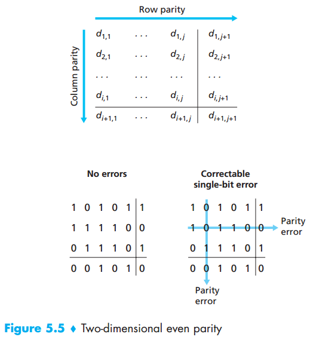

## Chapter 05: The Link Layer: Links, Access Networks, and LANs

- There are two fundamentally different types of link-layer channels. The first type are broadcast channels, which connect multiple hosts in wireless LANs, satellite networks, and hybrid fiber-coaxial cable (HFC) access networks. The second type
of link-layer channel is the point-to-point communication link, such as that often found between two routers connected by a long-distance link, or between a user’s office computer and the nearby Ethernet switch to which it is connected.

### 5.1 Introduction to the Link Layer

- Possible services that can be offered by a link-layer protocol include:
	- Framing.
	- Link access.
	- Reliable delivery.
	- Error detection and correction.

- For the most part, the link layer is implemented in a network adapter, also sometimes known as a network interface card (NIC). At the heart of the network adapter is the link-layer controller, usually a single, special-purpose chip that implements many of the link-layer services (framing, link access, error detection, and so on).

### 5.2 Error-Detection and -Correction Techniques

- Two-dimensional even parity  
  

- Perhaps the simplest form of error detection is the use of a single parity bit. However, measurements have shown that, rather than occurring independently, errors are often clustered together in “bursts.”

- The ability of the receiver to both detect and correct errors is known as forward error correction (FEC). 

- In checksumming techniques, the d bits of data are treated as a sequence of k-bit integers. One simple checksumming method is to simply sum these k-bit integers and use the resulting sum as the error-detection bits.

- An error-detection technique used widely in today’s computer networks is based on cyclic redundancy check (CRC) codes. CRC codes are also known as polynomial codes, since it is possible to view the bit string to be sent as a polynomial whose coefficients are the 0 and 1 values in the bit string, with operations on the bit string interpreted as polynomial arithmetic. All CRC calculations are done in modulo-2 arithmetic without carries in addition or borrows in subtraction. This means that addition and subtraction are identical, and both are equivalent to the bitwise exclusive-or (XOR) of the operands.

- CRC  
  

-  A sample CRC calculation  
  

### 5.3 Multiple Access Links and Protocols

- A point-to-point link consists of a single sender at one end of the link and a single receiver at the other end of the link. Many link-layer protocols have been designed for point-to-point links; the point-to-point protocol (PPP) and high-level data link control (HDLC) are two such protocols that we’ll cover later in this chapter. The second type of link, a broadcast link, can have multiple sending and receiving nodes all connected to the same, single, shared broadcast channel. The term broadcast is used here because when any one node transmits a frame, the channel broadcasts the frame and each of the other nodes receives a copy. Ethernet and wireless LANs are examples of broadcast link-layer technologies.

- Typically, when there is a collision, none of the receiving nodes can make any sense of any of the frames that were transmitted; in a sense, the signals of the colliding frames become inextricably tangled together. Thus, all the frames involved in the collision are lost, and the broadcast channel is wasted during the collision interval.

- We can classify just about any multiple access protocol as belonging to one of three categories: channel partitioning protocols, random access protocols, and taking-turns protocols.

- TDM divides time into time frames and further divides each time frame into N time slots. FDM divides the R bps channel into different frequencies (each with a bandwidth of R/N) and assigns each frequency to one of the N nodes. CDMA assigns a different code to each node. Each node then uses its unique code to encode the data bits it sends. If the codes are chosen carefully, CDMA networks have the wonderful property that different nodes can transmit simultaneously and yet have their respective receivers correctly receive a sender’s encoded data bits (assuming the receiver knows the sender’s code) in spite of interfering transmissions by other nodes.

- A four-node TDM and FDM example  
  

- When a node experiences a collision, it doesn’t necessarily retransmit the frame right away. Instead it waits a random delay before retransmitting the frame.

- Let p be a probability, that is, a number between 0 and 1. The operation of slotted ALOHA in each node is simple:
	- When the node has a fresh frame to send, it waits until the beginning of the next slot and transmits the entire frame in the slot.
	- If there isn’t a collision, the node has successfully transmitted its frame and thus need not consider retransmitting the frame. (The node can prepare a new frame for transmission, if it has one.)
	- If there is a collision, the node detects the collision before the end of the slot. The node retransmits its frame in each subsequent slot with probability p until the frame is transmitted without a collision.

- Slotted ALOHA  
  

- A slot in which exactly one node transmits is said to be a successful slot. The efficiency of a slotted multiple access protocol is defined to be the long-run fraction of successful slots in the case when there are a large number of active nodes, each always having a large number of frames to send.

- In pure ALOHA, when a frame first arrives (that is, a network-layer datagram is passed down from the network layer at the sending node), the node immediately transmits the frame in its entirety into the broadcast channel. If a transmitted frame experiences a collision with one or more other transmissions, the node will then immediately (after completely transmitting its collided frame) retransmit the frame with probability p. Otherwise, the node waits for a frame transmission time. After this wait, it then transmits the frame with probability p, or waits (remaining idle) for another frame time with probability 1 – p.

- There are two important rules for polite human conversation: (1) Listen before speaking, and (2) If someone else begins talking at the same time, stop talking. These two rules are embodied in the family of carrier sense multiple access (CSMA) and CSMA with collision detection (CSMA/CD) protocols.

- Before analyzing the CSMA/CD protocol, let us now summarize its operation from the perspective of an adapter (in a node) attached to a broadcast channel:
	1. The adapter obtains a datagram from the network layer, prepares a link-layer frame, and puts the frame adapter buffer.
	2. If the adapter senses that the channel is idle (that is, there is no signal energy entering the adapter from the channel), it starts to transmit the frame. If, on the other hand, the adapter senses that the channel is busy, it waits until it senses no signal energy and then starts to transmit the frame.
	3. While transmitting, the adapter monitors for the presence of signal energy coming from other adapters using the broadcast channel.
	4. If the adapter transmits the entire frame without detecting signal energy from other adapters, the adapter is finished with the frame. If, on the other hand, the adapter detects signal energy from other adapters while transmitting, it aborts the transmission (that is, it stops transmitting its frame).
	5. After aborting, the adapter waits a random amount of time and then returns to step 2.

- What we’d like is an interval that is short when the number of colliding nodes is small, and long when the number of colliding nodes is large. The binary exponential backoff algorithm, used in Ethernet as well as in DOCSIS cable network multiple access protocols [DOCSIS 2011], elegantly solves this problem. Specifically, when transmitting a frame that has already experienced n collisions, a node chooses the value of K at random from {0, 1, 2, . . . . 2^n-1}. Thus, the more collisions experienced by a frame, the larger the interval from which K is chosen.

- As with random access protocols, there are dozens of taking-turns protocols, and each one of these protocols has many variations. We’ll discuss two of the more important protocols here. The first one is the polling protocol. The polling protocol requires one of the nodes to be designated as a master node. The master node polls each of the nodes in a round-robin fashion. The second taking-turns protocol is the token-passing protocol. In this protocol there is no master node. A small, special-purpose frame known as a token is exchanged among the nodes in some fixed order.

### 5.4 Switched Local Area Networks

- In truth, it is not hosts and routers that have link-layer addresses but rather their adapters (that is, network interfaces) that have link-layer addresses. A host or router with multiple network interfaces will thus have multiple link-layer addresses associated with it, just as it would also have multiple IP addresses associated with it. It's important to note, however, that link-layer switches do not have link-layer addresses associated with their interfaces that connect to hosts and routers. This is because the job of the link-layer switch is to carry datagrams between hosts and routers; a switch does this job transparently, that is, without the host or router having to explicitly address the frame to the intervening switch. A link-layer address is variously called a LAN address, a physical address, or a MAC address.

- Sometimes a sending adapter does want all the other adapters on the LAN to receive and process the frame it is about to send. In this case, the sending adapter inserts a special MAC broadcast address into the destination address field of the frame.

- Because there are both network-layer addresses (for example, Internet IP addresses) and link-layer addresses (that is, MAC addresses), there is a need to translate between them. For the Internet, this is the job of the Address Resolution Protocol (ARP) [RFC 826]. ARP resolves an IP address to a MAC address. In many ways it is analogous to DNS (studied in Section 2.5), which resolves host names to IP addresses. However, one important difference between the two resolvers is that DNS resolves host names for hosts anywhere in the Internet, whereas ARP resolves IP addresses only for hosts and router interfaces on the same subnet.

- Each host and router has an ARP table in its memory, which contains mappings of IP addresses to MAC addresses. For each router interface there is also an ARP module (in the router) and an adapter.

- A hub is a physical-layer device that acts on individual bits rather than frames. When a bit, representing a zero or a one, arrives from one interface, the hub simply re-creates the bit, boosts its energy strength, and transmits the bit onto all the other interfaces.

- Ethernet frame structure  
  

- Ethernet comes in many different flavors, with somewhat bewildering acronyms such as 10BASE-T, 10BASE-2, 100BASE-T, 1000BASE-LX, and 10GBASE-T. These and many other Ethernet technologies have been standardized over the years by the IEEE 802.3 CSMA/CD (Ethernet) working group. While these acronyms may appear bewildering, there is actually considerable order here. The first part of the acronym refers to the speed of the standard: 10, 100, 1000, or 10G, for 10 Megabit (per second), 100 Megabit, Gigabit, and 10 Gigabit Ethernet, respectively. “BASE” refers to baseband Ethernet, meaning that the physical media only carries Ethernet traffic; almost all of the 802.3 standards are for baseband Ethernet. The final part of the acronym refers to the physical media itself; Ethernet is both a link-layer and a physical-layer specification and is carried over a variety of physical media including coaxial cable, copper wire, and fiber. Generally, a “T” refers to twisted-pair copper wires.

- Longer runs could be obtained by using a repeater—a physical-layer device that receives a signal on the input side, and regenerates the signal on the output side.

- A switch coordinates its transmissions and never forwards more than one frame onto the same interface at any time. Furthermore, modern switches are full-duplex, so that a switch and a node can each send frames to each other at the same time without interference. In other words, in a switch-based Ethernet LAN there are no collisions and, therefore, there is no need for a MAC protocol!

- Filtering is the switch function that determines whether a frame should be forwarded to some interface or should just be dropped. Forwarding is the switch function that determines the interfaces to which a frame should be directed, and then moves the frame to those interfaces. Switch filtering and forwarding are done with a switch table.

- A switch has the wonderful property (particularly for the already-overworked network administrator) that its table is built automatically, dynamically, and autonomously—without any intervention from a network administrator or from a configuration protocol. In other words, switches are self-learning.

- We can identify several advantages of using switches, rather than broadcast links such as buses or hub-based star topologies:
	- Elimination of collisions.
	- Heterogeneous links.
	- Management.

- As the name suggests, a switch that supports VLANs allows multiple virtual local area networks to be defined over a single physical local area network infrastructure. Hosts within a VLAN communicate with each other as if they (and no other hosts) were connected to the switch. In a port-based VLAN, the switch’s ports (interfaces) are divided into groups by the network manager.

- A single switch with two configured VLANs  
  

- A more scalable approach to interconnecting VLAN switches is known as VLAN trunking. In the VLAN trunking approach shown in Figure 5.26(b), a special port on each switch (port 16 on the left switch and port 1 on the right switch) is configured as a trunk port to interconnect the two VLAN switches. The trunk port belongs to all VLANs, and frames sent to any VLAN are forwarded over the trunk link to the other switch. But this raises yet another question: How does a switch know that a frame arriving on a trunk port belongs to a particular VLAN? The IEEE has defined an extended Ethernet frame format, 802.1Q, for frames crossing a VLAN trunk. As shown in Figure 5.27, the 802.1Q frame consists of the standard Ethernet frame with a four-byte VLAN tag added into the header that carries the identity of the VLAN to which the frame belongs. The VLAN tag is added into a frame by the switch at the sending side of a VLAN trunk, parsed, and removed by the switch at the receiving side of the trunk. The VLAN tag itself consists of a 2-byte Tag Protocol Identifier (TPID) field (with a fixed hexadecimal value of 81-00), a 2-byte Tag Control Information field that contains a 12-bit VLAN identifier field, and a 3-bit priority field that is similar in intent to the IP datagram TOS field.

- VLAN  
  

### 5.5 Link Virtualization: A Network as a Link Layer

- Multiprotocol Label Switching (MPLS) evolved from a number of industry efforts in the mid-to-late 1990s to improve the forwarding speed of IP routers by adopting a key concept from the world of virtual-circuit networks: a fixed-length label.

- MPLS header  
  

- Among the fields in the MPLS header are the label (which serves the role of the virtual-circuit identifier that we encountered back in Section 4.2.1), 3 bits reserved for experimental use, a single S bit, which is used to indicate the end of a series of “stacked” MPLS headers (an advanced topic that we’ll not cover here), and a time-to-live field. An MPLS-capable router is often referred to as a label-switched router, since it forwards an MPLS frame by looking up the MPLS label in its forwarding table and then immediately passing the datagram to the appropriate output interface. The true advantages of MPLS and the reason for current interest in MPLS, however, lie not in the potential increases in switching speeds, but rather in the new traffic management capabilities that MPLS enables. Finally, we note that MPLS can, and has, been used to implement so-called virtual private networks (VPNs).

- MPLS-enhanced forwarding  
  

### 5.6 Data Center Networking

- Each data center has its own data center network that interconnects its hosts with each other and interconnects the data center with the Internet. The hosts in data centers, called blades and resembling pizza boxes, are generally commodity hosts that include CPU, memory, and disk storage. The hosts are stacked in racks, with each rack typically having 20 to 40 blades. At the top of each rack there is a switch, aptly named the Top of Rack (TOR) switch, that interconnects the hosts in the rack with each other and with other switches in the data center. The data center network supports two types of traffic: traffic flowing between external clients and internal hosts and traffic flowing between internal hosts. To handle flows between external clients and internal hosts, the data center network includes one or more border routers, connecting the data center network to the public Internet.

- Inside the data center, the external requests are first directed to a load balancer whose job it is to distribute requests to the hosts, balancing the load across the hosts as a function of their current load. The load balancer not only balances the work load across hosts, but also provides a NAT-like function, translating the public external IP address to the internal IP address of the appropriate host, and then translating back for packets traveling in the reverse direction back to the clients.

- A data center network with a hierarchical topology  
  

- One such trend is to deploy new interconnection architectures and network protocols that overcome the drawbacks of the traditional hierarchical designs. Another major trend is to employ shipping container–based modular data centers (MDCs).