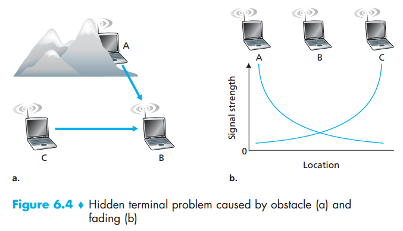
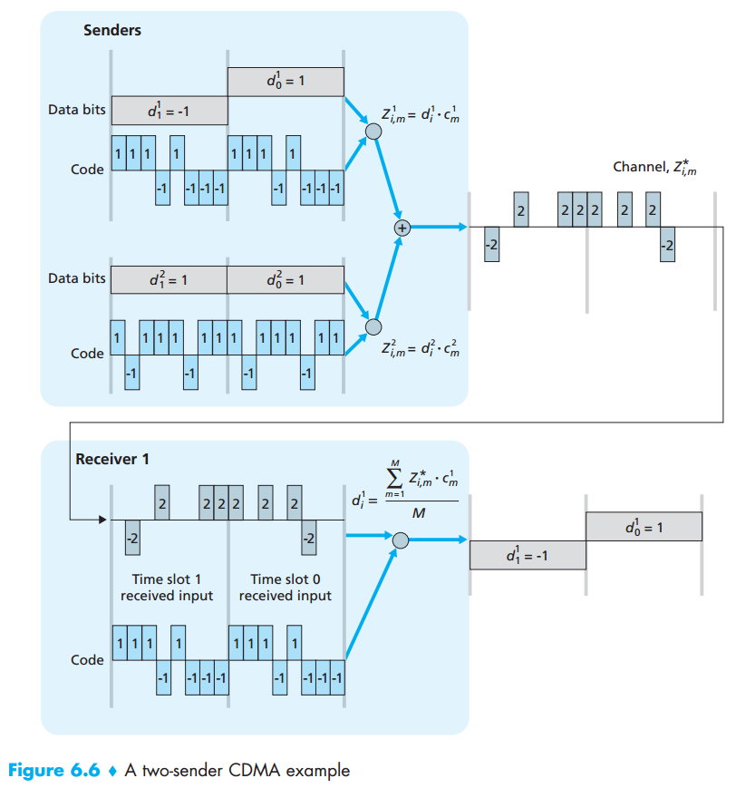
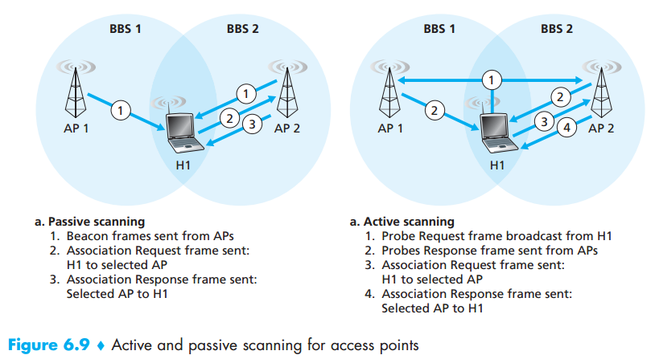
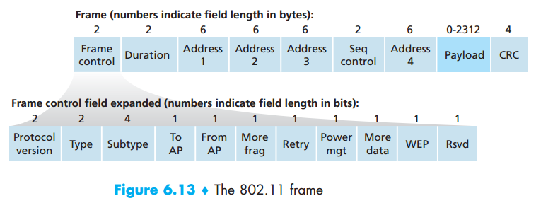
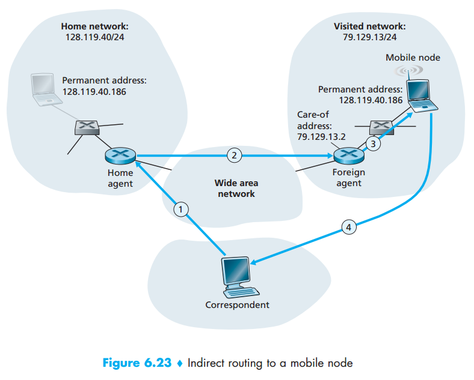
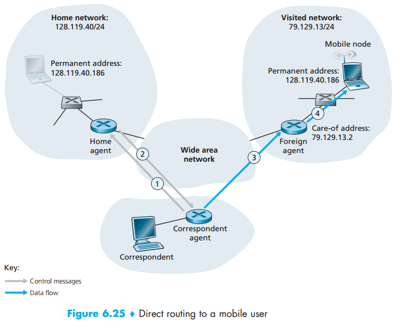

## Chapter 06: Wireless and Mobile Networks

### 6.1 Introduction

- When we say a wireless host is “associated” with a base station, we mean that (1) the host is within the wireless communication distance of the base station, and (2) the host uses that base station to relay data between it (the host) and the larger network. Cell towers in cellular networks and access points in 802.11 wireless LANs are examples of base stations.

- Hosts associated with a base station are often referred to as operating in infrastructure mode, since all traditional network services (e.g., address assignment and routing) are provided by the network to which a host is connected via the base station. In ad hoc networks, wireless hosts have no such infrastructure with which to connect. In the absence of such infrastructure, the hosts themselves must provide for services such as routing, address assignment, DNS-like name translation, and more.

### 6.2 Wireless Links and Network Characteristics

- Indeed, we can find a number of important differences between a wired link and a wireless link:
	- Decreasing signal strength.
	- Interference from other sources.
	- Multipath propagation.

- The signal-to-noise ratio (SNR) is a relative measure of the strength of the received signal (i.e., the information being transmitted) and this noise. 

-  Hidden terminal problem  
  

- In a CDMA protocol, each bit being sent is encoded by multiplying the bit by a signal (the code) that changes at a much faster rate (known as the chipping rate) than the original sequence of data bits.

- CDMA example  
  

### 6.3 WiFi: 802.11 Wireless LANs

- Although many technologies and standards for wireless LANs were developed in the 1990s, one particular class of standards has clearly emerged as the winner: the IEEE 802.11 wireless LAN, also known as WiFi.

- The fundamental building block of the 802.11 architecture is the basic service set (BSS). A BSS contains one or more wireless stations and a central base station, known as an access point (AP) in 802.11 parlance. When a network administrator installs an AP, the administrator assigns a oneor two-word Service Set Identifier (SSID) to the access point. The administrator must also assign a channel number to the AP. To understand channel numbers, recall that 802.11 operates in the frequency range of 2.4 GHz to 2.485 GHz. Within this 85 MHz band, 802.11 defines 11 partially overlapping channels. Any two channels are non-overlapping if and only if they are separated by four or more channels.

- A WiFi jungle is any physical location where a wireless station receives a sufficiently strong signal from two or more APs.

- The 802.11 standard requires that an AP periodically send beacon frames, each of which includes the AP’s SSID and MAC address. The process of scanning channels and listening for beacon frames is known as passive scanning (see Figure 6.9a). A wireless host can also perform active scanning, by broadcasting a probe frame that will be received by all APs within the wireless host’s range.

- Active and passive scanning for access points  
  

- In order to create an association with a particular AP, the wireless station may be required to authenticate itself to the AP. 802.11 wireless LANs provide a number of alternatives for authentication and access. One approach, used by many companies, is to permit access to a wireless network based on a station’s MAC address. A second approach, used by many Internet cafés, employs usernames and passwords. In both cases, the AP typically communicates with an authentication server, relaying information between the wireless end-point station and the authentication server using a protocol such as RADIUS or DIAMETER.

- Inspired by the huge success of Ethernet and its random access protocol, the designers of 802.11 chose a random access protocol for 802.11 wireless LANs. This random access protocol is referred to as CSMA with collision avoidance, or more succinctly as CSMA/CA.

- Having discussed how 802.11 uses link-layer acknowledgments, we’re now in a position to describe the 802.11 CSMA/CA protocol. Suppose that a station (wireless station or an AP) has a frame to transmit. 
	1. If initially the station senses the channel idle, it transmits its frame after a short period of time known as the Distributed Inter-frame Space (DIFS).
	2. Otherwise, the station chooses a random backoff value using binary exponential backoff and counts down this value when the channel is sensed idle. While the channel is sensed busy, the counter value remains frozen.
	3. When the counter reaches zero (note that this can only occur while the channel is sensed idle), the station transmits the entire frame and then waits for an acknowledgment.
	4. If an acknowledgment is received, the transmitting station knows that its frame has been correctly received at the destination station. If the station has another frame to send, it begins the CSMA/CA protocol at step 2. If the acknowledgment isn’t received, the transmitting station reenters the backoff phase in step 2, with the random value chosen from a larger interval.

- 802.11 uses link-layer acknowledgments  
  

- In order to avoid this problem, the IEEE 802.11 protocol allows a station to use a short Request to Send (RTS) control frame and a short Clear to Send (CTS) control frame to reserve access to the channel.

- The 802.11 frame  
  

- It turns out that three address fields are needed for internetworking purposes—specifically, for moving the network-layer datagram from a wireless station through an AP to a router interface. The fourth address field is used when APs forward frames to each other in ad hoc mode. Since we are only considering infrastructure networks here, let’s focus our attention on the first three address fields. The 802.11 standard defines these fields as follows:
	- Address 2 is the MAC address of the station that transmits the frame. 
	- Address 1 is the MAC address of the wireless station that is to receive the frame.
	- To understand address 3, recall that the BSS (consisting of the AP and wireless stations) is part of a subnet, and that this subnet connects to other subnets via some router interface. 

- When the host moves between BSSs in the same subnet, how does the switch know that the host has moved from one AP to another? One solution (a bit of a hack, really) is for AP2 to send a broadcast Ethernet frame with H1’s source address to the switch just after the new association.

- Some 802.11 implementations have a rate adaptation capability that adaptively selects the underlying physical-layer modulation technique to use based on current or recent channel characteristics.

- A node is able to explicitly alternate between sleep and wake states (not unlike a sleepy student in a classroom!). A node indicates to the access point that it will be going to sleep by setting the power-management bit in the header of an 802.11 frame to 1.

- Two other IEEE 802 protocols—Bluetooth and Zigbee (defined in the IEEE 802.15.1 and IEEE 802.15.4 standards) and WiMAX (defined in the IEEE 802.16 standard)—are standards for communicating over shorter and longer distances, respectively.

### 6.4 Cellular Internet Access

### 6.5 Mobility Management: Principles

- In a network setting, the permanent home of a mobile node (such as a laptop or smartphone) is known as the home network, and the entity within the home network that performs the mobility management functions discussed below on behalf of the mobile node is known as the home agent. The network in which the mobile node is currently residing is known as the foreign (or visited) network, and the entity within the foreign network that helps the mobile node with the mobility management functions discussed below is known as a foreign agent. A correspondent is the entity wishing to communicate with the mobile node.

- An alternative approach (and one that has been adopted in practice) is to push mobility functionality from the network core to the network edge—a recurring theme in our study of Internet architecture. A natural way to do this is via the mobile node’s home network. One role of the foreign agent is to create a so-called care-of address (COA) for the mobile node, with the network portion of the COA matching that of the foreign network. A second role of the foreign agent is to inform the home agent that the mobile node is resident in its (the foreign agent’s) network and has the given COA.

- In the indirect routing approach, the correspondent simply addresses the datagram to the mobile node’s permanent address and sends the datagram into the network, blissfully unaware of whether the mobile node is resident in its home network or is visiting a foreign network; mobility is thus completely transparent to the correspondent. Direct routing overcomes the inefficiency of triangle routing, but does so at the cost of additional complexity. In the direct routing approach, a correspondent agent in the correspondent’s network first learns the COA of the mobile node. This can be done by having the correspondent agent query the home agent, assuming that (as in the case of indirect routing) the mobile node has an up-to-date value for its COA registered with its home agent.

- Indirect routing to a mobile node  
  

- Direct routing to a mobile user  
  

### 6.6 Mobile IP

- The Internet architecture and protocols for supporting mobility, collectively known as mobile IP, are defined primarily in RFC 5944 for IPv4. The mobile IP standard consists of three main pieces:
	- Agent discovery.
	- Registration with the home agent.
	- Indirect routing of datagrams.

- Agent discovery can be accomplished in one of two ways: via agent advertisement or via agent solicitation. With agent advertisement, a foreign or home agent advertises its services using an extension to the existing router discovery protocol. With agent solicitation, a mobile node wanting to learn about agents without waiting to receive an agent advertisement can broadcast an agent solicitation message, which is simply an ICMP message with type value 10.

### 6.7 Managing Mobility in Cellular Networks

- As in the case of mobile IP, the responsibilities of the home and visited networks are quite different.
	- The home network maintains a database known as the home location register (HLR), which contains the permanent cell phone number and subscriber profile information for each of its subscribers.  As we’ll see, a special switch in the home network, known as the Gateway Mobile services Switching Center (GMSC) is contacted by a correspondent when a call is placed to a mobile user.
	- The visited network maintains a database known as the visitor location register (VLR). The VLR contains an entry for each mobile user that is currently in the portion of the network served by the VLR.

### 6.8 Wireless and Mobility: Impact on HigherLayer Protocols