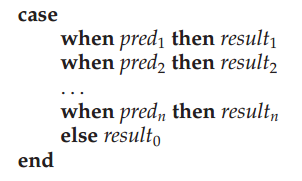

## Chapter 03: Introduction to SQL

### 3.1 Overview of the SQL Query Language

- The SQL language has several parts:
	- Data-definition language (DDL). The SQL DDL provides commands for defining relation schemas, deleting relations, and modifying relation schemas.
	- Data-manipulation language (DML). The SQL DML provides the ability to query information from the database and to insert tuples into, delete tuples from, and modify tuples in the database.
	- Integrity. The SQL DDL includes commands for specifying integrity constraints that the data stored in the database must satisfy. Updates that violate integrity constraints are disallowed.
	- View definition. The SQL DDL includes commands for defining views.
	- Transaction control. SQL includes commands for specifying the beginning and ending of transactions.
	- Embedded SQL and dynamic SQL. Embedded and dynamic SQL define how SQL statements can be embedded within general-purpose programming languages, such as C, C++, and Java.
	- Authorization. The SQL DDL includes commands for specifying access rights to relations and views.

### 3.2 SQL Data Definition

### 3.3 Basic Structure of SQL Queries

- In general, the meaning of an SQL query can be understood as follows:
	1. Generate a Cartesian product of the relations listed in the from clause
	2. Apply the predicates specified in the where clause on the result of Step 1.
	3. For each tuple in the result of Step 2, output the attributes (or results of expressions) specified in the select clause.

- The operation join ... using requires a list of attribute names to be specified. Both inputs must have attributes with the specified names.

### 3.4 Additional Basic Operations

- Pattern matching can be performed on strings, using the operator like. We describe patterns by using two special characters:
	- Percent (%): The % character matches any substring.
	- Underscore (_): The character matches any character.

- For patterns to include the special pattern characters (that is, % and ), SQL allows the specification of an escape character. The escape character is used immediately before a special pattern character to indicate that the special pattern character is to be treated like a normal character. We define the escape character for a like comparison using the escape keyword. 

### 3.5 Set Operations

### 3.6 Null Values

- If the where clause predicate evaluates to either false or unknown for a tuple, that tuple is not added to the result.

### 3.7 Aggregate Functions

- Aggregate functions are functions that take a collection (a set or multiset) of values as input and return a single value. SQL offers five built-in aggregate functions:
	- Average: avg
	- Minimum: min
	- Maximum: max
	- Total: sum
	- Count: count

- When an SQL query uses grouping, it is important to ensure that the only attributes that appear in the select statement without being aggregated are those that are present in the group by clause. In other words, any attribute that is not present in the group by clause must appear only inside an aggregate function if it appears in the select clause, otherwise the query is treated as erroneous.

- At times, it is useful to state a condition that applies to groups rather than to tuples. To express such a query, we use the having clause of SQL. SQL applies predicates in the having clause after groups have been formed, so aggregate functions may be used.

- The meaning of a query containing aggregation, group by, or having clauses is defined by the following sequence of operations:
	1. As was the case for queries without aggregation, the from clause is first evaluated to get a relation.
	2. If a where clause is present, the predicate in the where clause is applied on the result relation of the from clause.
	3. Tuples satisfying the where predicate are then placed into groups by the group by clause if it is present. If the group by clause is absent, the entire set of tuples satisfying the where predicate is treated as being in one group.
	4. The having clause, if it is present, is applied to each group; the groups that do not satisfy the having clause predicate are removed.
	5. The select clause uses the remaining groups to generate tuples of the result of the query, applying the aggregate functions to get a single result tuple for each group.

### 3.8 Nested Subqueries

- The with clause provides a way of defining a temporary relation whose definition is available only to the query in which the with clause occurs. The with clause makes the query logic clearer; it also permits a view definition to be used in multiple places within a query.

### 3.9 Modification of the Database

- The general form of the case statement is as follows.  
  