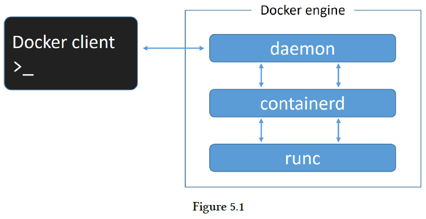
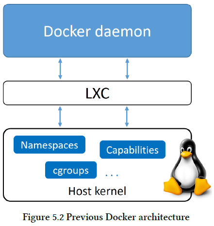
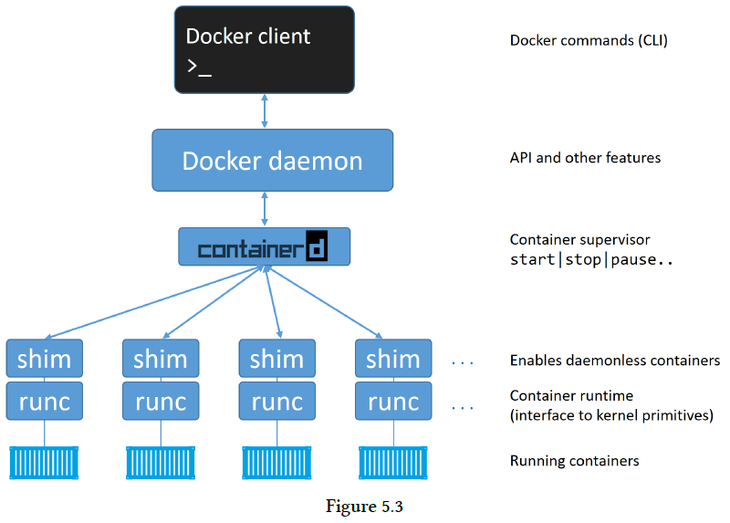
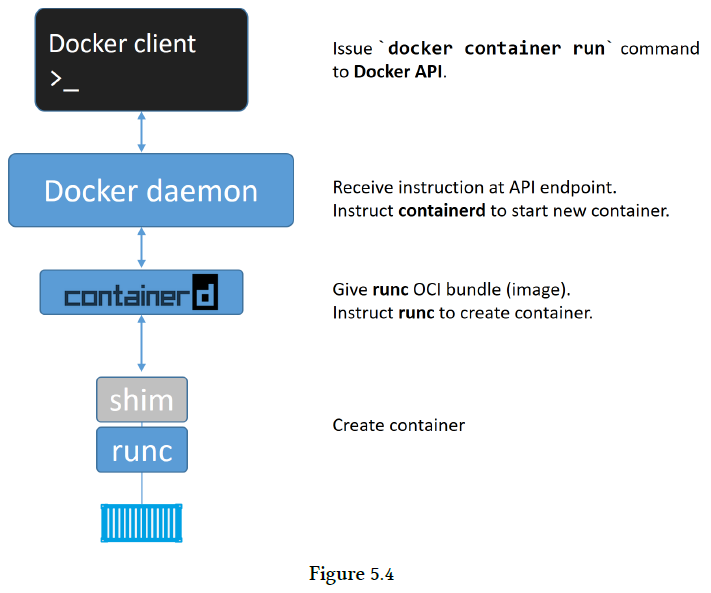

## Chapter 05: The Docker Engine

- The Docker engine is the core software that runs and manages containers. We often refer to it simply as Docker, or the Docker platform.

	The Docker engine is modular in design with many swappable components. Where possible, these are based on open-standards outlined by the Open Container Initiative (OCI).

	At the time of writing, the major components that make up the Docker engine are: the Docker client, the Docker daemon, containerd, and runc. Together, these create and run containers.

- A high-level view of the Docker engine  
  

- When Docker was first released, the Docker engine had two major components:
	- The Docker daemon (hereafter referred to as just “the daemon”)
	- LXC

	The Docker daemon was a monolithic binary. It contained all of the code for the Docker client, the Docker API, the container runtime, image builds, and much more.

	LXC provided the daemon with access to the fundamental building-blocks of containers that existed in the Linux kernel. Things like namespaces and control groups (cgroups).

- Previous Docker architecture  
  

- The reliance on LXC was an issue from the start.

	First up, LXC is Linux-specific. This was a problem for a project that had aspirations of being multi-platform.

	Second up, being reliant on an external tool for something so core to the project was a huge risk that could hinder development.

	As a result, Docker. Inc. developed their own tool called libcontainer as a replacement for LXC. The goal of libcontainer was to be a platform-agnostic tool that provided Docker with access to the fundamental container building-blocks that exist inside the kernel.

- A high-level view of the current Docker engine architecture  
  

- If you strip everything else away, runc is a small, lightweight CLI wrapper for libcontainer (remember that libcontainer originally replaced LXC in the early Docker architecture).

	runc has a single purpose in life — create containers. And it’s damn good at it. And fast! But as it’s a CLI wrapper, it’s effectively a standalone container runtime tool.

- As part of the effort to strip functionality out of the Docker daemon, all of the container execution logic was ripped out and refactored into a new tool called containerd (pronounced container-dee). Its sole purpose in life was to manage container lifecycle operations — start | stop | pause | rm....

	As previously stated, containerd was originally intended to be small, lightweight, and designed for a single task in life — container lifecycle operations. However, over time it has branched out and taken on more functionality. Things like image management.

- The process of creating a new container  
  

- Having all of the logic and code to start and manage containers removed from the daemon means that the entire container runtime is decoupled from the Docker daemon. We sometimes call this “daemonless containers”, and it makes it possible to perform maintenance and upgrades on the Docker daemon without impacting running containers!

- We mentioned earlier that containerd uses runc to create new containers. In fact, it forks a new instance of runc for every container it creates. However, once each container is created, its parent runc process exits. This means we can run hundreds of containers without having to run hundreds of runc instances.

	Once a container’s parent runc process exits, the associated containerd-shim process becomes the container’s parent.Some of the responsibilities the shim performs as a container’s parent include:
	- Keeping any STDIN and STDOUT streams open so that when the daemon is restarted, the container doesn’t terminate due to pipes being closed etc.
	- Reports the container’s exit status back to the daemon.

- On a Linux system, the components we’ve discussed are implemented as separate binaries as follows:
	- dockerd (the Docker daemon)
	- docker-containerd (containerd)
	- docker-containerd-shim (shim)
	- docker-runc (runc)

- However, at the time of writing, some of the major functionality that still exists in the daemon includes; image management, image builds, the REST API, authentication, security, core networking, and orchestration.