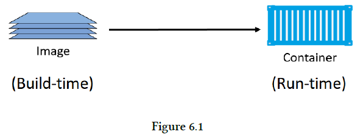
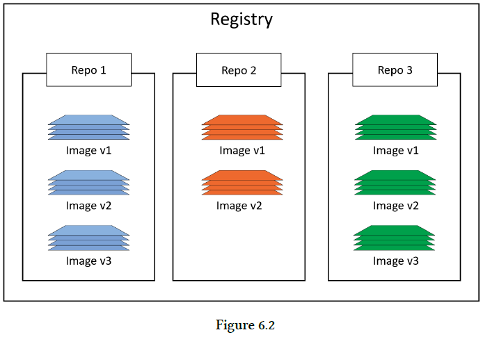
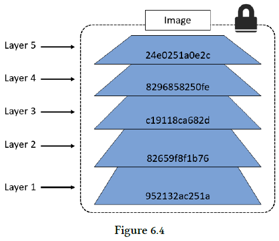
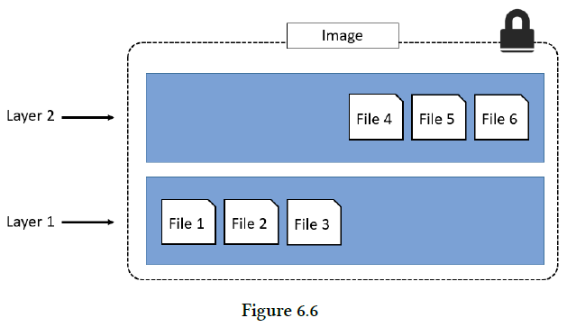
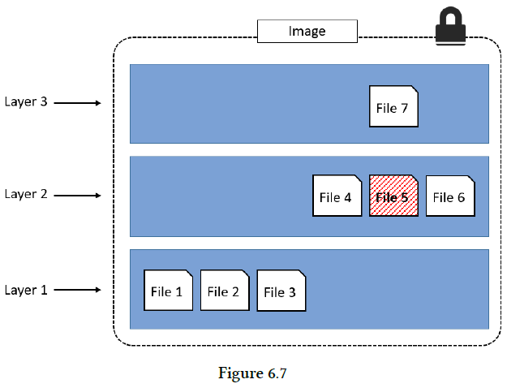
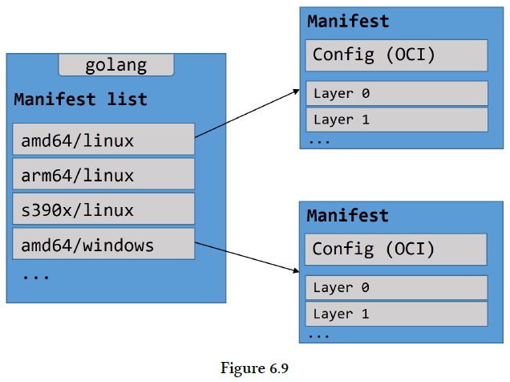

## Chapter 06: Images

- Images are made up of multiple layers that get stacked on top of each other and represented as a single object. Inside of the image is a cut-down operating system (OS) and all of the files and dependencies required to run an application. Because containers are intended to be fast and lightweight, images tend to be small.

- We’ve mentioned a couple of times already that images are like stopped containers (or classes if you’re a developer). In fact, you can stop a container and create a new image from it. With this in mind, images are considered build-time constructs, whereas containers are run-time constructs.

- High-level view of the relationship between images and containers  
  

- We use the docker container run and docker service create commands to start one or more containers from a single image. However, once you’ve started a container from an image, the two constructs become dependent on each other and you cannot delete the image until the last container using it has been stopped and destroyed.

- A cleanly installed Docker host has no images in its local repository.

	The process of getting images onto a Docker host is called pulling. So, if you want the latest Ubuntu image on your Docker host, you’d have to pull it.

- Docker images are stored in image registries. The most common registry is Docker Hub (https://hub.docker.com). Other registries exist, including 3rd party registries and secure on-premises registries.

	Image registries contain multiple image repositories. In turn, image repositories can contain multiple images.

- An image registry  
  

- As the name suggests, official repositories contain images that have been vetted by Docker, Inc. This means they should contain up-to-date, high-quality code, that is secure, well-documented, and in-line with best practices (please can I have an award for using five hyphens in a single sentence).

- Addressing images from official repositories is as simple as giving the repository name and tag separated by a colon (:). The format for docker image pull, when working with an image from an official repository is:
  ```bash
  docker image pull <repository>:<tag>
  ```

- First, if you do not specify an image tag after the repository name, Docker will assume you are referring to the image tagged as latest.

	Second, the latest tag doesn’t have any magical powers! Just because an image is tagged as latest does not guarantee it is the most recent image in a repository!

- Docker provides the --filter flag to filter the list of images returned by docker image ls. The following example will only return dangling images.
  ```bash
  $ docker image ls --filter dangling=true
  REPOSITORY TAG IMAGE ID CREATED SIZE
  <none> <none> 4fd34165afe0 7 days ago 14.5MB
  ```

	A dangling image is an image that is no longer tagged, and appears in listings as <none>:<none>. A common way they occur is when building a new image and tagging it with an existing tag. When this happens, Docker will build the new image, notice that an existing image has a matching tag, remove the tag from the existing image, give the tag to the new image.

- Docker currently supports the following filters:
	- dangling
		- Accepts true or false, and returns only dangling images (true), or non-dangling images (false).
	- before
		- Requires an image name or ID as argument, and returns all images created before it.
	- since
		- Same as above, but returns images created after the specified image.
	- label
		- Filters images based on the presence of a label or label and value. The docker image ls command does not display labels in its output.

- You can also use the --format flag to format output using Go templates.

	Use the following command to return all images, but only display repo, tag and size.
  ```bash
  $ docker image ls --format "{{.Repository}}: {{.Tag}}: {{.Size}}"
  dodge: challenger: 99.3MB
  ubuntu: latest: 111MB
  python: 3.4-alpine: 82.6MB
  python: 3.5-alpine: 88.8MB
  alpine: latest: 4.15MB
  nginx: latest: 108MB
  ```

- The docker search command lets you search Docker Hub from the CLI. You can pattern match against strings in the “NAME” field, and filter output based on any of the returned columns.

- A Docker image is just a bunch of loosely-connected read-only layers.

	There are a few ways to see and inspect the layers that make up an image, and we’ve already seen one of them. Let’s take a second look at the output of the docker image pull ubuntu:latest command from earlier:
  ```bash
  $ docker image pull ubuntu:latest
  latest: Pulling from library/ubuntu
  952132ac251a: Pull complete
  82659f8f1b76: Pull complete
  c19118ca682d: Pull complete
  8296858250fe: Pull complete
  24e0251a0e2c: Pull complete
  Digest: sha256:f4691c96e6bbaa99d...28ae95a60369c506dd6e6f6ab
  Status: Downloaded newer image for ubuntu:latest
  ```

	Another way to see the layers of an image is to inspect the image with the docker
image inspect command.

- An image with 5 layers  
  

- The docker history command shows the build history of an image and is not a strict list of layers in the image. For example, some Dockerfile instructions used to build an image do not result in layers being created. These include; “ENV”, “EXPOSE”, “CMD”, and “ENTRYPOINT”. Instead of these creating new layers, they add metadata to the image.

- It’s important to understand that as additional layers are added, the image is always the combination of all layers.

- The overall image has 6 files as it is the combination of both layers  
  

- The overall image only presents 6 files in the unified view  
  

- So far, we’ve shown you how to pull images by tag, and this is by far the most common way. But it has a problem — tags are mutable! This means it’s possible to accidentally tag an image with the wrong tag. Sometimes it’s even possible to tag an image with the same tag as an existing, but different, image. This can cause problems!

	Docker 1.10 introduced a new content addressable storage model. As part of this new model, all images now get a cryptographic content hash. For the purposes of this discussion, we’ll refer to this hash as the digest. Because the digest is a hash of the contents of the image, it is not possible to change the contents of the image without the digest also changing. This means digests are immutable.

- Since Docker version 1.10, an image is a very loose collection of independent layers.

	The image itself is really just a configuration object that lists the layers and some metadata.

	The layers are where the data lives (files etc.). Each one is fully independent, and has no concept of being part of a collective image.

	Each image is identified by a crypto ID that is a hash of the config object. Each layer is identified by a crypto ID that is a hash of the content it contains.

	This means that changing the contents of the image, or any of its layers, will cause the associated crypto hashes to change. As a result, images and layers are immutable, and we can easily identify any changes made to either.

	We call these hashes content hashes.

- When we push and pull images, we compress their layers to save bandwidth, as well as space in the Registry’s blob store.

	Cool, but compressing a layer changes its content! This means that its content hash will no longer match after the push or pull operation! This is obviously a problem.

	To get around this, each layer also gets something called a distribution hash. This is a hash of the compressed version of the layer. When a layer is pushed and pulled from the registry, its distribution hash is included, and this is what is used to verify that the layer arrived without being tampered with.

- Docker (image and registry specs) now supports multi-architecture images. This means a single image (repository:tag) can have an image for Linux on x64, Linux on PowerPC, Windows x64, ARM etc. Let me be clear, we’re talking about a single image tag supporting multiple platforms and architectures.

	The manifest list is exactly what it sounds like: a list of architectures supported by a particular image tag. Each supported architecture then has its own manifest detailing the layers it’s composed from.

- The official golang image  
  

- Images - The commands
	- `docker image pull` is the command to download images. We pull images from repositories inside of remote registries. By default, images will be pulled from repositories on Docker Hub. This command will pull the image tagged as latest from the alpine repository on Docker Hub docker image pull alpine:latest.
	- `docker image ls` lists all of the images stored in your Docker host’s local cache. To see the SHA256 digests of images add the --digests flag.
	- `docker image inspect` is a thing of beauty! It gives you all of the glorious details of an image — layer data and metadata.
	- `docker image rm` is the command to delete images. This command shows how to delete the alpine:latest image — docker image rm alpine:latest. You cannot delete an image that is associated with a container in the running (Up) or stopped (Exited) states.