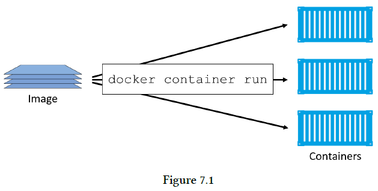
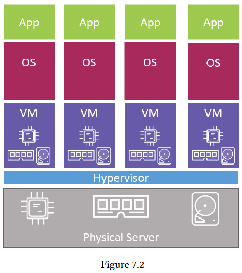
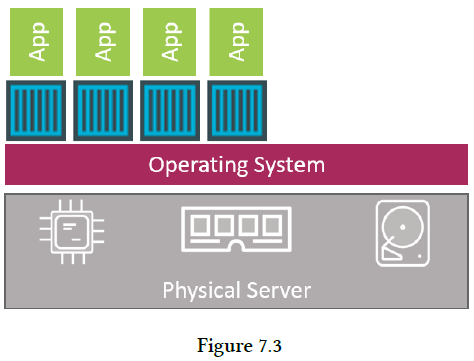

## Chapter 07: Containers

- A single Docker image being used to start multiple Docker containers  
  

- The simplest way to start a container is with the docker container run command. The command can take a lot of arguments, but in its most basic form you tell it an image to use and a app to run: docker container run <image> <app>.

	The -it flags will connect your current terminal window to the container’s shell.

	Containers run until the app they are executing exits.

	You can manually stop a container with the docker container stop command, and then restart it with docker container start. To get rid of a container forever you have to explicitly delete it using docker container rm.

- In the VM model, the physical server is powered on and the hypervisor boots (we’re skipping the BIOS and bootloader code etc.). Once the hypervisor boots, it lays claim to all physical resources on the system such as CPU, RAM, storage, and NICs. The hypervisor then carves these hardware resources into virtual versions that look smell and feel exactly like the real thing. It then packages them into a software construct called a virtual machine (VM). We then take those VMs and install an operating system and application on each one.

	When the server is powered on, your chosen OS boots. In the Docker world this can be Linux, or a modern version of Windows that has support for the container primitives in its kernel. Similar to the VM model, the OS claims all hardware resources. On top of the OS, we install a container engine such as Docker. The container engine then takes OS resources such as the process tree, the filesystem, and the network stack, and carves them up into secure isolated constructs called containers. Each container looks smells and feels just like a real OS. Inside of each container we can run an application.

	At a high level, we can say that hypervisors perform hardware virtualization — they carve up physical hardware resources into virtual versions. On the other hand, containers perform OS virtualization — they carve up OS resources into virtual versions.

- VMs  
  

- Containers  
  

- The VM model then carves low-level hardware resources into VMs. Each VM is a software construct containing virtual CPU, virtual RAM, virtual disk etc. As such, every VM needs its own OS to claim, initialize, and manage all of those virtual resources. And sadly, every OS comes with its own set of baggage and overheads. For example, every OS consumes a slice of CPU, a slice of RAM, a slice of storage etc. Most need their own licenses as well as people and infrastructure to patch and upgrade them. Each OS also presents a sizable attack surface. We often refer to all of this as the OS tax, or VM tax — every OS you install consumes resources!

	The container model has a single kernel running in the host OS. It’s possible to run tens or hundreds of containers on a single host with every container sharing that single OS/kernel. That means a single OS consuming CPU, RAM, and storage. A single OS that needs licensing. A single OS that needs upgrading and patching. And a single OS kernel presenting an attack surface. All in all, a single OS tax bill!

	Another thing to consider is start times. Because a container isn’t a full-blown OS, it starts much faster than a VM. Remember, there’s no kernel inside of a container that needs locating, decompressing, and initializing — not to mention all of the hardware enumerating and initializing associated with a normal kernel bootstrap.

- The simplest way to start a container is with the docker container run command.

	The format of the command is essentially docker container run <options> <image>:<tag> <app>.

- This means that if you type exit, to exit the Bash shell, the container will also exit (terminate). The reason for this is that a container cannot exist without a running process — killing the Bash shell kills the container’s only process, resulting in the container also being killed. This is also true of Windows containers — killing the main process in the container will also kill the container.

	Press Ctrl-PQ to exit the container without terminating it. Doing this will place you back in the shell of your Docker host and leave the container running in the background. You can use the docker container ls command to view the list of running containers on your system.

	It’s important to understand that this container is still running and you can re-attach your terminal to it with the docker container exec command.

- You can use the container’s name or ID with the docker container stop command. The format is docker container stop <container-id or container-name>.

	It is possible to delete a running container with a single command by passing the -f flag to docker container rm. However, it’s considered a best practice to take the two-step approach of stopping the container first and then deleting it. This gives the application/process that the container is running a fighting chance of stopping cleanly.

- To summarize the lifecycle of a container… You can stop, start, pause, and restart a container as many times as you want. And it’ll all happen really fast. But the container and its data will always be safe. It’s not until you explicitly delete a container that you run any chance of losing its data. And even then, if you’re storing container data in a volume, that data’s going to persist even after the container has gone.

- In our previous example the container was running the /bin/bash app. When you kill a running container with docker container rm <container> -f, the container will be killed without warning. The procedure is quite violent — a bit like sneaking up behind the container and shooting it in the back of the head. You’re literally giving the container, and the app it’s running, no chance to straighten its affairs before being killed.

	However, the docker container stop command is far more polite (like pointing a gun to the containers head and saying “you’ve got 10 seconds to say any final words”). It gives the process inside of the container a heads-up that it’s about to be stopped, giving it a chance to get things in order before the end comes. Once the docker stop command returns, you can then delete the container with docker container rm.

	The magic behind the scenes here can be explained with Linux/POSIX signals. docker container stop sends a SIGTERM signal to the PID 1 process inside of the container. As we just said, this gives the process a chance to clean things up and gracefully shut itself down. If it doesn’t exit within 10 seconds, it will receive a SIGKILL. This is effectively the bullet to the head. But hey, it got 10 seconds to sort itself out first!

	docker container rm <container> -f doesn’t bother asking nicely with a SIGTERM, it goes straight to the SIGKILL. Like we said a second ago, this is like creeping up from behind and smashing it over the head. I’m not a violent person by the way!

- It’s often a good idea to run containers with a restart policy. It’s a form of self-healing that enables Docker to automatically restart them after certain events or failures have occurred.

	Restart policies are applied per-container, and can be configured imperatively on the command line as part of docker-container run commands, or declaratively in Compose files for use with Docker Compose and Docker Stacks.

	At the time of writing, the following restart policies exist:
	- always
	- unless-stopped
	- on-failed

	The always policy is the simplest. It will always restart a stopped container unless it has been explicitly stopped, such as via a docker container stop command.

	An interesting feature of the --restart always policy is that a stopped container will be restarted when the Docker daemon starts.

	The main difference between the always and unless-stopped policies is that containers with the --restart unless-stopped policy will not be restarted when the daemon restarts if they were in the Stopped (Exited) state.

	The on-failure policy will restart a container if it exits with a non-zero exit code. It will also restart containers when the Docker daemon restarts, even containers that were in the stopped state.

- Now let’s take a look at a Linux web server example.
  ```bash
  $ docker container run -d --name webserver -p 80:8080 \
      nigelpoulton/pluralsight-docker-ci
  ```

	We know docker container run starts a new container. But this time we give it the -d flag instead of -it. -d stands for daemon mode, and tells the container to run in the background.

	After that, we name the container and then give it -p 80:8080. The -p flag maps ports on the Docker host to ports inside the container. This time we’re mapping port 80 on the Docker host to port 8080 inside the container.

- When building a Docker image, it’s possible to embed an instruction that lists the default app you want containers using the image to run. If we run a docker image inspect against the image we used to run our container, we’ll be able to see the app that the container will run when it starts.
  ```bash
  $ docker image inspect nigelpoulton/pluralsight-docker-ci
  [
    {
      "Id": "sha256:07e574331ce3768f30305519069589e027badfad98ccb49214bf3020ee69bba1",
      "RepoTags": [
        "docker.io/nigelpoulton/pluralsight-docker-ci:latest"
      ],

      <Snip>

        "Cmd": [
          "/bin/sh",
          "-c",
          "#(nop) CMD [\"/bin/sh\" \"-c\" \"cd /src && node ./app.js\"]"
        ],

  <Snip>
  ```

	It’s common to build images with default commands like this, as it makes starting containers easier. It also forces a default behavior and is a form of self documentation for the image — i.e. we can inspect the image and know what app it’s supposed to run.

- Containers - The commands
	- docker container run is the command used to start new containers. In its simplest form, it accepts an image and a command as arguments. The image is used to create the container and the command is the application you want the container to run.
	- Ctrl-PQ will detach your shell from the terminal of a container and leave the container running (UP) in the background.
	- docker container ls lists all containers in the running (UP) state. If you add the -a flag you will also see containers in the stopped (Exited) state.
	- docker container exec lets you run a new process inside of a running container. It’s useful for attaching the shell of your Docker host to a terminal inside of a running container.
	- docker container stop will stop a running container and put it in the Exited (0) state. It does this by issuing a SIGTERM to the process with PID 1 inside of the container. If the process has not cleaned up and stopped within 10 seconds, a SIGKILL will be issued to forcibly stop the container. docker container stop accepts container IDs and container names as arguments.
	- docker container start will restart a stopped (Exited) container. You can give docker container start the name or ID of a container.
	- docker container rm will delete a stopped container. You can specify containers by name or ID. It is recommended that you stop a container with the docker container stop command before deleting it with docker container rm.
	- docker container inspect will show you detailed configuration and runtime information about a container. It accepts container names and container IDs as its main argument.