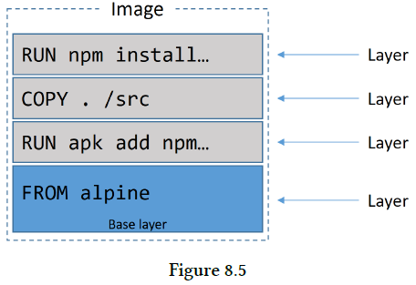

## Chapter 08: Containerizing an app

- The process of taking an application and configuring it to run as a container is called “containerizing”. Sometimes we call it “Dockerizing”.

- Basic flow of containerizing an app  
  

- The directory containing the application is referred to as the build context. It’s a common practice to keep your Dockerfile in the root directory of the build context.

	Let’s look at the contents of the Dockerfile.
  ```dockerfile
  FROM alpine
  LABEL maintainer="nigelpoulton@hotmail.com"
  RUN apk add --update nodejs nodejs-npm
  COPY . /src
  WORKDIR /src
  RUN npm install
  EXPOSE 8080
  ENTRYPOINT ["node", "./app.js"]
  ```

	The Dockerfile has two main purposes:
	- (1). To describe the application
	- (2). To tell Docker how to containerize the application (create an image with the app inside)

	At a high-level, the example Dockerfile says: Start with the alpine image, add “nigelpoulton@hotmail.com” as the maintainer, install Node.js and NPM, copy in the application code, set the working directory, install dependencies, document the app’s network port, and set app.js as the default application to run.

- The image now has four layers  
  

- The following command will build a new image called web:latest. The period (.) at the end of the command tells Docker to use the shell’s current working directory as the build context.
  ```bash
  $ docker image build -t web:latest .
  ```

	You can use the docker image inspect web:latest command to verify the configuration of the image. It will list all of the settings that were configured from the Dockerfile.

- Once you’ve created an image, it’s a good idea to store it in an image registry to keep it safe and make it available to others. Docker Hub is the most common public image registry, and it’s the default push location for docker image push commands.

	Before you can push an image, you need to tag it in a special way. This is because Docker needs all of the following information when pushing an image:
	- Registry
	- Repository
	- Tag

	The format of the command is docker image tag <current-tag> <new-tag> and it adds an additional tag, it does not overwrite the original.

- How Docker determined the push location  
  

- The following command will start a new container called c1 based on the web:latest image we just created. It maps port 80 on the Docker host, to port 8080 inside the container.
  ```bash
  $ docker container run -d --name c1 -p 80:8080 web:latest
  ```

	The -d flag runs the container in the background, and the -p 80:8080 flag maps port 80 on the host to port 8080 inside the running container.

- Comment lines in a Dockerfile start with the # character.

	All non-comment lines are Instructions. Instructions take the format INSTRUCTION argument. Instruction names are not case sensitive, but it is normal practice to write them in UPPERCASE. This makes reading the Dockerfile easier.

	The docker image build command parses the Dockerfile one-line-at-a-time starting from the top.

	Some instructions create new layers, whereas others just add metadata to the image.

	Examples of instructions that create new layers are FROM, RUN, and COPY. Examples of instructions that create metadata include EXPOSE, WORKDIR, ENV, and ENTRYPOINT. The basic premise is this - if an instruction is adding content such as files and programs to the image, it will create a new layer. If it is adding instructions on how to build the image and run the application, it will create metadata.

	You can view the instructions that were used to build the image with the docker image history command.

- You can view the output of the docker image build command to see the general process for building an image. As the following snippet shows, the basic process is: spin up a temporary container > run the Dockerfile instruction inside of that container > save the results as a new image layer > remove the temporary container.
  ```bash
  Step 3/8 : RUN apk add --update nodejs nodejs-npm
  ---> Running in e690ddca785f << Run inside of temp container
  fetch http://dl-cdn...APKINDEX.tar.gz
  fetch http://dl-cdn...APKINDEX.tar.gz
  (1/10) Installing ca-certificates (20171114-r0)
  <Snip>
  OK: 61 MiB in 21 packages
  ---> c1d31d36b81f << Create new layer
  Removing intermediate container << Remove temp container
  Step 4/8 : COPY . /src
  ```

- For example, the way you write your Dockerfiles has a huge impact on the size of your images. A common example is that every RUN instruction adds a new layer. As a result, it’s usually considered a best practice to include multiple commands as part of a single RUN instruction - all glued together with double-ampersands (&&) and backslash (\) line-breaks. While this isn’t rocket science, it requires time and discipline.

	Another issue is that we don’t clean up after ourselves. We’ll RUN a command against an image that pulls some build-time tools, and we’ll leave all those tools in the image when we ship it to production. Not ideal!

	There were ways around this - most notably the builder pattern. But most of these required discipline and added complexity.

	The builder pattern required you to have at least two Dockerfiles - one for development and one for production. You’d write your Dockerfile.dev to start from a large base image, pull in any additional build tools required, and build your app. You’d then build an image from the Dockerfile.dev and create a container from it. You’d then use your Dockerfile.prod to build a new image from a smaller base image, and copy over just the application stuff from the container you just created from the build image. And everything needed to be glued together with a script.

- The Dockerfile is shown below:
  ```dockerfile
  FROM node:latest AS storefront
  WORKDIR /usr/src/atsea/app/react-app
  COPY react-app .
  RUN npm install
  RUN npm run build

  FROM maven:latest AS appserver
  WORKDIR /usr/src/atsea
  COPY pom.xml .
  RUN mvn -B -f pom.xml -s /usr/share/maven/ref/settings-docker.xml dependency\
  :resolve
  COPY . .
  RUN mvn -B -s /usr/share/maven/ref/settings-docker.xml package -DskipTests

  FROM java:8-jdk-alpine AS production
  RUN adduser -Dh /home/gordon gordon
  WORKDIR /static
  COPY --from=storefront /usr/src/atsea/app/react-app/build/ .
  WORKDIR /app
  COPY --from=appserver /usr/src/atsea/target/AtSea-0.0.1-SNAPSHOT.jar .
  ENTRYPOINT ["java", "-jar", "/app/AtSea-0.0.1-SNAPSHOT.jar"]
  CMD ["--spring.profiles.active=postgres"]
  ```

	The first thing to note is that the Dockerfile has three FROM instructions. Each of these constitutes a distinct build stage. Internally they’re numbered form the top starting at 0. However, we’ve also given each stage a friendly name.

	An important thing to note, is that COPY --from instructions are used to only copy production-related application code from the images built by the previous stages. They do not copy across build artefacts that are not needed for production.

- As we know, the docker image build process iterates through a Dockerfile one-line-at-a-time starting from the top. For each instruction, Docker looks to see if it already has an image layer for that instruction in its cache. If it does, this is a cache hit and it uses that layer. If it doesn’t, this is a cache miss and it builds a new layer from the instruction. Getting cache hits can hugely speed up the build process.

- It is also important to understand that the COPY and ADD instructions include steps to ensure that the content being copied into the image has not changed since the last build. For example, it’s possible that the COPY . /src instruction in the Dockerfile has not changed since the previous, but… the contents of the directory being copied into the image have changed!

	To protect against this, Docker performs a checksum against each file being copied, and compares that to a checksum of the same file in the cached layer. If the checksums do not match, the cache is invalidated and a new layer is built.

- At a high level, Docker follows the normal process to build an image, but then adds an additional step that squashes everything into a single layer.

	Squashing can be good in situations where images are starting to have a lot of layers and this isn’t ideal. And example might be when creating a new base image that you want to build other images from in the future - this is much better as a single-layer image.

	On the negative side, squashed images do not share image layers. This can result in storage inefficiencies and larger push and pull operations.

- Squashed images vs non-squashed images  
  

- If you are building Linux images, and using the apt package manager, you should use the no-install-recommends flag with the apt-get install command. This makes sure that apt only installs main dependencies (packages in the Depends field) and not recommended or suggested packages. This can greatly reduce the number of unwanted packages that are downloaded into your images.

- If you are building Windows images, you should try not to use the MSI package manager. It is not space efficient and results in substantially larger images than are required.

- Containerizing an app - The commands
	- docker image build is the command that reads a Dockerfile and containerizes an application. The -t flag tags the image, and the -f flag lets you specify the name and location of the Dockerfile. With the -f flag, it is possible to use a Dockerfile with an arbitrary name and in an arbitrary location. The build context is where your application files exist, and this can be a directory on your local Docker host or a remote Git repo.
	- The FROM instruction in a Dockerfile specifies the base image for the new image you will build. It is usually the first instruction in a Dockerfile.
	- The RUN instruction in a Dockerfile allows you to run commands inside the image which create new layers. Each RUN instruction creates a single new layer.
	- The COPY instruction in a Dockerfile adds files into the image as a new layer. It is common to use the COPY instruction to copy your application code into an image.
	- The EXPOSE instruction in a Dockerfile documents the network port that the application uses.
	- The ENTRYPOINT instruction in a Dockerfile sets the default application to run when the image is started as a container.
	- Other Dockerfile instructions include LABEL, ENV, ONBUILD, HEALTHCHECK, CMD and more…