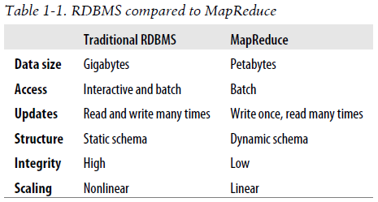

## Chapter 01: Meet Hadoop

- It has been said that “more data usually beats better algorithms,” which is to say that for some problems (such as recommending movies or music based on past preferences), however fiendish your algorithms are, often they can be beaten simply by having more data (and a less sophisticated algorithm).

- This is a long time to read all data on a single drive—and writing is even slower. The obvious way to reduce the time is to read from multiple disks at once. Imagine if we had 100 drives, each holding one hundredth of the data. Working in parallel, we could read the data in under two minutes.

	Using only one hundredth of a disk may seem wasteful. But we can store one hundred datasets, each of which is one terabyte, and provide shared access to them. We can imagine that the users of such a system would be happy to share access in return for shorter analysis times, and, statistically, that their analysis jobs would be likely to be spread over time, so they wouldn’t interfere with each other too much.

	There’s more to being able to read and write data in parallel to or from multiple disks, though.

	The first problem to solve is hardware failure: as soon as you start using many pieces of hardware, the chance that one will fail is fairly high. A common way of avoiding data loss is through replication: redundant copies of the data are kept by the system so that in the event of failure, there is another copy available.

	The second problem is that most analysis tasks need to be able to combine the data in some way, and data read from one disk may need to be combined with the data from any of the other 99 disks. Various distributed systems allow data to be combined from multiple sources, but doing this correctly is notoriously challenging.

- Why can’t we use databases with lots of disks to do large-scale batch analysis? Why is MapReduce needed?

	The answer to these questions comes from another trend in disk drives: seek time is improving more slowly than transfer rate. Seeking is the process of moving the disk’s head to a particular place on the disk to read or write data. It characterizes the latency of a disk operation, whereas the transfer rate corresponds to a disk’s bandwidth.

	MapReduce works well on unstructured or semistructured data because it is designed to interpret the data at processing time. In other words, the input keys and values for MapReduce are not intrinsic properties of the data, but they are chosen by the person analyzing the data.

	MapReduce is a linearly scalable programming model. The programmer writes two functions—a map function and a reduce function—each of which defines a mapping from one set of key-value pairs to another. These functions are oblivious to the size of the data or the cluster that they are operating on, so they can be used unchanged for a small dataset and for a massive one.

- RDBMS compared to MapReduce  
  

- MapReduce tries to collocate the data with the compute node, so data access is fast because it is local. This feature, known as data locality, is at the heart of MapReduce and is the reason for its good performance. Recognizing that network bandwidth is the most precious resource in a data center environment (it is easy to saturate network links by copying data around), MapReduce implementations go to great lengths to conserve it by explicitly modelling network topology.

- MapReduce is designed to run jobs that last minutes or hours on trusted, dedicated hardware running in a single data center with very high aggregate bandwidth interconnects.

- The Hadoop projects that are covered in this book are described briefly here:
	- **Common** A set of components and interfaces for distributed filesystems and general I/O (serialization, Java RPC, persistent data structures).
	- **Avro** A serialization system for efficient, cross-language RPC and persistent data storage.
	- **MapReduce** A distributed data processing model and execution environment that runs on large clusters of commodity machines.
	- **HDFS** A distributed filesystem that runs on large clusters of commodity machines.
	- **Pig** A data flow language and execution environment for exploring very large datasets. Pig runs on HDFS and MapReduce clusters.
	- **Hive** A distributed data warehouse. Hive manages data stored in HDFS and provides a query language based on SQL (and which is translated by the runtime engine to MapReduce jobs) for querying the data.
	- **HBase** A distributed, column-oriented database. HBase uses HDFS for its underlying storage, and supports both batch-style computations using MapReduce and point queries (random reads).
	- **ZooKeeper** A distributed, highly available coordination service. ZooKeeper provides primitives such as distributed locks that can be used for building distributed applications.
	- **Sqoop** A tool for efficient bulk transfer of data between structured data stores (such as relational databases) and HDFS.
	- **Oozie** A service for running and scheduling workflows of Hadoop jobs (including MapReduce, Pig, Hive, and Sqoop jobs).