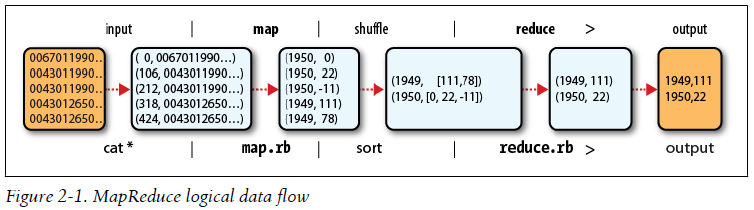
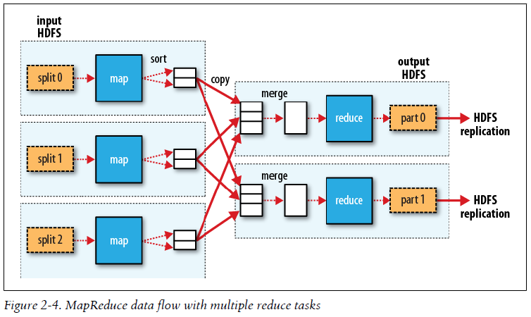

## Chapter 02: MapReduce

- MapReduce works by breaking the processing into two phases: the map phase and the reduce phase. Each phase has key-value pairs as input and output, the types of which may be chosen by the programmer. The programmer also specifies two functions: the map function and the reduce function.

- MapReduce logical data flow  
  

- It should now be clear why the optimal split size is the same as the block size: it is the largest size of input that can be guaranteed to be stored on a single node. If the split spanned two blocks, it would be unlikely that any HDFS node stored both blocks, so some of the split would have to be transferred across the network to the node running the map task, which is clearly less efficient than running the whole map task using local data.

	Map tasks write their output to the local disk, not to HDFS. Why is this? Map output is intermediate output: it’s processed by reduce tasks to produce the final output, and once the job is complete, the map output can be thrown away. So storing it in HDFS with replication would be overkill. If the node running the map task fails before the map output has been consumed by the reduce task, then Hadoop will automatically rerun the map task on another node to re-create the map output.

- MapReduce data flow with multiple reduce tasks  
  

- Many MapReduce jobs are limited by the bandwidth available on the cluster, so it pays to minimize the data transferred between map and reduce tasks. Hadoop allows the user to specify a combiner function to be run on the map output, and the combiner function’s output forms the input to the reduce function.