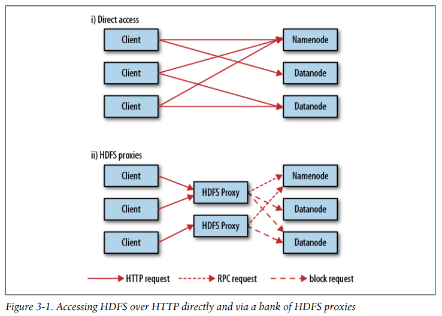
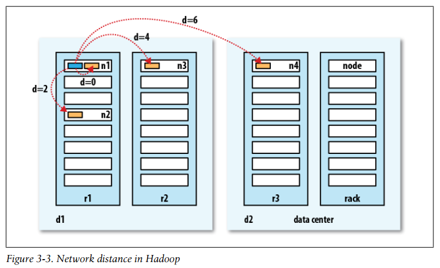
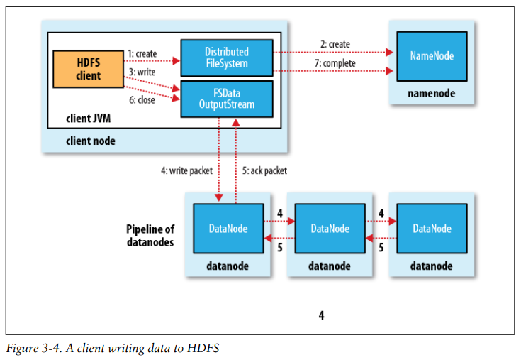

## Chapter 03: The Hadoop Distributed Filesystem

- Like in a filesystem for a single disk, files in HDFS are broken into block-sized chunks, which are stored as independent units. Unlike a filesystem for a single disk, a file in HDFS that is smaller than a single block does not occupy a full block’s worth of underlying storage.

	HDFS blocks are large compared to disk blocks, and the reason is to minimize the cost of seeks. By making a block large enough, the time to transfer the data from the disk can be significantly longer than the time to seek to the start of the block. Thus the time to transfer a large file made of multiple blocks operates at the disk transfer rate.

	Having a block abstraction for a distributed filesystem brings several benefits. The first benefit is the most obvious: a file can be larger than any single disk in the network. Second, making the unit of abstraction a block rather than a file simplifies the storage subsystem. Furthermore, blocks fit well with replication for providing fault tolerance and availability.

- An HDFS cluster has two types of nodes operating in a master-worker pattern: a namenode (the master) and a number of datanodes (workers). The namenode manages the filesystem namespace. It maintains the filesystem tree and the metadata for all the files and directories in the tree. This information is stored persistently on the local disk in the form of two files: the namespace image and the edit log. The namenode also knows the datanodes on which all the blocks for a given file are located; however, it does not store block locations persistently, because this information is reconstructed from datanodes when the system starts.

	A client accesses the filesystem on behalf of the user by communicating with the namenode and datanodes. The client presents a filesystem interface similar to a Portable Operating System Interface (POSIX), so the user code does not need to know about the namenode and datanode to function.

	Datanodes are the workhorses of the filesystem. They store and retrieve blocks when they are told to (by clients or the namenode), and they report back to the namenode periodically with lists of blocks that they are storing.

	Without the namenode, the filesystem cannot be used. In fact, if the machine running the namenode were obliterated, all the files on the filesystem would be lost since there would be no way of knowing how to reconstruct the files from the blocks on the datanodes. For this reason, it is important to make the namenode resilient to failure, and Hadoop provides two mechanisms for this.

	The first way is to back up the files that make up the persistent state of the filesystem metadata. Hadoop can be configured so that the namenode writes its persistent state to multiple filesystems.

	It is also possible to run a secondary namenode, which despite its name does not act as a namenode. Its main role is to periodically merge the namespace image with the edit log to prevent the edit log from becoming too large.

- The 2.x release series of Hadoop remedies this situation by adding support for HDFS high-availability (HA). In this implementation there is a pair of namenodes in an activestandby configuration. In the event of the failure of the active namenode, the standby takes over its duties to continue servicing client requests without a significant interruption.

- The transition from the active namenode to the standby is managed by a new entity in the system called the failover controller. Failover controllers are pluggable, but the first implementation uses ZooKeeper to ensure that only one namenode is active. Each namenode runs a lightweight failover controller process whose job it is to monitor its namenode for failures (using a simple heartbeating mechanism) and trigger a failover should a namenode fail.

	The HA implementation goes to great lengths to ensure that the previously active namenode is prevented from doing any damage and causing corruption—a method known as fencing. The system employs a range of fencing mechanisms, including killing the namenode’s process, revoking its access to the shared storage directory (typically by using a vendor-specific NFS command), and disabling its network port via a remote management command. As a last resort, the previously active namenode can be fenced with a technique rather graphically known as STONITH, or “shoot the other node in the head,” which uses a specialized power distribution unit to forcibly power down the host machine.

- HDFS has a permissions model for files and directories that is much like POSIX.

	There are three types of permission: the read permission (r), the write permission (w), and the execute permission (x).

	Each file and directory has an owner, a group, and a mode. The mode is made up of the permissions for the user who is the owner, the permissions for the users who are members of the group, and the permissions for users who are neither the owners nor members of the group.

- There are two ways of accessing HDFS over HTTP: directly, where the HDFS daemons serve HTTP requests to clients; and via a proxy (or proxies), which accesses HDFS on the client’s behalf using the usual DistributedFileSystem API.

- Accessing HDFS over HTTP directly and via a bank of HDFS proxies  
  

- A client reading data from HDFS  
  

- What does it mean for two nodes in a local network to be “close” to each other? In the context of high-volume data processing, the limiting factor is the rate at which we can transfer data between nodes—bandwidth is a scarce commodity. The idea is to use the bandwidth between two nodes as a measure of distance.

	Rather than measuring bandwidth between nodes, which can be difficult to do in practice (it requires a quiet cluster, and the number of pairs of nodes in a cluster grows as the square of the number of nodes), Hadoop takes a simple approach in which the network is represented as a tree and the distance between two nodes is the sum of their distances to their closest common ancestor. Levels in the tree are not predefined, but it is common to have levels that correspond to the data center, the rack, and the node that a process is running on. The idea is that the bandwidth available for each of the following scenarios becomes progressively less:
	- Processes on the same node
	- Different nodes on the same rack
	- Nodes on different racks in the same data center
	- Nodes in different data centers

- Network distance in Hadoop  
  

- A client writing data to HDFS  
  

- As the client writes data (step 3), DFSOutputStream splits it into packets, which it writes to an internal queue, called the data queue. The data queue is consumed by the DataStreamer, which is responsible for asking the namenode to allocate new blocks by picking a list of suitable datanodes to store the replicas. The list of datanodes forms a pipeline, and here we’ll assume the replication level is three, so there are three nodes in the pipeline. The DataStreamer streams the packets to the first datanode in the pipeline, which stores the packet and forwards it to the second datanode in the pipeline.

	DFSOutputStream also maintains an internal queue of packets that are waiting to be acknowledged by datanodes, called the ack queue. A packet is removed from the ack queue only when it has been acknowledged by all the datanodes in the pipeline (step 5).

	If a datanode fails while data is being written to it, then the following actions are taken, which are transparent to the client writing the data. First, the pipeline is closed, and any packets in the ack queue are added to the front of the data queue so that datanodes that are downstream from the failed node will not miss any packets. The current block on the good datanodes is given a new identity, which is communicated to the namenode, so that the partial block on the failed datanode will be deleted if the failed datanode recovers later on. The failed datanode is removed from the pipeline, and the remainder of the block’s data is written to the two good datanodes in the pipeline. The namenode notices that the block is under-replicated, and it arranges for a further replica to be created on another node. Subsequent blocks are then treated as normal.

- How does the namenode choose which datanodes to store replicas on? There’s a tradeoff between reliability and write bandwidth and read bandwidth here.

	Hadoop’s default strategy is to place the first replica on the same node as the client (for clients running outside the cluster, a node is chosen at random, although the system tries not to pick nodes that are too full or too busy). The second replica is placed on a different rack from the first (off-rack), chosen at random. The third replica is placed on the same rack as the second, but on a different node chosen at random. Further replicas are placed on random nodes on the cluster, although the system tries to avoid placing too many replicas on the same rack.

- After creating a file, it is visible in the filesystem namespace, as expected:
  ```java
  Path p = new Path("p");
  fs.create(p);
  assertThat(fs.exists(p), is(true));
  ```

	However, any content written to the file is not guaranteed to be visible, even if the stream is flushed. So the file appears to have a length of zero:
  ```java
  Path p = new Path("p");
  OutputStream out = fs.create(p);
  out.write("content".getBytes("UTF-8"));
  out.flush();
  assertThat(fs.getFileStatus(p).getLen(), is(0L));
  ```

	Once more than a block’s worth of data has been written, the first block will be visible to new readers. This is true of subsequent blocks, too: it is always the current block being written that is not visible to other readers.

	HDFS provides a method for forcing all buffers to be synchronized to the datanodes via the sync() method on FSDataOutputStream. After a successful return from sync(), HDFS guarantees that the data written up to that point in the file has reached all the datanodes in the write pipeline and is visible to all new readers.

	Closing a file in HDFS performs an implicit sync(), too.

- The HDFS access patterns that we have seen so far focus on single-threaded access. It’s possible to act on a collection of files—by specifying file globs, for example—but for efficient parallel processing of these files, you would have to write a program yourself. Hadoop comes with a useful program called distcp for copying large amounts of data to and from Hadoop filesystems in parallel.

	distcp is implemented as a MapReduce job where the work of copying is done by the maps that run in parallel across the cluster. There are no reducers. Each file is copied by a single map, and distcp tries to give each map approximately the same amount of data by bucketing files into roughly equal allocations.

- Hadoop Archives, or HAR files, are a file archiving facility that packs files into HDFS blocks more efficiently, thereby reducing namenode memory usage while still allowing transparent access to files. In particular, Hadoop Archives can be used as input to MapReduce.