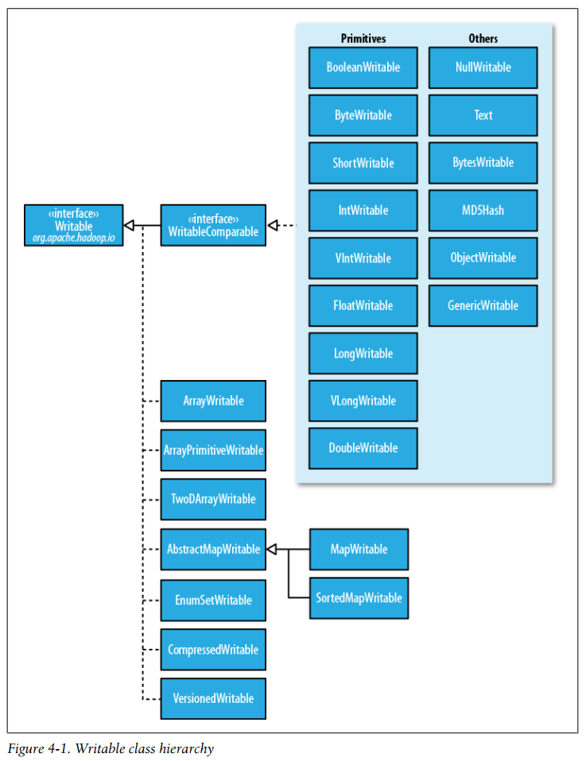
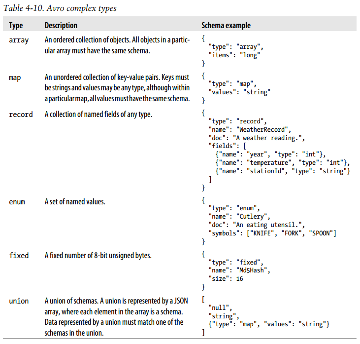
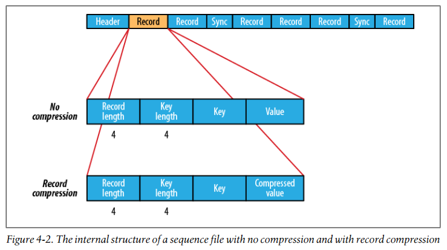
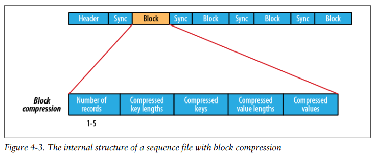

## Chapter 04: Hadoop I/O

- A client writing data sends it to a pipeline of datanodes , and the last datanode in the pipeline verifies the checksum.

	Each datanode keeps a persistent log of checksum verifications, so it knows the last time each of its blocks was verified.

	Aside from block verification on client reads, each datanode runs a DataBlockScanner in a background thread that periodically verifies all the blocks stored on the datanode.

- The Hadoop LocalFileSystem performs client-side checksumming. This means that when you write a file called filename, the filesystem client transparently creates a hidden file, .filename.crc, in the same directory containing the checksums for each chunk of the file.

- If you are using a native library and you are doing a lot of compression or decompression in your application, consider using CodecPool, which allows you to reuse compressors and decompressors, thereby amortizing the cost of creating these objects.

- Example 4-3. A program to compress data read from standard input and write it to standard output using a pooled compressor
  ```java
  public class PooledStreamCompressor {
    public static void main(String[] args) throws Exception {
      String codecClassname = args[0];
      Class<?> codecClass = Class.forName(codecClassname);
      Configuration conf = new Configuration();
      CompressionCodec codec = (CompressionCodec)
      ReflectionUtils.newInstance(codecClass, conf);
      Compressor compressor = null;
      try {
        compressor = CodecPool.getCompressor(codec);
        CompressionOutputStream out = codec.createOutputStream(System.out, compressor);
        IOUtils.copyBytes(System.in, out, 4096, false);
        out.finish();
      } finally {
        CodecPool.returnCompressor(compressor);
      }
    }
  }
  ```

- Hadoop applications process large datasets, so you should strive to take advantage of compression. Which compression format you use depends on such considerations as file size, format, and the tools you are using for processing. Here are some suggestions, arranged roughly in order of most to least effective:
	- Use a container file format such as Sequence File, RCFile, or Avro datafile, all of which support both compression and splitting. A fast compressor such as LZO, LZ4, or Snappy is generally a good choice.
	- Use a compression format that supports splitting, such as bzip2 (although bzip2 is fairly slow), or one that can be indexed to support splitting, such as LZO.
	- Split the file into chunks in the application, and compress each chunk separately using any supported compression format (it doesn’t matter whether it is splittable). In this case, you should choose the chunk size so that the compressed chunks are approximately the size of an HDFS block.
	- Store the files uncompressed.

- If your input files are compressed, they will be decompressed automatically as they are read by MapReduce, using the filename extension to determine which codec to use.

	To compress the output of a MapReduce job, in the job configuration, set the mapred.output.compress property to true and the mapred.output.compression.codec property to the classname of the compression codec you want to use. Alternatively, you can use the static convenience methods on FileOutputFormat to set these properties.

	If you are emitting sequence files for your output, you can set the mapred.output.com pression.type property to control the type of compression to use. The default is RECORD, which compresses individual records. Changing this to BLOCK, which
compresses groups of records, is recommended because it compresses better.

	Even if your MapReduce application reads and writes uncompressed data, it may benefit from compressing the intermediate output of the map phase. Since the map output is written to disk and transferred across the network to the reducer nodes, by using a fast compressor such as LZO, LZ4, or Snappy, you can get performance gains simply because the volume of data to transfer is reduced.

- Serialization is the process of turning structured objects into a byte stream for transmission over a network or for writing to persistent storage. Deserialization is the reverse process of turning a byte stream back into a series of structured objects.

- We want the storage format to be compact (to make efficient use of storage space), fast (so the overhead in reading or writing terabytes of data is minimal), extensible (so we can transparently read data written in an older format), and interoperable (so we can read or write persistent data using different languages).

- Hadoop uses its own serialization format, Writables, which is certainly compact and fast, but not so easy to extend or use from languages other than Java.

	The Writable interface defines two methods: one for writing its state to a DataOutput binary stream and one for reading its state from a DataInput binary stream.
  ```java
  package org.apache.hadoop.io;
  import java.io.DataOutput;
  import java.io.DataInput;
  import java.io.IOException;
  public interface Writable {
  void write(DataOutput out) throws IOException;
    void readFields(DataInput in) throws IOException;
  }
  ```

- IntWritable implements the WritableComparable interface, which is just a subinterface of the Writable and java.lang.Comparable interfaces:
  ```java
  package org.apache.hadoop.io;
  public interface WritableComparable<T> extends Writable, Comparable<T> {
  }
  ```

	Comparison of types is crucial for MapReduce, where there is a sorting phase during which keys are compared with one another. One optimization that Hadoop provides is the RawComparator extension of Java’s Comparator:
  ```
  package org.apache.hadoop.io;
  import java.util.Comparator;
  public interface RawComparator<T> extends Comparator<T> {
    public int compare(byte[] b1, int s1, int l1, byte[] b2, int s2, int l2);
  }
  ```

	This interface permits implementors to compare records read from a stream without deserializing them into objects, thereby avoiding any overhead of object creation. For example, the comparator for IntWritables implements the raw compare() method by reading an integer from each of the byte arrays b1 and b2 and comparing them directly from the given start positions (s1 and s2) and lengths (l1 and l2).

	WritableComparator is a general-purpose implementation of RawComparator for WritableComparable classes. It provides two main functions. First, it provides a default implementation of the raw compare() method that deserializes the objects to be compared from the stream and invokes the object compare() method. Second, it acts as a factory for RawComparator instances (that Writable implementations have registered).

- Writable class hierarchy  
  

- When it comes to encoding integers, there is a choice between the fixed-length formats (IntWritable and LongWritable) and the variable-length formats (VIntWritable and VLongWritable). The variable-length formats use only a single byte to encode the value if it is small enough (between –112 and 127, inclusive); otherwise, they use the first byte to indicate whether the value is positive or negative, and how many bytes follow.

- Text is a Writable for UTF-8 sequences. It can be thought of as the Writable equivalent of java.lang.String.

	The Text class uses an int (with a variable-length encoding) to store the number of bytes in the string encoding, so the maximum value is 2 GB. Furthermore, Text uses standard UTF-8, which makes it potentially easier to interoperate with other tools that understand UTF-8.

	Because of its emphasis on using standard UTF-8, there are some differences between Text and the Java String class. Indexing for the Text class is in terms of position in the encoded byte sequence, not the Unicode character in the string or the Java char code unit (as it is for String). For ASCII strings, these three concepts of index position coincide.

	All but U+10400 can be expressed using a single Java char. U+10400 is a supplementary character and is represented by two Java chars, known as a surrogate pair.

- Tests showing the differences between the String and Text classes
  ```java
  public class StringTextComparisonTest {
    @Test
    public void string() throws UnsupportedEncodingException {
      String s = "\u0041\u00DF\u6771\uD801\uDC00";
      assertThat(s.length(), is(5));
      assertThat(s.getBytes("UTF-8").length, is(10));
      assertThat(s.indexOf("\u0041"), is(0));
      assertThat(s.indexOf("\u00DF"), is(1));
      assertThat(s.indexOf("\u6771"), is(2));
      assertThat(s.indexOf("\uD801\uDC00"), is(3));
      assertThat(s.charAt(0), is('\u0041'));
      assertThat(s.charAt(1), is('\u00DF'));
      assertThat(s.charAt(2), is('\u6771'));
      assertThat(s.charAt(3), is('\uD801'));
      assertThat(s.charAt(4), is('\uDC00'));
      assertThat(s.codePointAt(0), is(0x0041));
      assertThat(s.codePointAt(1), is(0x00DF));
      assertThat(s.codePointAt(2), is(0x6771));
      assertThat(s.codePointAt(3), is(0x10400));
    }
    @Test
    public void text() {
      Text t = new Text("\u0041\u00DF\u6771\uD801\uDC00");
      assertThat(t.getLength(), is(10));
      assertThat(t.find("\u0041"), is(0));
      assertThat(t.find("\u00DF"), is(1));
      assertThat(t.find("\u6771"), is(3));
      assertThat(t.find("\uD801\uDC00"), is(6));
      assertThat(t.charAt(0), is(0x0041));
      assertThat(t.charAt(1), is(0x00DF));
      assertThat(t.charAt(3), is(0x6771));
      assertThat(t.charAt(6), is(0x10400));
    }
  }
  ```

	The test confirms that the length of a String is the number of char code units it contains (5, made up of one from each of the first three characters in the string and a surrogate pair from the last), whereas the length of a Text object is the number of bytes in its UTF-8 encoding (10 = 1+2+3+4). Similarly, the indexOf() method in String returns an index in char code units, and find() for Text is a byte offset.

	The charAt() method in String returns the char code unit for the given index, which in the case of a surrogate pair will not represent a whole Unicode character. The code PointAt() method, indexed by char code unit, is needed to retrieve a single Unicode character represented as an int. In fact, the charAt() method in Text is more like the codePointAt() method than its namesake in String. The only difference is that it is indexed by byte offset.

- In some situations, the byte array returned by the getBytes() method may be longer than the length returned by getLength():
  ```java
  Text t = new Text("hadoop");
  t.set(new Text("pig"));
  assertThat(t.getLength(), is(3));
  assertThat("Byte length not shortened", t.getBytes().length, is(6));
  ```

	This shows why it is imperative that you always call getLength() when calling getBytes(), so you know how much of the byte array is valid data.

- BytesWritable is a wrapper for an array of binary data. Its serialized format is an integer field (4 bytes) that specifies the number of bytes to follow, followed by the bytes themselves.

- NullWritable is a special type of Writable, as it has a zero-length serialization. No bytes are written to or read from the stream. It is used as a placeholder.

- ObjectWritable is a general-purpose wrapper for the following: Java primitives, String, enum, Writable, null, or arrays of any of these types. It is used in Hadoop RPC to marshal and unmarshal method arguments and return types.

	ObjectWritable is useful when a field can be of more than one type. For example, if the values in a SequenceFile have multiple types, you can declare the value type as an ObjectWritable and wrap each type in an ObjectWritable. Being a general-purpose mechanism, it wasted a fair amount of space because it writes the classname of the wrapped type every time it is serialized. In cases where the number of types is small and known ahead of time, this can be improved by having a static array of types and using the index into the array as the serialized reference to the type. This is the approach that GenericWritable takes, and you have to subclass it to specify which types to support.

- There are six Writable collection types in the org.apache.hadoop.io package: ArrayWritable, ArrayPrimitiveWritable, TwoDArrayWritable, MapWritable, SortedMapWritable, and EnumSetWritable.

- Just as you would for any value object you write in Java, you should override the hashCode(), equals(), and toString() methods from java.lang.Object. The hashCode() method is used by the HashPartitioner (the default partitioner in MapReduce) to choose a reduce partition, so you should make sure that you write a good hash function that mixes well to ensure reduce partitions are of a similar size.

	If you ever plan to use your custom Writable with TextOutputFormat, then you must implement its toString() method. TextOutputFormat calls toString() on keys and values for their output representation.

- Example 4-8. A RawComparator for comparing TextPair byte representations
  ```java
  public static class Comparator extends WritableComparator {
    private static final Text.Comparator TEXT_COMPARATOR = new Text.Comparator();
    public Comparator() {
      super(TextPair.class);
    }
    @Override
    public int compare(byte[] b1, int s1, int l1, byte[] b2, int s2, int l2) {
      try {
        int firstL1 = WritableUtils.decodeVIntSize(b1[s1]) + readVInt(b1, s1);
        int firstL2 = WritableUtils.decodeVIntSize(b2[s2]) + readVInt(b2, s2);
        int cmp = TEXT_COMPARATOR.compare(b1, s1, firstL1, b2, s2, firstL2);
        if (cmp != 0) {
          return cmp;
        }
        return TEXT_COMPARATOR.compare(b1, s1 + firstL1, l1 - firstL1,
            b2, s2 + firstL2, l2 - firstL2);
      } catch (IOException e) {
        throw new IllegalArgumentException(e);
      }
    }
  }

  static {
  WritableComparator.define(TextPair.class, new Comparator());
  }
  ```

- A Serialization defines a mapping from types to Serializer instances (for turning an object into a byte stream) and Deserializer instances (for turning a byte stream into an object).

	Set the io.serializations property to a comma-separated list of classnames to register Serialization implementations. Its default value includes org.apache.hadoop.io.serializer.WritableSerialization and the Avro-specific and reflect serializations, which means that only Writable or Avro objects can be serialized or deserialized out of the box.

- Java Serialization is not compact. Classes that implement java.io.Serializable or java.io.Externalizable write their classname and the object representation to the stream. Subsequent instances of the same class write a reference handle to the first occurrence, which occupies only 5 bytes. However, reference handles don’t work well with random access, because the referent class may occur at any point in the preceding stream—that is, there is state stored in the stream. Even worse, reference handles play havoc with sorting records in a serialized stream, since the first record of a particular class is distinguished and must be treated as a special case.

	Java Serialization is a general-purpose mechanism for serializing graphs of objects, so it necessarily has some overhead for serialization and deserialization operations. What’s more, the deserialization procedure creates a new instance for each object deserialized from the stream. Writable objects, on the other hand, can be (and often are) reused.

- There are a number of other serialization frameworks that approach the problem in a different way: rather than defining types through code, you define them in a languageneutral, declarative fashion, using an interface description language (IDL). The system can then generate types for different languages, which is good for interoperability. They also typically define versioning schemes that make type evolution straightforward.

- Apache Avro is a language-neutral data serialization system. The project was created by Doug Cutting (the creator of Hadoop) to address the major downside of Hadoop Writables: lack of language portability. Having a data format that can be processed by many languages (currently C, C++, C#, Java, PHP, Python, and Ruby) makes it easier to share datasets with a wider audience than one tied to a single language. It is also more future-proof, allowing data to potentially outlive the language used to read and write it.

	Avro schemas are usually written in JSON, and data is usually encoded using a binary format, but there are other options, too. There is a higher-level language called Avro IDL for writing schemas in a C-like language that is more familiar to developers. There is also a JSON-based data encoder, which, being human-readable, is useful for prototyping and debugging Avro data.

	Avro has rich schema resolution capabilities. Within certain carefully defined constraints, the schema used to read data need not be identical to the schema that was used to write the data. This is the mechanism by which Avro supports schema evolution.

	Avro specifies an object container format for sequences of objects—similar to Hadoop’s sequence file. An Avro datafile has a metadata section where the schema is stored, which makes the file self-describing. Avro datafiles support compression and are splittable, which is crucial for a MapReduce data input format. Furthermore, since Avro was designed with MapReduce in mind, in the future it will be possible to use Avro to bring first-class MapReduce APIs (that is, ones that are richer than Streaming, such as the Java API or C++ Pipes) to languages that speak Avro.

- Avro complex types  
  

- What’s more, there may be more than one representation, or mapping, for a language. All languages support a dynamic mapping, which can be used even when the schema is not known ahead of runtime. Java calls this the generic mapping.

	In addition, the Java and C++ implementations can generate code to represent the data for an Avro schema. Code generation, which is called the specific mapping in Java, is an optimization that is useful when you have a copy of the schema before you read or write data. Generated classes also provide a more domain-oriented API for user code than generic ones.

	Java has a third mapping, the reflect mapping, which maps Avro types onto preexisting Java types using reflection. It is slower than the generic and specific mappings, and is generally not recommended for new applications.

- Avro string can be represented by either Java String or the Avro Utf8 Java type. The reason to use Utf8 is efficiency: because it is mutable, a single Utf8 instance may be reused for reading or writing a series of values. Also, Java String decodes UTF-8 at object construction time, whereas Avro Utf8 does it lazily, which can increase performance in some cases.

- Let’s write a Java program to read and write Avro data to and from streams. We’ll start with a simple Avro schema for representing a pair of strings as a record:
  ```
  {
    "type": "record",
    "name": "StringPair",
    "doc": "A pair of strings.",
    "fields": [
      {"name": "left", "type": "string"},
      {"name": "right", "type": "string"}
    ]
  }
  ```

	If this schema is saved in a file on the classpath called StringPair.avsc (.avsc is the conventional extension for an Avro schema), we can load it using the following two lines of code:
  ```java
  Schema.Parser parser = new Schema.Parser();
  Schema schema = parser.parse(getClass().getResourceAsStream("StringPair.avsc"));
  ```

	We can create an instance of an Avro record using the generic API as follows:
  ```java
  GenericRecord datum = new GenericData.Record(schema);
  datum.put("left", "L");
  datum.put("right", "R");
  ```

	Next, we serialize the record to an output stream:
  ```java
  ByteArrayOutputStream out = new ByteArrayOutputStream();
  DatumWriter<GenericRecord> writer = new GenericDatumWriter<GenericRecord>(schema);
  Encoder encoder = EncoderFactory.get().binaryEncoder(out, null);
  writer.write(datum, encoder);
  encoder.flush();
  out.close();
  ```

	There are two important objects here: the DatumWriter and the Encoder. A DatumWriter translates data objects into the types understood by an Encoder, which the latter writes to the output stream. Here we are using a GenericDatumWriter, which passes the fields of GenericRecord to the Encoder. We pass a null to the encoder factory because we are not reusing a previously constructed encoder here.

	In this example only one object is written to the stream, but we could call write() with more objects before closing the stream if we wanted to.

	The GenericDatumWriter needs to be passed the schema because it follows the schema to determine which values from the data objects to write out. After we have called the writer’s write() method, we flush the encoder, then close the output stream.

	We can reverse the process and read the object back from the byte buffer:
  ```java
  DatumReader<GenericRecord> reader = new GenericDatumReader<GenericRecord>(schema);
  Decoder decoder = DecoderFactory.get().binaryDecoder(out.toByteArray(), null);
  GenericRecord result = reader.read(null, decoder);
  assertThat(result.get("left").toString(), is("L"));
  assertThat(result.get("right").toString(), is("R"));
  ```

	We pass null to the calls to binaryDecoder() and read() because we are not reusing objects here (the decoder or the record, respectively).

- Avro’s object container file format is for storing sequences of Avro objects. It is very similar in design to Hadoop’s sequence files.

	A datafile has a header containing metadata, including the Avro schema and a sync marker, followed by a series of (optionally compressed) blocks containing the serialized Avro objects. Blocks are separated by a sync marker that is unique to the file (the marker for a particular file is found in the header) and that permits rapid resynchronization with a block boundary after seeking to an arbitrary point in the file, such as an HDFS block boundary. Thus, Avro datafiles are splittable, which makes them amenable to efficient MapReduce processing.

- When the reader’s schema is different from the writer’s, we use the constructor for GenericDatumReader that takes two schema objects, the writer’s and the reader’s, in that order:
  ```java
  DatumReader<GenericRecord> reader = new GenericDatumReader<GenericRecord>(schema, newSchema);
  Decoder decoder = DecoderFactory.get().binaryDecoder(out.toByteArray(), null);
  GenericRecord result = reader.read(null, decoder);
  assertThat(result.get("left").toString(), is("L"));
  assertThat(result.get("right").toString(), is("R"));
  assertThat(result.get("description").toString(), is("));
  ```

	For datafiles, which have the writer’s schema stored in the metadata, we only need to specify the readers’s schema explicitly, which we can do by passing null for the writer’s schema:
  ```java
  DatumReader<GenericRecord> reader = new GenericDatumReader<GenericRecord>(null, newSchema);
  ```

	Another common use of a different reader’s schema is to drop fields in a record, an operation called projection. This is useful when you have records with a large number of fields and you want to read only some of them.

	Another useful technique for evolving Avro schemas is the use of name aliases. Aliases allow you to use different names in the schema used to read the Avro data than in the schema originally used to write the data.

- All types except record have preordained rules for their sort order, as described in the Avro specification, that cannot be overridden by the user. For records, however, you can control the sort order by specifying the order attribute for a field. It takes one of three values: ascending (the default), descending (to reverse the order), or ignore (so the field is skipped for comparison purposes).

	The record’s fields are compared pairwise in the document order of the reader’s schema. Thus, by specifying an appropriate reader’s schema, you can impose an arbitrary ordering on data records.

	Avro implements efficient binary comparisons. That is to say, Avro does not have to deserialize a binary data into objects to perform the comparison, because it can instead work directly on the byte streams.

- Avro provides a number of classes for making it easy to run MapReduce programs on Avro data. For example, AvroMapper and AvroReducer in the org.apache.avro.mapred package are specializations of Hadoop’s (old-style) Mapper and Reducer classes. They eliminate the key-value distinction for inputs and outputs, since Avro datafiles are just a sequence of values. However, intermediate data is still divided into key-value pairs for the shuffle.

	There are a couple of differences from the regular Hadoop MapReduce API. The first is the use of a org.apache.avro.mapred.Pair to wrap the map output key and value in MaxTemperatureMapper. (The reason that the org.apache.avro.mapred.AvroMapper doesn’t have a fixed output key and value is so that map-only jobs can emit just values to Avro datafiles.)

	The second major difference from regular MapReduce is the use of AvroJob for configuring the job. AvroJob is a convenience class for specifying the Avro schemas for the input, map output, and final output data.

- To create a SequenceFile, use one of its createWriter() static methods, which return a SequenceFile.Writer instance. There are several overloaded versions, but they all require you to specify a stream to write to (either an FSDataOutputStream or a FileSystem and Path pairing), a Configuration object, and the key and value types. Optional arguments include the compression type and codec, a Progressable callback to be informed of write progress, and a Metadata instance to be stored in the SequenceFile header.

	Once you have a SequenceFile.Writer, you then write key-value pairs using the append() method. When you’ve finished, you call the close() method (Sequence File.Writer implements java.io.Closeable).

- A sync point is a point in the stream that can be used to resynchronize with a record boundary if the reader is “lost”—for example, after seeking to an arbitrary position in the stream. Sync points are recorded by SequenceFile.Writer, which inserts a special entry to mark the sync point every few records as a sequence file is being written. Such entries are small enough to incur only a modest storage overhead—less than 1%. Sync points always align with record boundaries.

	Sync points come into their own when using sequence files as input to MapReduce, since they permit the file to be split and different portions of it can be processed independently by separate map tasks.

- The first three bytes of a sequence file are the bytes SEQ, which acts as a magic number, followed by a single byte representing the version number. The header contains other fields, including the names of the key and value classes, compression details, userdefined metadata, and the sync marker.

- The internal structure of a sequence file with no compression and with record compression  
  

- Block compression compresses multiple records at once; it is therefore more compact than and should generally be preferred over record compression because it has the opportunity to take advantage of similarities between records.

- The internal structure of a sequence file with block compression  
  

- A MapFile is a sorted SequenceFile with an index to permit lookups by key. MapFile can be thought of as a persistent form of java.util.Map (although it doesn’t implement this interface), which is able to grow beyond the size of a Map that is kept in memory.

	If we look at the MapFile, we see it’s actually a directory containing two files called data and index:
  ```bash
  % ls -l numbers.map
  total 104
  -rw-r--r-- 1 tom tom 47898 Jul 29 22:06 data
  -rw-r--r-- 1 tom tom   251 Jul 29 22:06 index
  ```

	Both files are SequenceFiles. The data file contains all of the entries, in order.

	The index file contains a fraction of the keys and contains a mapping from the key to that key’s offset in the data file.

- Hadoop comes with a few variants on the general key-value MapFile interface:
	- SetFile is a specialization of MapFile for storing a set of Writable keys. The keys must be added in sorted order.
	- ArrayFile is a MapFile where the key is an integer representing the index of the element in the array and the value is a Writable value.
	- BloomMapFile is a MapFile that offers a fast version of the get() method, especially  for sparsely populated files. The implementation uses a dynamic bloom filter for testing whether a given key is in the map. The test is very fast because it is inmemory, but it has a nonzero probability of false positives, in which case the regular get() method is called.

- One way of looking at a MapFile is as an indexed and sorted SequenceFile. So it’s quite natural to want to be able to convert a SequenceFile into a MapFile.

	Example 4-17. Re-creating the index for a MapFile
  ```java
  public class MapFileFixer {
    public static void main(String[] args) throws Exception {
      String mapUri = args[0];
      Configuration conf = new Configuration();
      FileSystem fs = FileSystem.get(URI.create(mapUri), conf);
      Path map = new Path(mapUri);
      Path mapData = new Path(map, MapFile.DATA_FILE_NAME);
      // Get key and value types from data sequence file
      SequenceFile.Reader reader = new SequenceFile.Reader(fs, mapData, conf);
      Class keyClass = reader.getKeyClass();
      Class valueClass = reader.getValueClass();
      reader.close();
      // Create the map file index file
      long entries = MapFile.fix(fs, map, keyClass, valueClass, false, conf);
      System.out.printf("Created MapFile %s with %d entries\n", map, entries);
    }
  }
  ```

	The fix() method is usually used for recreating corrupted indexes, but because it creates a new index from scratch, it’s exactly what we need here.