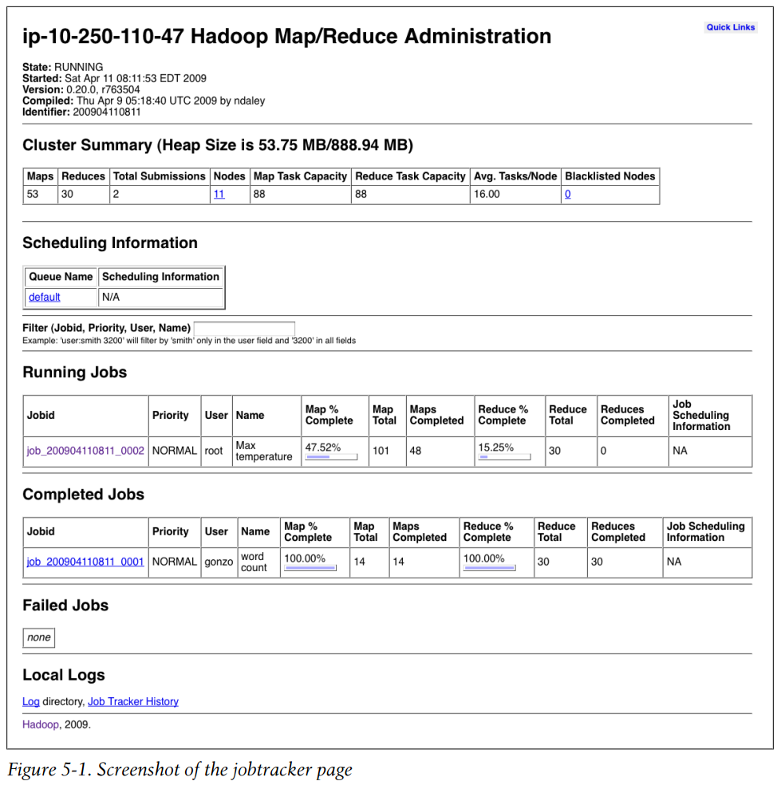
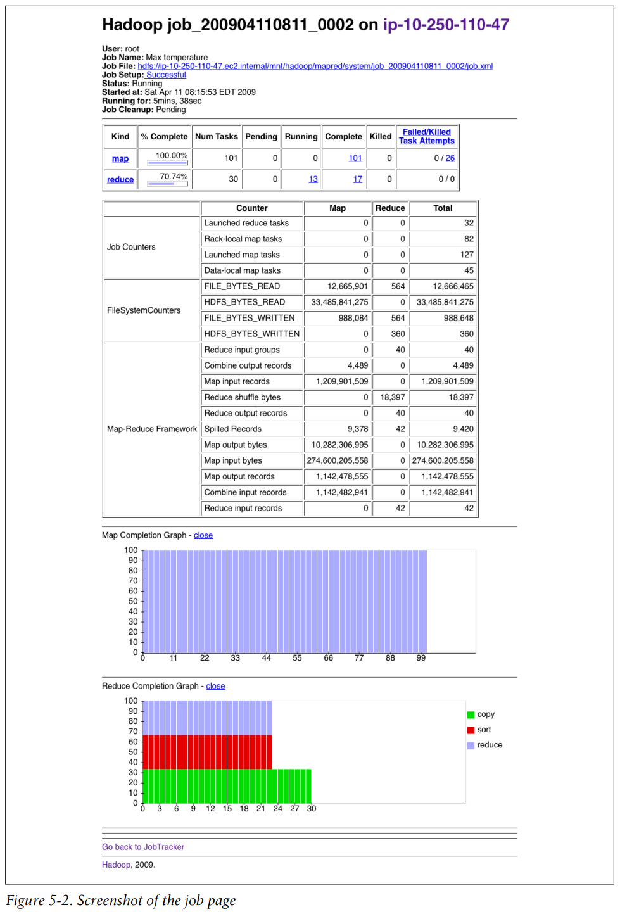
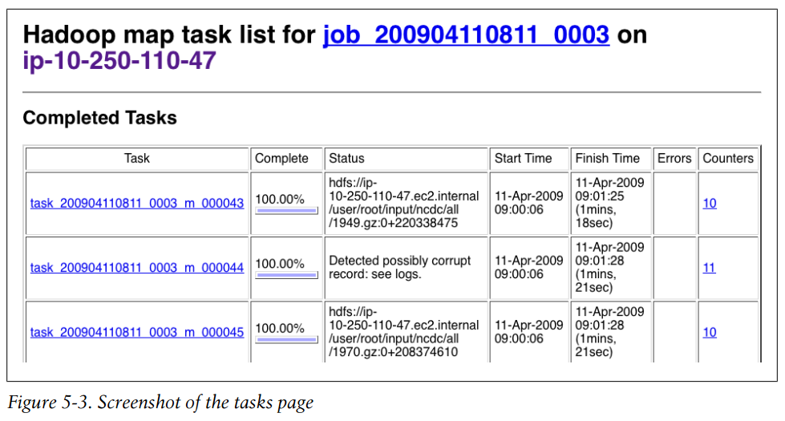
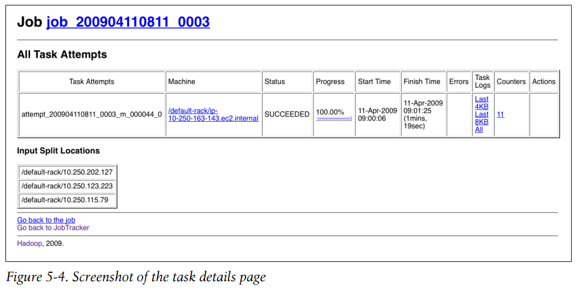
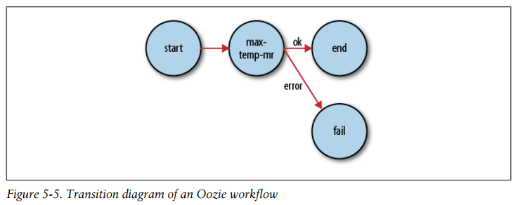

## Chapter 05: Developing a MapReduce Application

- Writing a program in MapReduce follows a certain pattern. You start by writing your map and reduce functions, ideally with unit tests to make sure they do what you expect. Then you write a driver program to run a job, which can run from your IDE using a small subset of the data to check that it is working.

- Components in Hadoop are configured using Hadoop’s own configuration API. An instance of the Configuration class (found in the org.apache.hadoop.conf package) represents a collection of configuration properties and their values.

	Configurations read their properties from resources—XML files with a simple structure for defining name-value pairs.

	There are a couple of things to note: type information is not stored in the XML file; instead, properties can be interpreted as a given type when they are read. Also, the get() methods allow you to specify a default value, which is used if the property is not defined in the XML file.

- Things get interesting when more than one resource is used to define a configuration. This is used in Hadoop to separate out the default properties for the system, defined internally in a file called core-default.xml, from the site-specific overrides in coresite.xml.

	Properties defined in resources that are added later override the earlier definitions.

	However, properties that are marked as final cannot be overridden in later definitions.

	Attempting to override final properties usually indicates a configuration error, so this results in a warning message being logged to aid diagnosis.

- Configuration properties can be defined in terms of other properties,or system properties.

	System properties take priority over properties defined in resource files.

	Note that although configuration properties can be defined in terms of system properties, unless system properties are redefined using configuration properties, they are not accessible through the configuration API.

- For building MapReduce jobs you only need to have the hadoop-core dependency, which contains all the Hadoop classes. For running unit tests we use junit, as well as a couple of helper libraries: hamcrest-all provides useful matchers for writing test assertions, and mrunit is used for writing MapReduce tests. The hadoop-test library contains the “mini-” clusters that are useful for testing with Hadoop clusters running in a single JVM (we also pull in jersey-core because it is missing from the Hadoop POM).

- When developing Hadoop applications, it is common to switch between running the application locally and running it on a cluster. In fact, you may have several clusters you work with, or you may have a local “pseudodistributed” cluster that you like to test on (a pseudodistributed cluster is one whose daemons all run on the local machine).

	One way to accommodate these variations is to have Hadoop configuration files containing the connection settings for each cluster you run against and specify which one you are using when you run Hadoop applications or tools. As a matter of best practice, it’s recommended to keep these files outside Hadoop’s installation directory tree, as this makes it easy to switch between Hadoop versions without duplicating or losing settings.

- The user identity that Hadoop uses for permissions in HDFS is determined by running the whoami command on the client system. Similarly, the group names are derived from the output of running groups.

	If, however, your Hadoop user identity is different from the name of your user account on your client machine, you can explicitly set your Hadoop username and group names by setting the hadoop.job.ugi property. The username and group names are specified as a comma-separated list of strings.

	You can set the user identity that the HDFS web interface runs as by setting dfs.web.ugi using the same syntax.

- Hadoop comes with a few helper classes for making it easier to run jobs from the command line. GenericOptionsParser is a class that interprets common Hadoop command-line options and sets them on a Configuration object for your application to use as desired. You don’t usually use GenericOptionsParser directly, as it’s more convenient to implement the Tool interface and run your application with the ToolRunner, which uses GenericOptionsParser internally:
  ```java
  public interface Tool extends Configurable {
    int run(String [] args) throws Exception;
  }
  ```

- Be aware that some properties have no effect when set in the client configuration.

	In general, you can tell the component where a property should be set by its name, so the fact that mapred.tasktracker.map.tasks.max imum starts with mapred.tasktracker gives you a clue that it can be set only for the tasktracker daemon.

- we call ToolRunner’s static run() method, which takes care of creating a Configuration object for the Tool before calling its run() method. ToolRunner also uses a GenericOptionsParser to pick up any standard options specified on the command line and to set them on the Configuration instance.

- JVM system properties are retrieved from the java.lang.System class, whereas Hadoop properties are accessible only from a Configuration object. So, the following command will print nothing, even though the color system property has been set (via HADOOP_OPTS), because the System class is not used by ConfigurationPrinter:
  ```bash
  % HADOOP_OPTS='-Dcolor=yellow' hadoop ConfigurationPrinter | grep color
  ```

- MRUnit (http://incubator.apache.org/mrunit/) is a testing library that makes it easy to pass known inputs to a mapper or a reducer and check that the outputs are as expected. MRUnit is used in conjunction with a standard test execution framework, such as JUnit, so you can run the tests for MapReduce jobs as a part of your normal development environment.

- Apart from the flexible configuration options offered by making your application implement Tool, you also make it more testable because it allows you to inject an arbitrary Configuration. You can take advantage of this to write a test that uses a local job runner to run a job against known input data, which checks that the output is as expected.

	There are two approaches to doing this. The first is to use the local job runner and run the job against a test file on the local filesystem.

	The second way of testing the driver is to run it using a “mini-” cluster. Hadoop has a set of testing classes, called MiniDFSCluster, MiniMRCluster, and MiniYARNCluster, that provide a programmatic way of creating in-process clusters.

- In a distributed setting, things are a little more complex. For a start, a job’s classes must be packaged into a job JAR file to send to the cluster. Hadoop will find the job JAR automatically by searching for the JAR on the driver’s classpath that contains the class set in the setJarByClass() method (on JobConf or Job). Alternatively, if you want to set an explicit JAR file by its file path, you can use the setJar() method.

- The user’s client-side classpath set by hadoop jar <jar> is made up of:
	- The job JAR file
	- Any JAR files in the lib directory of the job JAR file, and the classes directory (if present)
	- The classpath defined by HADOOP_CLASSPATH, if set

- Instead, the user’s task classpath is comprised of the following:
	- The job JAR file
	- Any JAR files contained in the lib directory of the job JAR file, and the classes directory (if present)
	- Any files added to the distributed cache, using the -libjars option, or the addFileToClassPath() method on DistributedCache (old API), or Job (new API)

- Given these different ways of controlling what is on the client and task classpaths, there are corresponding options for including library dependencies for a job.
	- Unpack the libraries and repackage them in the job JAR.
	- Package the libraries in the lib directory of the job JAR.
	- Keep the libraries separate from the job JAR, and add them to the client classpath via HADOOP_CLASSPATH and to the task classpath via -libjars.

- The waitForCompletion() method on Job launches the job and polls for progress, writing a line summarizing the map and reduce’s progress whenever either changes.

- The format of a job ID is composed of the time that the jobtracker (not the job) started and an incrementing counter maintained by the jobtracker to uniquely identify the job to that instance of the jobtracker.

	Tasks belong to a job, and their IDs are formed by replacing the job prefix of a job ID with a task prefix and adding a suffix to identify the task within the job.

	Tasks may be executed more than once, due to failure or speculative execution, so to identify different instances of a task execution, task attempts are given unique IDs on the jobtracker.

- Screenshot of the jobtracker page  
  

- Job history refers to the events and configuration for a completed job. It is retained regardless of whether the job was successful, in an attempt to provide interesting information for the user running a job.

- Screenshot of the job page  
  

- The -getmerge option to the hadoop fs command is useful here, as it gets all the files in the directory specified in the source pattern and merges them into a single file on the local filesystem.

- In fact, when trying to debug a job, you should always ask yourself if you can use a counter to get the information you need to find out what’s happening. Even if you need to use logging or a status message, it may be useful to use a counter to gauge the extent of the problem.
  ```java
  public class MaxTemperatureMapper extends Mapper<LongWritable, Text, Text, IntWritable> {
    enum Temperature {
      OVER_100
    }
    private NcdcRecordParser parser = new NcdcRecordParser();
    @Override
    public void map(LongWritable key, Text value, Context context)
        throws IOException, InterruptedException {
      parser.parse(value);
      if (parser.isValidTemperature()) {
        int airTemperature = parser.getAirTemperature();
        if (airTemperature > 1000) {
          System.err.println("Temperature over 100 degrees for input: " + value);
          context.setStatus("Detected possibly corrupt record: see logs.");
          context.getCounter(Temperature.OVER_100).increment(1);
        }
        context.write(new Text(parser.getYear()), new IntWritable(airTemperature));
      }
    }
  }
  ```

- Screenshot of the tasks page  
  

- Screenshot of the task details page  
  

- Anything written to standard output or standard error is directed to the relevant logfile. (Of course, in Streaming, standard output is used for the map or reduce output, so it will not show up in the standard output log.)

	In Java, you can write to the task’s syslog file if you wish by using the Apache Commons Logging API.

- Tuning checklist
	- **Number of mappers** How long are your mappers running for? If they are only running for a few seconds on average, you should see whether there’s a way to have fewer mappers and make them all run longer, a minute or so, as a rule of thumb. The extent to which this is possible depends on the input format you are using.
	- **Number of reducers** For maximum performance, the number of reducers should be slightly less than the number of reduce slots in the cluster. This allows the reducers to finish in one wave and fully utilizes the cluster during the reduce phase.
	- **Combiners** Check whether your job can take advantage of a combiner to reduce the amount of data passing through the shuffle.
	- **Intermediate compression** Job execution time can almost always benefit from enabling map output compression.
	- **Custom serialization** If you are using your own custom Writable objects or custom comparators, make sure you have implemented RawComparator.
	- **Shuffle tweaks** The MapReduce shuffle exposes around a dozen tuning parameters for memory management, which may help you wring out the last bit of performance.

- HPROF is a profiling tool that comes with the JDK that, although basic, can give valuable information about a program’s CPU and heap usage.

- For more complex problems, it is worth considering a higher-level language than MapReduce, such as Pig, Hive, Cascading, Cascalog, or Crunch. One immediate benefit is that it frees you from having to do the translation into MapReduce jobs, allowing you to concentrate on the analysis you are performing.

- The arguments for having more (but simpler) MapReduce stages are that doing so leads to more composable and more maintainable mappers and reducers.

	It’s possible to make map and reduce functions even more composable than we have done. A mapper commonly performs input format parsing, projection (selecting the relevant fields), and filtering (removing records that are not of interest). In the mappers you have seen so far, we have implemented all of these functions in a single mapper. However, there is a case for splitting these into distinct mappers and chaining them into a single mapper using the ChainMapper library class that comes with Hadoop. Combined with a ChainReducer, you can run a chain of mappers, followed by a reducer and another chain of mappers, in a single MapReduce job.

- An instance of JobControl represents a graph of jobs to be run. You add the job configurations, then tell the JobControl instance the dependencies between jobs. You run the JobControl in a thread, and it runs the jobs in dependency order.

- Apache Oozie is a system for running workflows of dependent jobs. It is composed of two main parts: a workflow engine that stores and runs workflows composed of different types of Hadoop jobs (MapReduce, Pig, Hive, and so on), and a coordinator engine that runs workflow jobs based on predefined schedules and data availability.

	Unlike JobControl, which runs on the client machine submitting the jobs, Oozie runs as a service in the cluster, and clients submit workflow definitions for immediate or later execution. In Oozie parlance, a workflow is a DAG of action nodes and controlflow nodes.

- Workflow definitions are written in XML using the Hadoop Process Definition Language, the specification for which can be found on the Oozie website (http://incubator.apache.org/oozie/).

	Oozie workflow definition to run the maximum temperature MapReduce job
  ```xml
  <workflow-app xmlns="uri:oozie:workflow:0.1" name="max-temp-workflow">
    <start to="max-temp-mr"/>
    <action name="max-temp-mr">
      <map-reduce>
        <job-tracker>${jobTracker}</job-tracker>
        <name-node>${nameNode}</name-node>
        <prepare>
          <delete path="${nameNode}/user/${wf:user()}/output"/>
        </prepare>
        <configuration>
          <property>
            <name>mapred.mapper.class</name>
            <value>OldMaxTemperature$OldMaxTemperatureMapper</value>
          </property>
          <!-- other properties elided -->
        </configuration>
      </map-reduce>
      <ok to="end"/>
      <error to="fail"/>
    </action>
    <kill name="fail">
      <message>MapReduce failed, error message[${wf:errorMessage(wf:lastErrorNode())}]
      </message>
    </kill>
    <end name="end"/>
  </workflow-app>
  ```

	All workflows must have one start and one end node. When the workflow job starts, it transitions to the node specified by the start node (the max-temp-mr action in this example). A workflow job succeeds when it transitions to the end node. However, if the workflow job transitions to a kill node, it is considered to have failed and reports the appropriate error message specified by the message element in the workflow definition.

- Transition diagram of an Oozie workflow  
  