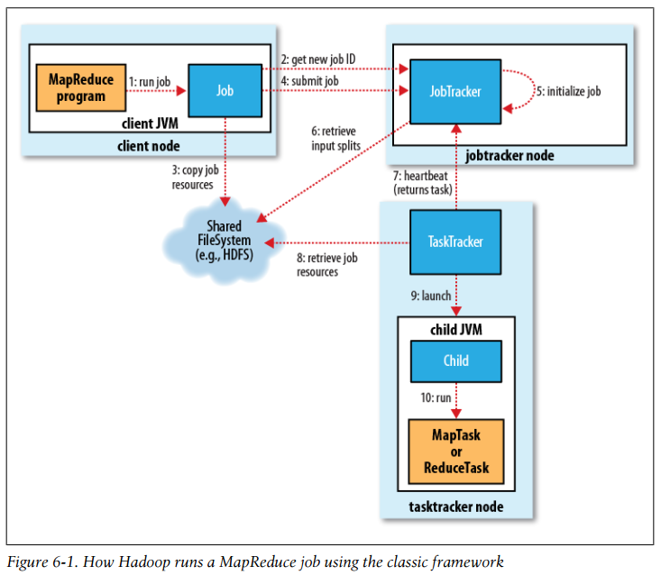
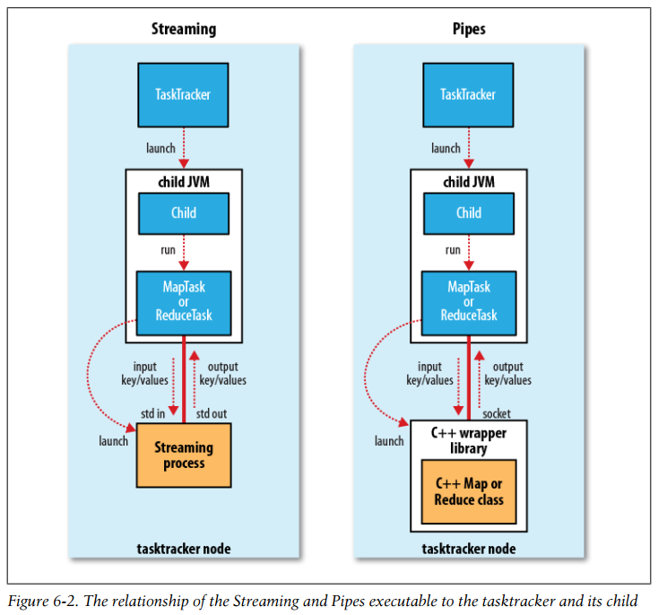
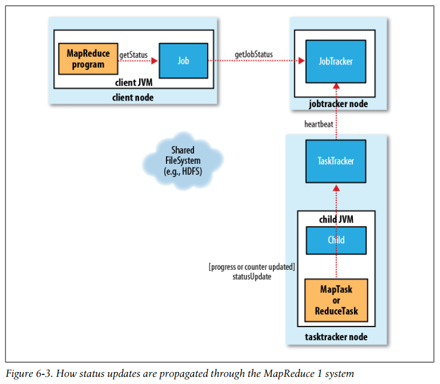
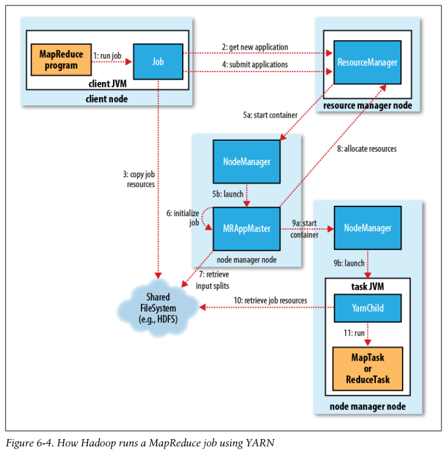
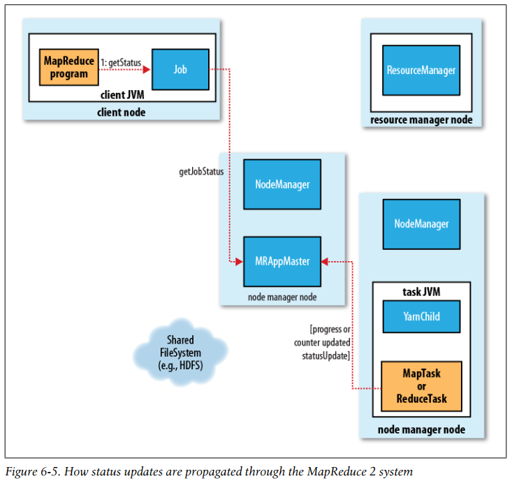
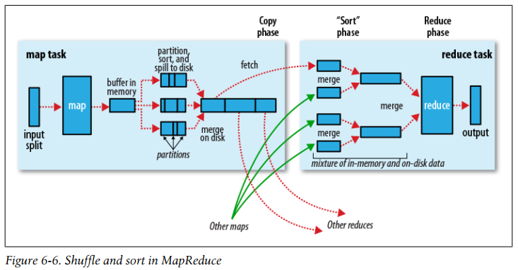
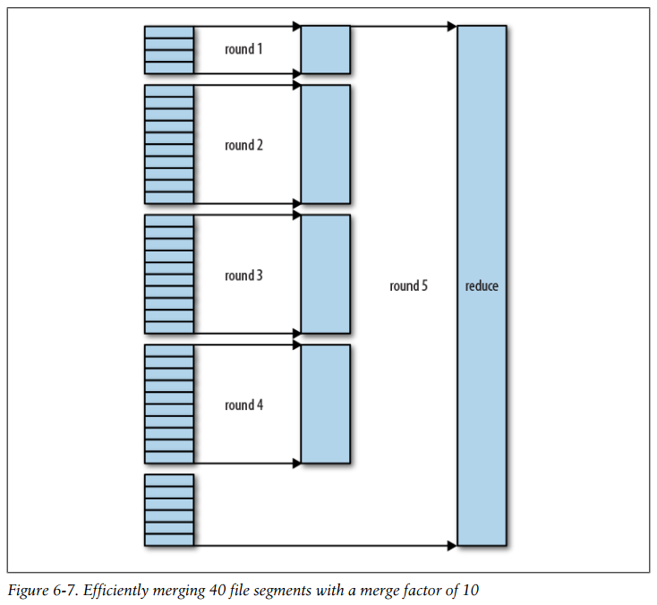

## Chapter 06: How MapReduce Works

- In Hadoop 2.0, a new MapReduce implementation was introduced. The new implementation (called MapReduce 2) is built on a system called YARN. For now, just note that the framework that is used for execution is set by the mapreduce.framework.name property, which takes the values local (for the local job runner), classic (for the “classic” MapReduce framework, also called MapReduce 1, which uses a jobtracker and tasktrackers), and yarn (for the new framework).

- How Hadoop runs a MapReduce job using the classic framework  
  

- The job submission process implemented by JobSummitter does the following:
	- Asks the jobtracker for a new job ID (by calling getNewJobId() on JobTracker).
	- Checks the output specification of the job.
	- Computes the input splits for the job.
	- Copies the resources needed to run the job, including the job JAR file, the configuration file, and the computed input splits, to the jobtracker’s filesystem in a directory named after the job ID.
	- Tells the jobtracker that the job is ready for execution by calling submitJob() on JobTracker.

- In addition to the map and reduce tasks, two further tasks are created: a job setup task and a job cleanup task. These are run by tasktrackers and are used to run code to set up the job before any map tasks run, and to cleanup after all the reduce tasks are complete.

- Tasktrackers run a simple loop that periodically sends heartbeat method calls to the jobtracker. Heartbeats tell the jobtracker that a tasktracker is alive, but they also double as a channel for messages. As a part of the heartbeat, a tasktracker will indicate whether it is ready to run a new task, and if it is, the jobtracker will allocate it a task, which it communicates to the tasktracker using the heartbeat return value.

	To choose a reduce task, the jobtracker simply takes the next in its list of yet-to-be-run reduce tasks, since there are no data locality considerations. For a map task, however, it takes into account the tasktracker’s network location and picks a task whose input split is as close as possible to the tasktracker.

- TaskRunner launches a new Java Virtual Machine to run each task in, so that any bugs in the user-defined map and reduce functions don’t affect the tasktracker (by causing it to crash or hang, for example). However, it is possible to reuse the JVM between tasks.

	The child process communicates with its parent through the umbilical interface. It informs the parent of the task’s progress every few seconds until the task is complete.

	Both Streaming and Pipes run special map and reduce tasks for the purpose of launching the user-supplied executable and communicating with it. In the case of Streaming, the Streaming task communicates with the process (which may be written in any language) using standard input and output streams. The Pipes task, on the other hand, listens on a socket and passes the C++ process a port number in its environment so that on startup, the C++ process can establish a persistent socket connection back to the parent Java Pipes task.

- The relationship of the Streaming and Pipes executable to the tasktracker and its child  
  

- A job and each of its tasks have a status, which includes such things as the state of the job or task (e.g., running, successfully completed, failed), the progress of maps and reduces, the values of the job’s counters, and a status message or description (which may be set by user code).

	When a task is running, it keeps track of its progress, that is, the proportion of the task completed. For map tasks, this is the proportion of the input that has been processed. For reduce tasks, it’s a little more complex, but the system can still estimate the proportion of the reduce input processed. It does this by dividing the total progress into three parts, corresponding to the three phases of the shuffle.

	If a task reports progress, it sets a flag to indicate that the status change should be sent to the tasktracker. The flag is checked in a separate thread every three seconds, and if set, it notifies the tasktracker of the current task status. Meanwhile, the tasktracker is sending heartbeats to the jobtracker every five seconds (this is a minimum, as the heartbeat interval is actually dependent on the size of the cluster; for larger clusters, the interval is longer), and the status of all the tasks being run by the tasktracker is sent in the call. Counters are sent less frequently than every five seconds because they can be relatively high-bandwidth.

	The jobtracker combines these updates to produce a global view of the status of all the jobs being run and their constituent tasks. Finally, as mentioned earlier, the Job receives the latest status by polling the jobtracker every second. Clients can also use Job’s getStatus() method to obtain a JobStatus instance, which contains all of the status information for the job.

- All of the following operations constitute progress:
	- Reading an input record (in a mapper or reducer)
	- Writing an output record (in a mapper or reducer)
	- Setting the status description on a reporter (using Reporter’s setStatus() method)
	- Incrementing a counter (using Reporter’s incrCounter() method)
	- Calling Reporter’s progress() method

- How status updates are propagated through the MapReduce 1 system  
  

- When the jobtracker receives a notification that the last task for a job is complete (this will be the special job cleanup task), it changes the status for the job to “successful.”

	The jobtracker also sends an HTTP job notification if it is configured to do so.

- In 2010 a group at Yahoo! began to design the next generation of MapReduce. The result was YARN, short for Yet Another Resource Negotiator (or if you prefer recursive acronyms, YARN Application Resource Negotiator).

	YARN remedies the scalability shortcomings of “classic” MapReduce by splitting the responsibilities of the jobtracker into separate entities. The jobtracker takes care of both job scheduling (matching tasks with tasktrackers) and task progress monitoring (keeping track of tasks, restarting failed or slow tasks, and doing task bookkeeping, such as maintaining counter totals).

	YARN separates these two roles into two independent daemons: a resource manager to manage the use of resources across the cluster and an application master to manage the lifecycle of applications running on the cluster. The idea is that an application master negotiates with the resource manager for cluster resources—described in terms of a number of containers, each with a certain memory limit—and then runs application-specific processes in those containers. The containers are overseen by node managers running on cluster nodes, which ensure that the application does not use more resources than it has been allocated.

- How Hadoop runs a MapReduce job using YARN  
  

- The new job ID is retrieved from the resource manager (rather than the jobtracker), although in the nomenclature of YARN, it is an application ID. The job client checks the output specification of the job; computes input splits; and copies job resources to HDFS. Finally, the job is submitted by calling submitApplication() on the resource manager.

- When the resource manager receives a call to its submitApplication(), it hands off the request to the scheduler. The scheduler allocates a container, and the resource manager then launches the application master’s process there, under the node manager’s management.

	The application master for MapReduce jobs is a Java application whose main class is MRAppMaster. It initializes the job by creating a number of bookkeeping objects to keep track of the job’s progress, as it will receive progress and completion reports from the tasks. Next, it retrieves the input splits computed in the client from the shared filesystem. It then creates a map task object for each split, as well as a number of reduce task objects determined by the mapreduce.job.reduces property.

	The next thing the application master does is decide how to run the tasks that make up the MapReduce job. If the job is small, the application master may choose to run the tasks in the same JVM as itself.

	Before any tasks can be run, the job setup method is called (for the job’s OutputCommitter) to create the job’s output directory.

- If the job does not qualify for running as an uber task, then the application master requests containers for all the map and reduce tasks in the job from the resource manager. All requests, which are piggybacked on heartbeat calls, includes information about each map task’s data locality, in particular the hosts and corresponding racks that the input split resides on. The scheduler uses this information to make scheduling decisions (just like a jobtracker’s scheduler does). It attempts to place tasks on data-local nodes in the ideal case, but if this is not possible, the scheduler prefers rack-local placement to nonlocal placement.

	Requests also specify memory requirements for tasks. By default, both map and reduce tasks are allocated 1024 MB of memory.

	The way memory is allocated is different from MapReduce 1, where tasktrackers have a fixed number of “slots,” set at cluster configuration time, and each task runs in a single slot. Slots have a maximum memory allowance, which again is fixed for a cluster, leading to both problems of underutilization when tasks use less memory (because other waiting tasks are not able to take advantage of the unused memory) and problems of job failure when a task can’t complete since it can’t get enough memory to run correctly and therefore can’t complete.

	In YARN, resources are more fine-grained, so both of these problems can be avoided. In particular, applications may request a memory capability that is anywhere between the minimum allocation and a maximum allocation, and that must be a multiple of the minimum allocation.

- Once a task has been assigned a container by the resource manager’s scheduler, the application master starts the container by contacting the node manager. The task is executed by a Java application whose main class is YarnChild. Before it can run the task it localizes the resources that the task needs, including the job configuration and JAR file, and any files from the distributed cache. Finally, it runs the map or reduce task.

- When running under YARN, the task reports its progress and status (including counters) back to its application master, which has an aggregate view of the job, every three seconds over the umbilical interface.

	The client polls the application master every second to receive progress updates, which are usually displayed to the user.

- How status updates are propagated through the MapReduce 2 system  
  

- As well as polling the application master for progress, every five seconds the client checks whether the job has completed by calling the waitForCompletion() method on Job.

	Notification of job completion via an HTTP callback is also supported, as it is in MapReduce 1.

	On job completion, the application master and the task containers clean up their working state, and the OutputCommitter’s job cleanup method is called. Job information is archived by the job history server to enable later interrogation by users if desired.

- When the jobtracker is notified of a task attempt that has failed (by the tasktracker’s heartbeat call), it will reschedule execution of the task. The jobtracker will try to avoid rescheduling the task on a tasktracker where it has previously failed. Furthermore, if a task fails four times (or more), it will not be retried again.

	A task attempt may also be killed, which is different from failing. A task attempt may be killed because it is a speculative duplicate, or because the tasktracker it was running on failed and the jobtracker marked all the task attempts running on it as killed. Killed task attempts do not count against the number of attempts to run the task, because it wasn’t the task’s fault that an attempt was killed.

- Failure of a tasktracker is another failure mode. If a tasktracker fails by crashing or running very slowly, it will stop sending heartbeats to the jobtracker (or send them very infrequently). The jobtracker will notice a tasktracker that has stopped sending heartbeats if it hasn’t received one for 10 minutes and remove it from its pool of tasktrackers to schedule tasks on.

	A tasktracker can also be blacklisted by the jobtracker, even if the tasktracker has not failed. If more than four tasks from the same job fail on a particular tasktracker, the jobtracker records this as a fault. A tasktracker is blacklisted if the number of faults is over some minimum threshold and is significantly higher than the average number of faults for tasktrackers in the cluster.

- Failure of the jobtracker is the most serious failure mode. Hadoop has no mechanism for dealing with jobtracker failure—it is a single point of failure—so in this case all running jobs fail. However, this failure mode is unlikely because the chance of a particular machine failing is low. The good news is that the situation is improved with YARN, since one of its design goals is to eliminate single points of failure in MapReduce.

- An application master sends periodic heartbeats to the resource manager, and in the event of application master failure, the resource manager will detect the failure and start a new instance of the master running in a new container (managed by a node manager).

	The client polls the application master for progress reports; if its application master fails, the client needs to locate the new instance.

- Node managers may be blacklisted if the number of failures for the application is high. Blacklisting is done by the application master, and for MapReduce the application master will try to reschedule tasks on different nodes if more than three tasks fail on a node manager.

- After a crash, a new resource manager instance is brought up (by an administrator), and it recovers from the saved state. The state consists of the node managers in the system as well as the running applications. (Note that tasks are not part of the resource manager’s state, since they are managed by the application master. Thus the amount of state to be stored is much more manageable than that of the jobtracker.)

- The Fair Scheduler aims to give every user a fair share of the cluster capacity over time.

	Jobs are placed in pools, and by default, each user gets her own pool. A user who submits more jobs than a second user will not get any more cluster resources than the second, on average.

	The Fair Scheduler supports preemption, so if a pool has not received its fair share for a certain period of time, the scheduler will kill tasks in pools running over capacity in order to give more slots to the pool running under capacity.

- The Capacity Scheduler takes a slightly different approach to multiuser scheduling. A cluster is made up of a number of queues (like the Fair Scheduler’s pools), which may be hierarchical (so a queue may be the child of another queue), and each queue has an allocated capacity. This is like the Fair Scheduler, except that within each queue, jobs are scheduled using FIFO scheduling (with priorities).

- MapReduce makes the guarantee that the input to every reducer is sorted by key. The process by which the system performs the sort—and transfers the map outputs to the reducers as inputs—is known as the shuffle.

- Shuffle and sort in MapReduce  
  

- Each map task has a circular memory buffer that it writes the output to. When the contents of the buffer reaches a certain threshold size, a background thread will start to spill the contents to disk. Map outputs will continue to be written to the buffer while the spill takes place, but if the buffer fills up during this time, the map will block until the spill is complete.

	Before it writes to disk, the thread first divides the data into partitions corresponding to the reducers that they will ultimately be sent to. Within each partition, the background thread performs an in-memory sort by key, and if there is a combiner function, it is run on the output of the sort. Running the combiner function makes for a more compact map output, so there is less data to write to local disk and to transfer to the reducer.

- The map output file is sitting on the local disk of the machine that ran the map task. The map tasks may finish at different times, so the reduce task starts copying their outputs as soon as each completes. This is known as the copy phase of the reduce task.

	The map outputs are copied to the reduce task JVM’s memory if they are small enough; otherwise, they are copied to disk. When the in-memory buffer reaches a threshold size or reaches a threshold number of map outputs, it is merged and spilled to disk. If a combiner is specified, it will be run during the merge to reduce the amount of data written to disk.

	When all the map outputs have been copied, the reduce task moves into the sort phase (which should properly be called the merge phase, as the sorting was carried out on the map side), which merges the map outputs, maintaining their sort ordering.

	Rather than have a final round that merges these five files into a single sorted file, the merge saves a trip to disk by directly feeding the reduce function in what is the last phase: the reduce phase. This final merge can come from a mixture of in-memory and on-disk segments.

	During the reduce phase, the reduce function is invoked for each key in the sorted output. The output of this phase is written directly to the output filesystem, typically HDFS. In the case of HDFS, because the tasktracker node (or node manager) is also running a datanode, the first block replica will be written to the local disk.

- As map tasks complete successfully, they notify their parent tasktracker of the status update, which in turn notifies the jobtracker. (In MapReduce 2, the tasks notify their application master directly.) These notifications are transmitted over the heartbeat communication mechanism described earlier. Therefore, for a given job, the jobtracker (or application master) knows the mapping between map outputs and hosts. A thread in the reducer periodically asks the master for map output hosts until it has retrieved them all.

- The number of files merged in each round is actually more subtle than this example suggests. The goal is to merge the minimum number of files to get to the merge factor for the final round.

	Note that this does not change the number of rounds; it’s just an optimization to minimize the amount of data that is written to disk, since the final round always merges directly into the reduce.

- Efficiently merging 40 file segments with a merge factor of 10  
  

- The general principle is to give the shuffle as much memory as possible. However, there is a trade-off, in that you need to make sure that your map and reduce functions get enough memory to operate.

	On the map side, the best performance can be obtained by avoiding multiple spills to disk; one is optimal.

	On the reduce side, the best performance is obtained when the intermediate data can reside entirely in memory. 

- When a job consists of hundreds or thousands of tasks, the possibility of a few straggling tasks is very real.

	Hadoop doesn’t try to diagnose and fix slow-running tasks; instead, it tries to detect when a task is running slower than expected and launches another equivalent task as a backup. This is termed speculative execution of tasks.

- Hadoop MapReduce uses a commit protocol to ensure that jobs and tasks either succeed or fail cleanly. The behavior is implemented by the OutputCommitter in use for the job.

- The OutputCommitter API is as follows (in both old and new MapReduce APIs):
    ```java
    public abstract class OutputCommitter {
      public abstract void setupJob(JobContext jobContext) throws IOException;
      public void commitJob(JobContext jobContext) throws IOException {}
      public void abortJob(JobContext jobContext, JobStatus.State state) throws IOException {}
      public abstract void setupTask(TaskAttemptContext taskContext) throws IOException;
      public abstract boolean needsTaskCommit(TaskAttemptContext taskContext) throws IOException;
      public abstract void commitTask(TaskAttemptContext taskContext) throws IOException;
      public abstract void abortTask(TaskAttemptContext taskContext) throws IOException;
    }
    ```

	The setupJob() method is called before the job is run, and is typically used to perform initialization.

	If the job succeeds, the commitJob() method is called, which in the default file-based implementation deletes the temporary working space and creates a hidden empty marker file in the output directory called _SUCCESS to indicate to filesystem clients that the job completed successfully. If the job did not succeed, abortJob() is called with a state object indicating whether the job failed or was killed (by a user, for example). In the default implementation, this will delete the job’s temporary working space.

	The operations are similar at the task level. The setupTask() method is called before the task is run, and the default implementation doesn’t do anything, because temporary directories named for task outputs are created when the task outputs are written.

	The commit phase for tasks is optional and may be disabled by returning false from needsTaskCommit(). This saves the framework from having to run the distributed commit protocol for the task, and neither commitTask() nor abortTask() is called.

	FileOutputCommitter will skip the commit phase when no output has been written by a task.

	If a task succeeds, commitTask() is called, which in the default implementation moves the temporary task output directory (which has the task attempt ID in its name to avoid conflicts between task attempts) to the final output path, ${mapred.output.dir}. Otherwise, the framework calls abortTask(), which deletes the temporary task output directory.

- The usual way of writing output from map and reduce tasks is by using the OutputCollector to collect key-value pairs. Some applications need more flexibility than a single key-value pair model, so these applications write output files directly from the map or reduce task to a distributed filesystem, such as HDFS.

	Care needs to be taken to ensure that multiple instances of the same task don’t try to write to the same file. As we saw in the previous section, the OutputCommitter protocol solves this problem.

- Jobs that have a large number of very short-lived tasks (these are usually map tasks) or that have a lengthy initialization can see performance gains when the JVM is reused for subsequent tasks.

- The best way to handle corrupt records is in your mapper or reducer code. You can detect the bad record and ignore it, or you can abort the job by throwing an exception. You can also count the total number of bad records in the job using counters to see how widespread the problem is.

	When skipping mode is enabled, tasks report the records being processed back to the tasktracker. When the task fails, the tasktracker retries the task, skipping the records that caused the failure. Because of the extra network traffic and bookkeeping to maintain the failed record ranges, skipping mode is turned on for a task only after it has failed twice.

	It’s important to note that skipping mode can detect only one bad record per task attempt, so this mechanism is appropriate only for detecting occasional bad records (a few per task, say). You may need to increase the maximum number of task attempts to give skipping mode enough attempts to detect and skip all the bad records in an input split.