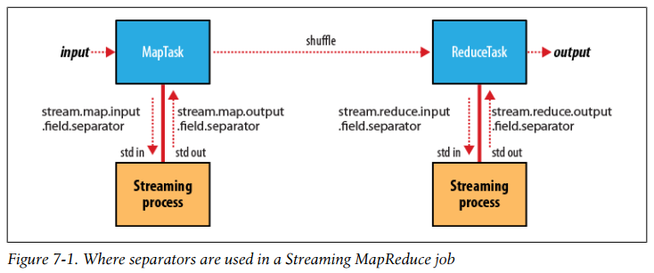
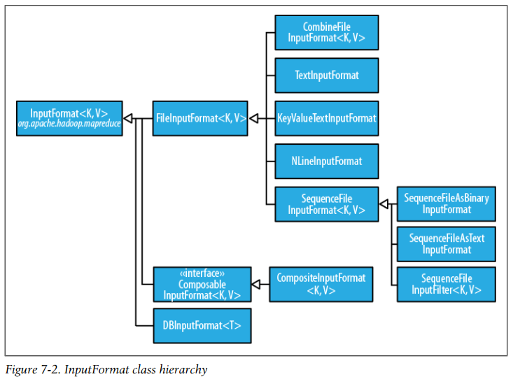
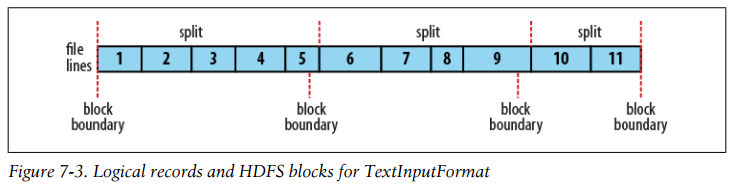
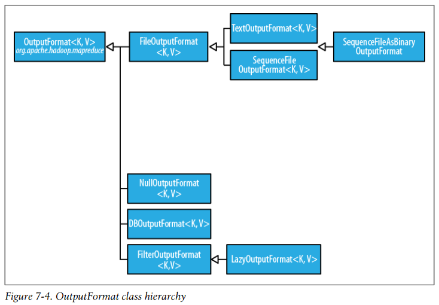

## Chapter 07: MapReduce Types and Formats

- The map and reduce functions in Hadoop MapReduce have the following general form:
  ```
  map: (K1, V1) → list(K2, V2)
  reduce: (K2, list(V2)) → list(K3, V3)
  ```

- If a combine function is used, then it is the same form as the reduce function (and is an implementation of Reducer), except its output types are the intermediate key and value types (K2 and V2), so they can feed the reduce function:
  ```
  map: (K1, V1) → list(K2, V2)
  combine: (K2, list(V2)) → list(K2, V2)
  reduce: (K2, list(V2)) → list(K3, V3)
  ```

- The partition function operates on the intermediate key and value types (K2 and V2) and returns the partition index. In practice, the partition is determined solely by the key (the value is ignored):
  ```
  partition: (K2, V2) → integer
  ```

- Input types are set by the input format. If not set explicitly, the intermediate types default to the (final) output types.

	It may seem strange that these methods for setting the intermediate and final output types exist at all. After all, why can’t the types be determined from a combination of the mapper and the reducer? The answer has to do with a limitation in Java generics: type erasure means that the type information isn’t always present at runtime, so Hadoop has to be given it explicitly. This also means that it’s possible to configure a MapReduce job with incompatible types, because the configuration isn’t checked at compile time.

- In Streaming, the default job is similar, but not identical, to the Java equivalent. The minimal form is:
  ```bash
  % hadoop jar $HADOOP_INSTALL/contrib/streaming/hadoop-*-streaming.jar \
    -input input/ncdc/sample.txt \
    -output output \
    -mapper /bin/cat
  ```

	Notice that you have to supply a mapper; the default identity mapper will not work. The reason has to do with the default input format, TextInputFormat, which generates LongWritable keys and Text values. However, Streaming output keys and values (including the map keys and values) are always both of type Text. The identity mapper cannot change LongWritable keys to Text keys, so it fails.

	When we specify a non-Java mapper and the input format is TextInputFormat, Streaming does something special. It doesn’t pass the key to the mapper process; it just passes the value. (For other input formats, the same effect can be achieved by setting stream.map.input.ignoreKey to true.)

- Where separators are used in a Streaming MapReduce job  
  

- Input splits are represented by the Java class InputSplit (which, like all of the classes mentioned in this section, is in the org.apache.hadoop.mapreduce package):
  ```java
  public abstract class InputSplit {
    public abstract long getLength() throws IOException, InterruptedException;
    public abstract String[] getLocations() throws IOException, InterruptedException;
  }
  ```

	An InputSplit has a length in bytes and a set of storage locations, which are just hostname strings. Notice that a split doesn’t contain the input data; it is just a reference to the data. The storage locations are used by the MapReduce system to place map tasks as close to the split’s data as possible, and the size is used to order the splits so that the largest get processed first, in an attempt to minimize the job runtime (this is an instance of a greedy approximation algorithm).

	As a MapReduce application writer, you don’t need to deal with InputSplits directly, as they are created by an InputFormat. An InputFormat is responsible for creating the input splits and dividing them into records. Before we see some concrete examples of InputFormat, let’s briefly examine how it is used in MapReduce. Here’s the interface:
  ```java
  public abstract class InputFormat<K, V> {
    public abstract List<InputSplit> getSplits(JobContext context)
        throws IOException, InterruptedException;
      public abstract RecordReader<K, V> 
          createRecordReader(InputSplit split, TaskAttemptContext context)
          throws IOException, InterruptedException;
  }
  ```

	The client running the job calculates the splits for the job by calling getSplits(), then sends them to the jobtracker, which uses their storage locations to schedule map tasks that will process them on the tasktrackers. On a tasktracker, the map task passes the split to the createRecordReader() method on InputFormat to obtain a RecordReader for that split. A RecordReader is little more than an iterator over records, and the map task uses one to generate record key-value pairs, which it passes to the map function. We can see this by looking at the Mapper’s run() method:
  ```java
  public void run(Context context) throws IOException, InterruptedException {
    setup(context);
    while (context.nextKeyValue()) {
      map(context.getCurrentKey(), context.getCurrentValue(), context);
    }
    cleanup(context);
  }
  ```

- For reasons of efficiency Record Reader implementations will return the same key and value objects on each call to getCurrentKey() and getCurrentValue(). Only the contents of these objects are changed by the reader’s nextKeyValue() method. This can be a surprise to users, who might expect keys and values to be immutable, and not to be reused. This causes problems when a reference to a key or value object is retained outside the map() method, as its value can change without warning. If you need to do this, make a copy of the object you want to hold on to. For example, for a Text object, you can use its copy constructor: new Text(value).

- InputFormat class hierarchy  
  

- A path may represent a file, a directory, or, by using a glob, a collection of files and directories. A path representing a directory includes all the files in the directory as input to the job.

- Hadoop works better with a small number of large files than a large number of small files. One reason for this is that FileInputFormat generates splits in such a way that each split is all or part of a single file. If the file is very small (“small” means significantly smaller than an HDFS block) and there are a lot of them, each map task will process very little input, and there will be a lot of them (one per file), each of which imposes extra bookkeeping overhead.

	The situation is alleviated somewhat by CombineFileInputFormat, which was designed to work well with small files. Where FileInputFormat creates a split per file, CombineFileInputFormat packs many files into each split so that each mapper has more to process.

	One technique for avoiding the many small files case is to merge small files into larger files by using a SequenceFile; with this approach, the keys can act as filenames (or a constant such as NullWritable, if not needed) and the values as file contents.

- There are a couple of ways to ensure that an existing file is not split. The first (quick and dirty) way is to increase the minimum split size to be larger than the largest file in your system. Setting it to its maximum value, Long.MAX_VALUE, has this effect. The second is to subclass the concrete subclass of FileInputFormat that you want to use, to override the isSplitable() method to return false.

- A related requirement that sometimes crops up is for mappers to have access to the full contents of a file. Not splitting the file gets you part of the way there, but you also need to have a RecordReader that delivers the file contents as the value of the record.

	An InputFormat for reading a whole file as a record
  ```java
  public class WholeFileInputFormat extends FileInputFormat<NullWritable, BytesWritable> {
    @Override
    protected boolean isSplitable(JobContext context, Path file) {
      return false;
    }
    @Override
    public RecordReader<NullWritable, BytesWritable> createRecordReader(
        InputSplit split, TaskAttemptContext context) throws IOException, InterruptedException {
      WholeFileRecordReader reader = new WholeFileRecordReader();
      reader.initialize(split, context);
      return reader;
    }
  }
  ```

	The RecordReader used by WholeFileInputFormat for reading a whole file as a record
  ```java
  class WholeFileRecordReader extends RecordReader<NullWritable, BytesWritable> {
    private FileSplit fileSplit;
    private Configuration conf;
    private BytesWritable value = new BytesWritable();
    private boolean processed = false;
    @Override
    public void initialize(InputSplit split, TaskAttemptContext context)
        throws IOException, InterruptedException {
      this.fileSplit = (FileSplit) split;
      this.conf = context.getConfiguration();
    }
    @Override
    public boolean nextKeyValue() throws IOException, InterruptedException {
      if (!processed) {
        byte[] contents = new byte[(int) fileSplit.getLength()];
        Path file = fileSplit.getPath();
        FileSystem fs = file.getFileSystem(conf);
        FSDataInputStream in = null;
        try {
          in = fs.open(file);
          IOUtils.readFully(in, contents, 0, contents.length);
          value.set(contents, 0, contents.length);
        } finally {
          IOUtils.closeStream(in);
        }
        processed = true;
        return true;
      }
      return false;
    }
    @Override
    public NullWritable getCurrentKey() throws IOException, InterruptedException {
      return NullWritable.get();
    }
    @Override
    public BytesWritable getCurrentValue() throws IOException, InterruptedException {
      return value;
    }
    @Override
    public float getProgress() throws IOException {
      return processed ? 1.0f : 0.0f;
    }
    @Override
    public void close() throws IOException {
      // do nothing
    }
  }
  ```

- TextInputFormat is the default InputFormat. Each record is a line of input. The key, a LongWritable, is the byte offset within the file of the beginning of the line. The value is the contents of the line, excluding any line terminators (e.g., newline or carriage return), and is packaged as a Text object. So a file containing the following text:
  ```
  On the top of the Crumpetty Tree
  The Quangle Wangle sat,
  But his face you could not see,
  On account of his Beaver Hat.
  ```

	is divided into one split of four records. The records are interpreted as the following key-value pairs:
  ```
  (0, On the top of the Crumpetty Tree)
  (33, The Quangle Wangle sat,)
  (57, But his face you could not see,)
  (89, On account of his Beaver Hat.)
  ```

	Clearly, the keys are not line numbers. This would be impossible to implement in general, in that a file is broken into splits at byte, not line, boundaries.

	However, the offset within the file of each line is known by each split independently of the other splits, since each split knows the size of the preceding splits and just adds this onto the offsets within the split to produce a global file offset.

- A TextInputFormat’s logical records are lines, which will cross HDFS boundaries more often than not. This has no bearing on the functioning of your program—lines are not missed or broken, for example—but it’s worth knowing about because it does mean that data-local maps (that is, maps that are running on the same host as their input data) will perform some remote reads. The slight overhead this causes is not normally significant.

- Logical records and HDFS blocks for TextInputFormat  
  

- It is common for each line in a file to be a key-value pair, separated by a delimiter such as a tab character. To interpret such files correctly, KeyValueTextInputFormat is appropriate.

	Consider the following input file, where → represents a (horizontal) tab character:
  ```
  line1→On the top of the Crumpetty Tree
  line2→The Quangle Wangle sat,
  line3→But his face you could not see,
  line4→On account of his Beaver Hat.
  ```

	Like in the TextInputFormat case, the input is in a single split comprising four records, although this time the keys are the Text sequences before the tab in each line:
  ```
  (line1, On the top of the Crumpetty Tree)
  (line2, The Quangle Wangle sat,)
  (line3, But his face you could not see,)
  (line4, On account of his Beaver Hat.)
  ```

- If you want your mappers to receive a fixed number of lines of input, then NLineInputFormat is the InputFormat to use. 

	By way of example, consider these four lines again:
  ```
  On the top of the Crumpetty Tree
  The Quangle Wangle sat,
  But his face you could not see,
  On account of his Beaver Hat.
  ```

	If, for example, N is two, then each split contains two lines. One mapper will receive the first two key-value pairs:
  ```
  (0, On the top of the Crumpetty Tree)
  (33, The Quangle Wangle sat,)
  ```

	And another mapper will receive the second two key-value pairs:
  ```
  (57, But his face you could not see,)
  (89, On account of his Beaver Hat.)
  ```

	Usually, having a map task for a small number of lines of input is inefficient (due to the overhead in task setup), but there are applications that take a small amount of input data and run an extensive (that is, CPU-intensive) computation for it, then emit their output. Simulations are a good example. By creating an input file that specifies input parameters, one per line, you can perform a parameter sweep: run a set of simulations in parallel to find how a model varies as the parameter changes.

	Another example is using Hadoop to bootstrap data loading from multiple data sources, such as databases. You create a “seed” input file that lists the data sources, one per line. Then each mapper is allocated a single data source, and it loads the data from that source into HDFS.

- Large XML documents that are composed of a series of “records” (XML document fragments) can be broken into these records using simple string or regular-expression matching to find the start and end tags of records. This alleviates the problem when the document is split by the framework because the next start tag of a record is easy to find by simply scanning from the start of the split, just like TextInputFormat finds newline boundaries.

	Hadoop comes with a class for this purpose called StreamXmlRecordReader (which is in the org.apache.hadoop.streaming package, although it can be used outside of Streaming). You can use it by setting your input format to StreamInputFormat and setting the stream.recordreader.class property to org.apache.hadoop.streaming.StreamXmlRecordReader. The reader is configured by setting job configuration properties to tell it the patterns for the start and end tags.

- Hadoop’s sequence file format stores sequences of binary key-value pairs. Sequence files are well suited as a format for MapReduce data because they are splittable (they have sync points so that readers can synchronize with record boundaries from an arbitrary point in the file, such as the start of a split), they support compression as a part of the format, and they can store arbitrary types using a variety of serialization frameworks.

	To use data from sequence files as the input to MapReduce, you use SequenceFileInputFormat. The keys and values are determined by the sequence file, and you need to make sure that your map input types correspond.

- SequenceFileAsTextInputFormat is a variant of SequenceFileInputFormat that converts the sequence file’s keys and values to Text objects. The conversion is performed by calling toString() on the keys and values.

- SequenceFileAsBinaryInputFormat is a variant of SequenceFileInputFormat that retrieves the sequence file’s keys and values as opaque binary objects. They are encapsulated as BytesWritable objects, and the application is free to interpret the underlying byte array as it pleases.

- Although the input to a MapReduce job may consist of multiple input files (constructed by a combination of file globs, filters, and plain paths), all of the input is interpreted by a single InputFormat and a single Mapper. What often happens, however, is that the data format evolves over time, so you have to write your mapper to cope with all of your legacy formats. Or you have data sources that provide the same type of data but in different formats. This arises in the case of performing joins of different datasets.

	These cases are handled elegantly by using the MultipleInputs class, which allows you to specify which InputFormat and Mapper to use on a per-path basis.
  ```java
  MultipleInputs.addInputPath(job, ncdcInputPath, 
      TextInputFormat.class, MaxTemperatureMapper.class);
  MultipleInputs.addInputPath(job, metOfficeInputPath,
      TextInputFormat.class, MetOfficeMaxTemperatureMapper.class);
  ```

- DBInputFormat is an input format for reading data from a relational database, using JDBC. Because it doesn’t have any sharding capabilities, you need to be careful not to overwhelm the database from which you are reading by running too many mappers. The corresponding output format is DBOutputFormat, which is useful for dumping job outputs (of modest size) into a database.

	HBase’s TableInputFormat is designed to allow a MapReduce program to operate on data stored in an HBase table. TableOutputFormat is for writing MapReduce outputs into an HBase table.

- OutputFormat class hierarchy  
  

- The default output format, TextOutputFormat, writes records as lines of text. Its keys and values may be of any type, since TextOutputFormat turns them to strings by calling toString() on them. Each key-value pair is separated by a tab character.

- As the name indicates, SequenceFileOutputFormat writes sequence files for its output. This is a good choice of output if it forms the input to a further MapReduce job, since it is compact and is readily compressed.

	SequenceFileAsBinaryOutputFormat is the counterpart to SequenceFileAsBinaryInputFormat, and it writes keys and values in raw binary format into a SequenceFile container.

	MapFileOutputFormat writes MapFiles as output. The keys in a MapFile must be added in order, so you need to ensure that your reducers emit keys in sorted order.

- Sometimes there is a need to have more control over the naming of the files or to produce multiple files per reducer. MapReduce comes with the MultipleOutputs class to help you do this.

	MultipleOutputs allows you to write data to files whose names are derived from the output keys and values, or in fact from an arbitrary string. This allows each reducer (or mapper in a map-only job) to create more than a single file.

- Partitioning whole dataset into files named by the station ID using MultipleOutputs
  ```java
  public class PartitionByStationUsingMultipleOutputs extends Configured implements Tool {
    // implementation elided
    static class MultipleOutputsReducer extends Reducer<Text, Text, NullWritable, Text> {
      private MultipleOutputs<NullWritable, Text> multipleOutputs;
      @Override
      protected void setup(Context context) throws IOException, InterruptedException {
        multipleOutputs = new MultipleOutputs<NullWritable, Text>(context);
      }
      @Override
      protected void reduce(Text key, Iterable<Text> values, Context context)
          throws IOException, InterruptedException {
        for (Text value : values) {
          multipleOutputs.write(NullWritable.get(), value, key.toString());
        }
      }
      @Override
      protected void cleanup(Context context) throws IOException, InterruptedException {
        multipleOutputs.close();
      }
    }
    // implementation elided
  }
  ```
	In the reducer, which is where we generate the output, we construct an instance of MultipleOutputs in the setup() method and assign it to an instance variable. We then use the MultipleOutputs instance in the reduce() method to write to the output, in place of the context. The write() method takes the key and value, as well as a name. We use the station identifier for the name, so the overall effect is to produce output files with the naming scheme station_identifier-r-nnnnn.

	The base path specified in the write() method of MultipleOutputs is interpreted relative to the output directory, and because it may contain file path separator characters (/), it’s possible to create subdirectories of arbitrary depth.

	MultipleOutputs delegates to the mapper’s OutputFormat, which in this example is a TextOutputFormat, but more complex setups are possible. For example, you can create named outputs, each with its own OutputFormat and key and value types (which may differ from the output types of the mapper or reducer). Furthermore, the mapper or reducer (or both) may write to multiple output files for each record processed.

- FileOutputFormat subclasses will create output (part-r-nnnnn) files, even if they are empty. Some applications prefer that empty files not be created, which is where Lazy OutputFormat helps. It is a wrapper output format that ensures that the output file is created only when the first record is emitted for a given partition.