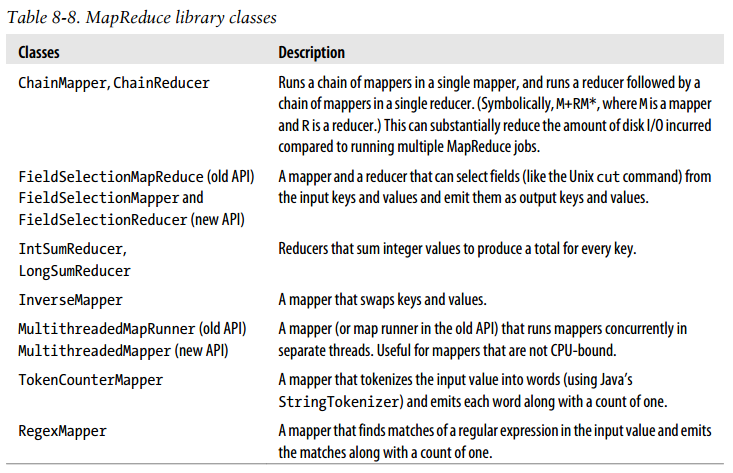

## Chapter 08: MapReduce Features

- Counters are a useful channel for gathering statistics about the job: for quality control or for application-level statistics.

- Built-in counter groups
	- MapReduce task counters
	- Filesystem counters
	- FileInputFormat counters
	- FileOutputFormat counters
	- Job counters

- Task counters gather information about tasks over the course of their execution, and the results are aggregated over all the tasks in a job. Task counters are maintained by each task attempt, and periodically sent to the tasktracker and then to the jobtracker so they can be globally aggregated.

- Job counters are maintained by the jobtracker (or application master in YARN), so they don’t need to be sent across the network, unlike all other counters, including user-defined ones. They measure job-level statistics, not values that change while a task is running.

- MapReduce allows user code to define a set of counters, which are then incremented as desired in the mapper or reducer. Counters are defined by a Java enum, which serves to group related counters. A job may define an arbitrary number of enums, each with an arbitrary number of fields. The name of the enum is the group name, and the enum’s fields are the counter names. Counters are global: the MapReduce framework aggregates them across all maps and reduces to produce a grand total at the end of the job.

	Application to run the maximum temperature job, including counting missing and malformed fields and quality codes
  ```java
  enum Temperature {
    MISSING,
    MALFORMED
  }

  static class MaxTemperatureMapperWithCounters
      extends Mapper<LongWritable, Text, Text, IntWritable> {
    @Override
    protected void map(LongWritable key, Text value, Context context)
        throws IOException, InterruptedException {
      if (parser.isValidTemperature()) {
      } else if (parser.isMalformedTemperature()) {
        context.getCounter(Temperature.MALFORMED).increment(1);
      } else if (parser.isMissingTemperature()) {
        context.getCounter(Temperature.MISSING).increment(1);
      }
      // dynamic counter
      context.getCounter("TemperatureQuality",
      parser.getQuality()).increment(1);
    }
  }
  ```

- The code makes use of a dynamic counter—one that isn’t defined by a Java enum. Because a Java enum’s fields are defined at compile time, you can’t create new counters on the fly using enums. Here we want to count the distribution of temperature quality codes, and though the format specification defines the values that the temperature quality code can take, it is more convenient to use a dynamic counter to emit the values that it actually takes. The method we use on the Reporter object takes a group and counter name using String names:
  ```java
  public void incrCounter(String group, String counter, long amount)
  ```

	The two ways of creating and accessing counters—using enums and using strings—are actually equivalent because Hadoop turns enums into strings to send counters over RPC.

- By default, a counter’s name is the enum’s fully qualified Java classname. These names are not very readable when they appear on the web UI or in the console, so Hadoop provides a way to change the display names using resource bundles.

	The recipe to provide readable names is as follows. Create a properties file named after the enum, using an underscore as a separator for nested classes. The properties file should be in the same directory as the top-level class containing the enum.

	The properties file should contain a single property named CounterGroupName, whose value is the display name for the whole group. Then each field in the enum should have a corresponding property defined for it, whose name is the name of the field suffixed with .name and whose value is the display name for the counter. Here are the contents of MaxTemperatureWithCounters_Temperature.properties:
  ```
  CounterGroupName=Air Temperature Records
  MISSING.name=Missing
  MALFORMED.name=Malformed
  ```

- In addition to being available via the web UI and the command line (using hadoop jobcounter), you can retrieve counter values using the Java API.

	First we retrieve a RunningJob object from a JobClient by calling the getJob() method with the job ID. We check whether there is actually a job with the given ID.

	After confirming that the job has completed, we call the RunningJob’s getCounters() method, which returns a Counters object, encapsulating all the counters for a job. The Counters class provides various methods for finding the names and values of counters.

- A Streaming MapReduce program can increment counters by sending a specially formatted line to the standard error stream, which is co-opted as a control channel in this case. The line must have the following format:
  ```
  reporter:counter:group,counter,amount
  ```

- The sort order for keys is controlled by a RawComparator, which is found as follows:
	- (1) If the property mapred.output.key.comparator.class is set, either explicitly or by calling setSortComparatorClass() on Job, then an instance of that class is used. (In the old API, the equivalent method is setOutputKeyComparatorClass() on JobConf.)
	- (2) Otherwise, keys must be a subclass of WritableComparable, and the registered comparator for the key class is used.
	- (3) If there is no registered comparator, then a RawComparator is used that deserializes the byte streams being compared into objects and delegates to the WritableCompar able’s compareTo() method.

- MapFileOutputFormat provides a pair of convenience static methods for performing lookups against MapReduce output.

	The getReaders() method opens a MapFile.Reader for each of the output files created by the MapReduce job. The getEntry() method then uses the partitioner to choose the reader for the key and finds the value for that key by calling Reader’s get() method.

	Retrieve the first entry with a given key from a collection of MapFiles
  ```java
  public class LookupRecordByTemperature
      extends Configured implements Tool {
    @Override
    public int run(String[] args) throws Exception {
      Reader[] readers = MapFileOutputFormat.getReaders(path, getConf());
      Partitioner<IntWritable, Text> partitioner =
          new HashPartitioner<IntWritable, Text>();
      Writable entry =
          MapFileOutputFormat.getEntry(readers, partitioner, key, val);
      ...
    }
  }
  ```

	We can also use the readers directly to get all the records for a given key. The array of readers that is returned is ordered by partition, so that the reader for a given key may be found using the same partitioner that was used in the MapReduce job.
  ```java
  Reader reader =
      readers[partitioner.getPartition(key, val, readers.length)];
  ```

	Once we have the reader, we get the first key using MapFile’s get() method, then repeatedly call next() to retrieve the next key and value until the key changes.

- It’s possible to get a fairly even set of partitions by sampling the key space. The idea behind sampling is that you look at a small subset of the keys to approximate the key distribution, which is then used to construct partitions. Luckily, we don’t have to write the code to do this ourselves, as Hadoop comes with a selection of samplers.

	The InputSampler class defines a nested Sampler interface whose implementations return a sample of keys given an InputFormat and Job:
  ```java
  public interface Sampler<K, V> {
    K[] getSample(InputFormat<K, V> inf, Job job)
        throws IOException, InterruptedException;
  }
  ```

	This interface usually is not called directly by clients. Instead, the writePartition File() static method on InputSampler is used, which creates a sequence file to store the keys that define the partitions:
  ```java
  public static <K, V>
      void writePartitionFile(Job job, Sampler<K, V> sampler)
      throws IOException, ClassNotFoundException, InterruptedException
  ```

	The sequence file is used by TotalOrderPartitioner to create partitions for the sort job.

- A MapReduce program for sorting a SequenceFile with IntWritable keys using the TotalOrderPartitioner to globally sort the data
  ```java
  public class SortByTemperatureUsingTotalOrderPartitioner
      extends Configured implements Tool {
    @Override
    public int run(String[] args) throws Exception {
      ...
      job.setPartitionerClass(TotalOrderPartitioner.class);
      InputSampler.Sampler<IntWritable, Text> sampler =
          new InputSampler.RandomSampler<IntWritable, Text>(0.1, 10000, 10);
      InputSampler.writePartitionFile(job, sampler);
      // Add to DistributedCache
      Configuration conf = job.getConfiguration();
      String partitionFile =TotalOrderPartitioner.getPartitionFile(conf);
      URI partitionUri =
          new URI(partitionFile + "#" + TotalOrderPartitioner.DEFAULT_PATH);
      DistributedCache.addCacheFile(partitionUri, conf);
      DistributedCache.createSymlink(conf);
      return job.waitForCompletion(true) ? 0 : 1;
    }
  }
  ```

	We use a RandomSampler, which chooses keys with a uniform probability. There are also parameters for the maximum number of samples to take and the maximum number of splits to sample, and the sampler stops when the first of these limits is met.

	The InputSampler writes a partition file that we need to share with the tasks running on the cluster by adding it to the distributed cache.

- Your input data determines the best sampler to use. For example, SplitSampler, which samples only the first n records in a split, is not so good for sorted data, because it doesn’t select keys from throughout the split.

	On the other hand, IntervalSampler chooses keys at regular intervals through the split and makes a better choice for sorted data. RandomSampler is a good general-purpose sampler. If none of these suits your application (and remember that the point of sampling is to produce partitions that are approximately equal in size), you can write your own implementation of the Sampler interface.

	One of the nice properties of InputSampler and TotalOrderPartitioner is that you are free to choose the number of partitions. This choice is normally driven by the number of reducer slots in your cluster (choose a number slightly fewer than the total, to allow for failures). However, TotalOrderPartitioner will work only if the partition boundaries are distinct. One problem with choosing a high number is that you may get collisions if you have a small key space.

- To summarize, there is a recipe here to get the effect of sorting by value:
	- Make the key a composite of the natural key and the natural value.
	- The sort comparator should order by the composite key, that is, the natural key and natural value.
	- The partitioner and grouping comparator for the composite key should consider only the natural key for partitioning and grouping.

- Application to find the maximum temperature by sorting temperatures in the key
  ```java
  public class MaxTemperatureUsingSecondarySort
      extends Configured implements Tool {

    static class MaxTemperatureMapper
        extends Mapper<LongWritable, Text, IntPair, NullWritable> {
      @Override
      protected void map(LongWritable key, Text value, Context context)
          throws IOException, InterruptedException {
        context.write(new IntPair(parser.getYearInt(),
            parser.getAirTemperature()), NullWritable.get());
      }
    }

    static class MaxTemperatureReducer
        extends Reducer<IntPair, NullWritable, IntPair, NullWritable> {
      @Override
      protected void reduce(IntPair key, Iterable<NullWritable> values,
          Context context) throws IOException, InterruptedException {
        context.write(key, NullWritable.get());
      }
    }

    public static class FirstPartitioner
        extends Partitioner<IntPair, NullWritable> {
      @Override
      public int getPartition(IntPair key, NullWritable value,
          int numPartitions) {
        return Math.abs(key.getFirst() * 127) % numPartitions;
      }
    }

    public static class KeyComparator extends WritableComparator {
      protected KeyComparator() {
        super(IntPair.class, true);
      }
      @Override
      public int compare(WritableComparable w1, WritableComparable w2) {
        IntPair ip1 = (IntPair) w1;
        IntPair ip2 = (IntPair) w2;
        int cmp = IntPair.compare(ip1.getFirst(), ip2.getFirst());
        if (cmp != 0) return cmp;
        return -IntPair.compare(ip1.getSecond(), ip2.getSecond());
      }
    }

    public static class GroupComparator extends WritableComparator {
      protected GroupComparator() {
        super(IntPair.class, true);
      }
      @Override
      public int compare(WritableComparable w1, WritableComparable w2) {
        IntPair ip1 = (IntPair) w1;
        IntPair ip2 = (IntPair) w2;
        return IntPair.compare(ip1.getFirst(), ip2.getFirst());
      }
    }

    @Override
    public int run(String[] args) throws Exception {
      job.setPartitionerClass(FirstPartitioner.class);
      job.setSortComparatorClass(KeyComparator.class);
      job.setGroupingComparatorClass(GroupComparator.class);
      ...
    }
  }
  ```

	We set the partitioner to partition by the first field of the key (the year) using a custom partitioner called FirstPartitioner. To sort keys by year (ascending) and temperature (descending), we use a custom sort comparator, using setSortComparatorClass(), that extracts the fields and performs the appropriate comparisons. Similarly, to group keys by year, we set a custom comparator, using setGroupingComparatorClass(), to extract the first field of the key for comparison.

- How we implement the join depends on how large the datasets are and how they are partitioned. If one dataset is large (the weather records) but the other one is small enough to be distributed to each node in the cluster (as the station metadata is), the join can be effected by a MapReduce job that brings the records for each station together (a partial sort on station ID, for example). The mapper or reducer uses the smaller dataset to look up the station metadata for a station ID, so it can be written out with each record.

	If the join is performed by the mapper, it is called a map-side join, whereas if it is performed by the reducer it is called a reduce-side join.

- A map-side join between large inputs works by performing the join before the data reaches the map function. For this to work, though, the inputs to each map must be partitioned and sorted in a particular way. Each input dataset must be divided into the same number of partitions, and it must be sorted by the same key (the join key) in each source. All the records for a particular key must reside in the same partition.

	A map-side join can be used to join the outputs of several jobs that had the same number of reducers, the same keys, and output files that are not splittable. Use a CompositeInputFormat from the org.apache.hadoop.mapreduce.join package to run a map-side join. The input sources and join type (inner or outer) for CompositeInputFormat are configured through a join expression that is written according to a simple grammar.

- A reduce-side join is more general than a map-side join, in that the input datasets don’t have to be structured in any particular way, but it is less efficient because both datasets have to go through the MapReduce shuffle. The basic idea is that the mapper tags each record with its source and uses the join key as the map output key, so that the records with the same key are brought together in the reducer.

- Side data can be defined as extra read-only data needed by a job to process the main dataset. The challenge is to make side data available to all the map or reduce tasks (which are spread across the cluster) in a convenient and efficient fashion.

- You can set arbitrary key-value pairs in the job configuration using the various setter methods on Configuration (or JobConf in the old MapReduce API). This is very useful when you need to pass a small piece of metadata to your tasks.

- Rather than serializing side data in the job configuration, it is preferable to distribute datasets using Hadoop’s distributed cache mechanism. This provides a service for copying files and archives to the task nodes in time for the tasks to use them when they run. To save network bandwidth, files are normally copied to any particular node once per job.

- When you launch a job, Hadoop copies the files specified by the -files, -archives, and -libjars options to the distributed filesystem (normally HDFS). Then, before a task is run, the tasktracker copies the files from the distributed filesystem to a local disk —the cache—so the task can access the files. The files are said to be localized at this point.

- Most applications don’t need to use the distributed cache API, because they can use the cache via GenericOptionsParser. However, some applications may need to use more advanced features of the distributed cache, and for this they can use its API directly. The API is in two parts: methods for putting data into the cache (found in Job) and methods for retrieving data from the cache (found in JobContext). Here are the pertinent methods in Job for putting data into the cache:
  ```java
  public void addCacheFile(URI uri)
  public void addCacheArchive(URI uri)
  public void setCacheFiles(URI[] files)
  public void setCacheArchives(URI[] archives)
  public void addFileToClassPath(Path file)
  public void addArchiveToClassPath(Path archive)
  public void createSymlink()
  ```

	Recall that there are two types of objects that can be placed in the cache: files and archives.

	The second part of the distributed cache API is found on JobContext, and it is used from the map or reduce task code when you want to access files from the distributed cache.
  ```java
  public Path[] getLocalCacheFiles() throws IOException;
  public Path[] getLocalCacheArchives() throws IOException;
  public Path[] getFileClassPaths();
  public Path[] getArchiveClassPaths();
  ```

- MapReduce library classes  
  