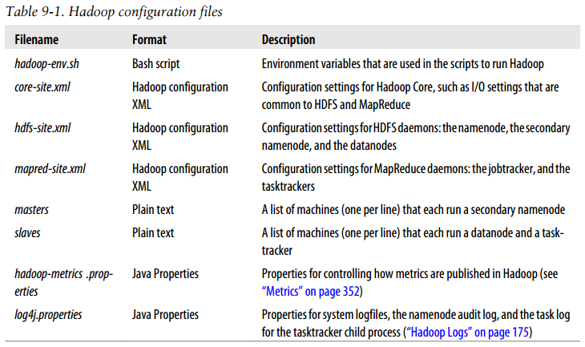
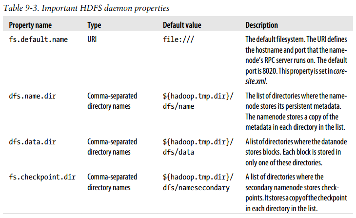
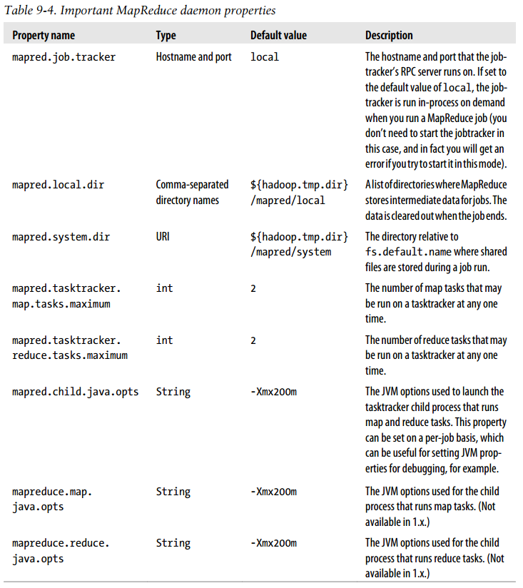
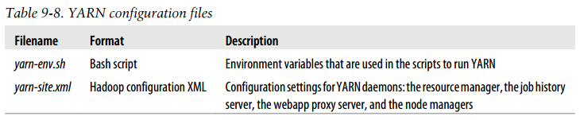
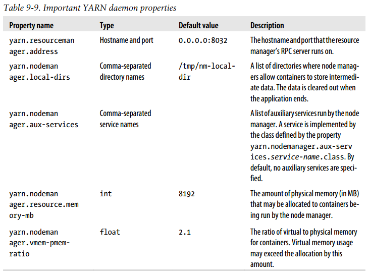
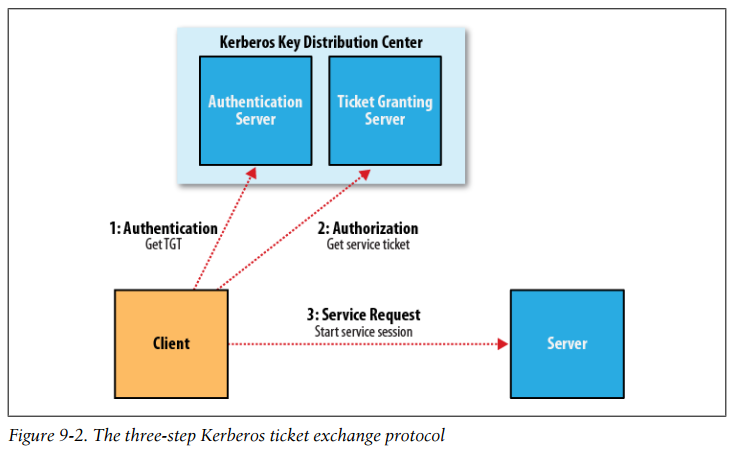

## Chapter 09: Setting Up a Hadoop Cluster

### Cluster Specification

- HDFS clusters do not benefit from using RAID (Redundant Array of Independent Disks) for datanode storage (although RAID is recommended for the namenode’s disks, to protect against corruption of its metadata). The redundancy that RAID provides is not needed, since HDFS handles it by replication between nodes. Furthermore, RAID striping (RAID 0), which is commonly used to increase performance, turns out to be slower than the JBOD (Just a Bunch Of Disks) configuration used by HDFS, which round-robins HDFS blocks between all disks. This is because RAID 0 read and write operations are limited by the speed of the slowest disk in the RAID array. In JBOD, disk operations are independent, so the average speed of operations is greater than that of the slowest disk.

- The Hadoop configuration must specify a map between node addresses and network locations. The map is described by a Java interface, DNSToSwitchMapping, whose signature is:
  ```java
  public interface DNSToSwitchMapping {
    public List<String> resolve(List<String> names);
  }
  ```
	The names parameter is a list of IP addresses, and the return value is a list of corresponding network location strings.

### Cluster Setup and Installation

### SSH Configuration

### Hadoop Configuration

- Hadoop configuration files  
  

- For some clusters, the one-size-fits-all configuration model breaks down. For example, if you expand the cluster with new machines that have a different hardware specification from the existing ones, you need a different configuration for the new machines to take advantage of their extra resources. In these cases, you need to have the concept of a class of machine and maintain a separate configuration for each class.

- For example, the start-dfs.sh script, which starts all the HDFS daemons in the cluster, runs the namenode on the machine that the script is run on. In slightly more detail, it:
	- (1) Starts a namenode on the local machine (the machine that the script is run on)
	- (2) Starts a datanode on each machine listed in the slaves file
	- (3) Starts a secondary namenode on each machine listed in the masters file

	There is a similar script called start-mapred.sh, which starts all the MapReduce daemons in the cluster. More specifically, it:
	1. Starts a jobtracker on the local machine
	2. Starts a tasktracker on each machine listed in the slaves file

	Note that masters is not used by the MapReduce control scripts.

- Important HDFS daemon properties  
  

- Important MapReduce daemon properties  
  

- Hadoop daemons generally run both an RPC server for communication between daemons and an HTTP server to provide web pages for human consumption.

- To prevent cases like these, some way of enforcing a limit on a task’s memory usage is needed. Hadoop provides two mechanisms for this. The simplest is via the Linux ulimit command, which can be done at the operating-system level (in the limits.conf file, typically found in /etc/security) or by setting mapred.child.ulimit in the Hadoop configuration. The second mechanism is Hadoop’s task memory monitoring feature. The idea is that an administrator sets a range of allowed virtual memory limits for tasks on the cluster, and users specify the maximum memory requirements for their jobs in the job configuration.

### YARN Configuration

- YARN configuration files  
  

- Important YARN daemon properties  
  

- YARN daemons run one or more RPC and HTTP servers.

### Security

- Hadoop itself does not manage user credentials; instead, it relies on Kerberos, a mature open-source network authentication protocol, to authenticate the user. In turn, Kerberos doesn’t manage permissions. Kerberos says that a user is who he says he is; it’s Hadoop’s job to determine whether that user has permission to perform a given action.

- At a high level, there are three steps that a client must take to access a service when using Kerberos, each of which involves a message exchange with a server:
	- (1) Authentication. The client authenticates itself to the Authentication Server and receives a timestamped Ticket-Granting Ticket (TGT).
	- (2) Authorization. The client uses the TGT to request a service ticket from the Ticket Granting Server.
	- (3) Service request. The client uses the service ticket to authenticate itself to the server that is providing the service the client is using. In the case of Hadoop, this might be the namenode or the jobtracker.
	
	Together, the Authentication Server and the Ticket Granting Server form the Key Distribution Center (KDC).

- The three-step Kerberos ticket exchange protocol
  

- The authorization and service request steps are not user-level actions; the client performs these steps on the user’s behalf. The authentication step, however, is normally carried out explicitly by the user using the kinit command, which will prompt for a password.

- A delegation token is generated by the server (the namenode in this case) and can be thought of as a shared secret between the client and the server. On the first RPC call to the namenode, the client has no delegation token, so it uses Kerberos to authenticate, and as a part of the response it gets a delegation token from the namenode. In subsequent calls, it presents the delegation token, which the namenode can verify (since it generated it using a secret key), and hence the client is authenticated to the server. When it wants to perform operations on HDFS blocks, the client uses a special kind of delegation token, called a block access token, that the namenode passes to the client in response to a metadata request. The client uses the block access token to authenticate itself to datanodes.

### Benchmarking a Hadoop Cluster

### Hadoop in the Cloud

- The Apache Whirr project (http://whirr.apache.org/) provides a Java API and a set of scripts that make it easy to run Hadoop on EC2 and other cloud providers.10 The scripts allow you to perform such operations as launching or terminating a cluster, or listing the running instances in a cluster.