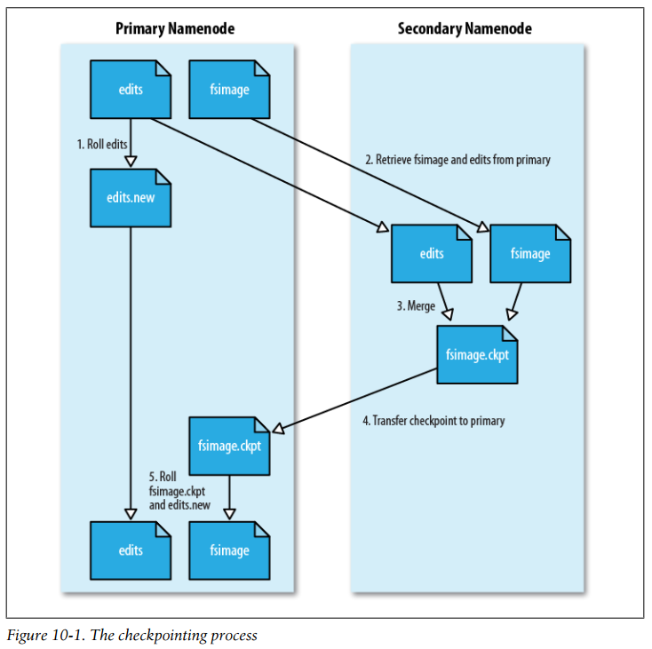

## Chapter 10: Administering Hadoop

### HDFS

- A newly formatted namenode creates the following directory structure:
  ```bash
  ${dfs.name.dir}/
  └── current/
     ├── VERSION
     ├── edits
     ├── fsimage
     └── fstime
  ```

- When a filesystem client performs a write operation (such as creating or moving a file), it is first recorded in the edit log. The fsimage file is a persistent checkpoint of the filesystem metadata. If the namenode fails, then the latest state of its metadata can be reconstructed by loading the fsimage from disk into memory, and then applying each of the operations in the edit log. The fsimage file contains a serialized form of all the directory and file inodes in the filesystem.

- The solution is to run the secondary namenode, whose purpose is to produce checkpoints of the primary’s in-memory filesystem metadata.1 The checkpointing process proceeds as follows:
	1. The secondary asks the primary to roll its edits file, so new edits go to a new file.
	2. The secondary retrieves fsimage and edits from the primary (using HTTP GET).
	3. The secondary loads fsimage into memory, applies each operation from edits, then creates a new consolidated fsimage file.
	4. The secondary sends the new fsimage back to the primary (using HTTP POST).
	5. The primary replaces the old fsimage with the new one from the secondary and the old edits file with the new one it started in step 1. It also updates the fstime file to record the time that the checkpoint was taken.

- The checkpointing process  
  

- A useful side effect of the checkpointing process is that the secondary has a checkpoint at the end of the process, which can be found in a subdirectory called previous.checkpoint. This can be used as a source for making (stale) backups of the namenode’s metadata:
  ```bash
  ${fs.checkpoint.dir}/
  ├── current/
  │  ├── VERSION
  │  ├── edits
  │  ├── fsimage
  │  └── fstime
  └── previous.checkpoint/
     ├── VERSION
     ├── edits
     ├── fsimage
     └── fstime
  ```

- When the namenode starts, the first thing it does is load its image file (fsimage) into memory and apply the edits from the edit log (edits). Once it has reconstructed a consistent in-memory image of the filesystem metadata, it creates a new fsimage file (effectively doing the checkpoint itself, without recourse to the secondary namenode) and an empty edit log. Only at this point does the namenode start listening for RPC and HTTP requests. However, the namenode is running in safe mode, which means that it offers only a read-only view of the filesystem to clients.

- Recall that the locations of blocks in the system are not persisted by the namenode; this information resides with the datanodes, in the form of a list of the blocks it is storing. During normal operation of the system, the namenode has a map of block locations stored in memory. Safe mode is needed to give the datanodes time to check in to the namenode with their block lists, so the namenode can be informed of enough block locations to run the filesystem effectively.

- Safe mode is exited when the minimal replication condition is reached, plus an extension time of 30 seconds. The minimal replication condition is when 99.9% of the blocks in the whole filesystem meet their minimum replication level.

- An administrator has the ability to make the namenode enter or leave safe mode at any time. It is sometimes necessary to do this when carrying out maintenance on the cluster or after upgrading a cluster to confirm that data is still readable. To enter safe mode, use the following command:
  ```bash
  % hadoop dfsadmin -safemode enter
  Safe mode is ON
  ```
	You can make the namenode leave safe mode by using:
  ```bash
  % hadoop dfsadmin -safemode leave
  Safe mode is OFF
  ```

- The dfsadmin tool is a multipurpose tool for finding information about the state of HDFS, as well as for performing administration operations on HDFS.

- Hadoop provides an fsck utility for checking the health of files in HDFS. The tool looks for blocks that are missing from all datanodes, as well as under- or over-replicated blocks.

- Every datanode runs a block scanner, which periodically verifies all the blocks stored on the datanode. This allows bad blocks to be detected and fixed before they are read by clients.

- The balancer program is a Hadoop daemon that redistributes blocks by moving them from overutilized datanodes to underutilized datanodes, while adhering to the block replica placement policy that makes data loss unlikely by placing block replicas on different racks.

### Monitoring

- The HDFS and MapReduce daemons collect information about events and measurements that are collectively known as metrics. Metrics belong to a context, and Hadoop currently uses “dfs”, “mapred”, “rpc”, and “jvm” contexts. Hadoop daemons usually collect metrics under several contexts.

- How Do Metrics Differ from Counters? The main difference is their scope: metrics are collected by Hadoop daemons, whereas counters are collected for MapReduce tasks and aggregated for the whole job. They have different audiences, too: broadly speaking, metrics are for administrators, and counters are for MapReduce users.

- FileContext writes metrics to a local file. It exposes two configuration properties: fileName, which specifies the absolute name of the file to write to, and period, for the time interval (in seconds) between file updates. Ganglia (http://ganglia.info/) is an open source distributed monitoring system for very large clusters. It is designed to impose very low resource overheads on each node in the cluster. Ganglia itself collects metrics, such as CPU and memory usage, and by using GangliaContext, you can inject Hadoop metrics into Ganglia. CompositeContext allows you to output the same set of metrics to multiple contexts, such as a FileContext and a GangliaContext.

- Java Management Extensions (JMX) is a standard Java API for monitoring and managing applications. Hadoop includes several managed beans (MBeans), which expose Hadoop metrics to JMX-aware applications.

- Many third-party monitoring and alerting systems (such as Nagios or Hyperic) can query MBeans, making JMX the natural way to monitor your Hadoop cluster from an existing monitoring system. You will need to enable remote access to JMX, however, and choose a level of security that is appropriate for your cluster. The options here include password authentication, SSL connections, and SSL client-authentication.

- It’s common to use Ganglia in conjunction with an alerting system such as Nagios for monitoring a Hadoop cluster. Ganglia is good for efficiently collecting a large number of metrics and graphing them, whereas Nagios and similar systems are good at sending alerts when a critical threshold is reached in any of a smaller set of metrics.

### Maintenance

- Although commissioning a new node can be as simple as configuring the hdfssite.xml file to point to the namenode, configuring the mapred-site.xml file to point to the jobtracker, and starting the datanode and jobtracker daemons, it is generally best to have a list of authorized nodes.

- To add new nodes to the cluster:
	- (1) Add the network addresses of the new nodes to the include file.
	- (2) Update the namenode with the new set of permitted datanodes using this command:
        ```bash
        % hadoop dfsadmin -refreshNodes
        ```
	- (3) Update the jobtracker with the new set of permitted tasktrackers using:
        ```bash
        % hadoop mradmin -refreshNodes
        ```
	- (4) Update the slaves file with the new nodes, so that they are included in future operations performed by the Hadoop control scripts.
	- (5) Start the new datanodes and tasktrackers.
	- (6) Check that the new datanodes and tasktrackers appear in the web UI.

- Although HDFS is designed to tolerate datanode failures, this does not mean you can just terminate datanodes en masse with no ill effect. The way to decommission datanodes is to inform the namenode of the nodes that you wish to take out of circulation, so that it can replicate the blocks to other datanodes before the datanodes are shut down.

- The rules for whether a tasktracker may connect to the jobtracker are simple: a tasktracker may connect only if it appears in the include file and does not appear in the exclude file. For HDFS, the rules are slightly different. If a datanode appears in both the include and the exclude file, then it may connect, but only to be decommissioned.

- To remove nodes from the cluster:
	- (1) Add the network addresses of the nodes to be decommissioned to the exclude file. Do not update the include file at this point.
	- (2) Update the namenode with the new set of permitted datanodes, using this command:
        ```bash
        % hadoop dfsadmin -refreshNodes
        ```
	- (3) Update the jobtracker with the new set of permitted tasktrackers using:
        ```bash
        % hadoop mradmin -refreshNodes
        ```
	- (4) Go to the web UI and check whether the admin state has changed to “Decommission In Progress” for the datanodes being decommissioned. They will start copying their blocks to other datanodes in the cluster.
	- (5) When all the datanodes report their state as “Decommissioned,” all the blocks have been replicated. Shut down the decommissioned nodes.
	- (6) Remove the nodes from the include file, and run:
        ```bash
        % hadoop dfsadmin -refreshNodes
        % hadoop mradmin -refreshNodes
        ```
	- (7) Remove the nodes from the slaves file.

- An upgrade of HDFS makes a copy of the previous version’s metadata and data. Doing an upgrade does not double the storage requirements of the cluster, as the datanodes use hard links to keep two references (for the current and previous version) to the same block of data. This design makes it straightforward to roll back to the previous version of the filesystem, if you need to. You should understand that any changes made to the data on the upgraded system will be lost after the rollback completes. You can keep only the previous version of the filesystem, which means you can’t roll back several versions. Therefore, to carry out another upgrade to HDFS data and metadata, you will need to delete the previous version, a process called finalizing the upgrade. Once an upgrade is finalized, there is no procedure for rolling back to a previous version.

- Here is the high-level procedure for upgrading a cluster when the filesystem layout needs to be migrated:
	- (1) Make sure that any previous upgrade is finalized before proceeding with another upgrade.
	- (2) Shut down MapReduce, and kill any orphaned task processes on the tasktrackers.
	- (3) Shut down HDFS, and back up the namenode directories.
	- (4) Install new versions of Hadoop HDFS and MapReduce on the cluster and on clients.
	- (5) Start HDFS with the -upgrade option.
	- (6) Wait until the upgrade is complete.
	- (7) Perform some sanity checks on HDFS.
	- (8) Start MapReduce.
	- (9) Roll back or finalize the upgrade (optional).