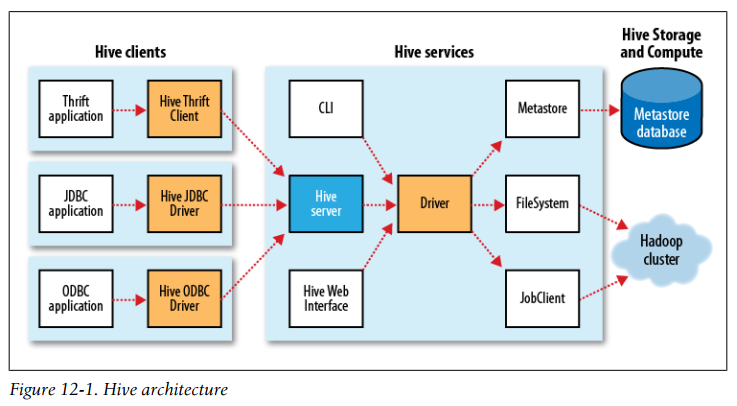
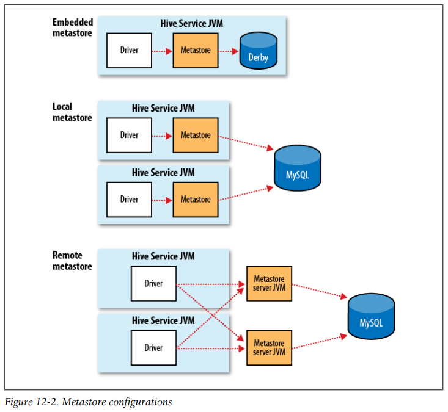
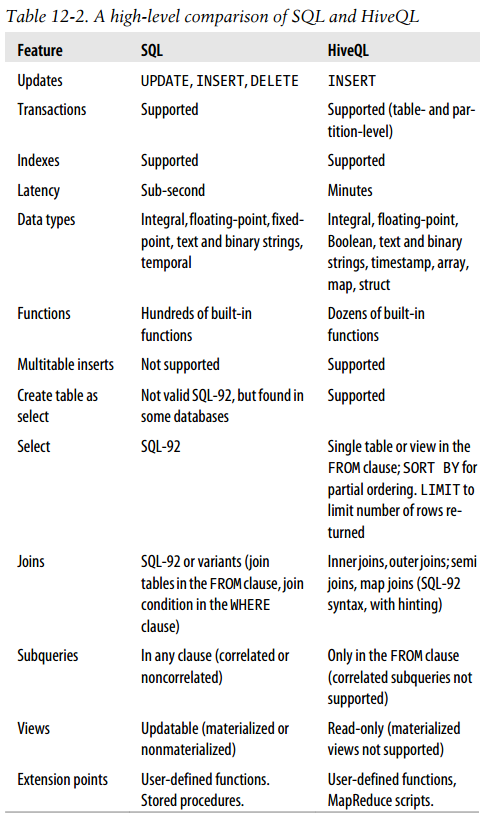
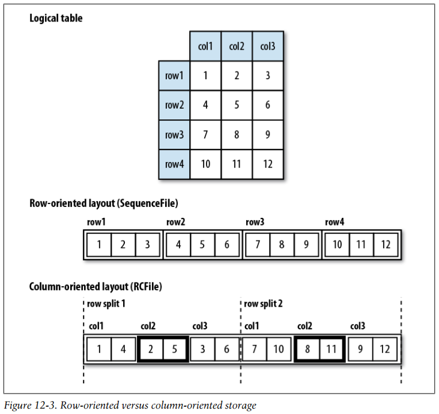
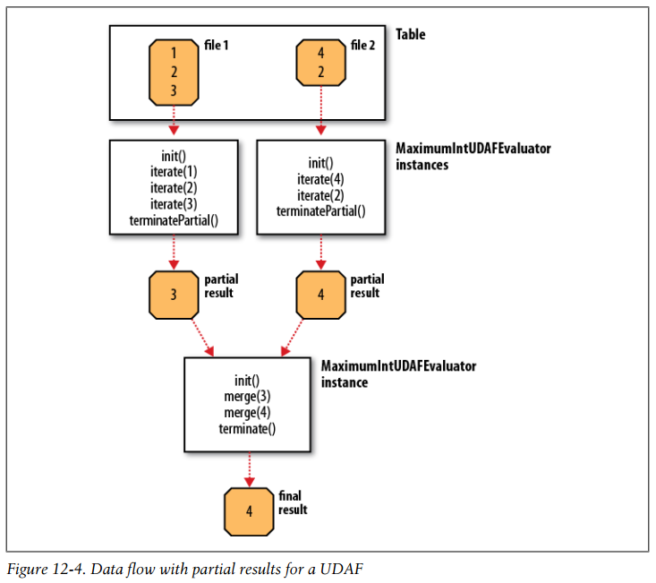

## Chapter 12: Hive

### Installing Hive

- In normal use, Hive runs on your workstation and converts your SQL query into a series of MapReduce jobs for execution on a Hadoop cluster. Hive organizes data into tables, which provide a means for attaching structure to data stored in HDFS. Metadata—such as table schemas—is stored in a database called the metastore.

### An Example

- We create a table to hold the weather data using the CREATE TABLE statement:
  ```sql
  CREATE TABLE records (year STRING, temperature INT, quality INT)
  ROW FORMAT DELIMITED
    FIELDS TERMINATED BY '\t';
  ```
	Next, we can populate Hive with the data.
  ```sql
  LOAD DATA LOCAL INPATH 'input/ncdc/micro-tab/sample.txt'
  OVERWRITE INTO TABLE records;
  ```
	Now that the data is in Hive, we can run a query against it:
  ```bash
  hive> SELECT year, MAX(temperature)
      > FROM records
      > WHERE temperature != 9999
      > AND (quality = 0 OR quality = 1 OR quality = 4 OR quality = 5 OR quality = 9)
      > GROUP BY year;
  1949	111
  1950	22
  ```

- But the remarkable thing is that Hive transforms this query into a MapReduce job, which it executes on our behalf, then prints the results to the console.

### Running Hive

- There is a precedence hierarchy to setting properties. In the following list, lower numbers take precedence over higher numbers:
	- (1) The Hive SET command
	- (2) The command-line -hiveconf option
	- (3) hive-site.xml
	- (4) hive-default.xml
	- (5) hadoop-site.xml (or, equivalently, core-site.xml, hdfs-site.xml, and mapredsite.xml)
	- (6) hadoop-default.xml (or, equivalently, core-default.xml, hdfs-default.xml, and mapred-default.xml)

- Hive architecture  
  

- The metastore is the central repository of Hive metadata. The metastore is divided into two pieces: a service and the backing store for the data.

- Metastore configurations  
  

### Comparison with Traditional Databases

- In a traditional database, a table’s schema is enforced at data load time. If the data being loaded doesn’t conform to the schema, then it is rejected. This design is sometimes called schema on write because the data is checked against the schema when it is written into the database. Hive, on the other hand, doesn’t verify the data when it is loaded, but rather when a query is issued. This is called schema on read.

- Hive was built to operate over HDFS data using MapReduce, where full-table scans are the norm and a table update is achieved by transforming the data into a new table. For a data warehousing application that runs over large portions of the dataset, this works well.

- Compact indexes store the HDFS block numbers of each value, rather than each file offset, so they don’t take up much disk space but are still effective for the case where values are clustered together in nearby rows. Bitmap indexes use compressed bitsets to efficiently store the rows that a particular value appears in, and they are usually appropriate for low-cardinality columns (such as gender or country).

### HiveQL

- A high-level comparison of SQL and HiveQL  
  

- Hive has three complex types: ARRAY, MAP, and STRUCT. ARRAY and MAP are like their namesakes in Java, whereas a STRUCT is a record type that encapsulates a set of named fields. Complex types permit an arbitrary level of nesting. Complex type declarations must specify the type of the fields in the collection, using an angled bracket notation, as illustrated in this table definition with three columns, one for each complex type:
  ```sql
  CREATE TABLE complex (
    col1 ARRAY<INT>,
    col2 MAP<STRING, INT>,
    col3 STRUCT<a:STRING, b:INT, c:DOUBLE>
  );
  ```

### Tables

- A Hive table is logically made up of the data being stored and the associated metadata describing the layout of the data in the table. The data typically resides in HDFS, although it may reside in any Hadoop filesystem, including the local filesystem or S3. Hive stores the metadata in a relational database—and not in HDFS.

- When you create a table in Hive, by default Hive will manage the data, which means that Hive moves the data into its warehouse directory. Alternatively, you may create an external table, which tells Hive to refer to the data that is at an existing location outside the warehouse directory.

- When you load data into a managed table, it is moved into Hive’s warehouse directory. For example:
  ```sql
  CREATE TABLE managed_table (dummy STRING);
  LOAD DATA INPATH '/user/tom/data.txt' INTO table managed_table;
  ```
	will move the file hdfs://user/tom/data.txt into Hive’s warehouse directory for the managed\_table table, which is hdfs://user/hive/warehouse/managed\_table. If the table is later dropped, using:
  ```sql
  DROP TABLE managed_table;
  ```
	the table, including its metadata and its data, is deleted. It bears repeating that since the initial LOAD performed a move operation, and the DROP performed a delete operation, the data no longer exists anywhere. This is what it means for Hive to manage the data.

- An external table behaves differently. You control the creation and deletion of the data. The location of the external data is specified at table creation time:
  ```sql
  CREATE EXTERNAL TABLE external_table (dummy STRING)
    LOCATION '/user/tom/external_table';
  LOAD DATA INPATH '/user/tom/data.txt' INTO TABLE external_table;
  ```
	With the EXTERNAL keyword, Hive knows that it is not managing the data, so it doesn’t move it to its warehouse directory. Indeed, it doesn’t even check whether the external location exists at the time it is defined. This is a useful feature because it means you can create the data lazily after creating the table. When you drop an external table, Hive will leave the data untouched and only delete the metadata.

- Hive organizes tables into partitions, a way of dividing a table into coarse-grained parts based on the value of a partition column, such as a date. Using partitions can make it faster to do queries on slices of the data. Tables or partitions may be subdivided further into buckets to give extra structure to the data that may be used for more efficient queries.

- Partitions are defined at table creation time using the PARTITIONED BY clause, which takes a list of column definitions. For the hypothetical logfiles example, we might define a table with records comprising a timestamp and the log line itself:
  ```sql
  CREATE TABLE logs (ts BIGINT, line STRING)
  PARTITIONED BY (dt STRING, country STRING);
  ```
	When we load data into a partitioned table, the partition values are specified explicitly:
  ```sql
  LOAD DATA LOCAL INPATH 'input/hive/partitions/file1'
  INTO TABLE logs
  PARTITION (dt='2001-01-01', country='GB');
  ```
	At the filesystem level, partitions are simply nested subdirectories of the table directory. After loading a few more files into the logs table, the directory structure might look like this:
  ```bash
  /user/hive/warehouse/logs
  ├── dt=2001-01-01/
  │	├── country=GB/
  │	│	├── file1
  │	│	└── file2
  │	└── country=US/
  │		└── file3
  └── dt=2001-01-02/
      ├── country=GB/
      │	└── file4
      └── country=US/
          ├── file5
          └── file6
  ```

- One thing to bear in mind is that the column definitions in the PARTITIONED BY clause are full-fledged table columns, called partition columns; however, the datafiles do not contain values for these columns, since they are derived from the directory names.

- There are two reasons why you might want to organize your tables (or partitions) into buckets. The first is to enable more efficient queries. The second reason to bucket a table is to make sampling more efficient.

- First, let’s see how to tell Hive that a table should be bucketed. We use the CLUSTERED BY clause to specify the columns to bucket on and the number of buckets:
  ```sql
  CREATE TABLE bucketed_users (id INT, name STRING)
  CLUSTERED BY (id) INTO 4 BUCKETS;
  ```
	The data within a bucket may additionally be sorted by one or more columns. This allows even more efficient map-side joins, since the join of each bucket becomes an efficient merge-sort. The syntax for declaring that a table has sorted buckets is:
  ```sql
  CREATE TABLE bucketed_users (id INT, name STRING)
  CLUSTERED BY (id) SORTED BY (id ASC) INTO 4 BUCKETS;
  ```

- We can see the same thing by sampling the table using the TABLESAMPLE clause, which restricts the query to a fraction of the buckets in the table rather than the whole table:
  ```bash
  hive> SELECT * FROM bucketed_users
      > TABLESAMPLE(BUCKET 1 OUT OF 4 ON id);
  0	Nat
  4	Ann
  ```

- The default row delimiter is not a tab character, but the Control-A character from the set of ASCII control codes (it has ASCII code 1). The default collection item delimiter is a Control-B character, used to delimit items in an ARRAY or STRUCT, or in key-value pairs in a MAP. The default map key delimiter is a Control-C character, used to delimit the key and value in a MAP. Rows in a table are delimited by a newline character.

- Thus, the statement:
  ```sql
  CREATE TABLE ...;
  ```
	is identical to the more explicit:
  ```sql
  CREATE TABLE ...
  ROW FORMAT DELIMITED
    FIELDS TERMINATED BY '\001'
    COLLECTION ITEMS TERMINATED BY '\002'
    MAP KEYS TERMINATED BY '\003'
    LINES TERMINATED BY '\n'
  STORED AS TEXTFILE;
  ```

- Row-oriented versus column-oriented storage  
  

- Use the following CREATE TABLE clauses to enable column-oriented storage in Hive:
  ```sql
  CREATE TABLE ...
  ROW FORMAT SERDE 'org.apache.hadoop.hive.serde2.columnar.ColumnarSerDe'
  STORED AS RCFILE;
  ```

- Let’s see how to use another SerDe for storage. We’ll use a contrib SerDe that uses a regular expression for reading the fixed-width station metadata from a text file:
  ```sql
  CREATE TABLE stations (usaf STRING, wban STRING, name STRING)
  ROW FORMAT SERDE 'org.apache.hadoop.hive.contrib.serde2.RegexSerDe'
  WITH SERDEPROPERTIES (
    "input.regex" = "(\\d{6}) (\\d{5}) (.{29}) .*"
  );
  ```

- We’ve already seen how to use the LOAD DATA operation to import data into a Hive table (or partition) by copying or moving files to the table’s directory. You can also populate a table with data from another Hive table using an INSERT statement, or at creation time using the CTAS construct, which is an abbreviation used to refer to CREATE TABLE...AS SELECT.

### Querying Data

- ORDER BY produces a result that is totally sorted, as expected, but to do so it sets the number of reducers to one, making it very inefficient for large datasets. When a globally sorted result is not required—and in many cases it isn’t—you can use Hive’s nonstandard extension, SORT BY, instead. SORT BY produces a sorted file per reducer.

- In some cases, you want to control which reducer a particular row goes to, typically so you can perform some subsequent aggregation. This is what Hive’s DISTRIBUTE BY clause does.

- Here’s an example to sort the weather dataset by year and temperature, in such a way to ensure that all the rows for a given year end up in the same reducer partition:
  ```bash
  hive> FROM records2
      > SELECT year, temperature
      > DISTRIBUTE BY year
      > SORT BY year ASC, temperature DESC;
  1949	111
  1949	78
  1950	22
  1950	0
  1950	-11
  ```

- If the columns for SORT BY and DISTRIBUTE BY are the same, you can use CLUSTER BY as a shorthand for specifying both.

- Using an approach like Hadoop Streaming, the TRANSFORM, MAP, and REDUCE clauses make it possible to invoke an external script or program from Hive.

- is\_good\_quality.py
  ```python
  #!/usr/bin/env python
  import re
  import sys
  for line in sys.stdin:
    (year, temp, q) = line.strip().split()
    if (temp != "9999" and re.match("[01459]", q)):
      print "%s\t%s" % (year, temp)
  ```
	max\_temperature\_reduce.py
  ```python
  #!/usr/bin/env python
  import sys
  (last_key, max_val) = (None, -sys.maxint)
  for line in sys.stdin:
    (key, val) = line.strip().split("\t")
    if last_key and last_key != key:
      print "%s\t%s" % (last_key, max_val)
      (last_key, max_val) = (key, int(val))
    else:
      (last_key, max_val) = (key, max(max_val, int(val)))
  if last_key:
    print "%s\t%s" % (last_key, max_val)
  ```
	We can use the script as follows:
  ```bash
  hive> ADD FILE /Users/tom/book-workspace/hadoop-book/ch12/src/main/python/is_good_quality.py;
  hive> FROM records2
      > SELECT TRANSFORM(year, temperature, quality)
      > USING 'is_good_quality.py'
      > AS year, temperature;
  1950 0
  1950 22
  1950 -11
  1949 111
  1949 78
  ```
	If we use a nested form for the query, we can specify a map and a reduce function. This time we use the MAP and REDUCE keywords, but SELECT TRANSFORM in both cases would have the same result.
  ```sql
  FROM (
    FROM records2
    MAP year, temperature, quality
    USING 'is_good_quality.py'
    AS year, temperature) map_output
  REDUCE year, temperature
  USING 'max_temperature_reduce.py'
  AS year, temperature;
  ```

- Hive only supports equijoins, which means that only equality can be used in the join predicate.

- A single join is implemented as a single MapReduce job, but multiple joins can be performed in less than one MapReduce job per join if the same column is used in the join condition.

- The order of the tables in the JOIN clauses is significant. It’s generally best to have the largest table last.

- Hive doesn’t support IN subqueries (at the time of this writing), but you can use a LEFT SEMI JOIN to do the same thing. Consider this IN subquery, which finds all the items in the things table that are in the sales table:
  ```sql
  SELECT *
  FROM things
  WHERE things.id IN (SELECT id from sales);
  ```
	We can rewrite it as follows:
  ```bash
  hive> SELECT *
      > FROM things LEFT SEMI JOIN sales ON (sales.id = things.id);
  2	Tie
  3	Hat
  4	Coat
  ```
	There is a restriction that we must observe for LEFT SEMI JOIN queries: the right table (sales) may appear only in the ON clause. It cannot be referenced in a SELECT expression, for example.

- If one table is small enough to fit in memory, Hive can load the smaller table into memory to perform the join in each of the mappers. The syntax for specifying a map join is a hint embedded in an SQL C-style comment:
  ```bash
  hive> SELECT /*+ MAPJOIN(things) */ sales.*, things.*
      > FROM sales JOIN things ON (sales.id = things.id);
  Joe		2	2	Tie
  Hank	4	4	Coat
  Eve		3	3	Hat
  Hank	2	2	Tie
  ```

- A subquery is a SELECT statement that is embedded in another SQL statement. Hive has limited support for subqueries, permitting a subquery only in the FROM clause of a SELECT statement.

- A view is a sort of “virtual table” that is defined by a SELECT statement. Views can be used to present data to users in a way that differs from the way it is actually stored on disk. Often, the data from existing tables is simplified or aggregated in a particular way that makes it convenient for further processing. Views may also be used to restrict users’ access to particular subsets of tables that they are authorized to see. In Hive, a view is not materialized to disk when it is created; rather, the view’s SELECT statement is executed when the statement that refers to the view is run. If a view performs extensive transformations on the base tables or is used frequently, you may choose to manually materialize it by creating a new table that stores the contents of the view.

### User-Defined Functions

- There are three types of UDF in Hive: (regular) UDFs, user-defined aggregate functions (UDAFs), and user-defined table-generating functions (UDTFs). They differ in the numbers of rows that they accept as input and produce as output:
	- A UDF operates on a single row and produces a single row as its output. Most functions, such as mathematical functions and string functions, are of this type.
	- A UDAF works on multiple input rows and creates a single output row. Aggregate functions include such functions as COUNT and MAX.
	- A UDTF operates on a single row and produces multiple rows—a table—as output.

- A UDF for stripping characters from the ends of strings
  ```java
  public class Strip extends UDF {
    private Text result = new Text();
    public Text evaluate(Text str) {
      if (str == null) {
        return null;
      }
      result.set(StringUtils.strip(str.toString()));
      return result;
    }
    public Text evaluate(Text str, String stripChars) {
      if (str == null) {
        return null;
      }
      result.set(StringUtils.strip(str.toString(), stripChars));
      return result;
    }
  }
  ```

- A UDF must satisfy the following two properties:
	- A UDF must be a subclass of org.apache.hadoop.hive.ql.exec.UDF.
	- A UDF must implement at least one evaluate() method.

- To use the UDF in Hive, we need to package the compiled Java class in a JAR file (you can do this by typing ant hive with the book’s example code) and register the file with Hive:
  ```bash
  ADD JAR /path/to/hive-examples.jar;
  ```
	We also need to create an alias for the Java classname:
  ```bash
  CREATE TEMPORARY FUNCTION strip AS 'com.hadoopbook.hive.Strip';
  ```

- An aggregate function is more difficult to write than a regular UDF. Values are aggregated in chunks (potentially across many map or reduce tasks), so the implementation has to be capable of combining partial aggregations into a final result.

- A UDAF for calculating the maximum of a collection of integers
  ```java
  public class Maximum extends UDAF {
    public static class MaximumIntUDAFEvaluator implements UDAFEvaluator {
      private IntWritable result;
      public void init() {
        result = null;
      }
      public boolean iterate(IntWritable value) {
        if (value == null) {
          return true;
        }
        if (result == null) {
          result = new IntWritable(value.get());
        } else {
          result.set(Math.max(result.get(), value.get()));
        }
        return true;
      }
      public IntWritable terminatePartial() {
        return result;
      }
      public boolean merge(IntWritable other) {
        return iterate(other);
      }
      public IntWritable terminate() {
        return result;
      }
    }
  }
  ```

- Data flow with partial results for a UDAF  
  