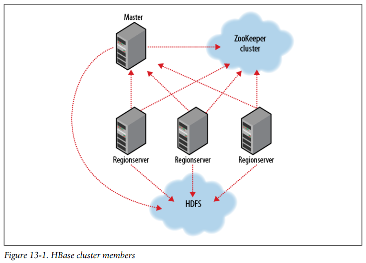

## Chapter 13: HBase

- Applications store data into labeled tables. Tables are made of rows and columns. Table cells—the intersection of row and column coordinates—are versioned. By default, their version is a timestamp auto-assigned by HBase at the time of cell insertion. A cell’s content is an uninterpreted array of bytes.

	Table row keys are also byte arrays, so theoretically anything can serve as a row key, from strings to binary representations of long or even serialized data structures. Table rows are sorted by row key, the table’s primary key. The sort is byte-ordered. All table accesses are via the table primary key.

	Row columns are grouped into column families. All column family members have a common prefix.

	Physically, all column family members are stored together on the filesystem. So, though earlier we described HBase as a column-oriented store, it would be more accurate if it were described as a column-family-oriented store.

	In synopsis, HBase tables are like those in an RDBMS, only cells are versioned, rows are sorted, and columns can be added on the fly by the client as long as the column family they belong to preexists.

- Tables are automatically partitioned horizontally by HBase into regions. Each region comprises a subset of a table’s rows. A region is denoted by the table it belongs to, its first row, inclusive, and last row, exclusive.

	Regions are the units that get distributed over an HBase cluster.

- Row updates are atomic, no matter how many row columns constitute the row-level transaction. This keeps the locking model simple.

- HBase cluster members  
  

- Just as HDFS and MapReduce are built of clients, slaves, and a coordinating master—namenode and datanodes in HDFS and jobtracker and tasktrackers in MapReduce—so is HBase modeled with an HBase master node orchestrating a cluster of one or more regionserver slaves.

	The HBase master is responsible for bootstrapping a virgin install, for assigning regions to registered regionservers, and for recovering regionserver failures. The master node is lightly loaded. The regionservers carry zero or more regions and field client read/write requests. They also manage region splits informing the HBase master about the new daughter regions for it to manage the offlining of parent region and assignment of the replacement daughters.

	HBase depends on ZooKeeper and by default it manages a ZooKeeper instance as the authority on cluster state. HBase hosts vitals such as the location of the root catalog table and the address of the current cluster Master. Assignment of regions is mediated via ZooKeeper in case participating servers crash mid-assignment. Hosting the assignment transaction state in ZooKeeper makes it so recovery can pick up on the assignment at where the crashed server left off. At a minimum, bootstrapping a client connection to an HBase cluster, the client must be passed the location of the ZooKeeper ensemble. Thereafter, the client navigates the ZooKeeper hierarchy to learn cluster attributes such as server locations.

	HBase persists data via the Hadoop filesystem API. Since there are multiple implementations of the filesystem interface—one for the local filesystem, one for the KFS filesystem, Amazon’s S3, and HDFS (the Hadoop Distributed Filesystem)—HBase can persist to any of these implementations.

- HBase, internally, keeps special catalog tables named -ROOT- and .META. within which it maintains the current list, state, and location of all regions afloat on the cluster. The -ROOT- table holds the list of .META. table regions. The .META. table holds the list of all user-space regions. Entries in these tables are keyed by region name, where a region name is made of the table name the region belongs to, the region’s start row, its time of creation, and finally, an MD5 hash of all of the former (i.e., a hash of tablename, start row, and creation timestamp.)

- Writes arriving at a regionserver are first appended to a commit log and then are added to an in-memory memstore. When a memstore fills, its content is flushed to the filesystem.

	When Reading, the region’s memstore is consulted first. If sufficient versions are found reading memstore alone, the query completes there. Otherwise, flush files are consulted in order, from newest to oldest until versions sufficient to satisfy the query are found, or until we run out of flush files.

- To create a table, you must name your table and define its schema. A table’s schema comprises table attributes and the list of table column families. Column families themselves have attributes that you in turn set at schema definition time.

	Schemas can be later edited by offlining the table using the shell disable command, making the necessary alterations using alter, then putting the table back online with enable.

- Basic table administration and access
  ```java
  public class ExampleClient {
    public static void main(String[] args) throws IOException {
      Configuration config = HBaseConfiguration.create();
      // Create table
      HBaseAdmin admin = new HBaseAdmin(config);
      HTableDescriptor htd = new HTableDescriptor("test");
      HColumnDescriptor hcd = new HColumnDescriptor("data");
      htd.addFamily(hcd);
      admin.createTable(htd);
      byte [] tablename = htd.getName();
      HTableDescriptor [] tables = admin.listTables();
      ...
      // Run some operations against the table.
      HTable table = new HTable(config, tablename);
      byte [] row1 = Bytes.toBytes("row1");
      Put p1 = new Put(row1);
      byte [] databytes = Bytes.toBytes("data");
      p1.add(databytes, Bytes.toBytes("1"), Bytes.toBytes("value1"));
      table.put(p1);
      Get g = new Get(row1);
      Result result = table.get(g);
      System.out.println("Get: " + result);
      Scan scan = new Scan();
      ResultScanner scanner = table.getScanner(scan);
      try {
        for (Result scannerResult: scanner) {
          ...
        }
      } finally {
        scanner.close();
      }
      // Drop the table
      admin.disableTable(tablename);
      admin.deleteTable(tablename);
    }
  }
  ```

- A MapReduce application to count the number of rows in an HBase table
  ```java
  static class RowCounterMapper
      extends TableMapper<ImmutableBytesWritable, Result> {
    public static enum Counters {ROWS}
    @Override
    public void map(ImmutableBytesWritable row, 
        Result values, Context context) throws IOException {
      for (KeyValue value: values.list()) {
        if (value.getValue().length > 0) {
          context.getCounter(Counters.ROWS).increment(1);
          break;
        }
      }
    }
  }

  public static Job createSubmittableJob(Configuration conf, String[] args)
      throws IOException {
    ...
    Scan scan = new Scan();
    scan.setFilter(new FirstKeyOnlyFilter());
    ...
    String [] fields = columnName.split(":");
    if(fields.length == 1) {
      scan.addFamily(Bytes.toBytes(fields[0]));
    } else {
      scan.addColumn(Bytes.toBytes(fields[0]), Bytes.toBytes(fields[1]));
    }
    ...
    TableMapReduceUtil.initTableMapperJob(tableName, scan,
        RowCounterMapper.class, ImmutableBytesWritable.class,
        Result.class, job);
    ...
    return job;
  }
  ```

- If a table is new, it will have only one region, and initially all updates will be to this single region until it splits. This will happen even if row keys are randomly distributed. This startup phenomenon means uploads run slowly at first until there are sufficient regions distributed so all cluster members are able to participate in the upload.

- HBase scanners are like cursors in a traditional database or Java iterators, except—unlike the latter—they have to be closed after use. Scanners return rows in order. Users obtain a scanner on an HBase table by calling HTable.getScanner(scan), where the scan parameter is a configured instance of a Scan object. In the Scan instance, you can pass the row at which to start and stop the scan, which columns in a row to return in the row result, and optionally, a filter to run on the server side The ResultScanner interface, which is returned when you call HTable.getScanner(), is as follows:
  ```java
  public interface ResultScanner extends Closeable, Iterable<Result> {
    public Result next() throws IOException;
    public Result [] next(int nbRows) throws IOException;
    public void close();
  }
  ```

	You can ask for the next row’s results or a number of rows. Each invocation of next() involves a trip back to the regionserver, so grabbing a bunch of rows at once can make for significant performance savings.

- Take time designing your row key.

	A smart compound key can be used to cluster data in ways amenable to how it will be accessed.