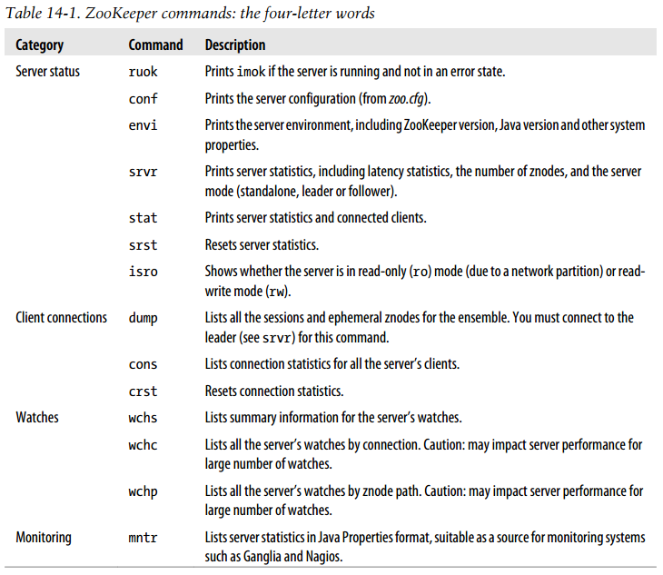
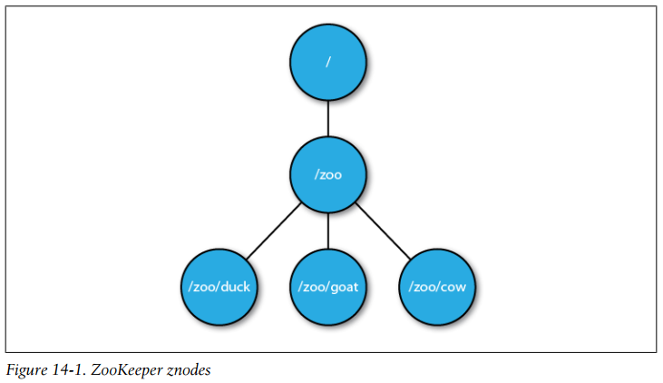
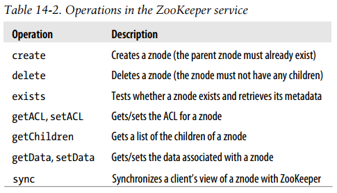
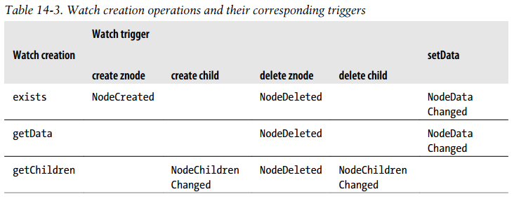
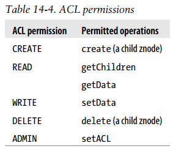
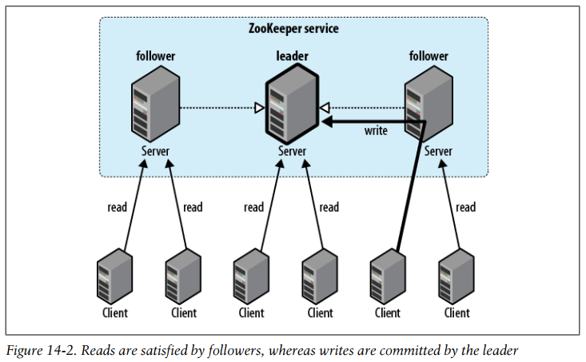
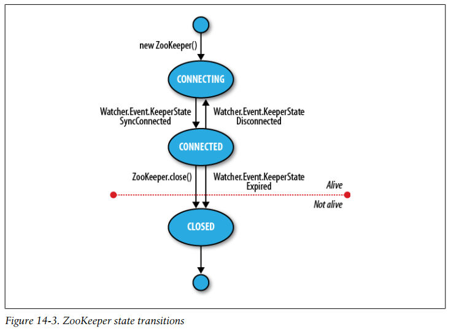

## Chapter 14: ZooKeeper

### Installing and Running ZooKeeper

- ZooKeeper commands: the four-letter words  
  

### An Example

- One way of understanding ZooKeeper is to think of it as providing a high-availability filesystem. It doesn’t have files and directories, but a unified concept of a node, called a znode, which acts both as a container of data (like a file) and a container of other znodes (like a directory). Znodes form a hierarchical namespace, and a natural way to build a membership list is to create a parent znode with the name of the group and child znodes with the name of the group members (servers).

- ZooKeeper znodes  
  

- A program to create a znode representing a group in ZooKeeper
  ```java
  public class CreateGroup implements Watcher {
    private static final int SESSION_TIMEOUT = 5000;
    private ZooKeeper zk;
    private CountDownLatch connectedSignal = new CountDownLatch(1);
    public void connect(String hosts) throws IOException, InterruptedException {
      zk = new ZooKeeper(hosts, SESSION_TIMEOUT, this);
      connectedSignal.await();
    }
    @Override
    public void process(WatchedEvent event) { // Watcher interface
      if (event.getState() == KeeperState.SyncConnected) {
        connectedSignal.countDown();
      }
    }
    public void create(String groupName) throws KeeperException, InterruptedException {
      String path = "/" + groupName;
      String createdPath = zk.create(path, null/*data*/,
          Ids.OPEN_ACL_UNSAFE, CreateMode.PERSISTENT);
      System.out.println("Created " + createdPath);
    }
    public void close() throws InterruptedException {
      zk.close();
    }
    public static void main(String[] args) throws Exception {
      CreateGroup createGroup = new CreateGroup();
      createGroup.connect(args[0]);
      createGroup.create(args[1]);
      createGroup.close();
    }
  }
  ```

- When a ZooKeeper instance is created, it starts a thread to connect to the ZooKeeper service. The call to the constructor returns immediately, so it is important to wait for the connection to be established before using the ZooKeeper object. We make use of Java’s CountDownLatch class (in the java.util.concurrent package) to block until the ZooKeeper instance is ready.

- We create a new ZooKeeper znode using the create() method on the ZooKeeper instance. The arguments it takes are the path (represented by a string), the contents of the znode (a byte array, null here), an access control list (or ACL for short, which here is a completely open ACL, allowing any client to read from or write to the znode), and the nature of the znode to be created.

- Znodes may be ephemeral or persistent. An ephemeral znode will be deleted by the ZooKeeper service when the client that created it disconnects, either by explicitly disconnecting or if the client terminates for whatever reason. A persistent znode, on the other hand, is not deleted when the client disconnects. The return value of the create() method is the path that was created by ZooKeeper.

- A program that joins a group
  ```java
  public class JoinGroup extends ConnectionWatcher {
    public void join(String groupName, String memberName)
        throws KeeperException, InterruptedException {
      String path = "/" + groupName + "/" + memberName;
      String createdPath = zk.create(path, null/*data*/,
          Ids.OPEN_ACL_UNSAFE, CreateMode.EPHEMERAL);
      System.out.println("Created " + createdPath);
    }
    public static void main(String[] args) throws Exception {
      JoinGroup joinGroup = new JoinGroup();
      joinGroup.connect(args[0]);
      joinGroup.join(args[1], args[2]);
      // stay alive until process is killed or thread is interrupted
      Thread.sleep(Long.MAX_VALUE);
    }
  }
  ```

- A helper class that waits for the connection to ZooKeeper to be established
  ```java
  public class ConnectionWatcher implements Watcher {
    private static final int SESSION_TIMEOUT = 5000;
    protected ZooKeeper zk;
    private CountDownLatch connectedSignal = new CountDownLatch(1);
    public void connect(String hosts) throws IOException, InterruptedException {
      zk = new ZooKeeper(hosts, SESSION_TIMEOUT, this);
      connectedSignal.await();
    }
    @Override
    public void process(WatchedEvent event) {
      if (event.getState() == KeeperState.SyncConnected) {
        connectedSignal.countDown();
      }
    }
    public void close() throws InterruptedException {
      zk.close();
    }
  }
  ```

- A program to list the members in a group
  ```java
  public class ListGroup extends ConnectionWatcher {
    public void list(String groupName) throws KeeperException, InterruptedException {
      String path = "/" + groupName;
      try {
        List<String> children = zk.getChildren(path, false);
        if (children.isEmpty()) {
          System.out.printf("No members in group %s\n", groupName);
          System.exit(1);
        }
        for (String child : children) {
          System.out.println(child);
        }
      } catch (KeeperException.NoNodeException e) {
        System.out.printf("Group %s does not exist\n", groupName);
        System.exit(1);
      }
    }
    public static void main(String[] args) throws Exception {
      ListGroup listGroup = new ListGroup();
      listGroup.connect(args[0]);
      listGroup.list(args[1]);
      listGroup.close();
    }
  }
  ```

- We call getChildren() with a znode path and a watch flag to retrieve a list of child paths for the znode, which we print out. Placing a watch on a znode causes the registered Watcher to be triggered if the znode changes state. Although we’re not using it here, watching a znode’s children would permit a program to get notifications of members joining or leaving the group, or of the group being deleted.

- The ZooKeeper class provides a delete() method that takes a path and a version number. ZooKeeper will delete a znode only if the version number specified is the same as the version number of the znode it is trying to delete, an optimistic locking mechanism that allows clients to detect conflicts over znode modification. You can bypass the version check, however, by using a version number of –1 to delete the znode regardless of its version number. There is no recursive delete operation in ZooKeeper, so you have to delete child znodes before parents.

- A program to delete a group and its members
  ```java
  public class DeleteGroup extends ConnectionWatcher {
    public void delete(String groupName) throws KeeperException, InterruptedException {
      String path = "/" + groupName;
      try {
        List<String> children = zk.getChildren(path, false);
        for (String child : children) {
          zk.delete(path + "/" + child, -1);
        }
        zk.delete(path, -1);
      } catch (KeeperException.NoNodeException e) {
        System.out.printf("Group %s does not exist\n", groupName);
        System.exit(1);
      }
    }
    public static void main(String[] args) throws Exception {
      DeleteGroup deleteGroup = new DeleteGroup();
      deleteGroup.connect(args[0]);
      deleteGroup.delete(args[1]);
      deleteGroup.close();
    }
  }
  ```

### The ZooKeeper Service

- ZooKeeper maintains a hierarchical tree of nodes called znodes. A znode stores data and has an associated ACL. ZooKeeper is designed for coordination (which typically uses small datafiles), not high-volume data storage, so there is a limit of 1 MB on the amount of data that may be stored in any znode.

- Data access is atomic. A client reading the data stored at a znode will never receive only some of the data; either the data will be delivered in its entirety or the read will fail. Similarly, a write will replace all the data associated with a znode.

- Znodes are referenced by paths, which in ZooKeeper are represented as slash-delimited Unicode character strings, like filesystem paths in Unix. Paths must be absolute, so they must begin with a slash character. Furthermore, they are canonical, which means that each path has a single representation, and so paths do not undergo resolution. The string “zookeeper” is a reserved word and may not be used as a path component. In particular, ZooKeeper uses the /zookeeper subtree to store management information, such as information on quotas.

- Znodes can be one of two types: ephemeral or persistent. A znode’s type is set at creation time and may not be changed later. An ephemeral znode is deleted by ZooKeeper when the creating client’s session ends. By contrast, a persistent znode is not tied to the client’s session and is deleted only when explicitly deleted by a client (not necessarily the one that created it). An ephemeral znode may not have children, not even ephemeral ones.

- A sequential znode is given a sequence number by ZooKeeper as a part of its name. If a znode is created with the sequential flag set, then the value of a monotonically increasing counter (maintained by the parent znode) is appended to its name.

- Watches allow clients to get notifications when a znode changes in some way. Watches are set by operations on the ZooKeeper service and are triggered by other operations on the service. Watchers are triggered only once. To receive multiple notifications, a client needs to reregister the watch.

- Operations in the ZooKeeper service  
  

- There is another ZooKeeper operation, called multi, which batches together multiple primitive operations into a single unit that either succeeds or fails in its entirety. The situation where some of the primitive operations succeed and some fail can never arise.

- Watch creation operations and their corresponding triggers  
  

- ACLs depend on authentication, the process by which the client identifies itself to ZooKeeper. There are a few authentication schemes that ZooKeeper provides:
	- **digest** The client is authenticated by a username and password.
	- **sasl** The client is authenticated using Kerberos.
	- **ip** The client is authenticated by its IP address.

- ACL permissions  
  

- Conceptually, ZooKeeper is very simple: all it has to do is ensure that every modification to the tree of znodes is replicated to a majority of the ensemble. If a minority of the machines fail, then a minimum of one machine will survive with the latest state. The other remaining replicas will eventually catch up with this state.

- ZooKeeper uses a protocol called Zab that runs in two phases, which may be repeated indefinitely:
	- **Phase 1: Leader election** The machines in an ensemble go through a process of electing a distinguished member, called the leader. The other machines are termed followers. This phase is finished once a majority (or quorum) of followers have synchronized their state with the leader.
	- **Phase 2: Atomic broadcast** All write requests are forwarded to the leader, which broadcasts the update to the followers. When a majority have persisted the change, the leader commits the update, and the client gets a response saying the update succeeded. The protocol for achieving consensus is designed to be atomic, so a change either succeeds or fails. It resembles a two-phase commit.

- Every update made to the znode tree is given a globally unique identifier, called a zxid (which stands for “ZooKeeper transaction ID”). Updates are ordered according to ZooKeeper, which is the single authority on ordering in the distributed system.

- Reads are satisfied by followers, whereas writes are committed by the leader  
  

- When a server fails and a client tries to connect to another in the ensemble, a server that is behind the one that failed will not accept connections from the client until it has caught up with the failed server.

- The lag in any client’s view of the system is bounded, so it will not be out of date by more than some multiple of tens of seconds. This means that rather than allow a client to see data that is very stale, a server will shut down, forcing the client to switch to a more up-to-date server.

- Slightly confusingly, the sync operation is available only as an asynchronous call. This is because you don’t need to wait for it to return, since ZooKeeper guarantees that any subsequent operation will happen after the sync completes on the server, even if the operation is issued before the sync completes.

- Sessions are kept alive by the client sending ping requests (also known as heartbeats) whenever the session is idle for longer than a certain period. (Pings are automatically sent by the ZooKeeper client library, so your code doesn’t need to worry about maintaining the session.) The period is chosen to be low enough to detect server failure (manifested by a read timeout) and reconnect to another server within the session timeout period.

- As a general rule, the larger the ZooKeeper ensemble, the larger the session timeout should be. Connection timeouts, read timeouts, and ping periods are all defined internally as a function of the number of servers in the ensemble, so as the ensemble grows, these periods decrease. Consider increasing the timeout if you experience frequent connection loss.

- ZooKeeper state transitions  
  

- A ZooKeeper Watcher object serves double duty: it can be used to be notified of changes in the ZooKeeper state (as described in this section), and it can be used to be notified of changes in znodes. The (default) watcher passed into the ZooKeeper object constructor is used for state changes, but znode changes may either use a dedicated instance of Watcher (by passing one in to the appropriate read operation) or share the default one if using the form of the read operation that takes a Boolean flag to specify whether to use a watcher.

### Building Applications with ZooKeeper

- One of the most basic services that a distributed application needs is a configuration service so that common pieces of configuration information can be shared by machines in a cluster. At the simplest level, ZooKeeper can act as a highly available store for configuration, allowing application participants to retrieve or update configuration files. Using ZooKeeper watches, it is possible to create an active configuration service, where interested clients are notified of changes in configuration.

- ActiveKeyValueStore
  ```java
  public class ActiveKeyValueStore extends ConnectionWatcher {
    private static final Charset CHARSET = Charset.forName("UTF-8");
    public void write(String path, String value) throws InterruptedException, KeeperException {
      Stat stat = zk.exists(path, false);
      if (stat == null) {
        zk.create(path, value.getBytes(CHARSET), Ids.OPEN_ACL_UNSAFE, CreateMode.PERSISTENT);
      } else {
        zk.setData(path, value.getBytes(CHARSET), -1);
      }
    }
    public String read(String path, Watcher watcher)
        throws InterruptedException, KeeperException {
      byte[] data = zk.getData(path, watcher, null/*stat*/);
      return new String(data, CHARSET);
    }
  }
  ```

- An application that updates a property in ZooKeeper at random times
  ```java
  public class ConfigUpdater {
    public static final String PATH = "/config";
    private ActiveKeyValueStore store;
    private Random random = new Random();
    public ConfigUpdater(String hosts) throws IOException, InterruptedException {
      store = new ActiveKeyValueStore();
      store.connect(hosts);
    }
    public void run() throws InterruptedException, KeeperException {
      while (true) {
        String value = random.nextInt(100) + ";
        store.write(PATH, value);
        System.out.printf("Set %s to %s\n", PATH, value);
        TimeUnit.SECONDS.sleep(random.nextInt(10));
      }
    }
    public static void main(String[] args) throws Exception {
      ConfigUpdater configUpdater = new ConfigUpdater(args[0]);
      configUpdater.run();
    }
  }
  ```

- An application that watches for updates of a property in ZooKeeper and prints them to the console
  ```java
  public class ConfigWatcher implements Watcher {
    private ActiveKeyValueStore store;
    public ConfigWatcher(String hosts) throws IOException, InterruptedException {
      store = new ActiveKeyValueStore();
      store.connect(hosts);
    }
    public void displayConfig() throws InterruptedException, KeeperException {
      String value = store.read(ConfigUpdater.PATH, this);
      System.out.printf("Read %s as %s\n", ConfigUpdater.PATH, value);
    }
    @Override
    public void process(WatchedEvent event) {
      if (event.getType() == EventType.NodeDataChanged) {
        try {
          displayConfig();
        } catch (InterruptedException e) {
          System.err.println("Interrupted. Exiting.");
          Thread.currentThread().interrupt();
        } catch (KeeperException e) {
          System.err.printf("KeeperException: %s. Exiting.\n", e);
        }
      }
    }
    public static void main(String[] args) throws Exception {
      ConfigWatcher configWatcher = new ConfigWatcher(args[0]);
      configWatcher.displayConfig();
      // stay alive until process is killed or thread is interrupted
      Thread.sleep(Long.MAX_VALUE);
    }
  }
  ```

- An InterruptedException does not indicate a failure, but rather that the operation has been canceled, so in the configuration application example, it is appropriate to propagate the exception, causing the application to terminate.

- A KeeperException is thrown if the ZooKeeper server signals an error or if there is a communication problem with the server. For different error cases, there are various subclasses of KeeperException. Every subclass of KeeperException has a corresponding code with information about the type of error. There are two ways then to handle KeeperException: either catch KeeperException and test its code to determine what remedying action to take, or catch the equivalent KeeperException subclasses and perform the appropriate action in each catch block.

- KeeperExceptions fall into three broad categories.
	- **State exceptions.** A state exception occurs when the operation fails because it cannot be applied to the znode tree.
	- **Recoverable exceptions.** Recoverable exceptions are those from which the application can recover within the same ZooKeeper session.
	- **Unrecoverable exceptions.** In some cases, the ZooKeeper session becomes invalid—perhaps because of a timeout or because the session was closed, or perhaps because authentication failed. In any case, all ephemeral nodes associated with the session will be lost, so the application needs to rebuild its state before reconnecting to ZooKeeper.

- Do not confuse ZooKeeper’s own leader election with a general leader election service, which can be built using ZooKeeper primitives (and in fact, one implementation is included with ZooKeeper). 

- To implement a distributed lock using ZooKeeper, we use sequential znodes to impose an order on the processes vying for the lock. The idea is simple: first, designate a lock znode, typically describing the entity being locked on, say, /leader; then, clients that want to acquire the lock create sequential ephemeral znodes as children of the lock znode. At any point in time, the client with the lowest sequence number holds the lock.  It will be notified that it has the lock by creating a watch that fires when znodes go away.

- The pseudocode for lock acquisition is as follows:
	- (1) Create an ephemeral sequential znode named lock- under the lock znode, and remember its actual pathname (the return value of the create operation).
	- (2) Get the children of the lock znode and set a watch.
	- (3) If the path name of the znode created in 1 has the lowest number of the children returned in 2, then the lock has been acquired. Exit.
	- (4) Wait for the notification from the watch set in 2, and go to step 2.

- The “herd effect” refers to a large number of clients being notified of the same event when only a small number of them can actually proceed.

### 14.5 ZooKeeper in Production

- ZooKeeper has the concept of an observer node, which is like a nonvoting follower. Because they do not participate in the vote for consensus during write requests, observers allow a ZooKeeper cluster to improve read performance without hurting write performance.

- Here is a sample configuration for a three-machine replicated ZooKeeper ensemble:
  ```
  tickTime=2000
  dataDir=/disk1/zookeeper
  dataLogDir=/disk2/zookeeper
  clientPort=2181
  initLimit=5
  syncLimit=2
  server.1=zookeeper1:2888:3888
  server.2=zookeeper2:2888:3888
  server.3=zookeeper3:2888:3888
  ```
	Servers listen on three ports: 2181 for client connections; 2888 for follower connections, if they are the leader; and 3888 for other server connections during the leader election phase. When a ZooKeeper server starts up, it reads the myid file to determine which server it is, and then reads the configuration file to determine the ports it should listen on and to discover the network addresses of the other servers in the ensemble.

- In replicated mode, there are two extra mandatory properties: initLimit and syncLimit, both measured in multiples of tickTime. initLimit is the amount of time to allow for followers to connect to and sync with the leader. If a majority of followers fail to sync within this period, the leader renounces its leadership status and another leader election takes place. If this happens often (and you can discover if this is the case because it is logged), it is a sign that the setting is too low. syncLimit is the amount of time to allow a follower to sync with the leader. If a follower fails to sync within this period, it will restart itself. Clients that were attached to this follower will connect to another one.