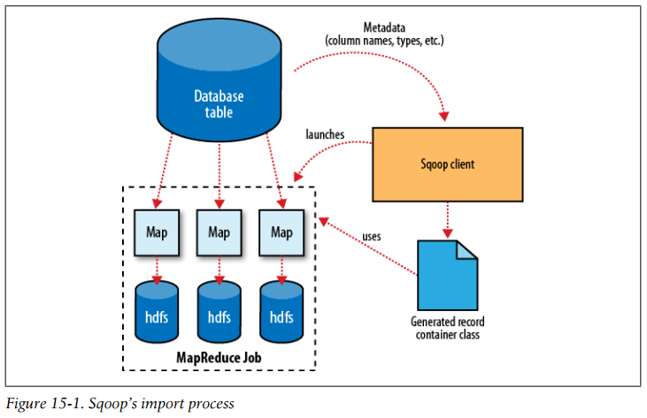
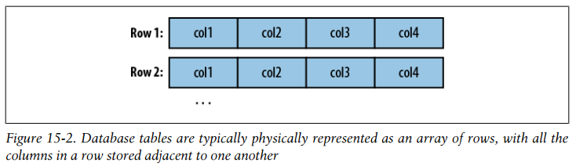
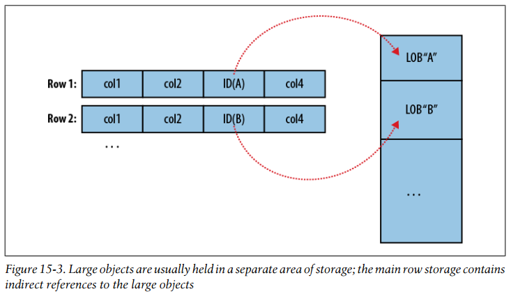
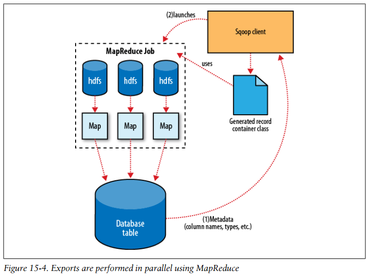

## Chapter 15: Sqoop

- Apache Sqoop is an open source tool that allows users to extract data from a structured data store into Hadoop for further processing. This processing can be done with MapReduce programs or other higher-level tools such as Hive. (It’s even possible to use Sqoop to move data from a database into HBase.) When the final results of an analytic pipeline are available, Sqoop can export these results back to the data store for consumption by other clients.

- Sqoop has an extension framework that makes it possible to import data from—and export data to—any external storage system that has bulk data transfer capabilities. A Sqoop connector is a modular component that uses this framework to enable Sqoop imports and exports.

- Sqoop’s import tool will run a MapReduce job that connects to the MySQL database and reads the table. By default, this will use four map tasks in parallel to speed up the import process. Each task will write its imported results to a different file, but all in a common directory.

	By default, Sqoop will generate comma-delimited text files for our imported data. Delimiters can be specified explicitly, as well as field enclosing and escape characters, to allow the presence of delimiters in the field contents.

- Both Avro datafiles and SequenceFiles provide the most precise representation possible of the imported data. They also allow data to be compressed while retaining MapReduce’s ability to process different sections of the same file in parallel.

- Sqoop’s import process  
  

- More critical to the import system’s operation, though, are the serialization methods that form the DBWritable interface, which allow the Widget class to interact with JDBC:
  ```java
  public void readFields(ResultSet __dbResults) throws SQLException;
  public void write(PreparedStatement __dbStmt) throws SQLException;
  ```

	JDBC’s ResultSet interface provides a cursor that retrieves records from a query; the readFields() method here will populate the fields of the Widget object with the columns from one row of the ResultSet’s data. The write() method shown here allows Sqoop to insert new Widget rows into a table, a process called exporting.

	Reading a table is typically done with a simple query such as:
  ```sql
  SELECT col1,col2,col3,... FROM tableName
  ```

	But often, better import performance can be gained by dividing this query across multiple nodes. This is done using a splitting column. Using metadata about the table, Sqoop will guess a good column to use for splitting the table (typically the primary key for the table, if one exists). The minimum and maximum values for the primary key column are retrieved, and then these are used in conjunction with a target number of tasks to determine the queries that each map task should issue.

	After generating the deserialization code and configuring the InputFormat, Sqoop sends the job to the MapReduce cluster. Map tasks execute the queries and deserialize rows from the ResultSet into instances of the generated class, which are either stored directly in SequenceFiles or transformed into delimited text before being written to HDFS.

- Some databases offer specific tools designed to extract data quickly. For example, MySQL’s mysqldump application can read from a table with greater throughput than a JDBC channel. The use of these external tools is referred to as direct mode in Sqoop’s documentation.

- This three-step process of importing data to HDFS, creating the Hive table, and then loading the HDFS-resident data into Hive can be shortened to one step if you know that you want to import straight from a database directly into Hive. During an import, Sqoop can generate the Hive table definition and then load in the data.

- Most databases provide the capability to store large amounts of data in a single field. Depending on whether this data is textual or binary in nature, it is usually represented as a CLOB or BLOB column in the table.

- Database tables are typically physically represented as an array of rows, with all the columns in a row stored adjacent to one another  
  

- Large objects are usually held in a separate area of storage; the main row storage contains indirect references to the large objects  
  

- As shown earlier, records imported by Sqoop are laid out on disk in a fashion very similar to a database’s internal structure: an array of records with all fields of a record concatenated together. When running a MapReduce program over imported records, each map task must fully materialize all fields of each record in its input split. If the contents of a large object field are relevant only for a small subset of the total number of records used as input to a MapReduce program, it would be inefficient to fully materialize all these records. Furthermore, depending on the size of the large object, full materialization in memory may be impossible.

	To overcome these difficulties, Sqoop will store imported large objects in a separate file called a LobFile. The LobFile format can store individual records of very large size (a 64-bit address space is used). Each record in a LobFile holds a single large object. The LobFile format allows clients to hold a reference to a record without accessing the record contents. When records are accessed, this is done through a java.io.Input Stream (for binary objects) or java.io.Reader (for character-based objects).

	When a record is imported, the “normal” fields will be materialized together in a text file, along with a reference to the LobFile where a CLOB or BLOB column is stored.

- Exports are performed in parallel using MapReduce  
  

- The JDBC-based export strategy builds up batch INSERT statements that will each add multiple records to the target table. Inserting many records per statement performs much better than executing many single-row INSERT statements on most database systems.

	For MySQL, Sqoop can employ a direct-mode strategy using mysqlimport. Each map task spawns a mysqlimport process that it communicates with via a named FIFO on the local filesystem. Data is then streamed into mysqlimport via the FIFO channel, and from there into the database.

- Due to the parallel nature of the process, often an export is not an atomic operation. Sqoop will spawn multiple tasks to export slices of the data in parallel. These tasks can complete at different times, meaning that even though transactions are used inside tasks, results from one task may be visible before the results of another task. Moreover, databases often use fixed-size buffers to store transactions. As a result, one transaction cannot necessarily contain the entire set of operations performed by a task. Sqoop commits results every few thousand rows, to ensure that it does not run out of memory. These intermediate results are visible while the export continues. Applications that will use the results of an export should not be started until the export process is complete, or they may see partial results.

	To solve this problem, Sqoop can export to a temporary staging table, and then at the end of the job—if the export has succeeded—move the staged data into the destination table in a single transaction.

- Sqoop can also export records stored in SequenceFiles to an output table, although some restrictions apply. A SequenceFile can contain arbitrary record types. Sqoop’s export tool will read objects from SequenceFiles and send them directly to the OutputCollector, which passes the objects to the database export OutputFormat. To work with Sqoop, the record must be stored in the “value” portion of the SequenceFile’s key-value pair format and must subclass the org.apache.sqoop.lib.SqoopRecord abstract class.