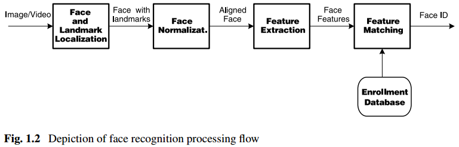
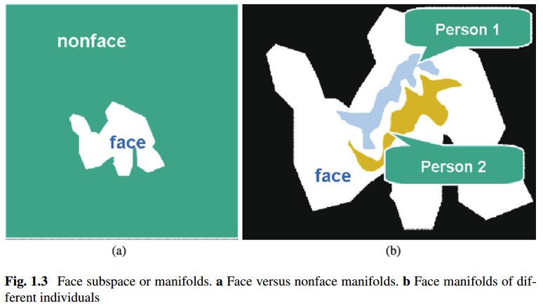

## Chapter 01: Introduction

### Face Recognition

### Categorization

- As a biometric system, a face recognition system operates in either or both of two modes: (1) face verification (or authentication), and (2) face identification (or recognition). Face verification involves a one-to-one match that compares a query face image against an enrollment face image whose identity is being claimed. Face identification involves one-to-many matching that compares a query face against multiple faces in the enrollment database to associate the identity of the query face to one of those in the database.

### Processing Workflow

- Depiction of face recognition processing flow  
  

- Face detection segments the face area from the background. In the case of video, the detected faces may need to be tracked across multiple frames using a face tracking component. While face detection provides a coarse estimate of the location and scale of the face, face landmarking localizes facial landmarks (e.g., eyes, nose, mouth, and facial outline). This may be accomplished by a landmarking module or face alignment module.

- Face normalization is performed to normalize the face geometrically and photometrically. This is necessary because state-of-the-art recognition methods are expected to recognize face images with varying pose and illumination. The geometrical normalization process transforms the face into a standard frame by face cropping. Warping or morphing may be used for more elaborate geometric normalization. The photometric normalization process normalizes the face based on properties such as illumination and gray scale.

- Face feature extraction is performed on the normalized face to extract salient information that is useful for distinguishing faces of different persons and is robust with respect to the geometric and photometric variations. The extracted face features are used for face matching.

- In face matching the extracted features from the input face are matched against one or many of the enrolled faces in the database. The matcher outputs ‘yes’ or ‘no’ for 1:1 verification; for 1:N identification, the output is the identity of the input face when the top match is found with sufficient confidence or unknown when the tip match score is below a threshold. The main challenge in this stage of face recognition is to find a suitable similarity metric for comparing facial features.

### Face Subspace

- The eigenface or PCA method [19, 42] derives a small number (typically 40 or lower) of principal components or eigenfaces from a set of training face images. Given the eigenfaces as basis for a face subspace, a face image is compactly represented by a low dimensional feature vector and a face can be reconstructed as a linear combination of the eigenfaces. The use of subspace modeling techniques has significantly advanced the face recognition technology.

- Face_subspace_or_manifolds  
  

- The manifold or distribution of all the faces accounts for variations in facial appearance whereas the nonface manifold accounts for all objects other than the faces. If we examine these manifolds in the image space, we find them highly nonlinear and nonconvex. Face detection can be considered as a task of distinguishing between the face and nonface manifolds in the image (subwindow) space and face recognition can be considered as a task of distinguishing between faces of different individuals in the face manifold.

### Technology Challenges

### Solution Strategies

### Current Status

### Summary