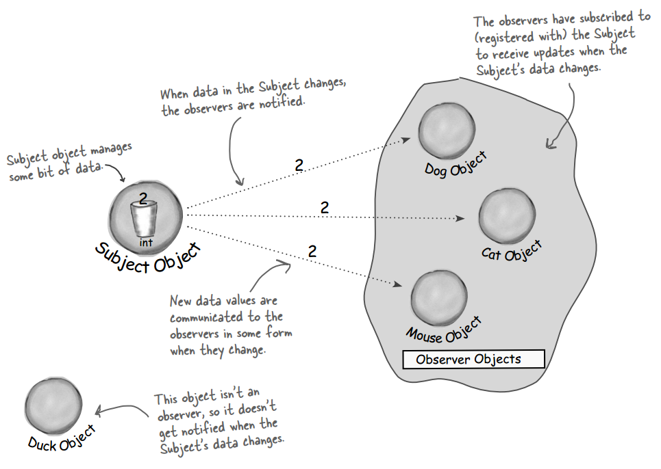
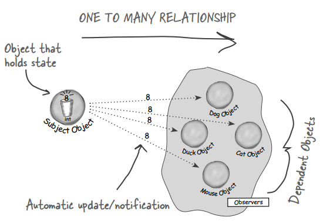
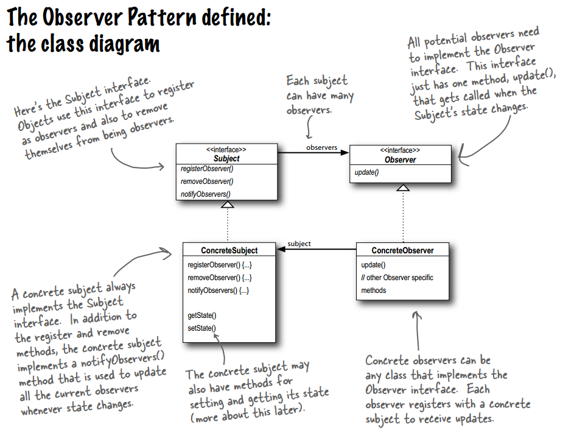
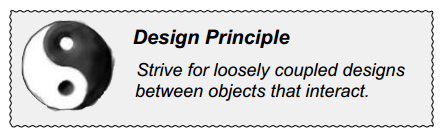

## Chapter 02: the Observer Pattern

- Publishers + Subscribers = Observer Pattern

- If you understand newspaper subscriptions, you pretty much understand the Observer Pattern, only we call the publisher the SUBJECT and the subscribers the OBSERVERS.

- subject-observer
  

- The Observer Pattern defines a one-to-many dependency between objects so that when one object changes state, all of its dependents are notified and updated automatically.

- observer pattern  
  

- observer pattern class diagram  
  

- When two objects are loosely coupled, they can interact, but have very little knowledge of each other. The Observer Pattern provides an object design where subjects and observers are loosely coupled.

- design principle  
  

- Loosely coupled designs allow us to build flexible OO systems that can handle change because they minimize the interdependency between objects.

- Java has built-in support in several of its APIs. The most general is the Observer interface and the Observable class in the java.util package. These are quite similar to our Subject and Observer interface, but give you a lot of functionality out of the box. You can also implement either a push or pull style of update to your observers.

- If you look under the hood at JButton’s superclass, AbstractButton, you’ll see that it has a lot of add/remove listener methods. These methods allow you to add and remove observers, or as they are called in Swing, listeners, to listen for various types of events that occur on the Swing component. For instance, an ActionListener lets you “listen in” on any types of actions that might occur on a button, like a button press. You’ll find various types of listeners all over the Swing API.

- BULLET POINTS
	- The Observer Pattern defines a one-to-many relationship between objects.
	- Subjects, or as we also know them, Observables, update Observers using a common interface.
	- Observers are loosely coupled in that the Observable knows nothing about them, other than that they implement the Observer Interface.
	- You can push or pull data from the Observable when using the pattern (pull is considered more “correct”).
	- Don’t depend on a specific order of notification for your Observers.
	- Java has several implementations of the Observer Pattern, including the general purpose java.util.Observable.
	- Watch out for issues with the java.util.Observable implementation.
	- Don’t be afraid to create your own Observable implementation if needed.
	- Swing makes heavy use of the Observer Pattern, as do many GUI frameworks.
	- You’ll also find the pattern in many other places, including JavaBeans and RMI.
