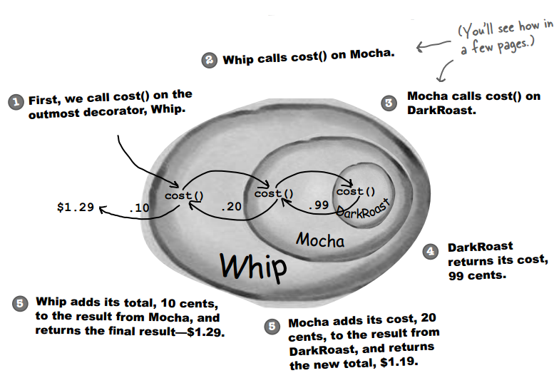
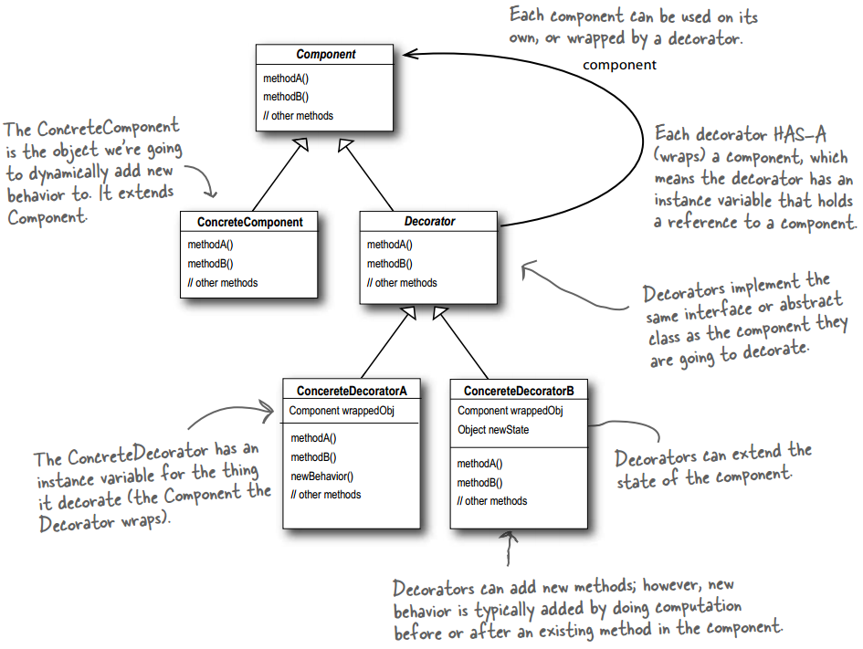
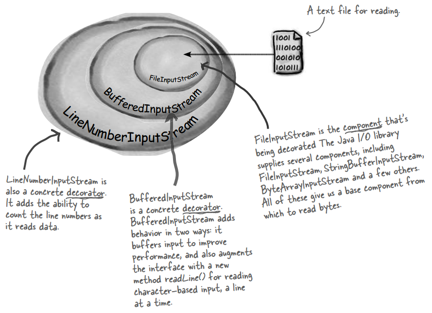
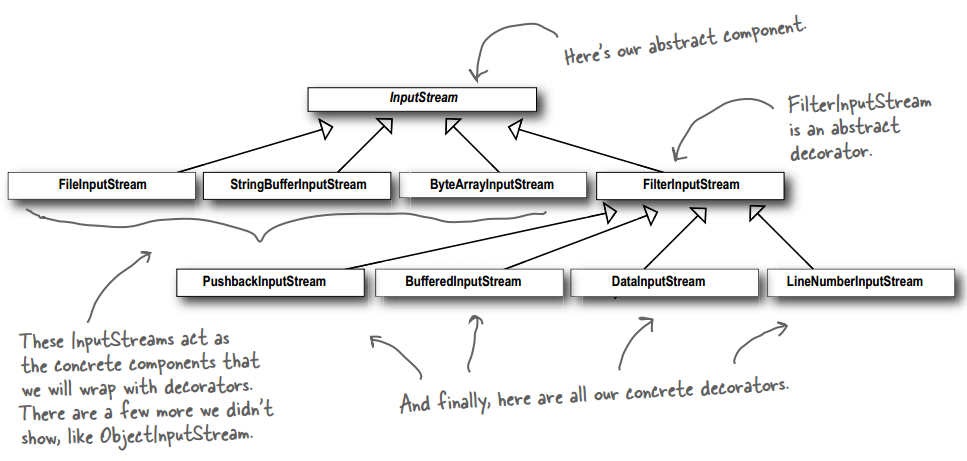

## Chapter 03: the Decorator Pattern

- design principle  
  

- decorator pattern  
  

- Okay, here’s what we know so far...
	- Decorators have the same supertype as the objects they decorate.
	- You can use one or more decorators to wrap an object.
	- Given that the decorator has the same supertype as the object it decorates, we can pass around a decorated object in place of the original (wrapped) object.
	- The decorator adds its own behavior either before and/or after delegating to the object it decorates to do the rest of the job.
	- Objects can be decorated at any time, so we can decorate objects dynamically at runtime with as many decorators as we like.

- The Decorator Pattern attaches additional responsibilities to an object dynamically. Decorators provide a fl exible alternative to subclassing for extending functionality.

- decorator pattern class diagram  
  

- Java I/O
  
  

- But Java I/O also points out one of the downsides of the Decorator Pattern: designs using this pattern often result in a large number of small classes that can be overwhelming to a developer trying to use the Decorator-based API.

- BULLET POINTS
	- Inheritance is one form of extension, but not necessarily the best way to achieve flexibility in our designs.
	- In our designs we should allow behavior to be extended without the need to modify existing code.
	- Composition and delegation can often be used to add new behaviors at runtime.
	- The Decorator Pattern provides an alternative to subclassing for extending behavior.
	- The Decorator Pattern involves a set of decorator classes that are used to wrap concrete components.
	- Decorator classes mirror the type of the components they decorate. (In fact, they are the same type as the components they decorate, either through inheritance or interface implementation.)
	- Decorators change the behavior of their components by adding new functionality before and/or after (or even in place of) method calls to the component.
	- You can wrap a component with any number of decorators.
	- Decorators are typically transparent to the client of the component; that is, unless the client is relying on the component’s concrete type.
	- Decorators can result in many small objects in our design, and overuse can be complex.