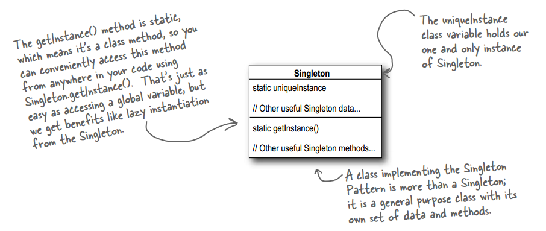
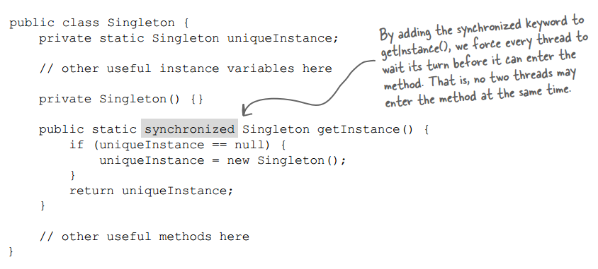
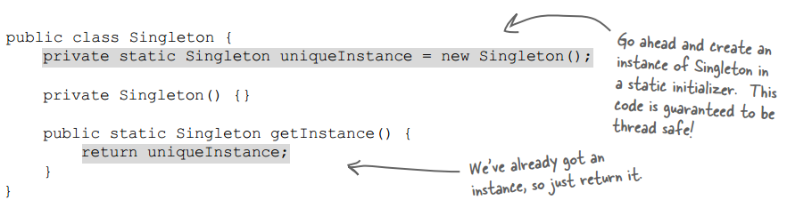
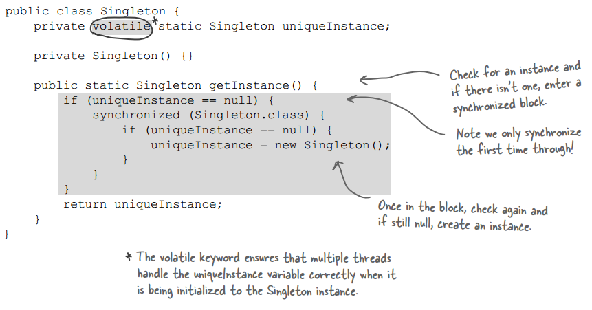

## Chapter 05: the Singleton Pattern

- The Singleton Pattern ensures a class has only one instance, and provides a global point of access to it.

 - singleton class diagram  
  

- synchronized getInstance  
  

- eagerly created instance  
  

- double checked locking  
  

- If you have two or more classloaders, you can load the same class multiple times (once in each classloader). Now, if that class happens to be a Singleton, then since we have more than one version of the class, we also have more than one instance of the Singleton. So, if you are using multiple classloaders and Singletons, be careful. One way around this problem is to specify the classloader yourself.

- In Java, global variables are basically static references to objects. There are a couple of disadvantages to using global variables in this manner. We’ve already mentioned one: the issue of lazy versus eager instantiation. But we need to keep
in mind the intent of the pattern: to ensure only one instance of a class exists and to provide global access. A global variable can provide the latter, but not the former. Global variables also tend to encourage developers to pollute the namespace with lots of global references to small objects. Singletons don’t encourage this in the same way, but can be abused nonetheless.

- BULLET POINTS
	- The Singleton Pattern ensures you have at most one instance of a class in your application.
	- The Singleton Pattern also provides a global access point to that instance.
	- Java’s implementation of the Singleton Pattern makes use of a private constructor, a static method combined with a static variable.
	- Examine your performance and resource constraints and carefully choose an appropriate Singleton implementation for multithreaded applications (and we should consider all applications multithreaded!).
	- Beware of the double-checked locking implementation; it is not thread-safe in versions before Java 2, version 5.
	- Be careful if you are using multiple class loaders; this could defeat the Singleton implementation and result in multiple instances.
	- If you are using a JVM earlier than 1.2, you’ll need to create a registry of Singletons to defeat the garbage collector.