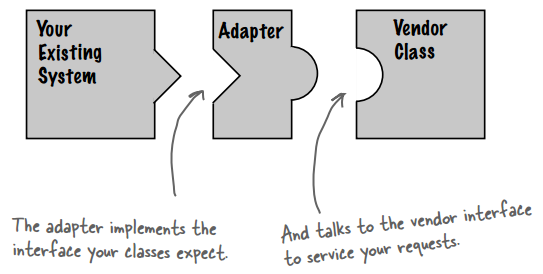
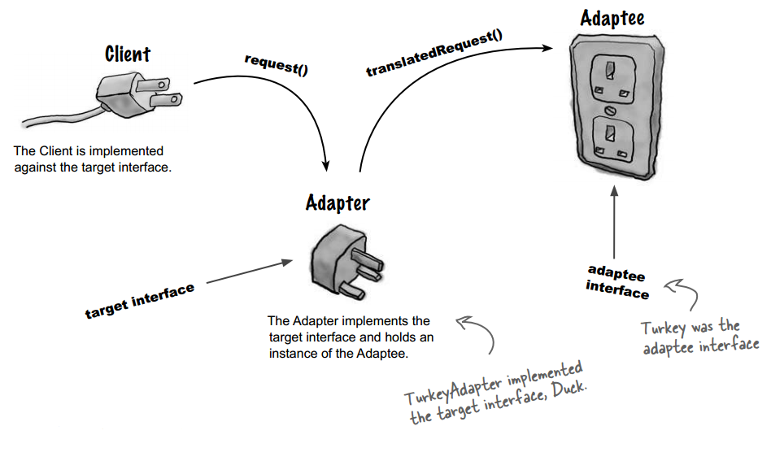
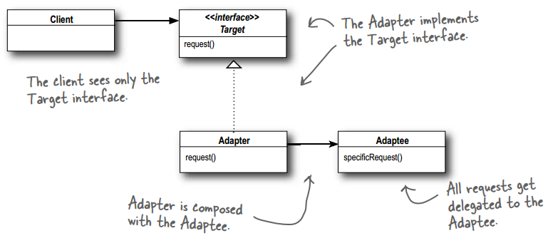
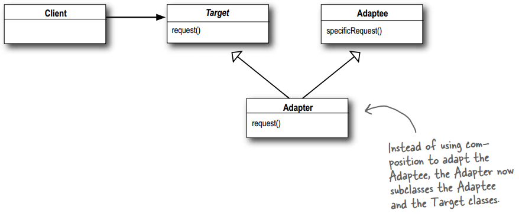
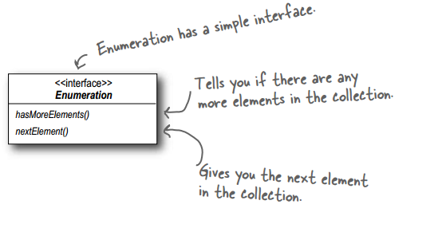
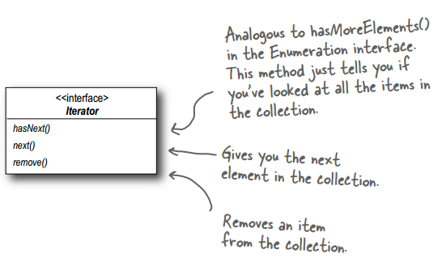
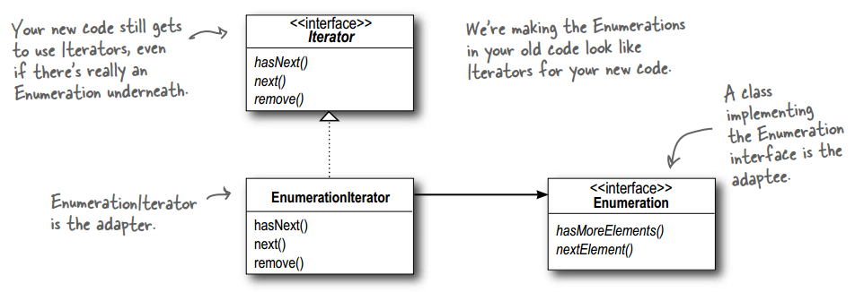
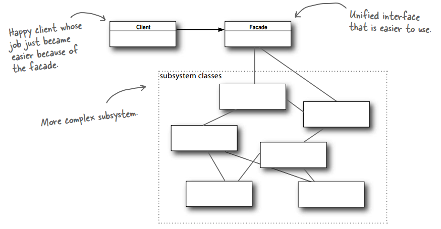
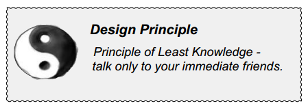

## Chapter 07: the Adapter and Facade Patterns

- Adapter  
  

- adapter pattern  
  

- Here’s how the Client uses the Adapter
	- The client makes a request to the adapter by calling a method on it using the target interface.
	- The adapter translates the request into one or more calls on the adaptee using the adaptee interface.
	- The client receives the results of the call and never knows there is an adapter doing the translation.

- The Adapter Pattern converts the interface of a class into another interface the clients expect. Adapter lets classes work together that couldn’t otherwise because of incompatible interfaces.

- Object adapter  
  

- Class adapter  
  

- If you’ve been around Java for a while you probably remember that the early collections types (Vector, Stack, Hashtable, and a few others) implement a method elements(), which returns an Enumeration. The Enumeration interface allows you to step through the elements of a collection without knowing the specifi cs of how they are managed in the collection.

- Enumerators  
  

- When Sun released their more recent Collections classes they began using an Iterator interface that, like Enumeration, allows you to iterate through a set of items in a collection, but also adds the ability to remove items.

- Iterators  
  

- Adapting an enumeration to an iterator  
  

- A Facade is just what you need: with the Facade Pattern you can take a complex subsystem and make it easier to use by implementing a Facade class that provides one, more reasonable interface. Don’t worry; if you need the power of the complex subsystem, it’s still there for you to use, but if all you need is a straightforward interface, the Facade is there for you.

- A facade not only simplifies an interface, it decouples a client from a subsystem of components.

- Facades and adapters may wrap multiple classes, but a facade’s intent is to simplify, while an adapter’s is to convert the interface to something different.

- The Facade Pattern provides a unified interface to a set of interfaces in a subsytem. Facade defines a higher-level interface that makes the subsystem easier to use.

- Facade pattern class diagram  
  

- design priciple  
  

- The principle provides some guidelines: take any object; now from any method in that object, the principle tells us that we should only invoke methods that belong to:
	- The object itself
	- Objects passed in as a parameter to the method
	- Any object the method creates or instantiates
	- Any components of the object

- BULLET POINTS
	- When you need to use an existing class and its interface is not the one you need, use an adapter.
	- When you need to simplify and unify a large interface or complex set of interfaces, use a facade.
	- An adapter changes an interface into one a client expects.
	- A facade decouples a client from a complex subsystem.
	- Implementing an adapter may require little work or a great deal of work depending on the size and complexity of the target interface.
	- Implementing a facade requires that we compose the facade with its subsystem and use delegation to perform the work of the facade.
	- There are two forms of the Adapter Pattern: object and class adapters. Class adapters require multiple inheritance.
	- You can implement more than one facade for a subsystem.
	- An adapter wraps an object to change its interface, a decorator wraps an object to add new behaviors and responsibilities, and a facade “wraps” a set of objects to simplify.