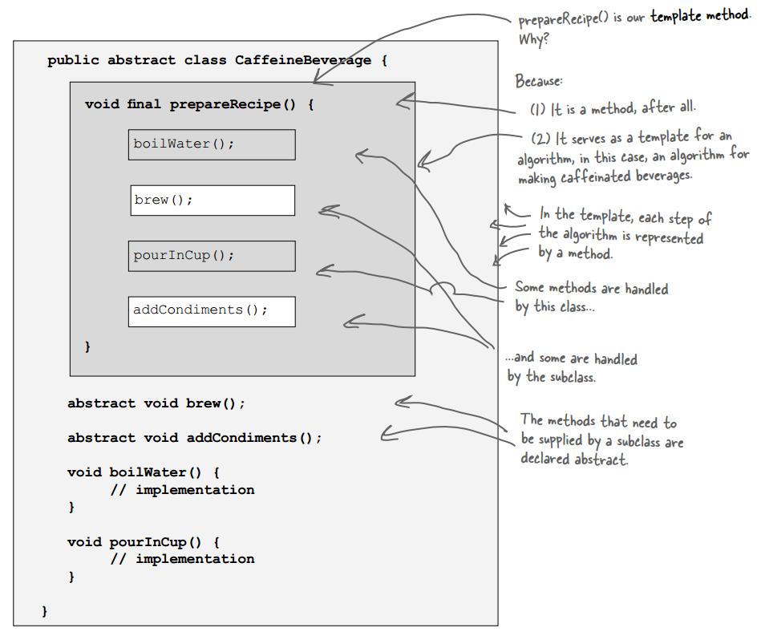
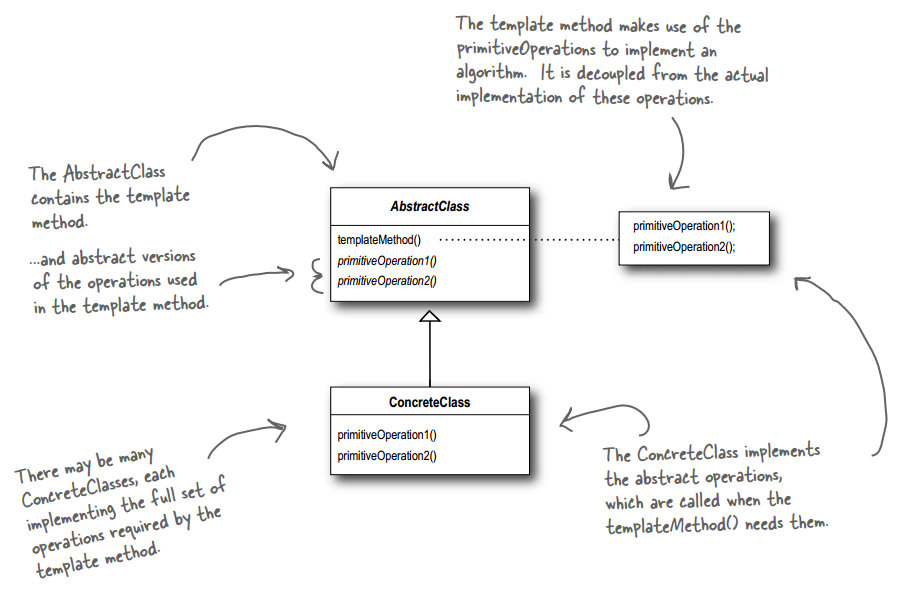
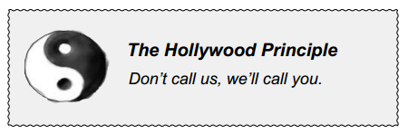
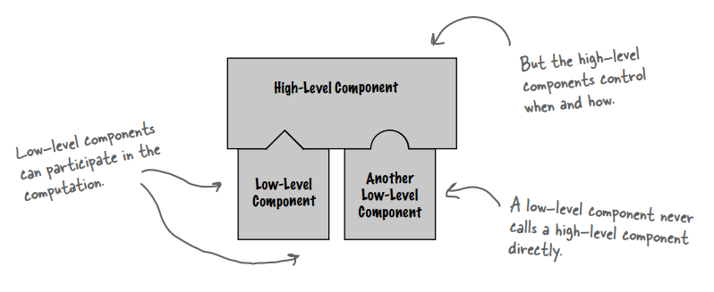

## Chapter 08: the Template Method Pattern

- Template method pattern  
  

- The Template Method defines the steps of an algorithm and allows subclasses to provide the implementation for one or more steps.

- The Template Method Pattern defi nes the skeleton of an algorithm in a method, deferring some steps to subclasses. Template Method lets subclasses redefine certain steps of an algorithm without changing the algorithm’s structure.

- This pattern is all about creating a template for an algorithm. What’s a template? As you’ve seen it’s just a method; more specifi cally, it’s a method that defines an algorithm as a set of steps. One or more of these steps is defi ned to be abstract and implemented by a subclass. This ensures the algorithm’s structure stays unchanged, while subclasses provide some part of the implementation.

- Template method pattern class diagram  
  

- A hook is a method that is declared in the abstract class, but only given an empty or default implementation. This gives
subclasses the ability to “hook into” the algorithm at various points, if they wish; a subclass is also free to ignore the hook.

- design principle  
  

- the Hollywood principle  
  

- sorting with template method  
  

- If you haven’t encountered JFrame, it’s the most basic Swing container and inherits a paint() method. By default, paint() does nothing because it’s a hook! By overriding paint(), you can insert yourself into JFrame’s algorithm for displaying its area of the screen and have your own graphic output incorporated into the JFrame.

- Concrete applets make extensive use of hooks to supply their own behaviors. Because these methods are implemented as hooks, the applet isn’t required to implement them.

- BULLET POINTS
	- A “template method” defines the steps of an algorithm, deferring to subclasses for the implementation of those steps.
	- The Template Method Pattern gives us an important technique for code reuse.
	- The template method’s abstract class may define concrete methods, abstract methods and hooks.
	- Abstract methods are implemented by subclasses.
	- Hooks are methods that do nothing or default behavior in the abstract class, but may be overridden in the subclass.
	- To prevent subclasses from changing the algorithm in the template method, declare the template method as final.
	- The Hollywood Principle guides us to put decision-making in high-level modules that can decide how and when to call low level modules.
	- You’ll see lots of uses of the Template Method Pattern in real world code, but don’t expect it all (like any pattern) to be designed “by the book.”
	- The Strategy and Template Method Patterns both encapsulate algorithms, one by inheritance and one by composition.
	- The Factory Method is a specialization of Template Method.