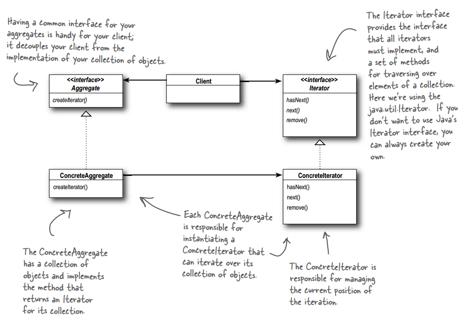
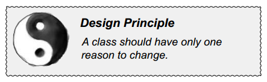
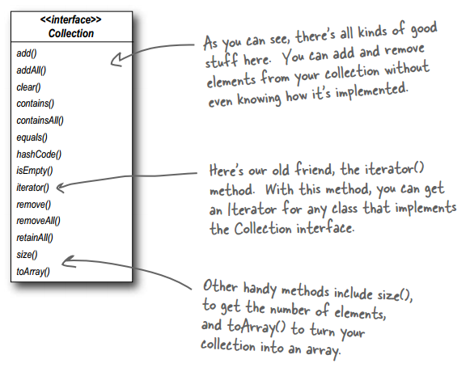
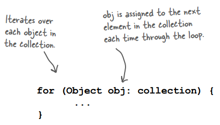
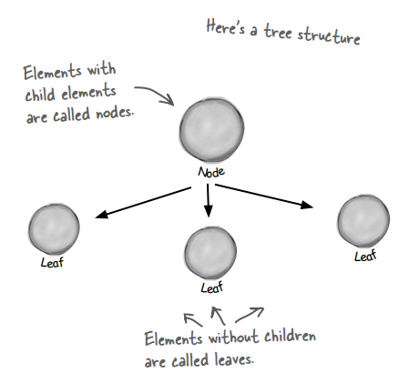
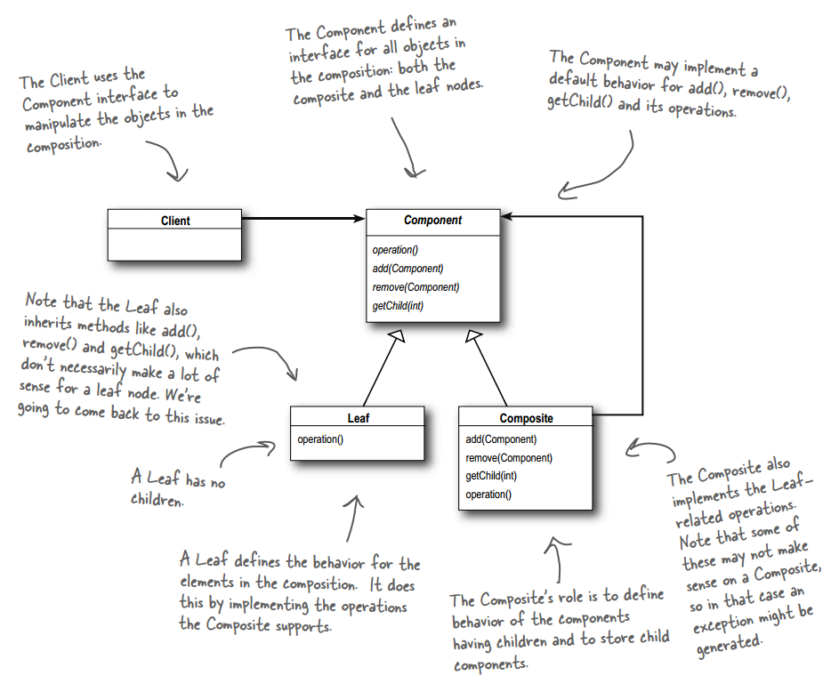

## Chapter 09: the Iterator and Composite Patterns

- When we say COLLECTION we just mean a group of objects. They might be stored in very different data structures like lists, arrays, hashtables, but they’re still collections. We also sometimes call these AGGREGATES.

- The Iterator Pattern provides a way to access the elements of an aggregate object sequentially without exposing its underlying representation.

- The Iterator Pattern allows traversal of the elements of an aggregate without exposing the underlying implementation. It also places the task of traversal on the iterator object, not on the aggregate, which simplifies the aggregate interface and implementation, and places the responsibility where it should be.

- Iterator  
  

- design principle  
  

- Every responsibility of a class is an area of potential change. More than one responsibility means more than one area of change. This principle guides us to keep each class to a single responsibility.

- Cohesion is a term you’ll hear used as a measure of how closely a class or a module supports a single purpose or responsibility. We say that a module or class has high cohesion when it is designed around a set of related functions, and we say it has low cohesion when it is designed around a set of unrelated functions. Cohesion is a more general concept
than the Single Responsibility Principle, but the two are closely related. Classes that adhere to the principle tend to have high cohesion and are more maintainable than classes that take on multiple responsibilities and have low cohesion.

- Collection  
  

- Java 5 includes a new form of the for statement, called for/in, that lets you iterate over a collection or an array without creating an iterator explicitly.

- foreach  
  

- The Composite Pattern allows you to compose objects into tree structures to represent part-whole hierarchies. Composite lets clients treat individual objects and compositions of objects uniformly.

- tree  
  

- The Composite Pattern allows us to build structures of objects in the form of trees that contain both compositions of objects and individual objects as nodes. Using a composite structure, we can apply the same operations over both composites and individual objects. In other words, in most cases we can ignore the differences between compositions of objects and individual objects.

- composite pattern  
  

- Sometimes, if the composite structure is complex or expensive to traverse, it’s helpful to implement caching of the composite nodes. For instance, if you are constantly traversing a composite and all its children to compute some result, you could implement a cache that stores the result temporarily to save traversals.

- BULLET POINTS
	- An Iterator allows access to an aggregate’s elements without exposing its internal structure.
	- An Iterator takes the job of iterating over an aggregate and encapsulates it in another object.
	- When using an Iterator, we relieve the aggregate of the responsibility of supporting operations for traversing its data.
	- An Iterator provides a common interface for traversing the items of an aggregate, allowing you to use polymorphism when writing code that makes use of the items of the aggregate.
	- We should strive to assign only one responsibility to each class.
	- The Composite Pattern provides a structure to hold both individual objects and composites.
	- The Composite Pattern allows clients to treat composites and individual objects uniformly.
	- A Component is any object in a Composite structure. Components may be other composites or leaf nodes.
	- There are many design tradeoffs in implementing Composite. You need to balance transparency and safety with your needs.