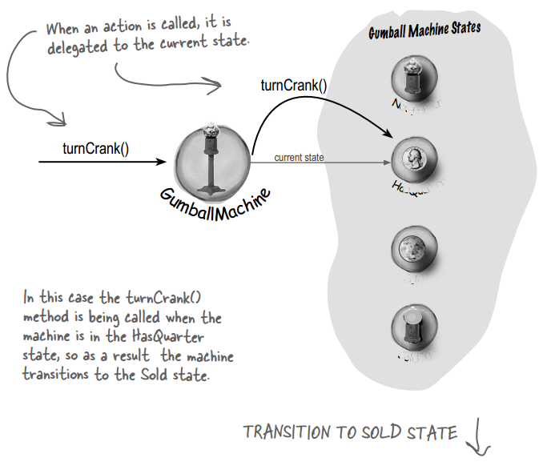
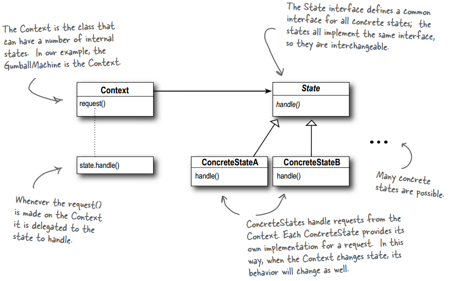

## Chapter 10: the State Pattern

- State pattern  
  

- The State Pattern allows an object to alter its behavior when its internal state changes. The object will appear to change its class.

- Because the pattern encapsulates state into separate classes and delegates to the object representing the current state, we know that behavior changes along with the internal state. Think about it from the perspective of a client: if an object you’re using can completely change its behavior, then it appears to you that the object is actually instantiated from another class. In reality, however, you know that we are using composition to give the appearance of a class change by simply referencing different state objects.

- state pattern class diagram  
  

- With the State Pattern, we have a set of behaviors encapsulated in state objects; at any time the context is delegating to one of those states. Over time, the current state changes across the set of state objects to reflect the internal state of the context, so the context’s behavior changes over time as well. The client usually knows very little, if anything, about the state objects. With Strategy, the client usually specifies the strategy object that the context is composed with. Now, while the pattern provides the flexibility to change the strategy object at runtime, often there is a strategy object that is most appropriate for a context object.

- BULLET POINTS
	- The State Pattern allows an object to have many different behaviors that are based on its internal state.
	- Unlike a procedural state machine, the State Pattern represents state as a full-blown class.
	- The Context gets its behavior by delegating to the current state object it is composed with.
	- By encapsulating each state into a class, we localize any changes that will need to be made.
	- The State and Strategy Patterns have the same class diagram, but they differ in intent.
	- Strategy Pattern typically configures Context classes with a behavior or algorithm.
	- State Pattern allows a Context to change its behavior as the state of the Context changes.
	- State transitions can be controlled by the State classes or by the Context classes.
	- Using the State Pattern will typically result in a greater number of classes in your design.
	- State classes may be shared among Context instances.