## Chapter 11: the Proxy Pattern

- A remote proxy acts as a local representative to a remote object. What’s a “remote object?” It’s an object that lives in the heap of a different Java Virtual Machine (or more generally, a remote object that is running in a different address space). What’s a “local representative?” It’s an object that you can call local methods on and have them forwarded on to the remote object.

- proxy  
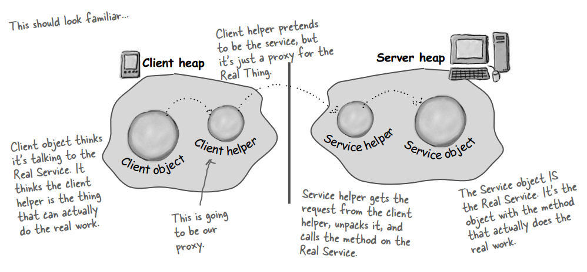  

- What RMI does for you is build the client and service helper objects, right down to creating a client helper object with the same methods as the remote service. The nice thing about RMI is that you don’t have to write any of the networking or I/O code yourself. With your client, you call remote methods (i.e., the ones the Real Service has) just like normal method calls on objects running in the client’s own local JVM. RMI also provides all the runtime infrastructure to make it all work, including a lookup service that the client can use to find and access the remote objects. There is one difference between RMI calls and local (normal) method calls. Remember that even though to the client it looks like the method call is local, the client helper sends the method call across the network. So there is networking and I/O. And what do we know about networking and I/O methods? They’re risky! They can fail! And so, they throw exceptions all over the place. As a result, the client does have to acknowledge the risk.

- Making the Remote service
	- Make a Remote Interface
	- Make a Remote Implementation
	- Generate the stubs and skeletons using rmic
	- Start the RMI registry (rmiregistry)
	- Start the remote service

- RMI  
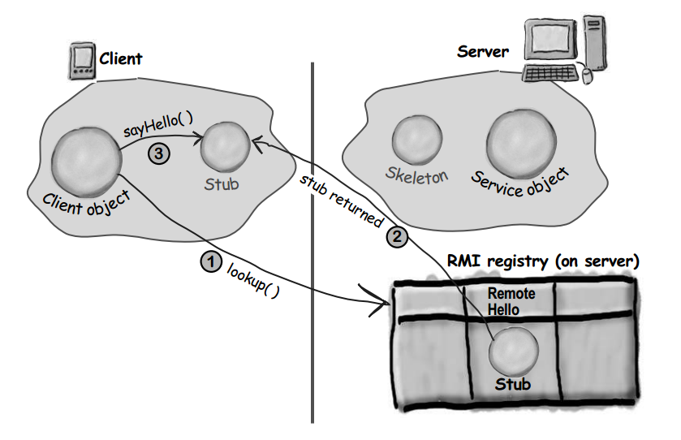  

- RMI server and client  
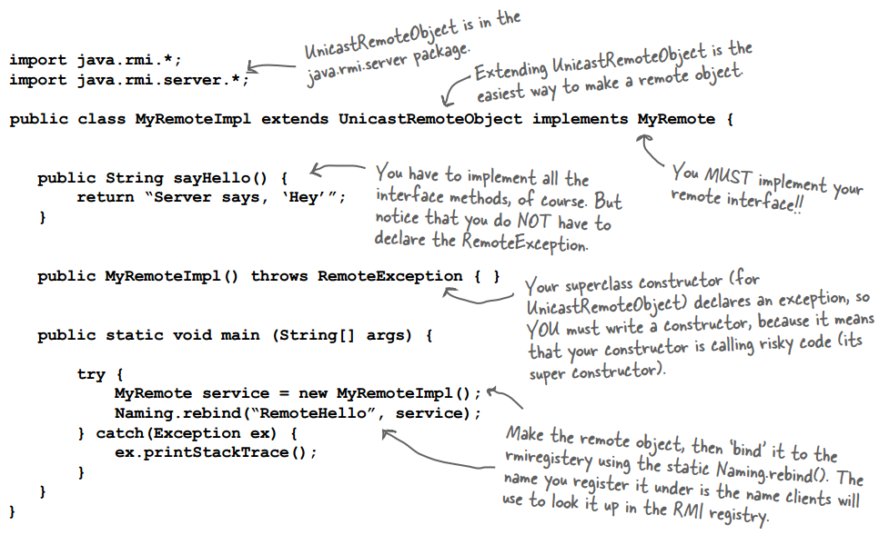  
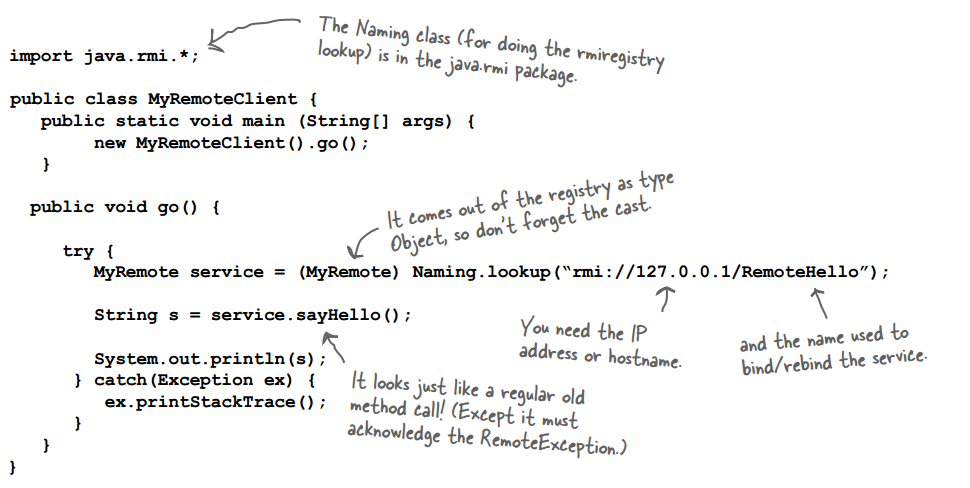  

- The Proxy Pattern provides a surrogate or placeholder for another object to control access to it.

- Use the Proxy Pattern to create a representative object that controls access to another object, which may be remote, expensive to create or in need of securing.

- proxy pattern class diagram  
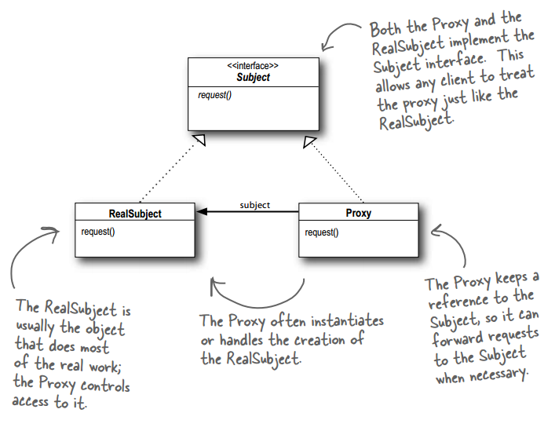  

- remote proxy  
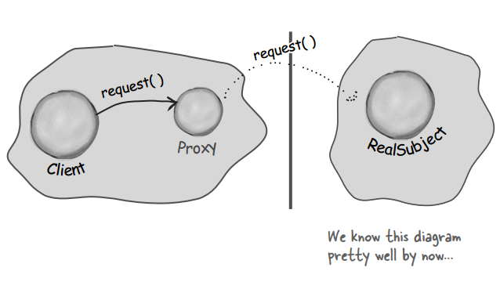  

- virtual proxy  
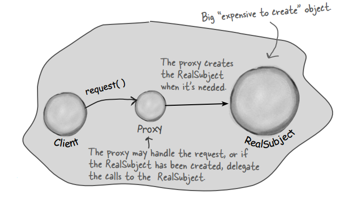  

- Java’s got its own proxy support right in the java.lang.refl ect package. With this package, Java lets you create a proxy class on the fl y that implements one or more interfaces and forwards method invocations to a class that you specify. Because the actual proxy class is created at runtime, we refer to this Java technology as a dynamic proxy.

- dynamic proxy class diagram  
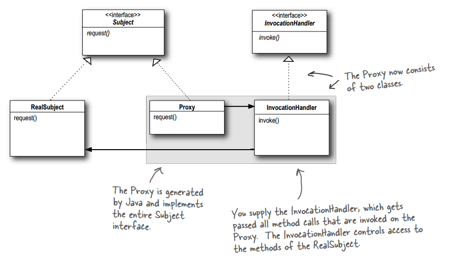  

- dynamic proxy  
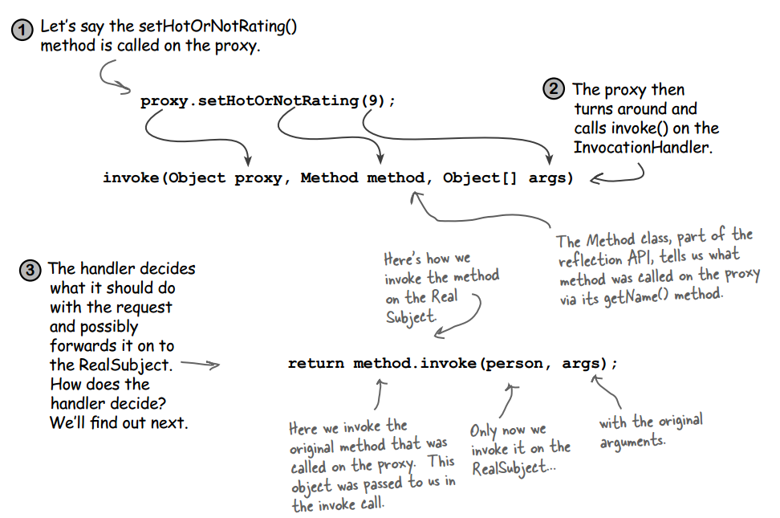  
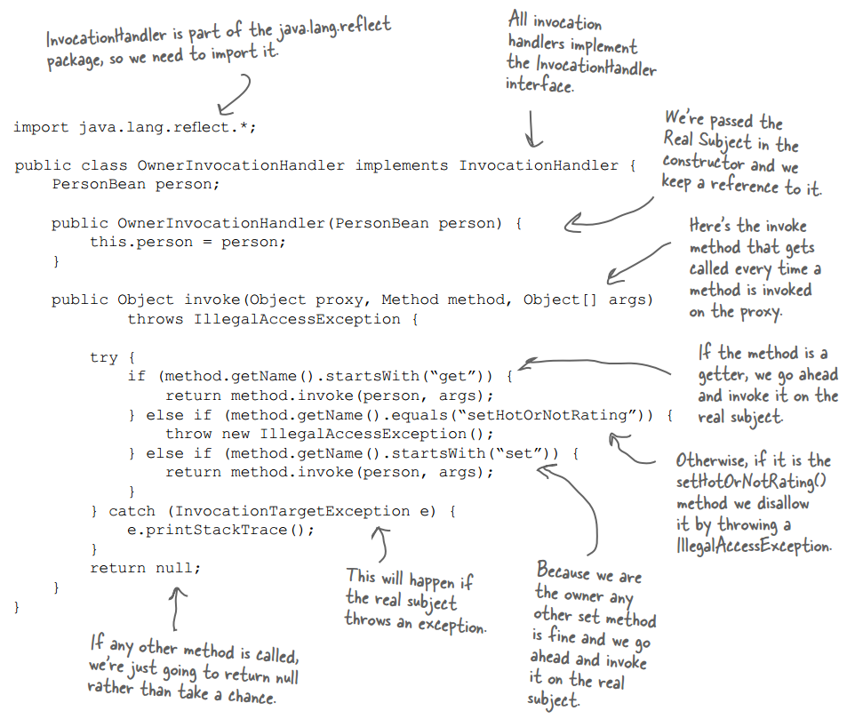  
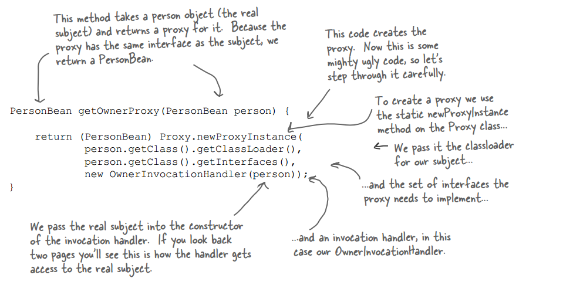  

- In Java 5, RMI and Dynamic Proxy got together and now stubs are generated dynamically using Dynamic Proxy. The remote object’s stub is a java.lang.reflect.Proxy instance (with an invocation handler) that is automatically generated to handle all the details of getting the local method calls by the client to the remote object. So, now you don’t have to use rmic at all; everything you need to get a client talking to a remote object is handled for you behind the scenes.

- BULLET POINTS
	- The Proxy Pattern provides a representative for another object in order to control the client’s access to it. There are a number of ways it can manage that access.
	- A Remote Proxy manages interaction between a client and a remote object.
	- A Virtual Proxy controls access to an object that is expensive to instantiate.
	- A Protection Proxy controls access to the methods of an object based on the caller.
	- Many other variants of the Proxy Pattern exist including caching proxies, synchronization proxies, firewall proxies, copy-on-write proxies, and so on.
	- Proxy is structurally similar to Decorator, but the two differ in their purpose.
	- The Decorator Pattern adds behavior to an object, while a Proxy controls access.
	- Java’s built-in support for Proxy can build a dynamic proxy class on demand and dispatch all calls on it to a handler of your choosing.
	- Like any wrapper, proxies will increase the number of classes and objects in your designs.