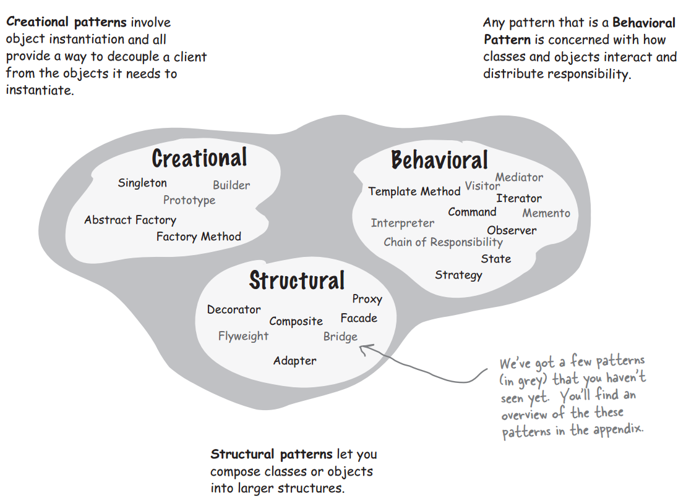

## Chapter 13: Better Living with Patterns

- A Pattern is a solution to a problem in a context.

- The context is the situation in which the pattern applies. This should be a recurring situation. The problem refers to the goal you are trying to achieve in this context, but it also refers to any constraints that occur in the context. The solution is what you’re after: a general design that anyone can apply which resolves the goal and set of constraints.

- “If you find yourself in a context with a problem that has a goal that is affected by a set of constraints, then you can apply a design that resolves the goal and constraints and leads to a solution.”

- The Design Pattern definition tells us that the problem consists of a goaland aset of constraints. Patterns gurus have a term for these: they call them forces. Why? Well, we’re sure they have their own reasons, but if you remember the movie, the force “shapes and controls the Universe.” Likewise, the forces in the pattern definition shape and control the solution. Only when a solution balances both sides of the force (the light side: your goal, and the dark side: the constraints) do we have a useful pattern. This “force” terminology can be quite confusing when you first see it in pattern discussions, but just remember that there are two sides of the force (goals and constraints) and that they need to be balanced or resolved to create a pattern solution. Don’t let the lingo get in your way and may the force be with you! 

- Classification  
  

- An Anti-Pattern tells you how to go from a problem to a BAD solution.

- An anti-pattern always looks like a good solution, but then turns out to be a bad solution when it is applied. By documenting antipatterns we help others to recognize bad solutions before they implement them.

- BULLET POINTS
	- Let Design Patterns emerge in your designs, don’t force them in just for the sake of using a pattern.
	- Design Patterns aren’t set in stone; adapt and tweak them to meet your needs.
	- Always use the simplest solution that meets your needs, even if it doesn’t include a pattern.
	- Study Design Pattern catalogs to familiarize yourself with patterns and the relationships among them.
	- Pattern classifications (or categories) provide groupings for patterns. When they help, use them.
	- You need to be committed to be a patterns writer: it takes time and patience, and you have to be willing to do lots of refinement.
	- Remember, most patterns you encounter will be adaptations of existing patterns, not new patterns.
	- Build your team’s shared vocabulary. This is one of the most powerful benefits of using patterns.
	- Like any community, the patterns community has its own lingo. Don’t let that hold you back. Having read this book, you now know most of it.