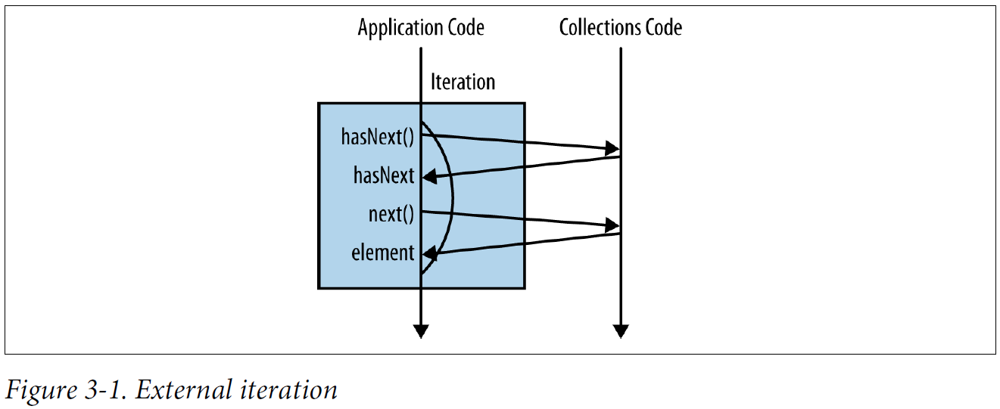
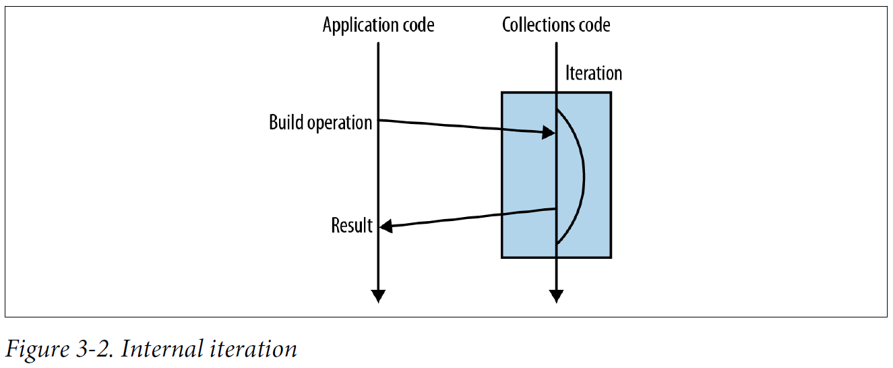
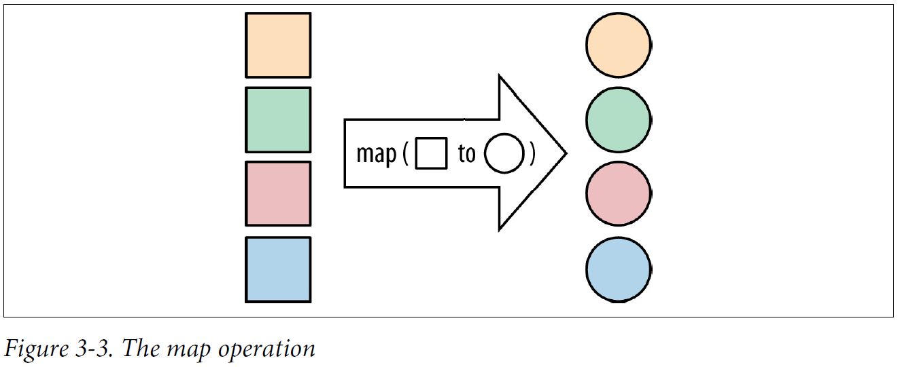
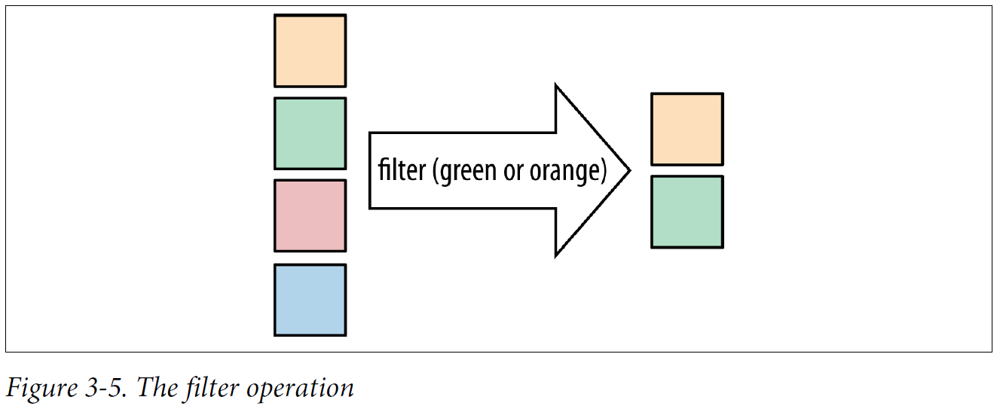
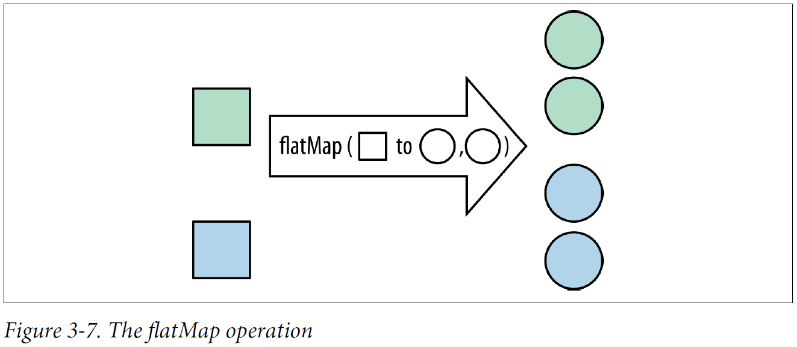
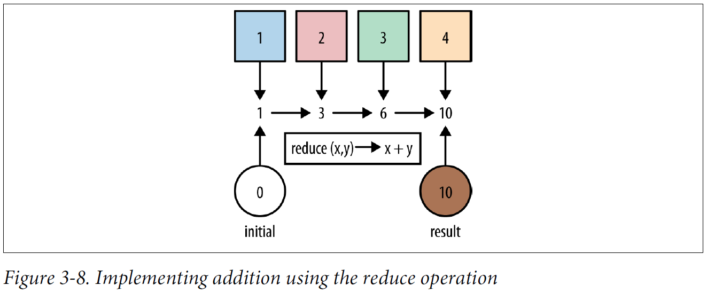

## Chapter 03: Streams

- Looking under the covers a little bit, the for loop is actually syntactic sugar that wraps up the iteration and hides it. It’s worth taking a moment to look at what’s going on under the hood here. The first step in this process is a call to the iterator method, which creates a new Iterator object in order to control the iteration process. We call this external iteration. The iteration then proceeds by explicitly calling the hasNext and next methods on this Iterator.

- External iteration  
  

- Internal iteration  
  

- In Java, when you call a method it traditionally corresponds to the computer actually doing something; for example, System.out.println("Hello World"); prints output to your terminal. Some of the methods on Stream work a little bit differently. They are normal Java methods, but the Stream object returned isn’t a new collection—it’s a recipe for creating a new collection.

	Methods such as filter that build up the Stream recipe but don’t force a new value to be generated at the end are referred to as lazy. Methods such as count that generate a final value out of the Stream sequence are called eager.

	It’s very easy to figure out whether an operation is eager or lazy: look at what it returns. If it gives you back a Stream, it’s lazy; if it gives you back another value or void, then it’s eager. This makes sense because the preferred way of using these methods is to form a sequence of lazy operations chained together and then to have a single eager operation at the end that generates your result.

	This whole approach is somewhat similar to the familiar builder pattern. In the builder pattern, there are a sequence of calls that set up properties or configuration, followed by a single call to a build method. The object being created isn’t created until the call to build occurs.

- collect(toList()) is an eager operation that generates a list from the values in a Stream.

- If you’ve got a function that converts a value of one type into another, map lets you apply this function to a stream of values, producing another stream of the new values.

- The map operation  
  

- Any time you’re looping over some data and checking each element, you might want to think about using the new filter method on Stream.

- The filter operation  
  

- flatMap lets you replace a value with a Stream and concatenates all the streams together.

- The flatMap operation  
  

- A pretty common operation that we might want to perform on streams is finding the maximum or minimum element. Fortunately, this case is very well covered by the max and min operations that are provided by the Streams API.

- Conveniently, Java 8 has added a static method called comparing that lets us build a comparator using keys. Previously, we always encountered an ugly pattern in which we had to write code that got a field out of both the objects being compared, then compare these field values. Now, to get the same element out of both elements being compared, we just provide a getter function for the value.

- The reduce pattern
  ```java
  Object accumulator = initialValue;
  for(Object element : collection) {
    accumulator = combine(accumulator, element);
  }
  ```

- Implementing addition using the reduce operation  
  

- Implementing sum using reduce
  ```java
  int count = Stream.of(1, 2, 3)
                    .reduce(0, (acc, element) -> acc + element);
  assertEquals(6, count);
  ```

- Expanding the application of reduce
  ```java
  BinaryOperator<Integer> accumulator = (acc, element) -> acc + element;
  int count = accumulator.apply(
                  accumulator.apply(
                      accumulator.apply(0, 1),
                  2),
              3);
  ```

- A higher-order function is a function that either takes another function as an argument or returns a function as its result. It’s very easy to spot a higher-order function: just look at its signature. If a functional interface is used as a parameter or return type, you have a higher-order function.