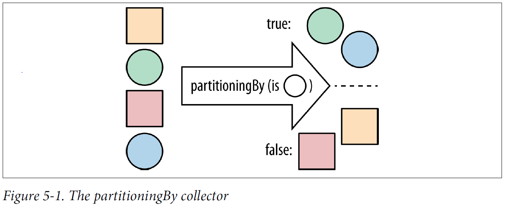
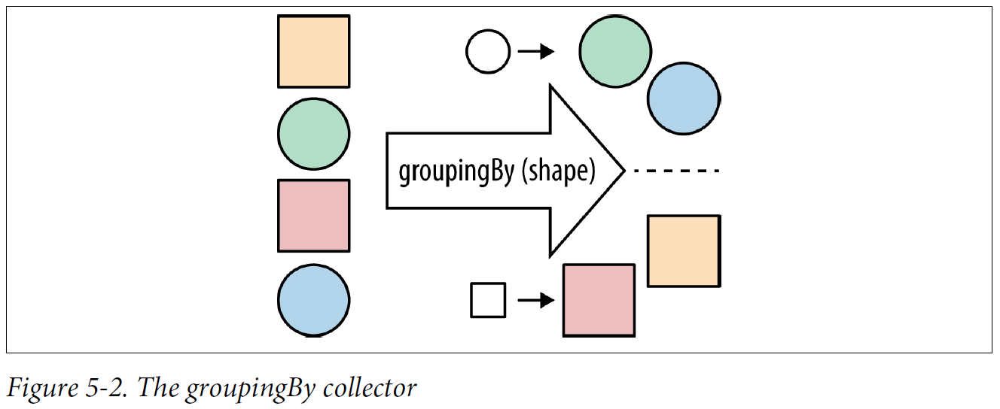
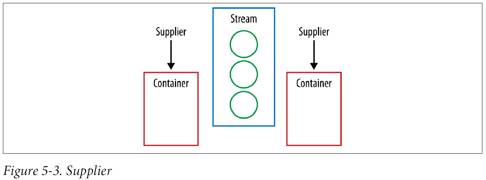
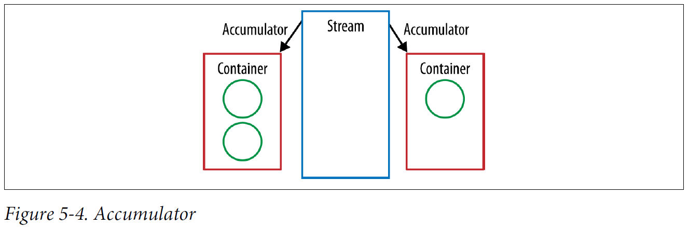
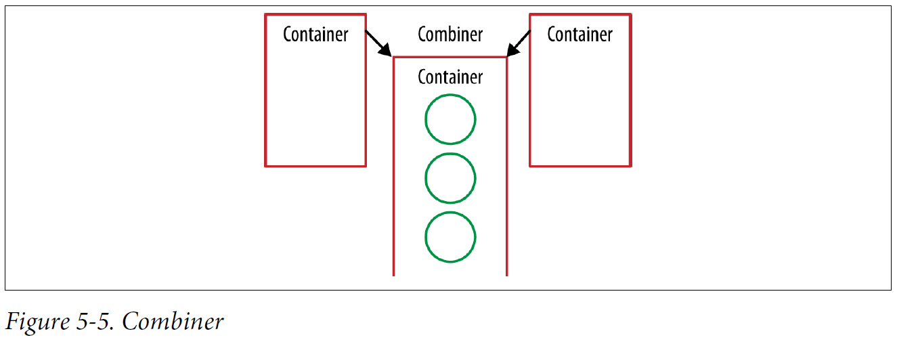
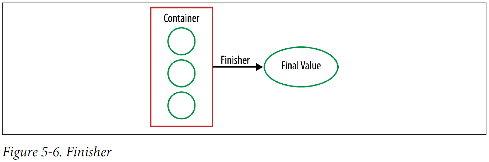

## Chapter 05: Advanced Collections and Collectors

- A common idiom you may have noticed is the creation of a lambda expression that calls a method on its parameter. If we want a lambda expression that gets the name of an artist, we would write the following:
  ```java
  artist -> artist.getName()
  ```

	This is such a common idiom that there’s actually an abbreviated syntax for this that lets you reuse an existing method, called a method reference. If we were to write the previous lambda expression using a method reference, it would look like this:
  ```java
  Artist::getName
  ```

	The standard form is Classname::methodName. Remember that even though it’s a method, you don’t need to use brackets because you’re not actually calling the method. You’re providing the equivalent of a lambda expression that can be called in order to call the method. You can use method references in the same places as lambda expressions.

	You can also call constructors using the same abbreviated syntax. If you were to use a lambda expression to create an Artist, you might write:
  ```java
  (name, nationality) -> new Artist(name, nationality)
  ```

	We can also write this using method references:
  ```java
  Artist::new
  ```

	This code is not only shorter but also a lot easier to read.

- A Stream intuitively presents an order because each element is operated upon, or encountered, in turn. We call this the encounter order. How the encounter order is defined depends on both the source of the data and the operations performed on the Stream.

	When you create a Stream from a collection with a defined order, the Stream has a defined encounter order.

	If there’s no defined order to begin, the Stream produced by that source doesn’t have a defined order.

- Some operations are more expensive on ordered streams. This problem can be solved by eliminating ordering. To do so, call the stream’s unordered method. Most operations, however, such as filter, map, and reduce, can operate very efficiently on ordered streams.

	This can cause unexpected behavior, for example, forEach provides no guarantees as to encounter order if you’re using parallel streams. If you require an ordering guarantee in these situations, then forEachOrdered is your friend!

- Enter the collector, a general-purpose construct for producing complex values from streams. These can be used with any Stream by passing them into the collect method.

- Later in this book I’ll talk about how you can use the streams library to perform data parallel operations; collecting the results of parallel operations can require a different type of Set to be produced than if there were no requirement for thread safety.

	It might be the case that you wish to collect your values into a Collection of a specific type if you require that type later. For example, perhaps you want to use a TreeSet instead of allowing the framework to determine what type of Set implementation you get. You can do that using the toCollection collector, which takes a function to build the collection as its argument.

- It’s also possible to collect into a single value using a collector. There are maxBy and minBy collectors that let you obtain a single value according to some ordering.

- Finding the band with the most members
  ```java
  public Optional<Artist> biggestGroup(Stream<Artist> artists) {
    Function<Artist,Long> getCount = artist -> artist.getMembers().count();
    return artists.collect(maxBy(comparing(getCount)));
  }
  ```

- Finding the average number of tracks for a list of albums
  ```java
  public double averageNumberOfTracks(List<Album> albums) {
    return albums.stream()
                 .collect(averagingInt(album -> album.getTrackList().size()));
  }
  ```

- Consequently, there is a collector, partitioningBy, that takes a stream and partitions its contents into two groups. It uses a Predicate to determine whether an element should be part of the true group or the false group and returns a Map from Boolean to a List of values. So, the Predicate returns true for all the values in the true List and false for the other List.

- The partitioningBy collector  
  

- Partitioning a stream of artists into bands and solo artists
  ```java
  public Map<Boolean, List<Artist>> bandsAndSolo(Stream<Artist> artists) {
    return artists.collect(partitioningBy(artist -> artist.isSolo()));
  }
  ```

- Partitioning up a stream of artists into bands and solo artists using a method reference
  ```java
  public Map<Boolean, List<Artist>> bandsAndSoloRef(Stream<Artist> artists) {
    return artists.collect(partitioningBy(Artist::isSolo));
  }
  ```

- There’s a natural way to generalize partitioning through altering the grouping operation. It’s more general in the sense that instead of splitting up your data into true and false groups, you can use whatever values you want.

- Grouping albums by their main artist
  ```java
  public Map<Artist, List<Album>> albumsByArtist(Stream<Album> albums) {
    return albums.collect(groupingBy(album -> album.getMainMusician()));
  }
  ```

- The groupingBy collector  
  

- Formatting artist names using streams and collectors
  ```java
  String result = artists.stream()
                         .map(Artist::getName)
                         .collect(Collectors.joining(", ", "[", "]"));
  ```

- Using collectors to count the number of albums for each artist
  ```java
  public Map<Artist, Long> numberOfAlbums(Stream<Album> albums) {
    return albums.collect(groupingBy(album -> album.getMainMusician(), counting()));
  }
  ```

	This form of groupingBy divides elements into buckets. Each bucket gets associated with the key provided by the classifier function: getMainMusician. The groupingBy operation then uses the downstream collector to collect each bucket and makes a map of the results.

- The mapping collector allows you to perform a map-like operation over your collector’s container. You also need to tell your mapping collector what collection it needs to store the results in, which you can do with the toList collector. It’s turtles, I mean collectors, all the way down!

	Using collectors to find the names of every album that an artist has produced
  ```java
  public Map<Artist, List<String>> nameOfAlbums(Stream<Album> albums) {
    return albums.collect(groupingBy(Album::getMainMusician, mapping(Album::getName, toList())));
  }
  ```

- In the same way that a collector is a recipe for building a final value, a downstream collector is a recipe for building a part of that value, which is then used by the main collector.

- A Collector is composed of four different components. First we have a supplier, which is a factory for making our container.

- Supplier  
  

- Our collector’s accumulator performs the same job as the second argument to reduce. It takes the current element and the result of the preceding operation and returns a new value.

- Accumulator  
  

- The combine method is an analogue of the third method of our reduce operation. If we have two containers, then we need to be able to merge them together.

- Combiner  
  

- We’ve already folded our mutable container over a Stream of values, but it’s not quite the final value that we want. The finisher gets called here, once, in order to make that conversion. This is especially useful if we want to create an immutable final value, such as a String, but our container is mutable.

- Finisher  
  

- There’s one aspect of collectors that I haven’t described so far: characteristics. A characteristic is a Set of objects that describes the Collector, allowing the framework to perform certain optimizations. It’s defined through a characteristics method.

- Reducing is a convenient way of making custom collectors
  ```java
  String result = artists.stream()
                         .map(Artist::getName)
                         .collect(Collectors.reducing(
                             new StringCombiner(", ", "[", "]"),
                             name -> new StringCombiner(", ", "[", "]").add(name),
                             StringCombiner::merge))
                         .toString();
  ```

- Caching a value using an explicit null check
  ```java
  public Artist getArtist(String name) {
    Artist artist = artistCache.get(name);
    if (artist == null) {
      artist = readArtistFromDB(name);
      artistCache.put(name, artist);
    }
    return artist;
  }
  ```

	Java 8 introduces a new computeIfAbsent method that takes a lambda to compute the new value if it doesn’t already exist.

	Caching a value using computeIfAbsent
  ```java
  public Artist getArtist(String name) {
    return artistCache.computeIfAbsent(name, this::readArtistFromDB);
  }
  ```

- Thankfully, a new forEach method has been introduced that takes a BiConsumer (two values enter, nothing leaves) and produces easier-to-read code through internal iteration.

	Using internal iteration over all entries of a Map
  ```java
  Map<Artist, Integer> countOfAlbums = new HashMap<>();
  albumsByArtist.forEach((artist, albums) -> {
    countOfAlbums.put(artist, albums.size());
  });
  ```