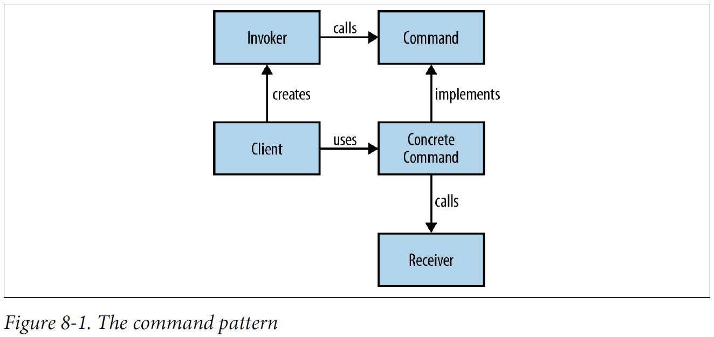

## Chapter 08: Design and Architectural Principles

- One of the other bastions of design we’re all familiar with is the idea of design patterns. Patterns document reusable templates that solve common problems in software architecture. If you spot a problem and you’re familiar with an appropriate pattern, then you can take the pattern and apply it to your situation. In a sense, patterns codify what people consider to be a best-practice approach to a given problem.

- A command object is an object that encapsulates all the information required to call another method later. The command pattern is a way of using this object in order to write generic code that sequences and executes methods based on runtime decisions.

- The command pattern  
  

- Using lambda expressions to build up a macro
  ```java
  Macro macro = new Macro();
  macro.record(() -> editor.open());
  macro.record(() -> editor.save());
  macro.record(() -> editor.close());
  macro.run();
  ```

	Using method references to build up a macro
  ```java
  Macro macro = new Macro();
  macro.record(editor::open);
  macro.record(editor::save);
  macro.record(editor::close);
  macro.run();
  ```

- The strategy pattern is a way of changing the algorithmic behavior of software based upon a runtime decision. How you implement the strategy pattern depends upon your circumstances, but in all cases the main idea is to be able to define a common problem that is solved by different algorithms and then encapsulate all the algorithms behind the same programming interface.

- The strategy pattern  
  

- Instantiating the Compressor using method references
  ```java
  Compressor gzipCompressor = new Compressor(GZIPOutputStream::new);
  gzipCompressor.compress(inFile, outFile);
  Compressor zipCompressor = new Compressor(ZipOutputStream::new);
  zipCompressor.compress(inFile, outFile);
  ```

- The observer pattern is another behavioral pattern that can be improved and simplified through the use of lambda expressions. In the observer pattern, an object, called the subject, maintains a list of other objects, which are its observers. When the state of the subject changes, its observers are notified. It is heavily used in MVC-based GUI toolkits in order to allow view components to be updated when state changes in the model without coupling the two classes together.

- Client code building up a Moon using lambdas and things landing on it
  ```
  Moon moon = new Moon();
  moon.startSpying(name -> {
    if (name.contains("Apollo"))
      System.out.println("We made it!");
  });
  moon.startSpying(name -> {
    if (name.contains("Apollo"))
      System.out.println("They're distracted, lets invade earth!");
  });
  moon.land("An asteroid");
  moon.land("Apollo 11");
  ```

- A pretty common situation when developing software is having a common algorithm with a set of differing specifics. We want to require the different implementations to have a common pattern in order to ensure that they’re following the same algorithm and also to make the code easier to understand. Once you understand the overall pattern, you can more easily understand each implementation.

- The special case of an employee applying for a loan
  ```java
  public class LoanApplication {
    private final Criteria identity;
    private final Criteria creditHistory;
    private final Criteria incomeHistory;
    public LoanApplication(Criteria identity, Criteria creditHistory, Criteria incomeHistory) {
      this.identity = identity;
      this.creditHistory = creditHistory;
      this.incomeHistory = incomeHistory;
    }
    public void checkLoanApplication() throws ApplicationDenied {
      identity.check();
      creditHistory.check();
      incomeHistory.check();
      reportFindings();
    }
    private void reportFindings() {
  ```

- A Criteria functional interface that throws an exception if our application fails
  ```java
  public interface Criteria {
    public void check() throws ApplicationDenied;
  }
  ```

- The criteria methods on a Company
  ```java
  public void checkIdentity() throws ApplicationDenied;
  public void checkProfitAndLoss() throws ApplicationDenied;
  public void checkHistoricalDebt() throws ApplicationDenied;
  ```

- Our CompanyLoanApplication specifies which methods provide each criterion
  ```java
  public class CompanyLoanApplication extends LoanApplication {
    public CompanyLoanApplication(Company company) {
      super(company::checkIdentity, company::checkHistoricalDebt, company::checkProfitAndLoss);
    }
  }
  ```

- A domain-specific language (DSL) is a programming language focused on a particular part of a software system. They are usually small and frequently less expressive than a general-purpose language, such as Java, for most programming tasks. DSLs are highly specialized: by trading off being good at everything, they get to be good at something.

	It’s usual to split up DSLs into two different categories: internal and external. An external DSL is one that is written separately from the source code of your program and then parsed and implemented separately. For example, Cascading Style Sheets (CSS) and regular expressions are commonly used external DSLs.

	Internal DSLs are embedded into the programming language that they are written in. In one sense, they’re just regular libraries that have an API designed to be fluent. Despite their simplicity, internal DSLs are valued because they can be a powerful tool for making your code more succinct and easier to read.

- Let’s take a look at each of the concepts in turn:
	- Each spec describes a single behavior that your program exhibits.
	- An expectation is a way of describing the behavior of the application. You will find expectations in specs.
	- Groups of specs are combined into a suite.

	Each of these concepts has an equivalent in a traditional testing framework, such as JUnit. A spec is similar to a test method, an expectation is similar to an assertion, and a suite is similar to a test class.

- Some stories to specify a Stack
  ```java
  public class StackSpec {{
    describe("a stack", it -> {
      it.should("be empty when created", expect -> {
        expect.that(new Stack()).isEmpty();
      });
      it.should("push new elements onto the top of the stack", expect -> {
        Stack<Integer> stack = new Stack<>();
        stack.push(1);
        expect.that(stack.get(0)).isEqualTo(1);
      });
      it.should("pop the last element pushed onto the stack", expect -> {
        Stack<Integer> stack = new Stack<>();
        stack.push(2);
        stack.push(1);
        expect.that(stack.pop()).isEqualTo(2);
      });
    });
  }}
  ```

- The SOLID principles are a set of basic principles for designing OO programs. The name itself is a acronym, with each of the five principles named after one of the letters: Single responsibility, Open/closed, Liskov substitution, Interface segregation, and Dependency inversion. The principles act as a set of guidelines to help you implement code that is easy to maintain and extend over time.

- Every class or method in your program should have only a single reason to change.

The single responsibility principle is stronger than that, though. A class should not just have a single responsibility: it should also encapsulate it.

This is part of the idea of a design exhibiting strong cohesion. A class is cohesive if its methods and fields should be treated together because they are closely related.

- The streams-based prime checking running in parallel
  ```java
  public long countPrimes(int upTo) {
    return IntStream.range(1, upTo)
                    .parallel()
                    .filter(this::isPrime)
                    .count();
  }
  private boolean isPrime(int number) {
    return IntStream.range(2, number)
                    .allMatch(x -> (number % x) != 0);
  }
  ```

- Software entities should be open for extension, but closed for modification.

- Another interpretation of the open/closed principle that doesn’t follow in the traditional vein is the idea that immutable objects implement the open/closed principle. An immutable object is one that can’t be modified after it is created.

	The term “immutability” can have two potential interpretations: observable immutability or implementation immutability. Observable immutability means that from the perspective of any other object, a class is immutable; implementation immutability means that the object never mutates. Implementation immutability implies observable immutability, but the inverse isn’t necessarily true.

- In Java 8, any lambda expression that gets passed into a higher-order function is represented by a functional interface. The higher-order function calls its single method, which leads to different behavior depending upon which lambda expression gets passed in. Again, under the hood we’re using polymorphism in order to implement the open/closed principle.

- Abstractions should not depend on details; details should depend on abstractions.

- In the context of lambda expressions, many of the higher-order functions that we’ve encountered enable a dependency inversion. A function such as map allows us to reuse code for the general concept of transforming a stream of values between different specific transformations. The map function doesn’t depend upon the details of any of these specific transformations, but upon an abstraction. In this case, the abstraction is the functional interface Function.

	A more complex example of dependency inversion is resource management. Obviously, there are lots of resources that can be managed, such as database connections, thread pools, files, and network connections.

- The domain logic with file handling split out
  ```java
  public List<String> findHeadings(Reader input) {
    return withLinesOf(input,
                       lines -> lines.filter(line -> line.endsWith(":"))
                                     .map(line -> line.substring(0, line.length()-1))
                                     .collect(toList()),
                       HeadingLookupException::new);
  }
  ```

	The definition of withLinesOf
  ```java
  private <T> T withLinesOf(Reader input, Function<Stream<String>, T> handler,
      Function<IOException, RuntimeException> error) {
    try (BufferedReader reader = new BufferedReader(input)) {
      return handler.apply(reader.lines());
    } catch (IOException e) {
      throw error.apply(e);
    }
  }
  ```

- To summarize, higher-order functions provide an inversion of control, which is a form of dependency inversion. We can easily use them with lambda expressions. The other thing to note with the dependency inversion principle is that the abstraction that we depend upon doesn’t have to be an interface. Here we’ve relied upon the existing Stream as an abstraction over raw reader and file handling. This approach also fits into the way that resource management is performed in functional languages—usually a higher-order function manages the resource and takes a callback function that is applied to an open resource, which is closed afterward.