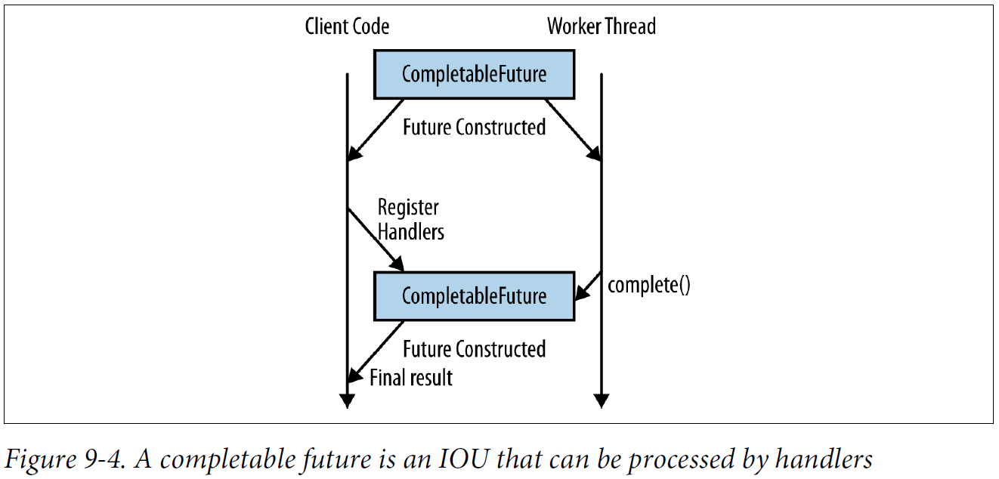

## Chapter 09: Lambda-Enabled Concurrency

- Let’s suppose you’re trying to write a chat service that handles a very high number of users. Every time a user connects to your service, a TCP connection to your server is opened. If you follow a traditional threading model, every time you want to write some data to your user, you would call a method that sends the user the data. This method call would block the thread that you’re running on.

	This approach to I/O, called blocking I/O, is fairly common and fairly easy to understand because the interaction with users follows a normal sequential flow of control through your program. The downside is that when you start looking at scaling your system to a significant number of users, you need to start a significant number of threads on your server in order to service them. That approach just doesn’t scale well.

	Nonblocking I/O—or, as it’s sometimes called, asynchronous I/O—can be used to process many concurrent network connections without having an individual thread service each connection. Unlike with blocking I/O, the methods to read and write data to your chat clients return immediately. The actual I/O processing is happening in a separate thread, and you are free to perform some useful work in the meantime.

- Receiving TCP connections
  ```java
  public class ChatVerticle extends Verticle {
    public void start() {
      vertx.createNetServer()
           .connectHandler(socket -> {
               container.logger().info("socket connected");
               socket.dataHandler(new User(socket, this));
           }).listen(10_000);
      container.logger().info("ChatVerticle started");
    }
  }
  ```

- Handling user connections
  ```java
  public class User implements Handler<Buffer> {
    private static final Pattern newline = Pattern.compile("\\n");
    private final NetSocket socket;
    private final Set<String> names;
    private final EventBus eventBus;
    private Optional<String> name;
    public User(NetSocket socket, Verticle verticle) {
      Vertx vertx = verticle.getVertx();
      this.socket = socket;
      names = vertx.sharedData().getSet("names");
      eventBus = vertx.eventBus();
      name = Optional.empty();
    }
    @Override
    public void handle(Buffer buffer) {
      newline.splitAsStream(buffer.toString())
             .forEach(line -> {
                 if (!name.isPresent())
                   setName(line);
                 else
                   handleMessage(line);
             });
    }
    // Class continues...
  ```

	Registering for chat messages
  ```java
  eventBus.registerHandler(name, (Message<String> msg) -> {
    sendClient(msg.body());
  });
  ```

	Sending chat messages
  ```java
  eventBus.send(user, name.get() + '>' + message);
  ```

	Broadcasting messages to followers
  ```java
  private void broadcastMessage(String message) {
    String name = this.name.get();
    eventBus.publish(name + ".followers", name + '>' + message);
  }
  ```

	Receiving the broadcast messages
  ```java
  private void followUser(String user) {
    eventBus.registerHandler(user + ".followers", (Message<String> message) -> {
      sendClient(message.body());
    });
  }
  ```

- Another option when trying to build up complex sequences of concurrent operations is to use what’s known as a Future. A Future is an IOU for a value. Instead of a method returning a value, it returns the Future. The Future doesn’t have the value when it’s first created, but it can be exchanged for the value later on, like an IOU.

- As you’ll have noticed, if you want to pass the result of one Future into the beginning of another piece of work, you end up blocking the thread of execution. This can be become a performance limitation because instead of work being executed in parallel it is (accidentally) run in serial.

- Downloading album information from some external web services using CompletableFutures
  ```java
  public Album lookupByName(String albumName) {
    CompletableFuture<List<Artist>> artistLookup
        = loginTo("artist")
              .thenCompose(artistLogin -> lookupArtists(albumName, artistLogin));
    return loginTo("track")
               .thenCompose(trackLogin -> lookupTracks(albumName, trackLogin))
               .thenCombine(artistLookup, (tracks, artists) -> new Album(albumName, tracks, artists))
               .join();
  }
  ```

- A completable future is an IOU that can be processed by handlers  
  

- Example code for asynchronously creating a CompletableFuture
  ```java
  CompletableFuture<Track> lookupTrack(String id) {
    return CompletableFuture.supplyAsync(() -> {
      // Some expensive work is done here
      // ...
      return track;
    }, service);
  }
  ```

- A complete investigation of the CompletableFuture API is rather beyond the scope of this chapter, but in many ways it is a hidden goodie bag. There are quite a few useful methods in the API for composing and combining different instances of CompletableFuture in pretty much any way imaginable.

	Let’s take a brief look at a few of those use cases:
	- If you want to end your chain with a block of code that returns nothing, such as a Consumer or Runnable, then take a look at thenAccept and thenRun.
	- Transforming the value of the CompletableFuture, a bit like using the map method on Stream, can be achieved using thenApply.
	- If you want to convert situations in which your CompletableFuture has completed with an exception, the exceptionally method allows you to recover by registering a function to make an alternative value.
	- If you need to do a map that takes account of both the exceptional case and regular use cases, use handle.
	- When trying to figure out what is happening with your CompletableFuture, you can use the isDone and isCompletedExceptionally methods.

- The concept behind a CompletableFuture can be generalized from single values to complete streams of data using reactive programming. Reactive programming is actually a form of declarative programming that lets us program in terms of changes and data flows that get automatically propagated.

	You can think of a spreadsheet as a commonly used example of reactive programming. If you enter =B1+5 in cell C1, it tells the spreadsheet to add 5 to the contents of cell B1 and put the result in C1. In addition, the spreadsheet reacts to any future changes in B1 and updates the value in C1.

- Searching for an artist by name and nationality
  ```java
  public Observable<Artist> search(String searchedName, String searchedNationality, int maxResults) {
    return getSavedArtists()
               .filter(name -> name.contains(searchedName))
               .flatMap(this::lookupArtist)
               .filter(artist -> artist.getNationality()
               .contains(searchedNationality))
               .take(maxResults);
  }
  ```

- There are two scenarios in particular in which you might want to think in terms of reacting to events rather than blocking.
	- The first is when your business domain is phrased in terms of events.
	- The second obvious use case is a situation where your application needs to perform many I/O operations simultaneously.