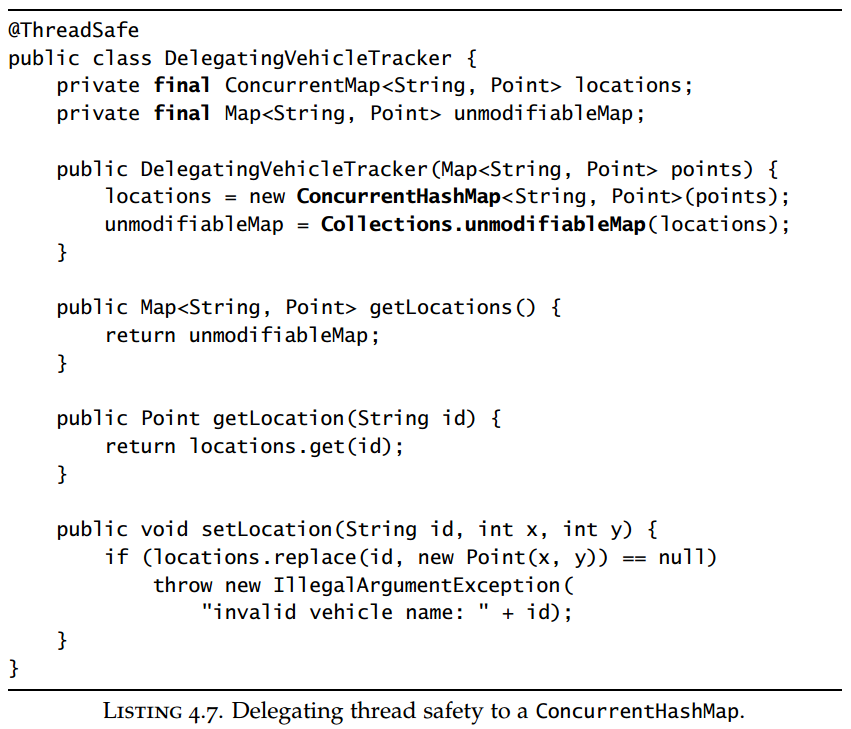
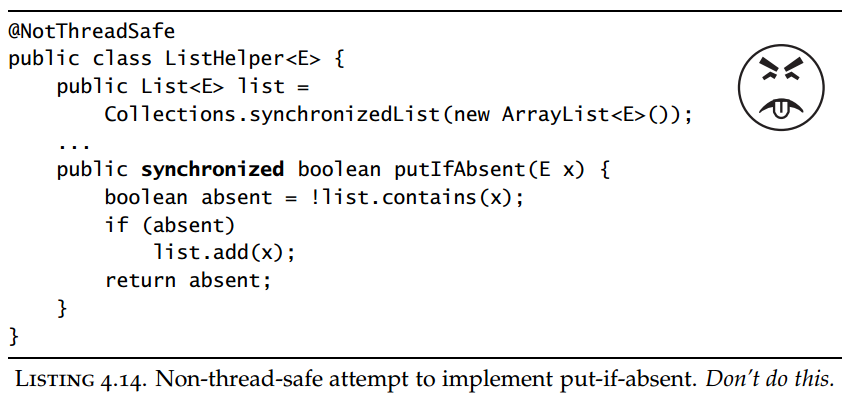
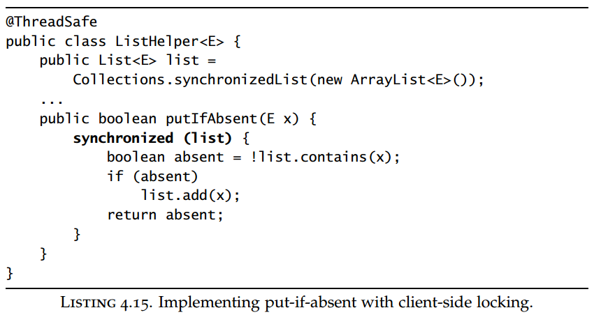
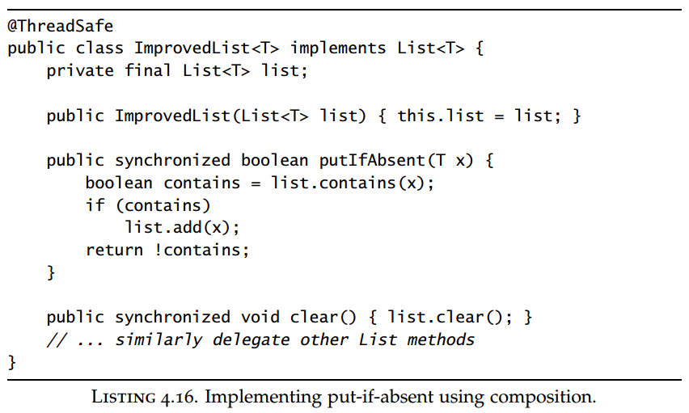

## Chapter 04: Composing Objects

### 4.1 Designing a thread-safe class

- The design process for a thread-safe class should include these three basic elements:
	- Identify the variables that form the object’s state;
	- Identify the invariants that constrain the state variables;
	- Establish a policy for managing concurrent access to the object’s state.

- The synchronization policy defines how an object coordinates access to its state without violating its invariants or postconditions. It specifies what combination of immutability, thread confinement, and locking is used to maintain thread safety, and which variables are guarded by which locks. To ensure that the class can be analyzed and maintained, document the synchronization policy.

- When the next state is derived from the current state, the operation is necessarily a compound action. Not all operations impose state transition constraints. Multivariable invariants like this one create atomicity requirements: related variables must be fetched or updated in a single atomic operation.

- You cannot ensure thread safety without understanding an object’s invariants and postconditions. Constraints on the valid values or state transitions for state variables can create atomicity and encapsulation requirements.

- The built-in mechanisms for efficiently waiting for a condition to become true—wait and notify—are tightly bound to intrinsic locking, and can be difficult to use correctly. To create operations that wait for a precondition to become true before proceeding, it is often easier to use existing library classes, such as blocking queues or semaphores, to provide the desired state-dependent behavior.

### 4.2 Instance confinement

- Encapsulating data within an object confines access to the data to the object’s methods, making it easier to ensure that the data is always accessed with the appropriate lock held.

- Confined objects must not escape their intended scope. An object may be confined to a class instance (such as a private class member), a lexical scope (such as a local variable), or a thread (such as an object that is passed from method to method within a thread, but not supposed to be shared across threads).

- There are many examples of confinement in the platform class libraries, including some classes that exist solely to turn non-thread-safe classes into threadsafe ones. The basic collection classes such as ArrayList and HashMap are not thread-safe, but the class library provides wrapper factory methods (Collections.synchronizedList and friends) so they can be used safely in multithreaded environments. These factories use the Decorator pattern to wrap the collection with a synchronized wrapper object; the wrapper implements each method of the appropriate interface as a synchronized method that forwards the request to the underlying collection object. So long as the wrapper object holds the only reachable reference to the underlying collection (i.e., the underlying collection is confined to the wrapper), the wrapper object is then thread-safe. The Javadoc for these methods warns that all access to the underlying collection must be made through the wrapper.

- Following the principle of instance confinement to its logical conclusion leads you to the Java monitor pattern. An object following the Java monitor pattern encapsulates all its mutable state and guards it with the object’s own intrinsic lock.

### 4.3 Delegating thread safety

- DelegatingVehicleTracker  
  

- If a class is composed of multiple independent thread-safe state variables and has no operations that have any invalid state transitions, then it can delegate thread safety to the underlying state variables.

- If a state variable is thread-safe, does not participate in any invariants that constrain its value, and has no prohibited state transitions for any of its operations, then it can safely be published.

### 4.4 Adding functionality to existing thread-safe classes

- NotThreadSafe ListHelper  
  

- Why wouldn’t this work? After all, putIfAbsent is synchronized, right? The problem is that it synchronizes on the wrong lock. Whatever lock the List uses to guard its state, it sure isn’t the lock on the ListHelper. ListHelper provides only the illusion of synchronization; the various list operations, while all synchronized, use different locks, which means that putIfAbsent is not atomic relative to other operations on the List. So there is no guarantee that another thread won’t modify the list while putIfAbsent is executing.

- ThreadSafe ListHelper  
  

- ImprovedList  
  