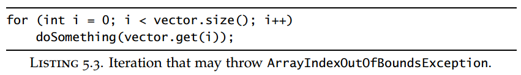
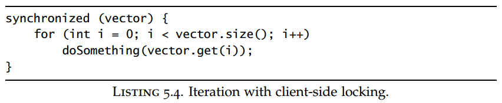
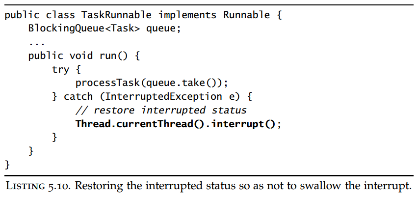
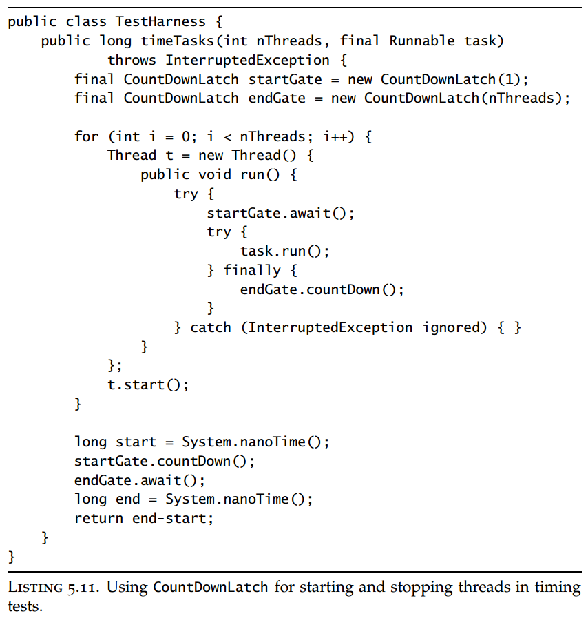
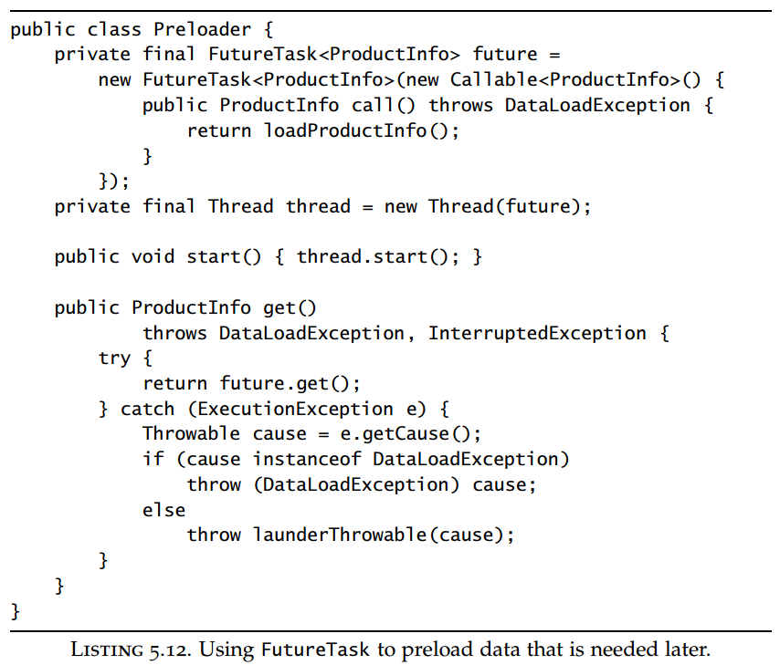
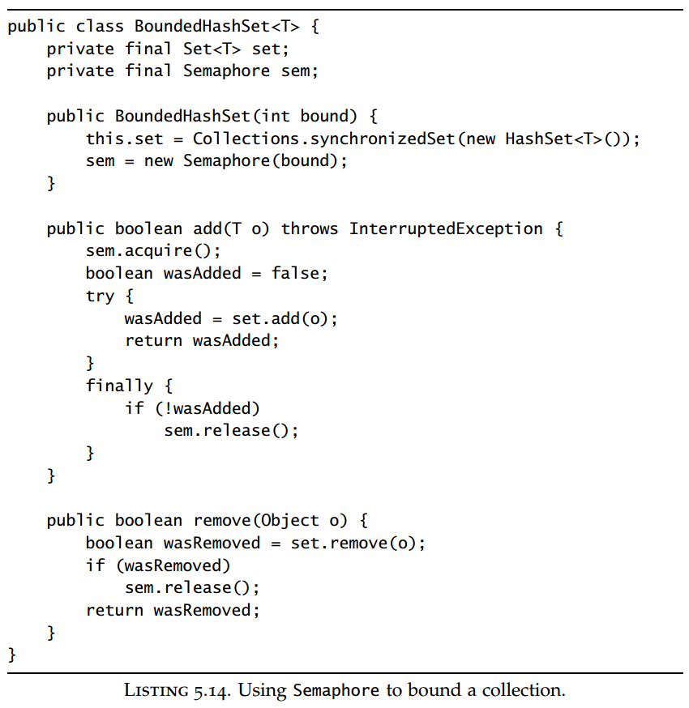
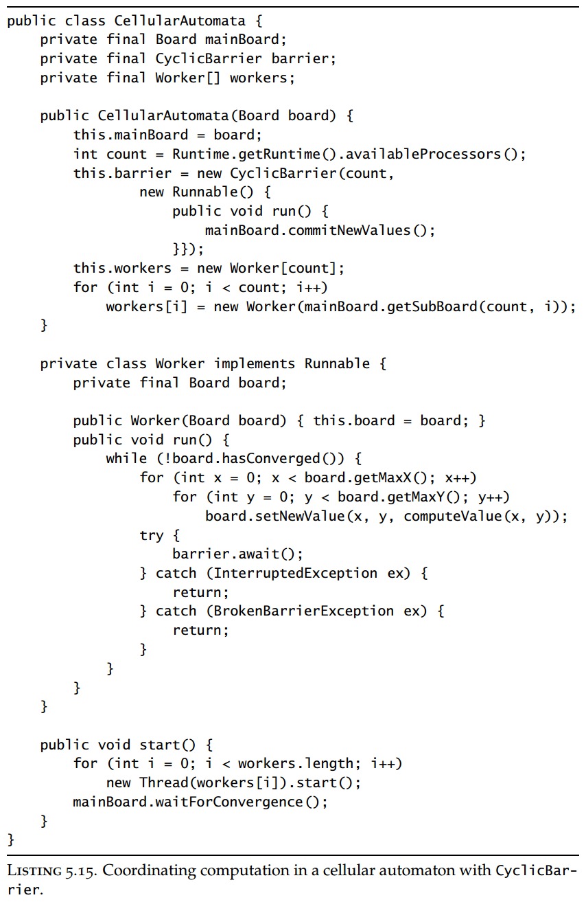
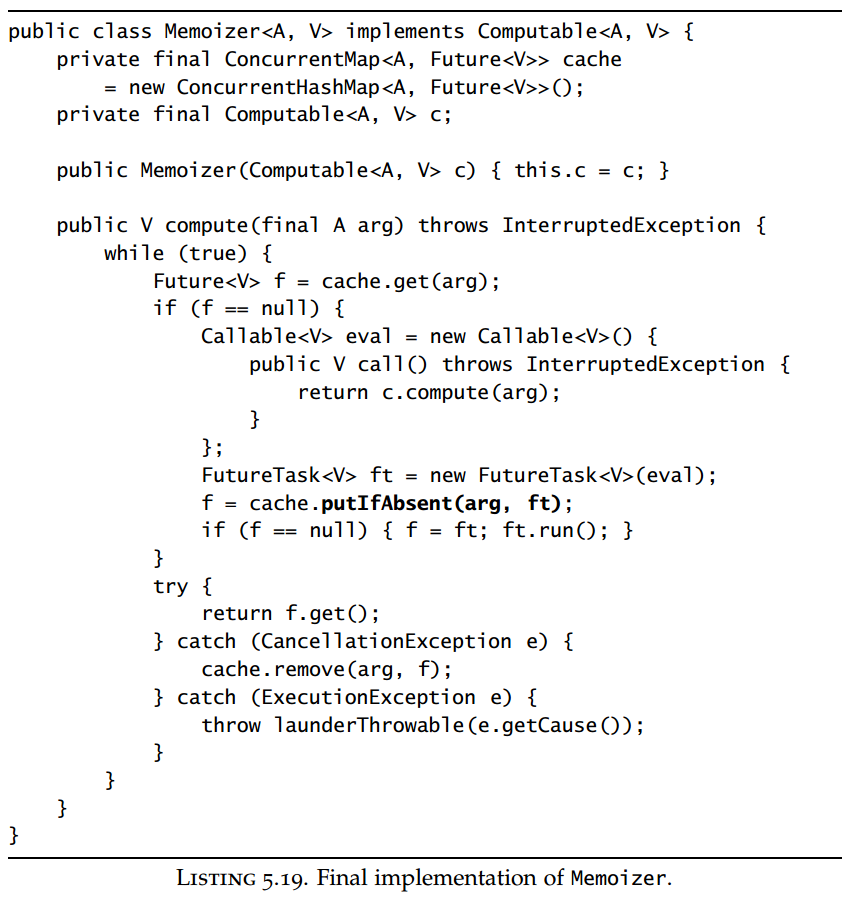

## Chapter 05: Building Blocks

### 5.1 Synchronized collections

- The synchronized collection classes include Vector and Hashtable, part of the original JDK, as well as their cousins added in JDK 1.2, the synchronized wrapper classes created by the Collections.synchronizedXxx factory methods. These classes achieve thread safety by encapsulating their state and synchronizing every public method so that only one thread at a time can access the collection state.

- The synchronized collections are thread-safe, but you may sometimes need to use additional client-side locking to guard compound actions.

- Iteration without locking  
  

- Iteration with locking  
  

- The standard way to iterate a Collection is with an Iterator, either explicitly or through the for-each loop syntax introduced in Java 5.0, but using iterators does not obviate the need to lock the collection during iteration if other threads can concurrently modify it. The iterators returned by the synchronized collections are not designed to deal with concurrent modification, and they are fail-fast—meaning that if they detect that the collection has changed since iteration began, they throw the unchecked ConcurrentModificationException.

- These fail-fast iterators are not designed to be foolproof—they are designed to catch concurrency errors on a “good-faith-effort” basis and thus act only as early-warning indicators for concurrency problems. They are implemented by associating a modification count with the collection: if the modification count changes during iteration, hasNext or next throws ConcurrentModificationException. However, this check is done without synchronization, so there is a risk of seeing a stale value of the modification count and therefore that the iterator does not realize a modification has been made.

- Iteration is also indirectly invoked by the collection’s hashCode and equals methods, which may be called if the collection is used as an element or key of another collection. Similarly, the containsAll, removeAll, and retainAll methods, as well as the constructors that take collections as arguments, also iterate the collection. All of these indirect uses of iteration can cause ConcurrentModificationException.

### 5.2 Concurrent collections

- Replacing synchronized collections with concurrent collections can offer dramatic scalability improvements with little risk.

- ConcurrentHashMap is a hash-based Map like HashMap, but it uses an entirely different locking strategy that offers better concurrency and scalability. Instead of synchronizing every method on a common lock, restricting access to a single
thread at a time, it uses a finer-grained locking mechanism called lock striping to allow a greater degree of shared access.

- ConcurrentMap  
  

- CopyOnWriteArrayList is a concurrent replacement for a synchronized List that offers better concurrency in some common situations and eliminates the need to lock or copy the collection during iteration. (Similarly, CopyOnWriteArraySet is a concurrent replacement for a synchronized Set.)

- The copy-on-write collections derive their thread safety from the fact that as long as an effectively immutable object is properly published, no further synchronization is required when accessing it. They implement mutability by creating and republishing a new copy of the collection every time it is modified. Iterators for the copy-on-write collections retain a reference to the backing array that was current at the start of iteration, and since this will never change, they need to synchronize only briefly to ensure visibility of the array contents. As a result, multiple threads can iterate the collection without interference from one another or from threads wanting to modify the collection.

### 5.3 Blocking queues and the producer-consumer pattern

- Blocking queues provide blocking put and take methods as well as the timed equivalents offer and poll. If the queue is full, put blocks until space becomes available; if the queue is empty, take blocks until an element is available. Queues can be bounded or unbounded; unbounded queues are never full, so a put on an unbounded queue never blocks.

- The class library contains several implementations of BlockingQueue. LinkedBlockingQueue and ArrayBlockingQueue are FIFO queues, analogous to LinkedList and ArrayList but with better concurrent performance than a synchronized List. PriorityBlockingQueue is a priority-ordered queue, which is useful when you want to process elements in an order other than FIFO. The last BlockingQueue implementation, SynchronousQueue, is not really a queue at all, in that it maintains no storage space for queued elements. Instead, it maintains a list of queued threads waiting to enqueue or dequeue an element.

- A thread-confined object is owned exclusively by a single thread, but that ownership can be “transferred” by publishing it safely where only one other thread will gain access to it and ensuring that the publishing thread does not access it after the handoff.

- Java 6 also adds another two collection types, Deque (pronounced “deck”) and BlockingDeque, that extend Queue and BlockingQueue. A Deque is a doubleended queue that allows efficient insertion and removal from both the head and the tail. Implementations include ArrayDeque and LinkedBlockingDeque.

- Just as blocking queues lend themselves to the producer-consumer pattern, deques lend themselves to a related pattern called work stealing.

- When your code calls a method that throws InterruptedException, then your method is a blocking method too, and must have a plan for responding to interruption. For library code, there are basically two choices:
	- Propagate the InterruptedException.
	- Restore the interrupt.

- Restore the interrupt  
  

### 5.5 Synchronizers

- A latch is a synchronizer that can delay the progress of threads until it reaches its terminal state [CPJ 3.4.2]. A latch acts as a gate: until the latch reaches the terminal state the gate is closed and no thread can pass, and in the terminal state the gate opens, allowing all threads to pass. Once the latch reaches the terminal state, it cannot change state again, so it remains open forever. Latches can be used to ensure that certain activities do not proceed until other one-time activities complete.

- CountDownLatch is a flexible latch implementation; it allows one or more threads to wait for a set of events to occur. The latch state consists of a counter initialized to a positive number, representing the number of events to wait for. The countDown method decrements the counter, indicating that an event has occurred, and the await methods wait for the counter to reach zero, which happens when all the events have occurred. If the counter is nonzero on entry, await blocks until the counter reaches zero, the waiting thread is interrupted, or the wait times out.

- CountDownLatch  
  

- FutureTask also acts like a latch. (FutureTask implements Future, which describes an abstract result-bearing computation.) A computation represented by a FutureTask is implemented with a Callable, the result-bearing equivalent of Runnable, and can be in one of three states: waiting to run, running, or completed. Completion subsumes all the ways a computation can complete, including normal completion, cancellation, and exception. Once a FutureTask enters the completed state, it stays in that state forever.

- FutureTask  
  

- Counting semaphores are used to control the number of activities that can access a certain resource or perform a given action at the same time. Counting semaphores can be used to implement resource pools or to impose a bound on a collection. A Semaphore manages a set of virtual permits; the initial number of permits is passed to the Semaphore constructor. Activities can acquire permits (as long as some remain) and release permits when they are done with them. If no permit is available, acquire blocks until one is (or until interrupted or the operation times out). The release method returns a permit to the semaphore. A degenerate case of a counting semaphore is a binary semaphore, a Semaphore with an initial count of one. A binary semaphore can be used as a mutex with nonreentrant locking semantics; whoever holds the sole permit holds the mutex.

- Semaphore  
  

- Barriers are similar to latches in that they block a group of threads until some event has occurred [CPJ 4.4.3]. The key difference is that with a barrier, all the threads must come together at a barrier point at the same time in order to proceed. Latches are for waiting for events; barriers are for waiting for other threads.

- CyclicBarrier allows a fixed number of parties to rendezvous repeatedly at a barrier point and is useful in parallel iterative algorithms that break down a problem into a fixed number of independent subproblems. Threads call await when they reach the barrier point, and await blocks until all the threads have reached the barrier point. If all threads meet at the barrier point, the barrier has been successfully passed, in which case all threads are released and the barrier is reset so it can be used again. If a call to await times out or a thread blocked in await is interrupted, then the barrier is considered broken and all outstanding calls to await terminate with BrokenBarrierException. If the barrier is successfully passed, await returns a unique arrival index for each thread, which can be used to “elect” a leader that takes some special action in the next iteration. CyclicBarrier also lets you pass a barrier action to the constructor; this is a Runnable that is executed (in one of the subtask threads) when the barrier is successfully passed but before the blocked threads are released.

- CyclicBarrier  
  

- Another form of barrier is Exchanger, a two-party barrier in which the parties exchange data at the barrier point. Exchangers are useful when the parties perform asymmetric activities, for example when one thread fills a buffer with data and the other thread consumes the data from the buffer; these threads could use an Exchanger to meet and exchange a full buffer for an empty one. When two threads exchange objects via an Exchanger, the exchange constitutes a safe publication of both objects to the other party.

### 5.6 Building an efficient, scalable result cache

- Final implementation of Memoizer  
  