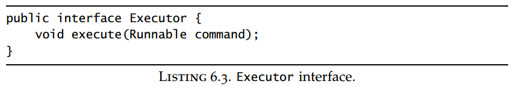
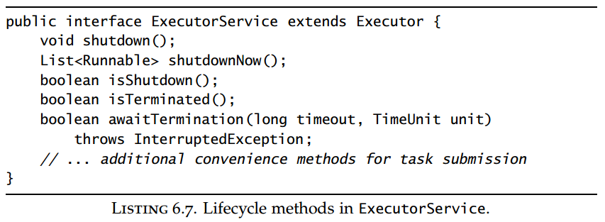
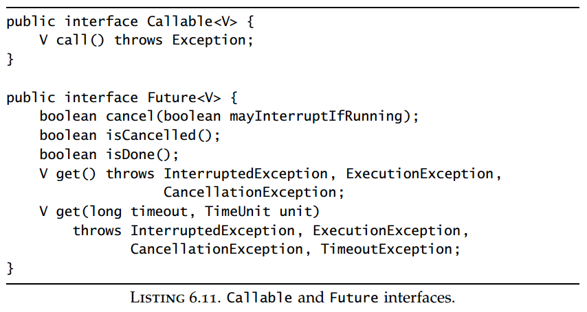

## Chapter 06: Task Execution

### 6.1 Executing tasks in threads

- Disadvantages of unbounded thread creation
	- Thread lifecycle overhead.
	- Resource consumption.
	- Stability.

- Executor  
  

### 6.2 The Executor framework

- Executor may be a simple interface, but it forms the basis for a flexible and powerful framework for asynchronous task execution that supports a wide variety of task execution policies. It provides a standard means of decoupling task submission from task execution, describing tasks with Runnable. The Executor implementations also provide lifecycle support and hooks for adding statistics gathering, application management, and monitoring. Executor is based on the producer-consumer pattern, where activities that submit tasks are the producers (producing units of work to be done) and the threads that execute tasks are the consumers (consuming those units of work). Using an Executor is usually the easiest path to implementing a producer-consumer design in your application.

- A thread pool, as its name suggests, manages a homogeneous pool of worker threads. A thread pool is tightly bound to a work queue holding tasks waiting to be executed. Worker threads have a simple life: request the next task from the work queue, execute it, and go back to waiting for another task.

- The class library provides a flexible thread pool implementation along with some useful predefined configurations. You can create a thread pool by calling one of the static factory methods in Executors:
	- newFixedThreadPool.
	- newCachedThreadPool.
	- newSingleThreadExecutor.
	- newScheduledThreadPool.

- To address the issue of execution service lifecycle, the ExecutorService interface extends Executor, adding a number of methods for lifecycle management (as well as some convenience methods for task submission).

- ExecutorService  
  

- The lifecycle implied by ExecutorService has three states—running, shutting down, and terminated. ExecutorServices are initially created in the running state. The shutdown method initiates a graceful shutdown: no new tasks are accepted but previously submitted tasks are allowed to complete—including those that have not yet begun execution. The shutdownNow method initiates an abrupt shutdown: it attempts to cancel outstanding tasks and does not start any tasks that are queued but not begun. Tasks submitted to an ExecutorService after it has been shut down are handled by the rejected execution handler, which might silently discard the task or might cause execute to throw the unchecked RejectedExecutionException. Once all tasks have completed, the ExecutorService transitions to the terminated state. You can wait for an ExecutorService to reach the terminated state with awaitTermination, or poll for whether it has yet terminated with isTerminated. It is common to follow shutdown immediately by awaitTermination, creating the effect of synchronously shutting down the ExecutorService.

- The Timer facility manages the execution of deferred (“run this task in 100 ms”) and periodic (“run this task every 10 ms”) tasks. However, Timer has some drawbacks, and ScheduledThreadPoolExecutor should be thought of as its replacement. You can construct a ScheduledThreadPoolExecutor through its constructor or through the newScheduledThreadPool factory. A Timer creates only a single thread for executing timer tasks. If a timer task takes too long to run, the timing accuracy of other TimerTasks can suffer. Another problem with Timer is that it behaves poorly if a TimerTask throws an unchecked exception. The Timer thread doesn’t catch the exception, so an unchecked exception thrown from a TimerTask terminates the timer thread. Timer also doesn’t resurrect the thread in this situation; instead, it erroneously assumes the entire Timer was cancelled. In this case, TimerTasks that are already scheduled but not yet executed are never run, and new tasks cannot be scheduled.

- If you need to build your own scheduling service, you may still be able to take advantage of the library by using a DelayQueue, a BlockingQueue implementation that provides the scheduling functionality of ScheduledThreadPoolExecutor. A DelayQueue manages a collection of Delayed objects. A Delayed has a delay time associated with it: DelayQueue lets you take an element only if its delay has expired. Objects are returned from a DelayQueue ordered by the time associated
with their delay.

### 6.3 Finding exploitable parallelism

- Many tasks are effectively deferred computations—executing a database query, fetching a resource over the network, or computing a complicated function. For these types of tasks, Callable is a better abstraction: it expects that the main entry point, call, will return a value and anticipates that it might throw an exception.7 Executors includes several utility methods for wrapping other types of tasks, including Runnable and java.security.PrivilegedAction, with a Callable.

- Runnable and Callable describe abstract computational tasks. Tasks are usually finite: they have a clear starting point and they eventually terminate. The lifecycle of a task executed by an Executor has four phases: created, submitted, started, and completed. Since tasks can take a long time to run, we also want to be able to cancel a task. In the Executor framework, tasks that have been submitted but not yet started can always be cancelled, and tasks that have started can sometimes be cancelled if they are responsive to interruption. 

- Callable and Future  
  

- Future represents the lifecycle of a task and provides methods to test whether the task has completed or been cancelled, retrieve its result, and cancel the task. The behavior of get varies depending on the task state (not yet started, running, completed). It returns immediately or throws an Exception if the task has already completed, but if not it blocks until the task completes. If the task completes by throwing an exception, get rethrows it wrapped in an ExecutionException; if it was cancelled, get throws CancellationException. If get throws ExecutionException, the underlying exception can be retrieved with getCause. There are several ways to create a Future to describe a task. The submit methods in ExecutorService all return a Future, so that you can submit a Runnable or a Callable to an executor and get back a Future that can be used to retrieve the result or cancel the task. You can also explicitly instantiate a FutureTask for a given Runnable or Callable.

- The real performance payoff of dividing a program’s workload into tasks comes when there are a large number of independent, homogeneous tasks that can be processed concurrently.

- CompletionService combines the functionality of an Executor and a BlockingQueue. You can submit Callable tasks to it for execution and use the queuelike methods take and poll to retrieve completed results, packaged as Futures, as they become available. ExecutorCompletionService implements CompletionService, delegating the computation to an Executor.

- QueueingFuture  
  

- It would be easy enough to create n tasks, submit them to a thread pool, retain the Futures, and use a timed get to fetch each result sequentially via its Future, but there is an even easier way—invokeAll. The invokeAll method takes a collection of tasks and returns a collection of Futures. The two collections have identical structures; invokeAll adds the Futures to the returned collection in the order imposed by the task collection’s iterator, thus allowing the caller to associate a Future with the Callable it represents. The timed version of invokeAll will return when all the tasks have completed, the calling thread is interrupted, or the timeout expires. Any tasks that are not complete when the timeout expires are cancelled. On return from invokeAll, each task will have either completed normally or been cancelled; the client code can call get or isCancelled to find out which.