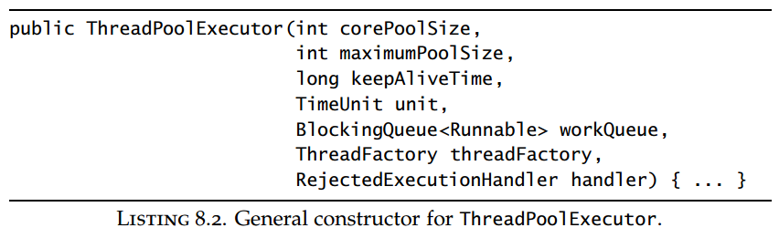
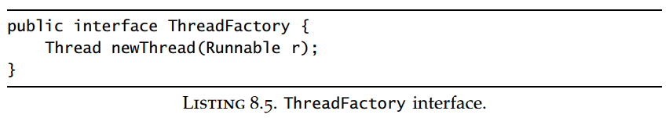
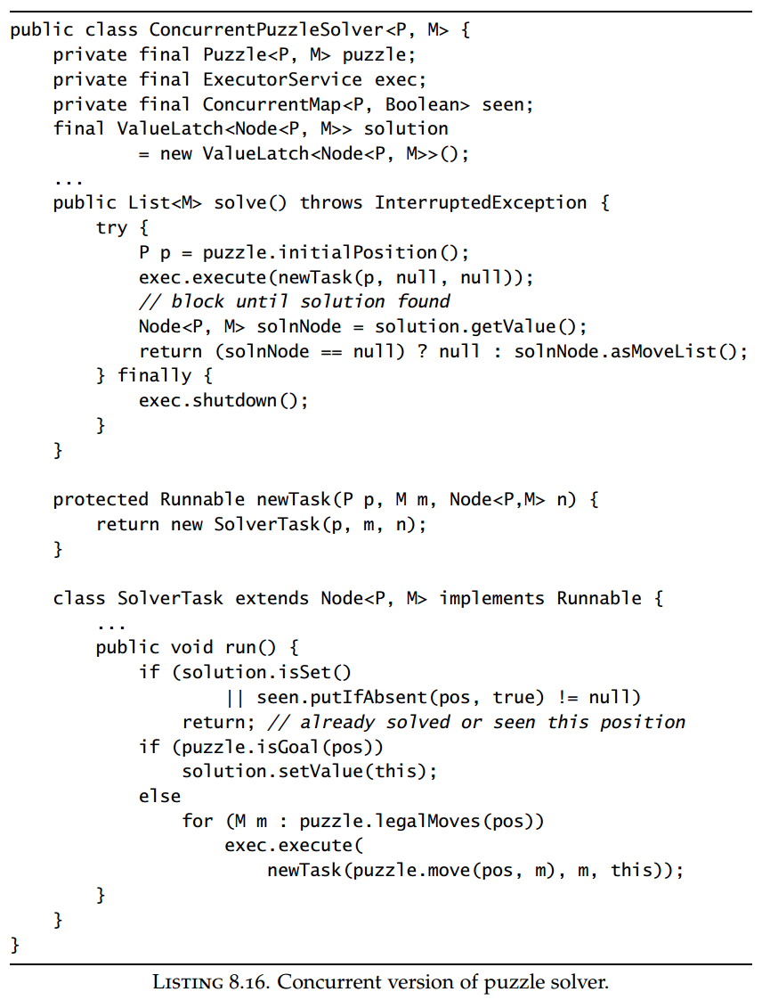

## Chapter 08: Applying Thread Pools

### 8.1 Implicit couplings between tasks and execution policies

- Types of tasks that require specific execution policies include:
	- Dependent tasks.
	- Tasks that exploit thread confinement.
	- Response-time-sensitive tasks.
	- Tasks that use ThreadLocal.

- Thread pools work best when tasks are homogeneous and independent. Mixing long-running and short-running tasks risks “clogging” the pool unless it is very large; submitting tasks that depend on other tasks risks deadlock unless the pool is unbounded.

- In a single-threaded executor, a task that submits another task to the same executor and waits for its result will always deadlock. The same thing can happen in larger thread pools if all threads are executing tasks that are blocked waiting for other tasks still on the work queue. This is called thread starvation deadlock.

- In addition to any explicit bounds on the size of a thread pool, there may also be implicit limits because of constraints on other resources. If your application uses a JDBC connection pool with ten connections and each task needs a database connection, it is as if your thread pool only has ten threads because tasks in excess of ten will block waiting for a connection.

- One technique that can mitigate the ill effects of long-running tasks is for tasks to use timed resource waits instead of unbounded waits. Most blocking methods in the plaform libraries come in both untimed and timed versions, such as Thread.join, BlockingQueue.put, CountDownLatch.await, and Selector.select. If the wait times out, you can mark the task as failed and abort it or requeue it for execution later.

### 8.2 Sizing thread pools

- To size a thread pool properly, you need to understand your computing environment, your resource budget, and the nature of your tasks. How many processors does the deployment system have? How much memory? Do tasks perform mostly computation, I/O, or some combination? Do they require a scarce resource, such as a JDBC connection? If you have different categories of tasks with very different behaviors, consider using multiple thread pools so each can be tuned according to its workload.

### 8.3 Configuring ThreadPoolExecutor

- ThreadPoolExecutor  
  

- ThreadPoolExecutor allows you to supply a BlockingQueue to hold tasks awaiting execution. There are three basic approaches to task queueing: unbounded queue, bounded queue, and synchronous handoff. A SynchronousQueue is not really a queue at all, but a mechanism for managing handoffs between threads. In order to put an element on a SynchronousQueue, another thread must already be waiting to accept the handoff.

- When a bounded work queue fills up, the saturation policy comes into play. The saturation policy for a ThreadPoolExecutor can be modified by calling setRejectedExecutionHandler. (The saturation policy is also used when a task is submitted to an Executor that has been shut down.) Several implementations of RejectedExecutionHandler are provided, each implementing a different saturation policy: AbortPolicy, CallerRunsPolicy, DiscardPolicy, and DiscardOldestPolicy.

- The caller-runs policy implements a form of throttling that neither discards tasks nor throws an exception, but instead tries to slow down the flow of new tasks by pushing some of the work back to the caller. It executes the newly submitted task not in a pool thread, but in the thread that calls execute. If we modified our WebServer example to use a bounded queue and the caller-runs policy, after all the pool threads were occupied and the work queue filled up the next task would be executed in the main thread during the call to execute. Since this would probably take some time, the main thread cannot submit any more tasks for at least a little while, giving the worker threads some time to catch up on the backlog. The main thread would also not be calling accept during this time, so incoming requests will queue up in the TCP layer instead of in the application. If the overload persisted, eventually the TCP layer would decide it has queued enough connection requests and begin discarding connection requests as well. As the server becomes overloaded, the overload is gradually pushed outward—from the pool threads to the work queue to the application to the TCP layer, and eventually to the client—enabling more graceful degradation under load.

- ThreadFactory  
  

- Executors includes a factory method, unconfigurableExecutorService, which takes an existing ExecutorService and wraps it with one exposing only the methods of ExecutorService so it cannot be further configured. Unlike the pooled implementations, newSingleThreadExecutor returns an ExecutorService wrapped in this manner, rather than a raw ThreadPoolExecutor. While a single-threaded executor is actually implemented as a thread pool with one thread, it also promises not to execute tasks concurrently. If some misguided code were to increase the pool size on a single-threaded executor, it would undermine the intended execution semantics.

### 8.4 Extending ThreadPoolExecutor

- ThreadPoolExecutor was designed for extension, providing several “hooks” for subclasses to override—beforeExecute, afterExecute, and terminated—that can be used to extend the behavior of ThreadPoolExecutor.

### 8.5 Parallelizing recursive algorithms

- Concurrent version of puzzle solver  
  