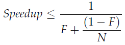

## Chapter 11: Performance and Scalability

- Application performance can be measured in a number of ways, such as service time, latency, throughput, efficiency, scalability, or capacity. Some of these (service time, latency) are measures of “how fast” a given unit of work can be processed or acknowledged; others (capacity, throughput) are measures of “how much” work can be performed with a given quantity of computing resources.

	Scalability describes the ability to improve throughput or capacity when additional computing resources (such as additional CPUs, memory, storage, or I/O bandwidth) are added.

- Avoid premature optimization. First make it right, then make it fast—if it is not already fast enough.

- Amdahl’s law describes how much a program can theoretically be sped up by additional computing resources, based on the proportion of parallelizable and serial components. If F is the fraction of the calculation that must be executed serially, then Amdahl’s law says that on a machine with N processors, we can achieve a speedup of at most:

	  

- Context switches are not free; thread scheduling requires manipulating shared data structures in the OS and JVM. The OS and JVMuse the same CPUs your program does; more CPU time spent in JVM and OS code means less is available for your program. But OS and JVM activity is not the only cost of context switches. When a new thread is switched in, the data it needs is unlikely to be in the local processor cache, so a context switch causes a flurry of cache misses, and thus threads run a little more slowly when they are first scheduled. This is one of the reasons that schedulers give each runnable thread a certain minimum time quantum even when many other threads are waiting: it amortizes the cost of the context switch and its consequences over more uninterrupted execution time, improving overall throughput (at some cost to responsiveness).

- The performance cost of synchronization comes from several sources. The visibility guarantees provided by synchronized and volatile may entail using special instructions called memory barriers that can flush or invalidate caches, flush hardware write buffers, and stall execution pipelines. Memory barriers may also have indirect performance consequences because they inhibit other compiler optimizations; most operations cannot be reordered with memory barriers.

	When assessing the performance impact of synchronization, it is important to distinguish between contended and uncontended synchronization. The synchronized mechanism is optimized for the uncontended case (volatile is always uncontended), and at this writing, the performance cost of a “fast-path” uncontended synchronization ranges from 20 to 250 clock cycles for most systems. While this is certainly not zero, the effect of needed, uncontended synchronization is rarely significant in overall application performance, and the alternative involves compromising safety and potentially signing yourself (or your successor) up for some very painful bug hunting later.

	Modern JVMs can reduce the cost of incidental synchronization by optimizing away locking that can be proven never to contend. If a lock object is accessible only to the current thread, the JVM is permitted to optimize away a lock acquisition because there is no way another thread could synchronize on the same lock.

	More sophisticated JVMs can use escape analysis to identify when a local object reference is never published to the heap and is therefore thread-local.

- The JVM can implement blocking either via spin-waiting (repeatedly trying to acquire the lock until it succeeds) or by suspending the blocked thread through the operating system. Which is more efficient depends on the relationship between context switch overhead and the time until the lock becomes available; spin-waiting is preferable for short waits and suspension is preferable for long waits.

- There are three ways to reduce lock contention:
	- Reduce the duration for which locks are held;
	- Reduce the frequency with which locks are requested; or
	- Replace exclusive locks with coordination mechanisms that permit greater concurrency.

- An effective way to reduce the likelihood of contention is to hold locks as briefly as possible. This can be done by moving code that doesn’t require the lock out of synchronized blocks, especially for expensive operations and potentially blocking operations such as I/O.

	The other way to reduce the fraction of time that a lock is held (and therefore the likelihood that it will be contended) is to have threads ask for it less often. This can be accomplished by lock splitting and lock striping, which involve using separate locks to guard multiple independent state variables previously guarded by a single lock. These techniques reduce the granularity at which locking occurs, potentially allowing greater scalability—but using more locks also increases the risk of deadlock.

	If a lock guards more than one independent state variable, you may be able to improve scalability by splitting it into multiple locks that each guard different variables. This results in each lock being requested less often.

	Lock splitting can sometimes be extended to partition locking on a variablesized set of independent objects, in which case it is called lock striping. For example, the implementation of ConcurrentHashMap uses an array of 16 locks, each of which guards 1/16 of the hash buckets; bucket N is guarded by lock N mod 16.

- Keeping a separate count to speed up operations like size and isEmpty works fine for a single-threaded or fully synchronized implementation, but makes it much harder to improve the scalability of the implementation because every operation that modifies the map must now update the shared counter. Even if you use lock striping for the hash chains, synchronizing access to the counter reintroduces the scalability problems of exclusive locking. What looked like a performance optimization—caching the results of the size operation—has turned into a scalability liability. In this case, the counter is called a hot field because every mutative operation needs to access it.

	ConcurrentHashMap avoids this problem by having size enumerate the stripes and add up the number of elements in each stripe, instead of maintaining a global count. To avoid enumerating every element, ConcurrentHashMap maintains a separate count field for each stripe, also guarded by the stripe lock.

- ReadWriteLock enforces a multiple-reader, single-writer locking discipline: more than one reader can access the shared resource concurrently so long as none of them wants to modify it, but writers must acquire the lock excusively. For read-mostly data structures, ReadWriteLock can offer greater concurrency than exclusive locking; for read-only data structures, immutability can eliminate the need for locking entirely.

- Allocating objects is usually cheaper than synchronizing.