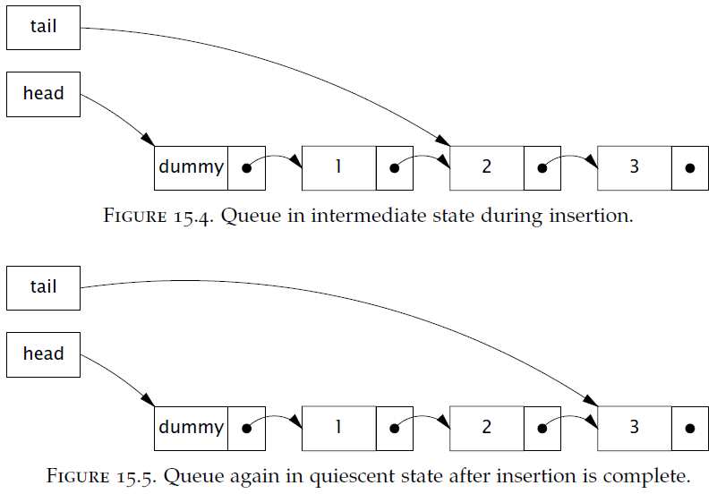

## Chapter 15: Atomic Variables and Nonblocking Synchronization

- Much of the recent research on concurrent algorithms has focused on nonblocking algorithms, which use low-level atomic machine instructions such as compare-and-swap instead of locks to ensure data integrity under concurrent access. Nonblocking algorithms are used extensively in operating systems and JVMs for thread and process scheduling, garbage collection, and to implement locks and other concurrent data structures.

- Modern JVMs can optimize uncontended lock acquisition and release fairly effectively, but if multiple threads request the lock at the same time the JVM enlists the help of the operating system. If it gets to this point, some unfortunate thread will be suspended and have to be resumed later.1 When that thread is resumed, it may have to wait for other threads to finish their scheduling quanta before it is actually scheduled. Suspending and resuming a thread has a lot of overhead and generally entails a lengthy interruption.

	Volatile variables are a lighter-weight synchronization mechanism than locking because they do not involve context switches or thread scheduling. However, volatile variables have some limitations compared to locking: while they provide similar visibility guarantees, they cannot be used to construct atomic compound actions.

	Locking has a few other disadvantages. When a thread is waiting for a lock, it cannot do anything else. If a thread holding a lock is delayed (due to a page fault, scheduling delay, or the like), then no thread that needs that lock can make progress. This can be a serious problem if the blocked thread is a high-priority thread but the thread holding the lock is a lower-priority thread—a performance hazard known as priority inversion.

- Exclusive locking is a pessimistic technique—it assumes the worst (if you don’t lock your door, gremlins will come in and rearrange your stuff) and doesn’t proceed until you can guarantee, by acquiring the appropriate locks, that other threads will not interfere.

	For fine-grained operations, there is an alternate approach that is often more efficient—the optimistic approach, whereby you proceed with an update, hopeful that you can complete it without interference. This approach relies on collision detection to determine if there has been interference from other parties during the update, in which case the operation fails and can be retried (or not).

- The approach taken by most processor architectures, including IA32 and Sparc, is to implement a compare-and-swap (CAS) instruction. CAS has three operands—a memory location V on which to operate, the expected old value A, and the new value B. CAS atomically updates V to the new value B, but only if the value in V matches the expected old value A; otherwise it does nothing. In either case, it returns the value currently in V.

- The language syntax for locking may be compact, but the work done by the JVM and OS to manage locks is not. Locking entails traversing a relatively complicated code path in the JVMand may entail OS-level locking, thread suspension, and context switches.

- Lock-based algorithms are at risk for a number of liveness failures. If a thread holding a lock is delayed due to blocking I/O, page fault, or other delay, it is possible that no thread will make progress. An algorithm is called nonblocking if failure or suspension of any thread cannot cause failure or suspension of another thread; an algorithm is called lock-free if, at each step, some thread can make progress.

- Nonblocking stack using Treiber’s algorithm (Treiber, 1986).
  ```java
  @ThreadSafe
  public class ConcurrentStack <E> {
    AtomicReference<Node<E>> top = new AtomicReference<Node<E>>();
    public void push(E item) {
      Node<E> newHead = new Node<E>(item);
      Node<E> oldHead;
      do {
        oldHead = top.get();
        newHead.next = oldHead;
      } while (!top.compareAndSet(oldHead, newHead));
    }
    public E pop() {
      Node<E> oldHead;
      Node<E> newHead;
      do {
        oldHead = top.get();
        if (oldHead == null)
          return null;
        newHead = oldHead.next;
      } while (!top.compareAndSet(oldHead, newHead));
      return oldHead.item;
    }
    ...
  }
  ```

- The trick to building nonblocking algorithms is to limit the scope of atomic changes to a single variable.

- Insertion in the Michael-Scott nonblocking queue algorithm (Michael and Scott, 1996).
  ```java
  @ThreadSafe
  public class LinkedQueue <E> {
    ...
    private final Node<E> dummy = new Node<E>(null, null);
    private final AtomicReference<Node<E>> head
        = new AtomicReference<Node<E>>(dummy);
    private final AtomicReference<Node<E>> tail
        = new AtomicReference<Node<E>>(dummy);

    public boolean put(E item) {
      Node<E> newNode = new Node<E>(item, null);
      while (true) {
        Node<E> curTail = tail.get();
        Node<E> tailNext = curTail.next.get();
        if (curTail == tail.get()) {
          if (tailNext != null) {
            // Queue in intermediate state, advance tail
            tail.compareAndSet(curTail, tailNext);
          } else {
            // In quiescent state, try inserting new node
            if (curTail.next.compareAndSet(null, newNode)) {
              // Insertion succeeded, try advancing tail
              tail.compareAndSet(curTail, newNode);
              return true;
            }
          }
        }
      }
    }
  }
  ```

	Inserting a new element involves updating two pointers. The first links the new node to the end of the list by updating the next pointer of the current last element; the second swings the tail pointer around to point to the new last element. Between these two operations, the queue is in the intermediate state. After the second update, the queue is again in the quiescent state.

	  

	The key observation that enables both of the required tricks is that if the queue is in the quiescent state, the next field of the link node pointed to by tail is null, and if it is in the intermediate state, tail.next is non-null. So any thread can immediately tell the state of the queue by examining tail.next. Further, if the queue is in the intermediate state, it can be restored to the quiescent state by advancing the tail pointer forward one node, finishing the operation for whichever thread is in the middle of inserting an element.

- Using atomic field updaters in ConcurrentLinkedQueue.
  ```java
  private class Node<E> {
    private final E item;
    private volatile Node<E> next;
    public Node(E item) {
      this.item = item;
    }
  }

  private static AtomicReferenceFieldUpdater<Node, Node> nextUpdater
      = AtomicReferenceFieldUpdater.newUpdater(
          Node.class, Node.class, "next");
  ```

	The atomic field updater classes (available in Integer, Long, and Reference versions) represent a reflection-based “view” of an existing volatile field so that CAS can be used on existing volatile fields. The updater classes have no constructors; to create one, you call the newUpdater factory method, specifying the class and field name. The field updater classes are not tied to a specific instance; one can be used to update the target field for any instance of the target class. The atomicity guarantees for the updater classes are weaker than for the regular atomic classes because you cannot guarantee that the underlying fields will not be modified directly—the compareAndSet and arithmetic methods guarantee atomicity only with respect to other threads using the atomic field updater methods.

- The ABA problem is an anomaly that can arise from the naive use of compare-and-swap in algorithms where nodes can be recycled (primarily in environments without garbage collection). A CAS effectively asks “Is the value of V still A?”, and proceeds with the update if so. In most situations, including the examples presented in this chapter, this is entirely sufficient. However, sometimes we really want to ask “Has the value of V changed since I last observed it to be A?” For some algorithms, changing V from A to B and then back to A still counts as a change that requires us to retry some algorithmic step.

	If you cannot avoid the ABA problem by letting the garbage collector manage link nodes for you, there is still a relatively simple solution: instead of updating the value of a reference, update a pair of values, a reference and a version number.